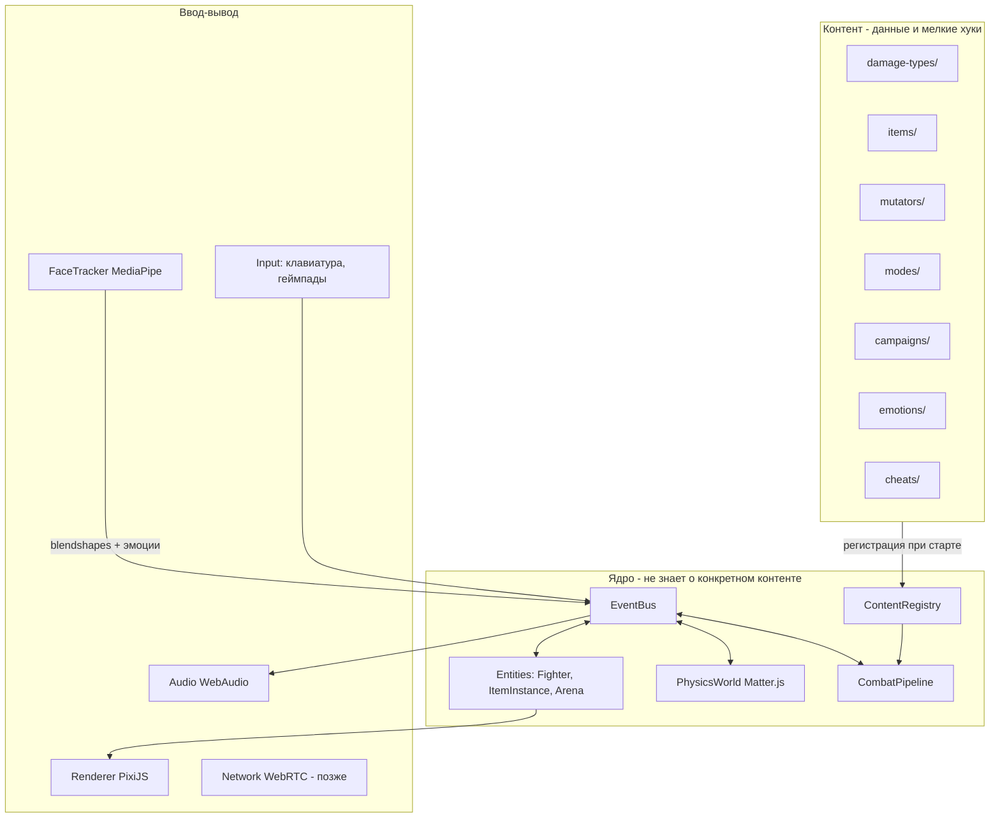

# Ragdoll Faces — архитектура и система расширяемости

> **Статус документа (июль 2026):** ниже — *целевая* архитектура (Pixi, `src/content/`, полный ContentRegistry).  
> **Факт в репозитории сейчас:** Matter.js через matter4react, бой в `src/core/BattleSession`, предметы в `src/items/`, сеть = WS dedicated + Trystero P2P, рендер = Matter canvas (не Pixi).  
> Проверка агентом: см. корневой [`AGENTS.md`](../AGENTS.md). Целевые разделы ниже — roadmap, не описание текущего кода.

Главное требование: **игра должна свободно расширяться**. Новый тип урона, новая шапка, новый артефакт, новый мутатор, новая кампания — всё добавляется как *контент*, без переписывания ядра. Этот документ описывает, как это устроено.

---

## 0. As-built (что есть сейчас)

| Слой | Факт |
|------|------|
| Симуляция | `src/core/` — `BattleSession`, `combatPipeline`, abilities, grab (выкл. `GRAB_ENABLED`) |
| Legacy FX/HP UI | `src/lib/useHealth.ts` рядом с core (в LeveL1 `skipCollisions: true`) |
| Рендер | matter4react / Matter canvas |
| Сеть | `src/server/` WS dedicated (bind `127.0.0.1`), `src/net/` P2P Trystero |
| Предметы | `src/items/` defs, без полного `EffectDef.attach` |
| События | `BattleEventBus` (hit / knockout / battleEnd / …), не полный `GameEvents` из §2 |
| Ввод | клавиатура → `usePlayerAbilities` / `useCoreInputBridge`; геймпад — не подключён |
| Verify | `yarn verify:ai` / `yarn verify:game` |

---

## 1. Общая схема (целевая)



Три слоя:

1. **Ядро** — физика, боевой конвейер, цикл матча, событийная шина. Ядро не знает, что такое «сковородка» или «огонь»; оно знает интерфейсы `DamageType`, `ItemDef`, `Effect`.
2. **Контент** — декларативные определения + маленькие функции-хуки. 95% нового контента — это новый файл в `src/content/`.
3. **Ввод-вывод** — рендер, вебка, звук, управление, сеть. Общаются с ядром только через события и состояние сущностей.

---

## 2. Событийная шина (EventBus)

Всё интересное в игре — событие. Эффекты предметов, мутаторы, гиммики боссов и ачивки подписываются на события, а не встраиваются в код боя.

```ts
// src/core/events.ts
export interface GameEvents {
  // бой
  hit:          { attacker: Fighter; target: Fighter; impulse: number; item?: ItemInstance; point: Vec2 };
  damageDealt:  { source: Fighter; target: Fighter; packet: DamagePacket; result: number };
  knockout:     { fighter: Fighter; by: Fighter | null };
  roundStart:   { round: number; mutators: MutatorId[] };
  roundEnd:     { winner: Fighter | null };
  // предметы
  itemEquipped: { fighter: Fighter; item: ItemInstance; slot: SlotId };
  itemActivated:{ fighter: Fighter; item: ItemInstance };
  // лицо и голос
  emotionStart: { fighter: Fighter; emotion: EmotionId; intensity: number };
  emotionEnd:   { fighter: Fighter; emotion: EmotionId };
  voiceLevel:   { fighter: Fighter; loudness: number };   // 0..1 с микрофона
  // мир
  tick:         { dt: number };
  pickup:       { fighter: Fighter; item: ItemInstance };
}

export interface EventBus {
  on<K extends keyof GameEvents>(event: K, fn: (e: GameEvents[K]) => void): Unsubscribe;
  emit<K extends keyof GameEvents>(event: K, payload: GameEvents[K]): void;
}
```

Добавление нового вида события (например, для нового режима) — расширение этого интерфейса; старый контент не трогается.

---

## 3. Реестры контента (ContentRegistry)

Единый паттерн для всего расширяемого: **реестр по строковому id**. Контент регистрирует себя при старте, ядро только читает.

```ts
// src/core/registry.ts
export class Registry<T extends { id: string }> {
  private map = new Map<string, T>();
  register(def: T): void { /* с проверкой дубликатов */ }
  get(id: string): T { /* с понятной ошибкой, если нет */ }
  all(): T[] { ... }
}

// Все реестры игры в одном месте:
export const content = {
  damageTypes: new Registry<DamageTypeDef>(),
  items:       new Registry<ItemDef>(),
  effects:     new Registry<EffectDef>(),
  emotions:    new Registry<EmotionDef>(),
  mutators:    new Registry<MutatorDef>(),
  modes:       new Registry<GameModeDef>(),
  campaigns:   new Registry<CampaignDef>(),
  cheats:      new Registry<CheatDef>(),
  arenas:      new Registry<ArenaDef>(),
};
```

### 3.1. Тип урона — `DamageTypeDef`

```ts
export interface DamageTypeDef {
  id: string;                    // "blunt" | "pierce" | "force" | "fire" | ваш новый
  name: string;                  // "Дробящий"
  color: string;                 // цвет цифр урона и частиц
  onApply?(ctx: DamageContext): void;  // доп. поведение: поджиг, оглушение, отброс
}
```

Новый тип урона = один файл: определение + (опционально) хук. Броня ссылается на типы через `resists: Record<string, number>` — старые предметы автоматически имеют резист 0 к новому типу.

### 3.2. Предмет — `ItemDef`

```ts
export interface ItemDef {
  id: string;                    // "frying-pan"
  name: string;                  // "Сковородка"
  slot: SlotId;                  // "handL" | "handR" | "head" | "belt" | "feet"
  twoHanded?: boolean;
  rarity: "common" | "rare" | "cursed" | "legendary";
  // физика: ядро строит тело по этим данным
  physics?: { massKg: number; shape: CapsuleSpec | BoxSpec; anchor: Vec2 };
  // статы: плоские модификаторы
  stats?: Partial<{ atk: number; def: number; hp: number }>;
  damageType?: string;           // каким типом бьёт (для оружия)
  resists?: Record<string, number>; // 0..1 по id типов урона (для брони)
  // поведение: список id эффектов из реестра effects
  effects?: string[];
  visual: ItemVisualSpec;        // как рисовать (вектор-примитивы)
}
```

### 3.3. Эффект — `EffectDef` (сердце расширяемости)

Эффект — это набор подписок на события с собственным состоянием. Все «фишки» (эмоции-заклинания, кричалка, имитатор, зеркало, проклятия) — эффекты.

```ts
export interface EffectDef {
  id: string;                    // "rage-attack-boost"
  description: string;           // показывается в тултипе предмета
  // Вызывается при экипировке; возвращённые подписки снимаются при снятии.
  attach(ctx: EffectContext): void;
}

export interface EffectContext {
  fighter: Fighter;              // носитель
  item: ItemInstance;
  bus: EventBus;                 // подписки авто-снимаются при unequip
  world: WorldApi;               // безопасное API: applyImpulse, spawnParticles, modifyStat...
}
```

Пример — «Амулет ярости» (+15% ATK пока злое лицо):

```ts
content.effects.register({
  id: "rage-attack-boost",
  description: "Пока вы злитесь: +15% атаки, −10% защиты",
  attach({ fighter, bus, world }) {
    bus.on("emotionStart", (e) => {
      if (e.fighter === fighter && e.emotion === "angry")
        world.addStatModifier(fighter, { atk: +0.15, def: -0.10, key: "rage" });
    });
    bus.on("emotionEnd", (e) => {
      if (e.fighter === fighter && e.emotion === "angry")
        world.removeStatModifier(fighter, "rage");
    });
  },
});
```

Правила для эффектов (баланс «много и мелко» из геймдизайна):
- один эффект меняет **одну** вещь на ±10–20% или даёт редкий триггер;
- эффекты не знают друг о друге; складываются через модификаторы статов с ключами;
- эффект обязан подчищаться при снятии предмета (гарантируется контекстом).

### 3.4. Боевой конвейер — `CombatPipeline`

Урон проходит фиксированные шаги, каждый шаг читает реестры:

```
столкновение (Matter.js) → фильтр по порогу импульса
  → DamagePacket { amount, type, source, item }
  → хуки эффектов onHit (могут изменить пакет)
  → резисты цели по типу (реестр damageTypes + resists брони)
  → вычитание DEF, минимум 1
  → onApply типа урона (поджиг, оглушение...)
  → событие damageDealt → HP, killcam-буфер, частицы
```

Расширение боёвки = новые типы урона и эффекты; сам конвейер стабилен.

### 3.5. Мутатор — `MutatorDef`

```ts
export interface MutatorDef {
  id: string;                     // "low-gravity"
  name: string;                   // "Луна-парк"
  apply(ctx: MutatorContext): void;   // изменяет мир на раунд
  remove(ctx: MutatorContext): void;  // обязан вернуть как было
}
```

### 3.6. Кампания — `CampaignDef` (чистые данные)

Кампании максимально декларативны, чтобы писать их как сценарий, а не как код:

```ts
export interface CampaignDef {
  id: string;
  poster: { title: string; teaser: string; art: string };  // объявление на доске
  chapters: ChapterDef[];
}

export interface ChapterDef {
  id: string;
  intro: ComicScene;              // панели: текст, позы, чьё лицо в панели
  battle: {
    arena: string;                // id арены
    enemies: EnemySpec[];         // билд и поведение противников
    mutators?: string[];
    gimmick?: string;             // id эффекта-гиммика (боссы)
    winCondition?: string;        // id условия из реестра режимов
  };
  outro: ComicScene;
  reward: string[];               // id предметов в гардероб
}
```

Гиммик босса («Клоун», «Бабушка») — тот же `EffectDef`, повешенный на бой, а не на предмет.

### 3.7. Эмоции, читы, режимы

- `EmotionDef`: id + функция-классификатор над blendshape-векторами MediaPipe (`detect(blendshapes): intensity`). Новая эмоция — один файл.
- `CheatDef`: id + строка-код + `apply/remove` (обычно просто включает мутатор).
- `GameModeDef`: правила победы + настройка раунда (сумо, царь горы, картошка — это они).

---

## 4. Структура папок

```
ragdoll-faces/
├── docs/                        # эта документация
├── src/
│   ├── core/                    # ядро: не знает о конкретном контенте
│   │   ├── events.ts            # EventBus и типы событий
│   │   ├── registry.ts          # Registry + объект content
│   │   ├── combat.ts            # CombatPipeline
│   │   ├── fighter.ts           # сущность бойца: статы, слоты, модификаторы
│   │   ├── match.ts             # цикл матча/раундов
│   │   └── world-api.ts         # безопасное API мира для эффектов
│   ├── physics/
│   │   ├── engine.ts            # Matter.Engine, шаг, столкновения
│   │   ├── stickman.ts          # порт createStickman из ragdollmasters
│   │   ├── ragdoll.ts           # сборка рэгдолла, арена, moveBody
│   │   └── units.ts             # matter-юниты ↔ метры
│   ├── render/
│   │   ├── renderer.ts          # PixiJS поверх физики
│   │   ├── face-draw.ts         # мультяшная морда из blendshapes
│   │   └── juice.ts             # тряска, частицы, trails, squash-and-stretch
│   ├── face/
│   │   └── tracker.ts           # MediaPipe → blendshapes → события эмоций
│   ├── audio/
│   │   └── sound.ts             # звуки, диктор; позже — затухание голоса
│   ├── input/
│   │   └── controls.ts          # клавиатура/геймпады → импульсы
│   ├── content/                 # ВЕСЬ игровой контент, файл = единица контента
│   │   ├── damage-types/        # blunt.ts, pierce.ts, force.ts, fire.ts
│   │   ├── effects/             # rage-boost.ts, shout-wave.ts, face-thief.ts...
│   │   ├── items/               # sword.ts, frying-pan.ts, clown-nose.ts...
│   │   ├── emotions/            # angry.ts, smile.ts, scared.ts, kiss.ts
│   │   ├── mutators/            # low-gravity.ts, ice.ts, big-heads.ts...
│   │   ├── modes/               # duel.ts, sumo.ts, hot-potato.ts...
│   │   ├── arenas/              # dojo.ts, rooftops.ts...
│   │   ├── campaigns/           # first-campaign/ (главы, комикс-сцены)
│   │   ├── cheats/              # bighead.ts, fishparty.ts
│   │   └── index.ts             # импортирует всё → регистрирует в content
│   ├── ui/                      # меню, экран экипировки, доска объявлений
│   └── main.ts
├── index.html
└── package.json
```

Правило: **ядро импортирует только интерфейсы; контент импортирует ядро; ядро никогда не импортирует контент** (кроме единственной точки `content/index.ts`, подключаемой в `main.ts`).

---

## 5. Что где считается (клиент/сеть)

- Этапы 1–5: всё на клиенте, мультиплеер локальный (одна клавиатура + геймпады).
- Этап 6 (сеть): P2P через WebRTC; голос — аудиопоток + квадратичное затухание на клиенте-слушателе; видео-кружки — видеопотоки. Античит не приоритет (игра «для своих»), авторитарный сервер — только если пойдём в рейтинги.

## 6. Технологии (выбор подтверждён исследованием, июль 2026)

| Область | Библиотека | Почему именно она (и что отвергли) |
|---|---|---|
| Сборка | Vite + TypeScript (strict) | быстрый dev-цикл; строгие типы ловят ошибки контента на этапе компиляции |
| Физика | matter-js | Порт stickman + pin-констрейнты из [ragdollmasters](https://github.com/onedoes/ragdollmasters): жёсткие связи, collision groups, moveBody на голову. Headless-тесты с фиксированным шагом. Ранее Rapier2D — мягкие пружины не давали feel форка |
| Рендер | pixi.js v8 | WebGPU-first, быстрейший 2D-рендер, фильтры (bloom, CRT), частицы; «только рендер» — нам и нужно, физику приносим свою. Отвергли: Phaser 4 (тянет свою структуру и бандлит Matter.js — мы бы боролись с фреймворком), Excalibur (pre-1.0, меньше материалов) |
| Лицо | @mediapipe/tasks-vision (Face Landmarker) | отраслевой стандарт: 478 landmark + **52 blendshape** прямо в браузере, GPU-делегат, до 2+ лиц, без сервера. Альтернатива micro-facemesh (WebGPU, быстрее) не отдаёт blendshapes — не подходит |
| Звук | Web Audio API | штатное затухание (PannerNode), фильтры, без зависимостей |
| Сеть (Этап 6) | Trystero (WebRTC) | комнаты и обмен данными/аудио/видео **без своего signaling-сервера** (пиры находятся через Nostr/MQTT); TURN — бесплатный Open Relay. Colyseus (авторитарный сервер) — только если пойдём в рейтинги/античит |
| Клипы | MediaRecorder API | запись canvas+PiP в webm/mp4 штатными средствами браузера |
| Steam (позже) | **Electron + steamworks.js** | Steam Overlay работает (Chromium в одном процессе, `--in-process-gpu`); steamworks.js — актуальная обвязка Steamworks. **Tauri отвергнут**: WebView2 — многопроцессный, Steam Overlay в нём не работает (подтверждено issue Tauri #6196 и WebView2Feedback #3200) |

Точные версии зафиксируем в `package.json` при старте Этапа 1.

## 7. Проект разрабатывается ИИ: правила, делающие кодовую базу удобной для агента

Кодить будет ИИ-агент, поэтому архитектура и процесс оптимизируются под него:

1. **Детерминированное ядро без DOM.** Симуляция (физика + бой) работает с фиксированным шагом и не касается DOM/Canvas. Значит, агент может запускать бои **headless в тестах**: «экипируй А мечом, Б щитом, прогони 600 тиков, проверь HP». Это главный механизм самопроверки без запуска браузера.
2. **Vitest для ядра.** Юнит-тесты на CombatPipeline, реестры, формулу урона, каждый эффект. Правило: новый эффект/тип урона = файл контента + тест рядом (`*.test.ts`). Агент проверяет себя `npm test` за секунды.
3. **Playwright — smoke-тест.** Один сценарий «игра загрузилась, два бойца на арене, матч стартует» ловит поломки интеграции (WASM, Pixi, вебка-заглушка).
4. **Строгий TypeScript + ESLint + Prettier.** `strict: true`, `noUncheckedIndexedAccess`. Типизированные реестры и события дают агенту автопроверку: опечатка в id или неверный payload события — ошибка компиляции, а не баг в рантайме.
5. **Маленькие файлы с одной ответственностью.** Один предмет/эффект/мутатор = один файл до ~100 строк. Агент меняет контент, не читая ядро; конфликты правок минимальны.
6. **Контент — данные, не код.** Чем больше игры описано декларативно (предметы, кампании, арены), тем надёжнее агент генерирует новое без регрессий.
7. **`AGENTS.md` в корне** — короткая инструкция для агента: как запустить, как тестировать, правила баланса («±10–20%, не имба»), запрет менять `core/` при добавлении контента, ссылки на CONTENT_GUIDE.md.
8. **Отладочные оверлеи** (FPS, хитбоксы, blendshapes, лог событий шины) включаются query-параметром `?debug` — агент и человек видят одно и то же при разборе багов.
