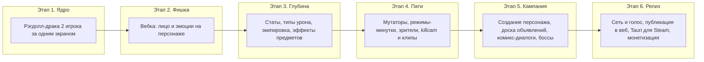

# Ragdoll Faces — роадмап проекта и план первого прототипа

## Концепт (зафиксировано)

Веб-игра (TypeScript), позже упаковка в Steam через Tauri. Рэгдолл-файтинг «для компании» в духе Ragdoll Masters:

- **Стиль**: плоский векторный минимализм + «juice» (тряска экрана, частицы, следы оружия, squash-and-stretch). Лицо персонажа — живая мимика игрока с вебки (MediaPipe).
- **Экипировка до боя**: слоты (левая рука, правая рука, голова, пояс, ноги). Предметы имеют физику (тяжёлый шлем смещает центр тяжести) и **мелкие эффекты-аффиксы** — много разных, каждый чуть-чуть меняет игру, никакой имбы. Эмоции-заклинания, кричалка голосом, имитатор (кража лица), зеркало и т.п. — всё это эффекты конкретных предметов.
- **Боевая математика**: у персонажа есть жизни, атака и защита. Урон = атака − защита (20 атаки против 15 защиты = 5 урона), поверх — физический импульс от рэгдолла. **Типы урона**: дробящий, колющий, силовой (отброс), огненный (дот); броня сопротивляется типам по-разному (кольчуга держит колющий, но не дробящий и т.д.).
- **Создание персонажа**: имя + распределение очков по чертам (влияют на бой: сила/живучесть/ловкость) + внешние отличия (цвет, причёска, голосовой «вскрик»). Персонаж сохраняется и растёт между боями.
- **Кампании в стиле DnD**: хаб — «доска объявлений искателя приключений»: несколько кампаний-«объявлений» в разных сеттингах, внутри — цепочки арен с комикс-диалогами (пузыри, пародийный пафос; в панели комикса — живое лицо игрока с вебки), боссы с гиммиками на эмоции.
- **Пати-режимы**: мутаторы раунда (низкая гравитация, лёд, гигантские головы, «всё оружие — рыбы»), режимы-минутки (сумо, царь горы, горячая картошка, one-hit), зрители-пакостники после выбывания.
- **Вирусность (критично)**: killcam с реальными лицами игроков, кнопка «Клип» (последние 15 секунд + лица в mp4/gif), автопостер матча в стиле обложки комикса, чит-коды как в старых играх.
- **Ностальгия**: меню в стиле shareware-2005, пафосная озвучка «PLAYER ONE WINS», CRT-фильтр опционально.
- **Монетизация (позже)**: бесплатный веб для вируса, затем Steam-версия и/или косметика.

## Технический стек

- **Vite + TypeScript** — сборка и dev-сервер
- **Rapier2D** (WASM) — физика рэгдоллов и оружия
- **PixiJS** — рендер (векторные тела, частицы, эффекты)
- **MediaPipe Face Landmarker** — мимика с вебки (52 blendshape-параметра)
- **Web Audio** — звук, позже квадратичное затухание голоса
- Позже: WebRTC (сеть/голос/видео), Tauri (Steam)

## Роадмап

- **Этап 1 — Ядро боя (прототип, дни)**: арена-«квадрат», два рэгдолла на одной клавиатуре, физика ударов, жизни, победа. Уже можно смеяться вдвоём.
- **Этап 2 — Лицо (главная фишка, ~неделя)**: вебка → MediaPipe → мимика на мультяшной морде рэгдолла; базовые эмоции распознаются (злость, улыбка, испуг).
- **Этап 3 — RPG-глубина (~1–2 недели)**: атака/защита/жизни, 4 типа урона (дробящий, колющий, силовой, огненный), слоты экипировки, экран выбора билда до боя, первые ~15–20 предметов с мелкими эффектами (включая эмоции-заклинания, кричалку, имитатора, зеркало).
- **Этап 4 — Пати-фан и вирусность (~1–2 недели)**: мутаторы, 3–4 режима-минутки, до 4 игроков локально (геймпады), зрители-пакостники, killcam с лицами, кнопка «Клип», чит-коды, shareware-меню.
- **Этап 5 — Кампания (контент, итеративно)**: создание персонажа (имя, черты, внешность), хаб «доска объявлений», 1-я кампания из 5–7 глав с комикс-диалогами и боссами на эмоции; кооп на двоих.
- **Этап 6 — Сеть и релиз**: WebRTC (онлайн, голос с квадратичным затуханием по радиусу, видео-кружки), публикация веб-версии, Tauri-сборка для Steam, монетизация.

После каждого этапа — играбельная версия: тестируешь, правим, только потом идём дальше.

## План первого шага (Этап 1 + скелет Этапа 2)

Создать проект `ragdoll-faces` в `~/Projects/` (название можно поменять), git, Vite + TS. Структура:

- `src/physics/ragdoll.ts` — сборка рэгдолла из капсул (голова, торс, руки x2 сегмента, ноги x2 сегмента) на суставах Rapier
- `src/physics/world.ts` — мир, арена (пол, стены, «квадрат»-додзё)
- `src/render/renderer.ts` — PixiJS-отрисовка тел поверх физики, цвет на игрока
- `src/render/juice.ts` — тряска камеры, частицы удара, следы
- `src/game/controls.ts` — управление в духе Ragdoll Masters: игрок задаёт направление импульса «центру тяжести», тело летит и бьёт конечностями (P1 — WASD, P2 — стрелки)
- `src/game/combat.ts` — жизни, урон от силы столкновения, нокаут, раунд/победа (сюда позже встанут атака/защита и типы урона)
- `src/game/match.ts` — цикл матча, счёт, рестарт
- `src/face/` — заглушка под MediaPipe (морда рисуется мультяшно, эмоции подключим на Этапе 2)

Критерий готовности: два человека за одной клавиатурой дерутся рэгдоллами на квадратной арене, удары ощущаются «сочно», есть счёт и победа.

## Решения, принятые по ходу обсуждения

- Голосовое затухание — квадратичное, считается на клиенте; сложность сети не в DSP, а в транспорте (WebRTC) — поэтому она в Этапе 6.
- Эффекты предметов маленькие и многочисленные — баланс через слабую силу каждого эффекта.
- Веб-first, чтобы «скинул ссылку — играем»; Steam позже без переписывания кода.

