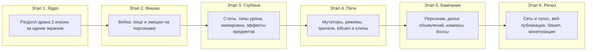

# Ragdoll Faces — роадмап

Порядок этапов, состав работ и критерии готовности. После каждого этапа игра играбельна: тестируем, правим, только потом идём дальше. Дизайн-детали — в [GAME_DESIGN.md](GAME_DESIGN.md), техника — в [ARCHITECTURE.md](ARCHITECTURE.md).

---

## Этап 1 — Ядро боя (дни)

Цель: вдвоём за одной клавиатурой смешно драться. Уже на этом этапе закладывается каркас расширяемости (EventBus, Registry, CombatPipeline) — пустой, но рабочий.

Состав:
- Vite + TypeScript (strict), установка Rapier2D и PixiJS; Vitest + ESLint + Prettier с первого дня.
- Каркас ядра: `EventBus`, `Registry`, `WorldApi` (минимум), цикл матча — ядро headless и детерминированное, первые тесты на формулу урона и шину.
- Рэгдолл из капсул на суставах (голова, торс, руки x2 сегмента, ноги x2 сегмента).
- Арена-«додзё»: пол, стены, квадрат.
- Управление «центром тяжести»: P1 — WASD, P2 — стрелки.
- Жизни, урон от импульса столкновений (пока один тип урона), нокаут, счёт, победа.
- Juice: тряска экрана, частицы ударов, squash-and-stretch, следы движения.
- Мультяшная морда-заготовка (реагирует на события боя, без вебки).

Критерий готовности: два человека дерутся, удары «сочные», есть счёт и победа, хочется реванш.

## Этап 2 — Лицо с вебки (~неделя)

Цель: главная фишка — мимика игрока на морде персонажа.

Состав:
- MediaPipe Face Landmarker: вебка → blendshapes (~52 параметра) для 1–2 лиц.
- Отрисовка мимики на морде (брови, рот, глаза, щёки).
- Реестр эмоций + первые классификаторы: злость, улыбка, испуг, удивление, поцелуй, подмигивание.
- События `emotionStart/End` в шине; отладочная панель «что игра видит на моём лице».
- Запасной режим без вебки (автономная морда).

Критерий готовности: корчишь рожу — персонаж корчит ту же; эмоции стабильно распознаются при обычном освещении.

## Этап 3 — RPG-глубина (~1–2 недели)

Цель: билды, статы, предметы с мелкими эффектами.

Состав:
- Статы: HP/ATK/DEF + Сила/Живучесть/Ловкость; формула урона с минимумом 1.
- Реестр типов урона: дробящий, колющий, силовой, огненный (+ резисты брони).
- Слоты экипировки (руки, голова, пояс, ноги), физика предметов на теле.
- Экран экипировки до боя.
- Система эффектов (EffectDef + WorldApi) и стартовый пул ~15–20 предметов, включая эмоциональные (амулет ярости, клоунский нос, маска-имитатор, зеркало) и голосовые (рог крикуна — громкость с микрофона).
- Дроп предметов после матчей, гардероб (localStorage).

Критерий готовности: два разных билда дают заметно разные бои; ни один предмет не имба; добавление нового предмета = один файл.

## Этап 4 — Пати-фан и вирусность (~1–2 недели)

Цель: игра для компании и контент для соцсетей.

Состав:
- До 4 игроков локально (геймпады).
- Реестр мутаторов: низкая гравитация, лёд, гигантские головы, «всё оружие — рыбы», землетрясение и т.д.
- Режимы-минутки: сумо, царь горы, горячая картошка, one-hit.
- Зрители-пакостники (банан, ветер, лазер).
- Killcam с реальными лицами (кадры с вебки в момент нокаута).
- Кнопка «Клип»: последние 15 секунд + лица PiP → mp4/gif (MediaRecorder).
- Автопостер матча «обложка комикса».
- Чит-коды с клавиатуры; shareware-меню-2005, диктор «PLAYER ONE WINS», CRT-фильтр.

Критерий готовности: вечер на 4 человек проходит без скуки; клип из игры реально хочется отправить в чат.

## Этап 5 — Кампании (итеративно)

Цель: одиночный/кооп контент с характером.

Состав:
- Создание персонажа: имя, распределение черт, внешность, запись «вскрика».
- Хаб «таверна с доской объявлений»; кампании как контент-пакеты.
- Движок комикс-сцен: панели, пузыри, живое лицо игрока в панели, «зачёт» эмоции для продолжения.
- Первая кампания: 5–7 глав, кооп на двоих, 2–3 босса с гиммиками на эмоции (Клоун, Бабушка, Эхо).
- Награды кампании → гардероб.

Критерий готовности: кампания проходится за вечер вдвоём, диалоги смешные, боссы заставляют корчить рожи.

## Этап 6 — Сеть и релиз

Цель: онлайн, голос по радиусу и публикация.

Состав:
- Trystero (WebRTC): комнаты по ссылке без своего signaling-сервера, синхронизация боя (P2P, хост-авторитет).
- Голос: аудиопотоки + квадратичное затухание по расстоянию (1/d²), low-pass на дистанции; шёпот в углу арены.
- Видео-кружки игроков (по краям экрана / летающие за персонажем).
- Публикация веб-версии (статический хостинг + маленький signaling-сервер + TURN).
- Electron-сборка + steamworks.js → Steam (страница, билды, ачивки, оверлей).
- Монетизация по стадиям: бесплатный веб → платный Steam → косметика → приватные комнаты.

Критерий готовности: два человека в разных городах играют по ссылке с голосом; та же сборка лежит в Steam.

---

## Постоянные правила по ходу всего роадмапа

- Расширяемость первична: новый контент — файл в `src/content/`, ядро не трогается (см. [CONTENT_GUIDE.md](CONTENT_GUIDE.md)).
- Каждая фича проверяется вопросом «станет ли от этого смешнее клип?».
- Баланс через «много мелких эффектов», не через сильные предметы.
- Играбельная сборка — в конце каждого этапа, не в конце проекта.
