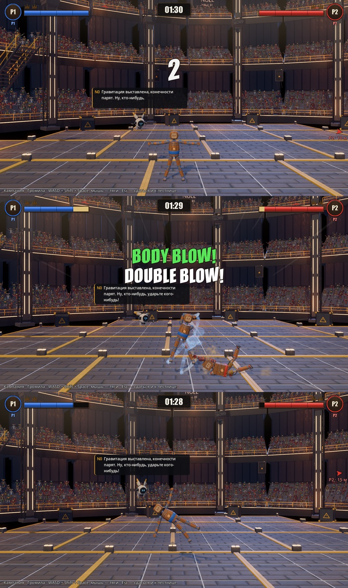
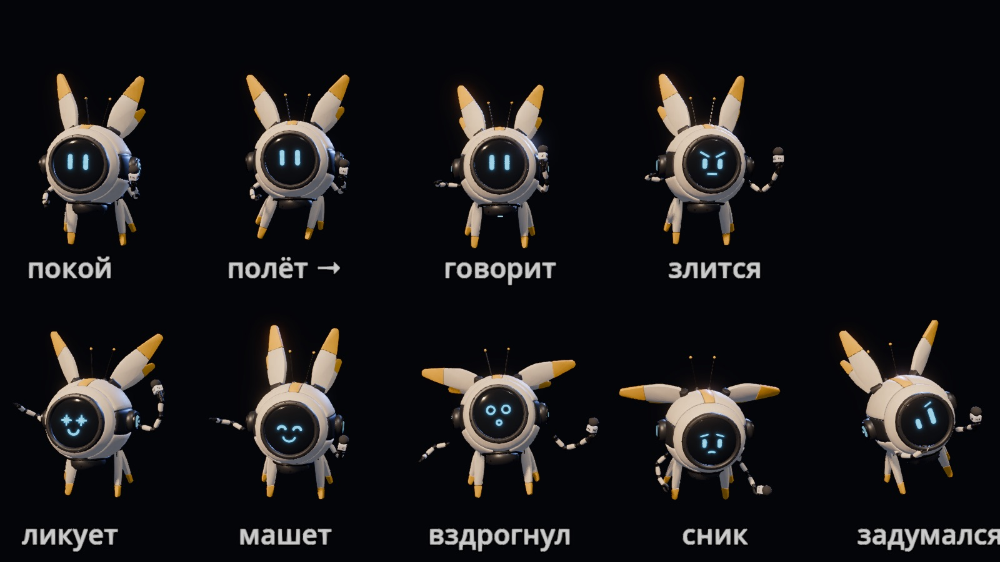

# 14 — N0 в бою: дрон, реплики, табло

Вход:
- лор §9 и раздел «Голоса и тон» (`LORE_NULL.md`);
- решения автора 30.09 из `N0_VOICE.md` (ветка `claude/project-thread-c3udni`):
  - табло меряет цифрами: `IMPACT 18.4G` вместо `CRUSHING BLOW!`;
  - N0 всегда летает рядом с игроком;
  - все строки — ключи перевода, первые языки — русский и английский;
- модель N0 v1: `scenes/n0/n0.tscn`, скрипт `N0Drone` с методами `set_expression()` и `flash_expression()`, в ветке этапа 13;
- PvE-строки поля — [PR #1](https://github.com/elv1bro/nullcub/pull/1).

Выход: в каждом бою N0 летает рядом с игроком и не мешает бою. Он говорит короткие реплики субтитром возле себя и меняет выражение экрана. Табло поля пишет события капсом и цифрами. Диктор `scenes/ui/announcer.gd` больше не кричит от себя.

## Статус (30.09.2026)

Тексты и правила подачи готовы в `N0_VOICE.md`, направление принято автором. Модель готова. Кода реплик нет. Перед стартом проверить, не пишет ли код сессия `N0_VOICE`, чтобы не делать работу дважды.

## Что сделать

1. Слить в main `N0_VOICE.md`, PR #1 и модель N0 (вместе с этапом 13).
2. Полёт: N0 держится рядом с игроком по правилам раздела «N0 в кадре» в `N0_VOICE.md`. Он не сталкивается с бойцами и не заслоняет точку удара.
3. Реплики: события `Match` и `WaveDirector` связать с таблицей реплик. Частота — по «Правилам подачи», выражение экрана — через `flash_expression`.
4. Табло: строки из `N0_VOICE.md` (IMPACT xG, FIGHTER OFFLINE, FIELD LIMIT EXTENDED и другие). FIGHT! и KO! остаются.
5. Перевод: все строки через `tr()`, файлы RU и EN.

## Проверка

- Проба: матч двух ботов, 3 минуты.
  - N0 ни разу не подлетел к кукле ближе допустимого и ни разу не столкнулся с ней.
  - Мелкие реплики звучат не чаще, чем разрешает правило.
  - Каждый крит даёт на табло IMPACT с числом.
  - Каждый KO даёт строку табло и реплику.
- Снимок кадра с субтитром N0.
- Переключение языка меняет все строки, ни одна не остаётся непереведённой.

## Итог v1 (02.10.2026): полёт, реплики, камера

Автор после сборки 0.0.1:
- «N0 летает в бою перед нами, а не за нами. Он должен быть всегда рядом и выдавать комментарии хотя бы субтитрами».
- «Камера слишком далеко. Мне не важно видеть соперника: можно указать на него стрелкой и написать количество метров до него».

Ветка `claude/n0-follow-camera` от сборки 0.0.1 (`claude/modest-brahmagupta-kocf6h`). Касается обоих боёв в куполе: Быстрый бой (клавиша 8) и бои кампании.

Кадры сверху вниз: отсчёт и реплика N0, бой, соперник в 15 м — стрелка «P2 · 15 м».

**Камера** (`scenes/camera/dynamic_camera.gd`, режим `follow_mode = "humans"`):
- в кадре только игрок; бот-соперник камеру не тянет;
- кукла занимает около четверти высоты кадра, полувысота кадра 3.6 м (было 7.5–11 м; первая версия — 4.2 м, автор: «как будто немного ближе ещё»);
- на быстром полёте кадр чуть отъезжает по упреждению, как раньше;
- у мембраны кадр упирается в границы арены, игрок смещается к краю;
- Быстрый бой вдвоём: второй человек попадает в кадр с первого нажатия своих клавиш, тогда кадр держит обоих (до 11 м);
- `primary_doll()` — главная кукла кадра (P1); от неё меряют стрелки, рядом с ней летает N0.

**Стрелка к сопернику** (`scenes/ui/offscreen_markers.gd`): стрелка цвета игрока у края экрана, под ней «P2 · 15 м» (у нижнего края — над ней). Расстояние теперь от игрока, раньше было от центра кадра. Стрелка и подпись крупнее. Где соперник и сколько до него — подсказка только этого HUD: автор 02.10 — «ведущий не может так подсказывать» (первая версия N0 говорила метры и показывала рукой — убрано).

**N0 рядом** (`scripts/n0/n0_host.gd`):
- летит за плечом игрока: дуга радиусом 1.75 м, 55° от вертикали, со стороны, где нет соперника;
- соперник перешёл на другую сторону — N0 перелетает дугой над головой;
- держится за плоскостью боя (z = −1.4): кукла всегда перед ним и его не заслоняет;
- следует пружиной с запаздыванием около 0.3 с, кренится по скорости;
- смотрит на игрока, на сильный удар — на точку удара, на KO — на поверженного;
- крит отбрасывает его и раскручивает;
- соперник подлетел ближе 1.6 м — уворачивается;
- на старте вылетает из-за края кадра;
- размер 0.6 (было 0.8), в кадре около 0.8 м.

**Реплики** (`scripts/n0/n0_lines.gd` — таблица и правила частоты, `scripts/n0/n0_speech.gd` — облачко):
- облачко у самого дрона, текст печатается по буквам, пока печатается — корпус подпрыгивает;
- облачко не заходит на полосу HUD сверху: если над дроном места нет, встаёт под ним;
- прячется на выходе бойцов, в кинематографе крита и на итогах;
- поводы:
  - отсчёт;
  - крит;
  - KO соперника и KO игрока;
  - Sudden Death;
  - ничья и победа по таймеру;
  - голосование: старт, итог, аномалия; в панели голосования субтитра N0 больше нет;
- мелкие поводы:
  - HEAD BLOW!;
  - комбо 4+;
  - отлетела деталь;
  - удар о мембрану;
  - сильный удар по игроку;
  - 10 с без ударов;
- частота по «Правилам подачи» `N0_VOICE.md`: важное — всегда, мелкое — не чаще раза в 8 с, с шансом 50 % и только когда N0 молчит;
- строки из `N0_VOICE.md` взяты как есть; поводы и строки сверх него — предложение, в `n0_lines.gd` помечены;
- язык пока русский, английский лежит рядом в той же таблице для перевода.

**Проверки:**
- `tests/n0_follow_probe.tscn` (headless) — 11 из 11:
  - камера держит только игрока, полувысота 3.60–3.68 м;
  - N0 рядом: в 95 % кадров не дальше 3.1 м, максимум 3.3 м;
  - N0 всегда за плоскостью боя;
  - сторона выбрана верно в 334 из 334 кадров;
  - N0 в кадре все 1200 кадров;
  - до соперника не ближе 1.5 м;
  - стрелка меряет от игрока: 22.0 м при реальных 22.0;
  - N0 о расстоянии до соперника не говорит (повода нет в таблице);
  - реплики на поводах, правила частоты;
  - второй человек входит в кадр по нажатию;
- снимок `tests/n0_follow_snapshot.tscn` (нужно окно) — кадры выше;
- зелёные и после правок: `null_field_probe` 9/9 (проверка камеры площадки обновлена под новое правило), `arena_events_probe` 8/8, `campaign_probe` 15/15 (с боем до KO), `match_probe` OK, `menu_probe` 4/4.

**Не сделано (дальше по этапу):**
- табло цифрами: `IMPACT 18.4G` вместо `CRUSHING BLOW!`, `FIGHTER OFFLINE`, `FIELD LIMIT EXTENDED`;
- перевод через `tr()` и выбор языка;
- облёт поверженного на KO;
- бип-голос;
- PvE-волны: N0 там нет, реплики `WaveDirector` не подключены.

**Тело N0 (02.10, автор: «нету анимации у N0, меняется только лицо — может, крыльями махать, двигаться»).** Покачивание было и раньше, но мелкое (5–7°) и почти всё к камере и от неё — сбоку не видно. Теперь (`scripts/n0/n0_drone.gd`, раздел «Тело» в шапке):
- крылья машут в плоскости экрана; на скорости чаще и шире: размах за секунду — 0.28 рад в покое, 0.73 рад в полёте 8 м/с;
- ножки — маятник на пружине: на разгоне отстают (до 0.8 рад), после остановки раскачиваются и возвращаются;
- руки телескопические: в жестах выдвигаются на 10–20 см, иначе из-за шара корпуса их не видно; микрофон едет за правой рукой;
- пока говорит — микрофон у экрана, левой рукой жестикулирует;
- жест к выражению:
  - ликует (KO соперника, удар о мембрану);
  - машет (отсчёт, победа);
  - вздрогнул (сильный удар, крит);
  - сник (упал игрок, Sudden Death);
  - задумался (долгая тишина);
  - злится, трясёт кулаками (angry, пока без повода);
  - дёргается (сбой голосования);
- двигатель светится ярче на скорости.

Лист — `tests/n0_gestures_snapshot.tscn` (нужно окно). Проверки тела — 4 новых пункта в `n0_follow_probe` (теперь 15 из 15): размах крыльев, отставание ножек, шесть жестов, микрофон у кисти (±1 мм). `n0_snapshot` 7/7.

**Ответы автора (02.10):**
- камера — «немного ближе ещё»: полувысота 4.2 → 3.6 м;
- N0 за плечом со стороны без соперника — «нормально»;
- частота реплик — «ещё проверим»;
- ветку слить в сборку и запушить — да.

**Открыто:** нужна ли стрелка к сопернику, когда тот в кадре, но далеко.
