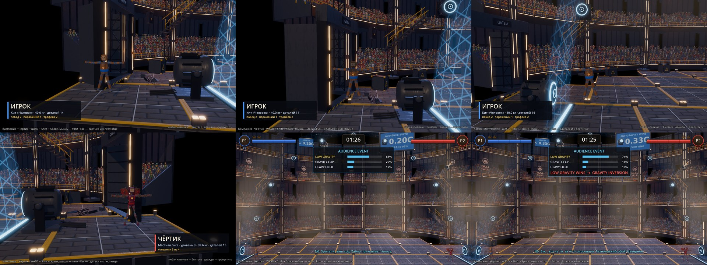

# 16 — Выход бойца

Вход:
- этап 13: ворота `Gate_Door_L/R` с петлями, большой экран; ворота должны стоять в кадре;
- этап 14: N0 и табло;
- этап 10: лицо игрока, если к этому времени готово;
- лор §7.

Выход: перед боем в куполе каждый боец выходит на арену.
1. Свет гаснет.
2. Ворота открываются.
3. Боец движется к мембране, дрон-камера следует за ним.
4. Большой экран показывает имя, сборку, массу и историю боёв.
5. Боец проходит сквозь мембрану: гравитация меняется, конечности всплывают.
6. Выходит следующий боец.

Затем отсчёт 3-2-1 и FIGHT!.

Зачем это нужно:
- игрок долго собирает тело, и выход даёт всем увидеть сборку (§7);
- этот же выход служит вступлением к игре вместо заставки-комикса, сюжет которой про Башню ушёл в архив (`INTRO_COMIC.md`).

## Правила (предложение)

- **Длительность:** не больше 6 с на бойца. Любая кнопка ускоряет выход, двойное нажатие пропускает его. В Быстром бою по умолчанию короткая версия (≤ 3 с), выход можно выключить.
- **Физика настоящая:**
  - кукла не ходит, поэтому до мембраны её везёт платформа ворот. Поля там ещё нет, конечности висят вниз;
  - у мембраны платформа отпускает куклу, поле подхватывает её, и конечности всплывают сами. Это главный кадр: игрок сразу понимает, что такое NULL.
- **Экран:** имя, иконки деталей сборки, масса, счёт побед и поражений. В кампании добавляются трофеи.
- **N0:** одна реплика на бойца, например про странную сборку.
- **Урон:** во время выхода урона нет, бойцы не сталкиваются.

## Проверка

- Проба: два бойца проходят выход за ≤ 12 с.
  - После выхода обе куклы внутри поля, в точках спавна ±1 м.
  - HP полные, урона за время выхода нет.
- Пропуск кнопкой: бой стартует не позже чем через 1 с.
- Снимки четырёх кадров: ворота, коридор с экраном, проход сквозь мембрану, конечности всплыли.

## Итог

**v1 готов (02.10.2026), облачная сессия, ветка `claude/modest-brahmagupta-kocf6h`.** Кадры (верхний ряд и первый нижний): ворота, путь к мембране, за мембраной, второй боец.

**Файлы:**
- `godot/scenes/arena/fighter_entrance.gd` (`FighterEntrance`) — сам выход;
- `godot/scenes/arena/fighter_card.tscn` и `.gd` — карточка: плашка внизу слева для P1 и справа для P2;
- в `campaign_fight.tscn` — узлы `EntranceCam` и `Entrance`, у `Match` `autostart = false`: отсчёт начинается после выхода;
- числа — `Tuning.ENTRANCE_*`.

**Как сделано:**
- **свет:** лампы зала гаснут до 30 %;
- **табло и карточка:** табло пишет имя бойца, карточка — имя, сборку, массу, число деталей, счёт или место в лестнице;
- **камера** выхода смотрит на ворота;
- **ворота и платформа:** створки `Gate_Door_L/R` открываются. Тела бойца заморожены, поэтому мембрана их не трогает, и «платформа» везёт его от ворот к плоскости боя и сквозь мембрану;
- **за мембраной** тела отпускаются со скоростью 2,5 м/с внутрь, и поле NULL подхватывает бойца — главный кадр выхода. Толпа заводится, у N0 EXCITED;
- **второй боец** ждёт спрятанным у своих ворот;
- **длительность** — около 4,8 с на бойца, 9,6 с на двоих;
- **кнопки:** первая ускоряет выход в 3 раза, вторая пропускает: бойцы сразу на точках спавна.

**Проверка:** `tests/arena_events_probe.tscn`, выход — 2 из 2:
- полный выход: 9,6 с; оба прошли мембрану, оказались внутри купола и отпущены; HP полные, ударов 0, начался отсчёт; камера выхода была текущей, потом боевая; свет гас (0,90 → 0,27) и вернулся;
- пропуск: срабатывает мгновенно, бойцы у спавна ±1 м.

**Не сделано:**
- в Быстром бою выхода нет (только кампания); короткая версия ≤ 3 с — позже;
- лицо игрока (этап 10) на табло и карточке;
- «платформа» без своей модели: боец просто плывёт;
- ворота стоят в глубине зала, путь к плоскости боя проходит сквозь край трибуны — кадр с камеры выхода это скрывает.
