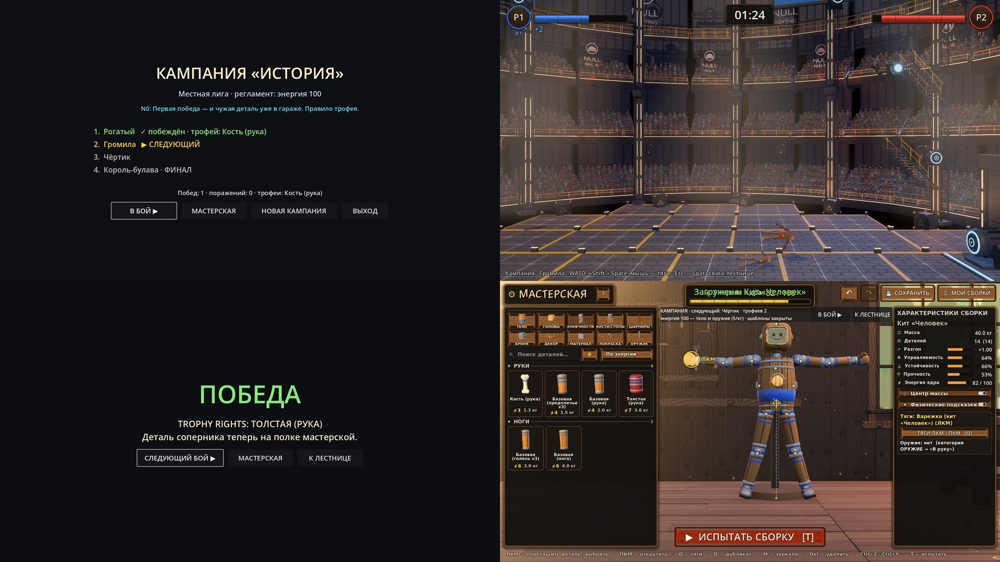

# 17 — Карьера: местная лига и правило трофея

Вход:
- бой (этап 06) и боты (этап 08, бот из `tests/match_probe.gd`);
- `ModularDoll` и чертежи `data/body/blueprints/kit_*.tres`;
- мастерская (`scenes/workshop/`, `WORKSHOP_V3.md`; чертежи пишутся в `user://blueprints/`);
- итоги (этап 09);
- лор: §13 (карьера) и правило трофея (принято автором 30.09).

Выход: режим «Кампания».
- Лестница местной лиги из 4 боёв: 3 боя и финал.
- Между боями — мастерская.
- После каждой победы — трофей.
- Прогресс сохраняется, в меню есть «Продолжить».

Этот этап — хребет демо и от купола не зависит: начинать можно на любой готовой арене и перенести бои в купол после слияния этапа 13. Решение автора 30.09: все бои кампании пока в куполе (Old NULL Hall).

## Шаг лестницы

1. **Экран лестницы:** 4 соперника (имя, сборка, масса), текущий подсвечен. N0 говорит одну реплику.
2. **Бой:** выход бойца (этап 16), бой (этап 06), итоги (этап 09).
3. **Исход:**
   - победа: на табло `TROPHY RIGHTS: <деталь>`, из сборки соперника **выпадает случайная деталь** (решение автора 30.09). Голова и торс не выпадают — это предложение. Деталь становится доступна в мастерской;
   - поражение: бой переигрывается, лестница не двигается, штрафа нет (решение автора 30.09).
4. **Мастерская:** сборка из стартового кита и трофеев. Energy — бюджет сборки, его задаёт регламент лиги, и с уровнем лиги он растёт (автор 30.09: «скорее да»). В демо одна ступень — местная лига. Числа — в `tuning.gd`, по ступеням лиги.
5. Следующий соперник.

## Соперники (предложение)

- Сборки по нарастающей массе и странности, из готовых чертежей `kit_*.tres`. После слияния этапа 13 добавляются детали NULL League.
- Бой 3 — с аномалией голосования (этап 15).
- Бой 4 — финал местной лиги, его прерывает вторжение (этап 18).
- У каждого соперника свой уровень бота: реакция и агрессия. Числа — в `tuning.gd`.

## Сохранение

`user://campaign.tres` хранит шаг лестницы, чертёж игрока и полученные трофеи. «Продолжить» в меню (этап 11) начинает с сохранённого шага.

## Не входит в демо

- Карьера дальше местной лиги (город → страна → континент). Акт 1 целиком делается позже.
- Призовые материалы и спонсоры — пока предложение.
- Кооп в кампании: кампания сначала одиночная (решение автора).

## Проверка

- Headless-проба: бот-игрок проходит лестницу.
  - 4 боя подряд.
  - После каждой победы у игрока на одну деталь соперника больше, мастерская видит трофей.
  - Поражение лестницу не двигает.
- Сохранение → перезапуск → продолжение с того же шага, с тем же чертежом и трофеями.
- `workshop_probe` зелёная.

## Итог

**v1 готов (30.09.2026), облачная сессия.** Лист кадров: лестница, бой в куполе, исход с трофеем, мастерская из кампании.

**Как попасть:** клавиша **9** на любой площадке или сцена `godot/scenes/campaign/campaign.tscn`. Главного меню пока нет (этап 11).

**Файлы:**
- `scripts/campaign/campaign_league.gd` (`CampaignLeague`) — лестница местной лиги, регламент энергии, стартовая полка, правило трофея;
- `scripts/campaign/campaign_state.gd` (`CampaignState`) — прогресс и сохранение. Файлы: `user://campaign.tres` и чертёж `user://blueprints/_campaign.tres`, тот же, который мастерская в кампании пишет автосейвом;
- `scripts/campaign/rival_brain.gd` (`RivalBrain`) — бот-соперник. Наскок как у бота `match_probe`, поверх `EnemyBrain`: задержка реакции, упреждение, ошибка прицела, зависание против поля NULL. Без «ржавой» раскраски врагов PvE;
- `scenes/campaign/campaign_fight.tscn` и `.gd` — бой в куполе Old NULL Hall. P1 — сборка игрока с тягами мыши и оружием из чертежа, P2 — соперник лиги с `RivalBrain`. Esc — сдаться и вернуться к лестнице;
- `scenes/campaign/campaign.tscn` и `campaign_flow.gd` — поток экранов: лестница → бой → исход → мастерская → следующий бой. Сцена дерева не меняется: бой и мастерская — дети `Stage`;
- правки в общих файлах:
  - `tuning.gd` — `LEAGUE_ENERGY`, `RIVAL_LEVELS`, `CAMPAIGN_RESULT_DELAY_S`;
  - `craft_edit.gd` — `campaign_shelf` (фильтр полки) и `campaign_templates_locked` (шаблоны тела и оружия закрыты); копия чертежа несёт регламент оружия;
  - `ui/workshop_ui.gd` — при `campaign_templates_locked` плитки шаблонов спрятаны;
  - `body_blueprint.gd` — `weapon_energy_per_kg`, `weapon_energy()`, `weapon_mass()`: оружие в руке входит в `energy_used()` только по регламенту (по умолчанию 0 — как раньше);
  - `playground.gd` — клавиша 9.

**Правила (решения автора 30.09):**
- все бои в куполе;
- поражение — бой переигрывается, лестница стоит, штрафа нет;
- победа — из сборки соперника выпадает случайная деталь. Голова и ядро не выпадают (предложение), сначала выпадают детали, которых у игрока ещё нет. Случай детерминирован по зерну кампании, так что перезапуск игры трофей не перебрасывает;
- энергия — регламент лиги: бюджет 100 для местной лиги;
- шаблоны тела и оружия в кампании закрыты и спрятаны, верстак стартует пустым: всё собирается из деталей полки (автор 30.09);
- оружие в руке ест ту же энергию, что и тело (автор 30.09: «и на оружие ограничение»). Правило по массе — предложение: `ceil(масса × 5)` за кг (`Tuning.LEAGUE_WEAPON_ENERGY_PER_KG`). Киянка 2,1 кг — 11, меч 1,9 — 10, молот 4,1 — 21, тяжёлый молот 5,6 — 28, кистень 6,5 — 33. Стартовое тело (82) с киянкой — 93 из 100; с молотом — 103, придётся облегчить тело. При перерасходе мастерская пишет «энергия X > бюджета», кампания не пускает в бой. Вне кампании оружие энергию не ест.

**Соперники** (предложение, пресеты кита): Рогатый (ур. 1) → Громила (ур. 2) → Чёртик (ур. 3, помечен под аномалию этапа 15) → Король-булава (ур. 4, финал). Все укладываются в регламент (94 / 97 / 95 / 82 из 100).

**Стартовая полка** (предложение): ядро-бочка, голова-игрушка, базовые конечности, кулак, варежка, ботинок, доп. сустав, короткая рукоять, киянка. Стартовая сборка — «Кит Человек».

**Проверки:**
- `tests/campaign_probe.tscn` — 15 из 15:
  - правила, сохранение и загрузка, поток экранов;
  - энергия оружия по регламенту (киянка 11, молот — перерасход, без регламента — 0);
  - соперник подлетает и бьёт;
  - мастерская с полкой «стартовый кит + трофеи», закрытыми и спрятанными шаблонами тела и оружия, пустым верстаком; возврат из неё;
  - лига до конца;
  - настоящий бой двух ботов до KO: 45 с, трофей записан.
- Существующие пробы после правок: `workshop_probe` — 186 OK, `body_probe` — OK, `kit_probe` — 3140 OK, `null_field_probe` — 9/9, `scene_switch_probe` — OK.
- Кадры: `tests/campaign_snapshot.tscn` (под `xvfb-run`).

**Не сделано и замечено:**
- выхода бойца нет (этап 16): бой начинается обычным отсчётом;
- реплики N0 на лестнице — заглушки до этапа 14 (`N0_VOICE.md`);
- кнопка «В руку» не отказывает при перерасходе энергии: оружие встаёт, счётчик энергии уходит за бюджет, «Испытать» и бой не пускают с причиной. Отказ прямо на кнопке — правка `workshop_build.gd` (файл сессии мастерской);
- у соперников нет оружия; числа уровней ботов — первые, баланс проверяет автор руками;
- после 4-й победы экран пишет «Продолжение следует». Финал со вторжением — этап 18;
- навигация по кнопкам с геймпада не проверена;
- для кампании в эту ветку влит купол из `claude/continue-from-docs-4b3odj` (этап 13). В main его пока нет.
