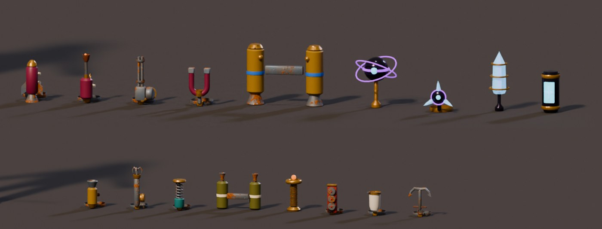
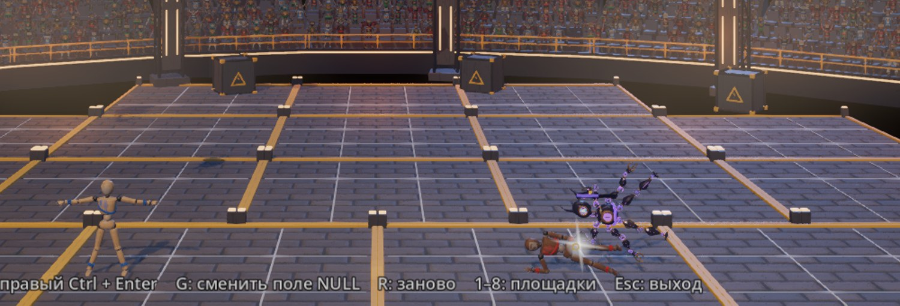
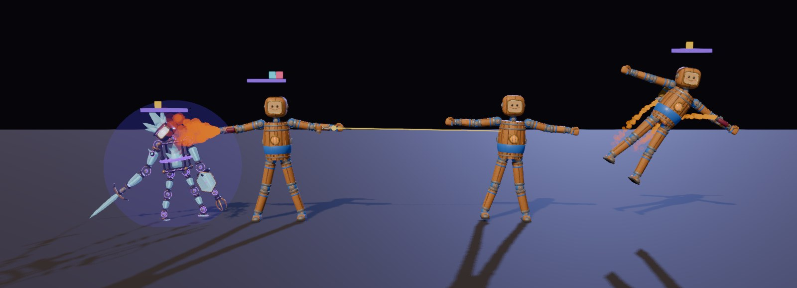
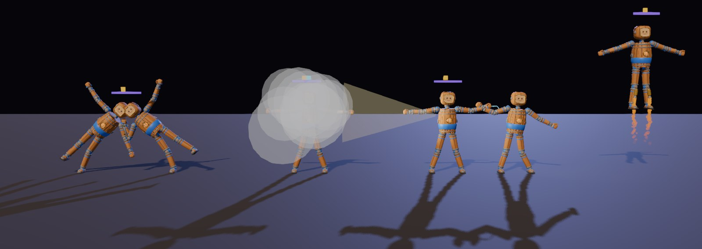
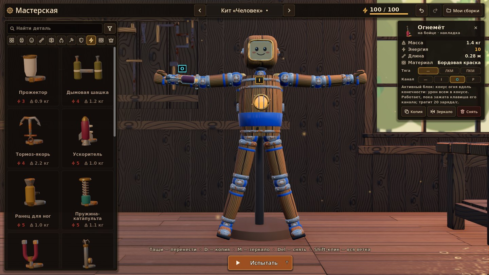

# Активные блоки — заряд и три канала (30.09.2026, v2)

Запрос автора:

> есть специальные блоки активные. типо ускоритель, огонь, пулемет, и так далее. много
> и когда создаешь у тебя есть 3 клавиши на которые ты можешь назначить действие. пока клавиша зажата действие исполняется, например ускоритель разгоняет активируется и тратит энергию а энергия восстанавливается медленно + от ударов больше. и было бы классно например что на 1 клавишу придется вешать и ускорители и огнемет так как их ограниченное количество.

Лор (предложение): `LORE_NULL.md`, «Заряд и три канала». Особые модули лиги — те же блоки (`ART_NULL.md`, «Детали лиги v2»).

v2 (автор: «делай что не сделано, я тебе доверяю; клавиши I O P; все блоки, что ты нашёл, тоже можно сделать»):
- клавиши каналов P1 — I / O / P;
- ещё 8 блоков, всего 17;
- боты сами жмут каналы;
- чемпион лиги — бот в Old NULL Hall (клавиша L);
- бойцы лиги — шаблоны мастерской;
- буквы клавиш над полоской заряда;
- модули на кадре бойцов лиги.

## Правила

- **Активный блок** — деталь кита с действием. Ставится как декор: на конечность (разъём «накладка»), на спину или на макушку. Своего тела у блока нет, он сливается с деталью-хозяином и добавляет ей массу.
- **Ось действия блока** — вдоль конечности к кисти или стопе. Поэтому огнемёт, пулемёт и магнит целятся рукой. На спине и макушке ось смотрит вверх, поэтому ранец поднимает.
- **Три канала.** Каждому блоку в мастерской назначается канал 1, 2 или 3 (клавиша). Блоков можно поставить больше трёх, и тогда на одном канале работают несколько сразу: зажал F — горят оба огнемёта и тянет ускоритель. Блок без канала в бою молчит.
- **Заряд** — топливо в бою, один на бойца. Это не Energy сборки: Energy — регламент (что ты вправе поставить), заряд — сколько можешь потратить сейчас.
  - Запас 100, на старте боя полный.
  - Копится сам: +4 в секунду.
  - Копится от ударов: +1 за 1 HP нанесённого удара, +0.4 за 1 HP полученного. Урон самих блоков заряда не даёт, иначе пулемёт кормил бы сам себя.
  - Пока канал зажат, каждый его блок тратит свою цену в секунду (пулемёт — за выстрел). Не хватает заряда — канал гаснет.
  - Разовые блоки (пружина, мина) срабатывают по нажатию, платят за раз и ждут перезарядки. Крюк-кошка стреляет по нажатию, а тянет, пока клавиша зажата.
- **Каналы молчат**, пока боец не жив, разбит, в стане или без управления (стенд мастерской, отсчёт перед боем).
- **Урон блоков** идёт тем же путём, что взрыв: HUD, статистика, нокаут. Только пока идёт бой.

### Клавиши

| Игрок | Канал 1 | Канал 2 | Канал 3 |
|---|---|---|---|
| P1 (клавиатура + мышь) | I | O | P |
| P2 (клавиатура) | Num 1 | Num 2 | Num 3 |
| геймпад игрока N | X | Y | правый курок |

- I / O / P — выбор автора: рядом, на правой стороне клавиатуры. Нигде в игре они не заняты: цифры 1–8 переключают арены, WASD, Shift, Space, E, ЛКМ и ПКМ — движение и руки.
- Над полоской заряда игрока стоят буквы клавиш его каналов. У ботов букв нет.

## Блоки

| Блок | Куда | Действие, пока канал зажат | Заряд | ⚡ сборки | Масса |
|---|---|---|---|---|---|
| Ускоритель | конечность | сила 170 Н вдоль конечности к кисти: рука тянет бойца туда, куда смотрит | 14/с | 5 | 1.0 кг |
| Реактивный ранец | спина | 300 Н вверх из двух сопел — полёт | 22/с | 8 | 2.0 кг |
| Огнемёт | конечность | конус 1.7 м, ±24°: 14 HP/с каждому чужому бойцу в конусе (порциями по 5), толкает всё в конусе | 20/с | 7 | 1.4 кг |
| Пулемёт | конечность | 12 выстрелов/с лучом до 14 м, разброс ±3°: 1.5 HP и импульс 5 Н·с за попадание, отдача | 2 за выстрел | 8 | 1.6 кг |
| Магнит | конечность | тянет чужие детали из железа (45 Н × кг железа, радиус 3 м); тянет и себя к ним | 12/с | 5 | 1.2 кг |
| Гравиядро (лига) | спина / макушка | стягивает чужих бойцов, оружие и обломки в радиусе 3.5 м (6 м/с²) | 28/с | 9 | 1.5 кг |
| Эмиттер щита (лига) | конечность | купол: входящий урон и стан × 0.25 | 20/с | 8 | 1.0 кг |
| Фазовый модуль (лига) | спина / макушка | проходит сквозь чужих бойцов и урона не берёт (боец полупрозрачный) | 32/с | 9 | 0.8 кг |
| Ядро самопочинки (лига) | спина / макушка | заряд переходит в здоровье: 8 HP/с | 30/с | 8 | 1.0 кг |
| **v2:** Ранец для ног | конечность (нога) | выхлоп к стопе, 150 Н к бедру: на ногах — подскок и полёт | 12/с | 5 | 1.0 кг |
| Крюк-кошка | конечность | по нажатию — трос вдоль конечности до 9 м; пока зажато — лебёдка 260 Н к зацепу, зацепленного бойца — к себе | 6 за выстрел + 8/с | 6 | 1.2 кг |
| Пружина-катапульта | конечность | по нажатию — удар тарелкой: кто перед ней (0.5 м) — отлетает и теряет 6 HP, бойца толкает назад; перезарядка 0.8 с | 15 за удар | 5 | 1.1 кг |
| Дымовая шашка | спина | облака дыма (радиус 1.4 м, 5 с): кто в дыму, того боты не видят, кроме как вплотную | 10/с | 4 | 1.2 кг |
| Разрядник | спина / макушка | ток по всем, кто вплотную (0.5 м от любой детали): 12 HP/с и короткий стан | 18/с | 7 | 1.3 кг |
| Минный лоток | конечность | по нажатию — мина (до 3 живых): взводится за 0.8 с, рвётся от касания любого бойца, своего тоже; взрыв как у бочки | 25 за мину | 7 | 1.5 кг |
| Прожектор | конечность | луч до 7 м, ±18°: боты в луче ослеплены и целятся мимо (ошибка прицела ×4) | 6/с | 3 | 0.9 кг |
| Тормоз-якорь | конечность | деталь-хозяин стоит намертво в точке нажатия: упор для удара и против отброса | 10/с | 4 | 2.2 кг |

Числа — первый вариант для проверки, баланс решает автор. Все они в одном месте: `ActiveBlocks.DEFS`.

**Пассивы деталей лиги** работают без клавиш (`ActiveBlocks.PASSIVE`):
- кристальное ядро: +50 к запасу заряда;
- ядро-гироскоп: +3 заряда в секунду;
- ядро-око: заряд за нанесённый удар × 1.5;
- живое ядро: +1 HP в секунду.

**Бойцы лиги** носят особый модуль своего дома на канале 1:
- Жнец — гравиядро;
- Кристаллид — энергощит;
- Глубинный — самопочинка;
- Страж портала — фаза.

## Боты

Бот сам жмёт каналы. `ActiveRig.auto` включается у куклы с мозгом (`EnemyBrain`, `LeagueBrain`), цель берётся у мозга. Канал зажат, если хоть один его блок «хочет», и новый канал бот не начинает при заряде меньше 12:

| Блок | Когда бот жмёт |
|---|---|
| Ускоритель, ранцы | цель дальше 2.2 м, и тяга смотрит на неё |
| Огнемёт | цель в конусе (+10°) и в радиусе |
| Пулемёт, прожектор | цель на оси (±23°) в радиусе |
| Магнит | у цели есть железо, она в радиусе |
| Гравиядро | цель в радиусе, но дальше 1 м |
| Крюк | цель на оси дальше 2.5 м; тянет, пока до неё больше 1.2 м |
| Пружина | цель перед тарелкой |
| Мина | цель ближе 4 м, изредка |
| Разрядник | цель вплотную |
| Щит | цель ближе 1.6 м или только что ранили |
| Фаза | меньше 35 % HP и цель рядом |
| Дым | меньше 40 % HP и цель ближе 3 м |
| Самопочинка | меньше 60 % HP и цель дальше 2.5 м |
| Якорь | никогда |

Дым и прожектор работают и против ботов PvE. `EnemyBrain`: цель в дыму не видна, кроме как вплотную; ослеплённый целится мимо.

**Чемпион лиги** (`scripts/league/league_brain.gd`, `LeagueBrain`):
- дуэлянт на базе `EnemyBrain`, но без ржавого вида врагов PvE: у лиги свой вид;
- тактика — подход, наскок рывком, удар рукой-тягой по цели, отскок;
- особый модуль жмёт автопилот;
- команда `league`.

В Old NULL Hall клавиша **L** вызывает следующего чемпиона (Жнец → Кристаллид → Глубинный → Страж портала). Прежний уходит, чемпион регистрируется в матче: урон, HUD (там он «P4»), нокаут.

На кадре Жнец Аоэлюн уложил второго бойца площадки. В пробе за 12 с:
- 5 атак;
- 31.8 HP урона по куклам площадки;
- 190 заряда потрачено на гравиядро.

## В бою

Слева направо:
- Кристаллид под куполом энергощита;
- боец кита жжёт его огнемётом (канал 2) и стреляет из пулемёта (канал 3) по второму бойцу;
- справа боец кита летит на ранце (канал 1).

Над каждым бойцом — полоска заряда (красная, когда заряда меньше 20 %) и огоньки занятых каналов. Огонёк зажатого канала крупнее.

Вторая волна, слева направо:
- крюк-кошка подтянул противника вплотную;
- боец с прожектором светит вправо и прячется в своём дыму;
- разрядник бьёт соседа током (голубая искра у рук);
- справа боец летит на ранцах для ног.

## В мастерской

Экран мастерской v0.3 (влит из main 30.09):

- **Своя категория ⚡ «Активные блоки».** Блоки — вид «декор», но в «Декоре» их нет. В общем списке «Все детали» у них своя группа.
- **Новый блок сразу на канале 1.** В панели выбранного блока — ряд «Канал: — / Q / F / C» тем же стилем, что «Шарнир» и «Тяга», и что блок делает и сколько тратит заряда. Выбранный канал — цветом канала. Тост пишет, сколько блоков уже на этом канале.
- **Плашки с клавишей канала на кукле** видны у выбранного блока и пока открыта категория «Активные блоки». Так же v0.3 прячет тяги и разъёмы: лишнего на стенде нет.
- **Канал переживает** отмену, повтор, зеркало, копию «в руку» (деталь и ветка), сохранение и загрузку. При замене блока на обычный декор канал снимается.
- **Energy сборки — второе ограничение.** Блоки стоят Energy, и чем дальше от ядра, тем дороже. Kit «Человек» с ранцем и огнемётом уже 100 из 100, пулемёт в тот же бюджет не входит.
- **Имена для игрока** (PartNames, v0.3 §12) есть у всех блоков и деталей лиги: «Ускоритель», «Гравиядро», «Рука-коса», «Голова-друза»…
- **Бойцы лиги — шаблоны** (стрелки у имени сборки): Жнец Аоэлюн, Кристаллид, Глубинный, Страж портала. Бюджет у них выше 100 — открытая категория (`LORE_NULL.md`).

## Код

**Новое:**
- `godot/scripts/active/active_blocks.gd` (`ActiveBlocks`): данные — блоки, пассивы, каналы, клавиши и экшены `pN_act1…3`.
- `godot/scripts/active/active_rig.gd` (`ActiveRig`): бой — заряд, каналы, действия, урон, эффекты, полоска заряда.
- `godot/scripts/active/active_mine.gd` (`ActiveMine`): мина.
- `godot/scripts/league/league_brain.gd` (`LeagueBrain`): мозг чемпиона лиги и `spawn`.
- `godot/tools/blender/kit_active.py`: модели. Их экспорт идёт через общий `body_kit.py`, модуль добавлен в `KIT_MODULES`.

**Добавочные правки в чужих файлах** (кит и мастерская — зона соседней сессии, `BODY_KIT.md` §0):
- `scripts/body/modular_doll.gd`:
  - `active_rig = ActiveRig.attach_if_needed(self)` в `_ready` — узел ставится только кукле с блоком или пассивом;
  - `team_mult_for` переопределён: множитель команды × множитель щита и фазы. Это единственная точка, через которую идёт весь входящий урон (`Doll.take_damage`, `DollCombat._deliver`), поэтому `doll.gd` и `doll_combat.gd` не тронуты.
- `scenes/workshop/craft_edit.gd`:
  - полка «Активные» (ключ `only`, функция `shelf_allows`);
  - канал 1 у нового блока, снятие канала при замене, канал в зеркале и в `signature`;
  - `set_channel`;
  - строка блока и пассива в `part_desc`.
- `scenes/workshop/workshop_build.gd`: `set_channel` (история, пересборка, тост), канал в дубликате и в копии «в руку», плашки каналов в `overlay_items` (`channels_visible`).
- `scenes/workshop/ui/workshop_ui.gd` (экран v0.3): категория в `CATS` (ключ `only`), отбор в библиотеке, ряд «Канал» в панели детали.
- `scripts/body/part_names.gd`: имена для игрока у 42 деталей (лига и блоки).
- `scenes/workshop/craft_edit.gd` (`BODY_PRESETS`) и `workshop_ui.gd` (`PRESET_SHORT`): шаблоны лиги.
- `scripts/enemies/enemy_brain.gd`: дым прячет цель, прожектор сбивает прицел (две строки).
- `scenes/arena/null_hall.gd`, `tools/build_null_hall.gd` и подсказка `scenes/playground_null_hall.tscn`: клавиша L — `call_champion`.
- `scenes/workshop/ui/anchor_overlay.gd`: плашка канала.
- `tools/build_body_kit.gd` (`HIT_PROFILE`) и `tests/kit_probe.gd` (`HIT_MULT`): строки для урона формой деталей лиги.

**Возрождение.** `Match.respawn_doll` пересоздаёт детей куклы со скриптом, поэтому второй `ActiveRig` или `LeagueLook` освобождает себя сам. Без этого фиолетовые шары лиги ужимались бы дважды.

**Новый блок:**
1. builder `build_Active_<Имя>` и строка META в `kit_active.py`;
2. экспорт → `build_body_kit.gd` (порядок сборки — `ART_NULL.md`, «Детали лиги v2»);
3. строка в `ActiveBlocks.DEFS`: действие, цена, точки сопел или дула в кадре детали;
4. если действие новое — ветка в `ActiveRig._run` и `_make_fx`.

## Проверки

- **`tests/active_blocks_probe.tscn`** — 34 из 34, без окна:
  - ранец поднимает на 2.8 м и тратит 33 заряда за 1.5 с (ждём 33);
  - огнемёт и пулемёт наносят урон, свой урон заряда не даёт;
  - щит: 5 HP вместо 20;
  - фаза: исключения столкновений включаются и снимаются, прозрачность возвращается;
  - ремонт: 50 → 62 HP;
  - удары дают +14 заряда (10 × 1 + 10 × 0.4);
  - пустой заряд и стенд — канал молчит;
  - гравиядро и магнит тянут;
  - пассивы ядер лиги и особые модули у всех четырёх бойцов;
  - экшены 12 из 12;
  - дубли при возрождении не появляются;
  - мастерская (данные): полки, канал по умолчанию, зеркало, замена детали, подпись чертежа, паспорт;
  - v2:
    - сапоги поднимают на 2.7 м;
    - крюк зацепился и подтянул с 3.0 до 1.3 м;
    - пружина — одно нажатие (15 заряда), жертва −6 HP;
    - дым прячет, прожектор слепит;
    - ток −17 HP вплотную;
    - мина сброшена одна и рванула (жертва −40 HP);
    - якорь: предплечье сдвинулось на 3 см против 55 см у двойника;
    - автопилот стреляет и чинится;
    - по цели в дыму бот не стреляет;
    - клавиши I O P.
- **`tests/league_brain_probe.tscn`** — 7 из 7 (площадка зала с матчем):
  - чемпион с мозгом, боем, видом лиги и автопилотом;
  - подошёл на 0.33 м, 5 атак, урон;
  - модуль жмёт сам;
  - следующий вызов заменяет прежнего.

  Кадр в окне: `-- "shot=/abs/champion.png"`.
- `tests/active_blocks_snapshot.tscn`: кадры боя и мастерской (выше).
- `kit_probe`, `workshop_probe` (214, с шаблонами лиги), `part_names_probe` (157 деталей), `ws_physics_probe`, `ws_sfx_probe`, `body_probe`, `league_fighters_snapshot` — OK (числа — в коммите v2).

## Открыто — решения автора

- Баланс: цены заряда, урон огня, пулемёта, тока и мины, запас и восстановление заряда, заряд от полученных ударов (сейчас 0.4). Все числа — в `ActiveBlocks.DEFS`.
- Полоску заряда я оставил над бойцом, с буквами клавиш. Отдельной строки в HUD матча нет: HUD — зона боевой сессии.
- HUD подписывает чемпиона лиги «P4» (панели HUD по номеру игрока). Показать имя — правка HUD.
- Бюджет бойцов лиги в мастерской выше 100 (открытая категория). В PvP с регламентом их надо бы ограничить.
