# Арты NULL (автор, 30.09.2026) — что на листах и что из них делаем в 3D

Автор прислал 5 концепт-листов в облачную сессию 30.09. **Картинки пришли только в чат, в репозиторий они не попали.** Ниже — подробное описание каждого листа, чтобы следующие сессии работали без них. Когда автор положит оригиналы в `docs/refs/null/`, ссылки добавить сюда.

Связь с лором — `LORE_NULL.md`; пайплайн 3D — `ASSET_PIPELINE.md` (Blender-скрипт → glb → Godot-сцена).

## Лист 1. Камера боя (сравнение 6 вариантов)

Шесть кадров одного боя, три помечены ✗, один ✓, два поясняют механику.

| # | Кадр | Вердикт автора |
|---|---|---|
| 1 | крупный план двух бойцов | ✗ «Слишком близко: непонятен масштаб, не видно, куда лететь» |
| 2 | вся арена целиком: огромная горизонтальная капсула-мембрана в стадионе, бойцы крошечные, над ней табло GRAVITY ↘ 0.35G | ✗ «Слишком маленькие бойцы, теряется динамика» |
| 3 | бой среди летающих ящиков и обломков, табло GRAVITY ↘ 0.24G под наклоном | ✗ «Красиво, но сложно читать в бою» |
| 4 | часть огромной арены, бойцы средние, за ними трибуны, баннер NULL LEAGUE, огромное кольцо | **✓ рекомендуемый вариант** |
| 5 | боец врезается в мембрану, синяя «электрическая сетка» прогибается наружу | как работает упругая граница |
| 6 | бойцы далеко друг от друга, камера на одном; стрелки у края экрана «P2 → 37m», «← P1 62m» | камера следует за игроками |

**Правила камеры (с листа, дословно по смыслу):**

1. **2.5D боковая камера.** Ориентация постоянная, без наклона, движение только в плоскости X/Y.
2. **Показывает часть арены.** Арена значительно больше экрана, камера следует за игроками.
3. **Читаемые бойцы.** Рост бойца — 8–12 % высоты экрана; простые контрастные силуэты.
4. **Оффскрин-индикаторы.** Если игрок далеко — стрелка у края экрана с расстоянием в метрах.
5. **Эластичная граница** видна только вблизи и сильно растягивается при ударе.
6. **Минимальный UI:** таймер, гравитация, индикаторы игроков, без лишнего текста.

**HUD варианта 4:** слева сверху портрет P1, синяя полоса HP, под ней 4 кружка (счёт раундов); по центру «ROUND 2/5» и таймер «01:42»; справа зеркально P2 (красный); слева снизу круглый значок-стрелка направления гравитации и «0.35G».

**Итог листа:** вариант 4 — понятно, как играть, с первого взгляда; чувствуются масштаб и скорость; бойцы хорошо читаются; нет визуального перегруза; камера даёт пространство для полёта; легко добавить события, трибуны, N0 и другие механики.

Следствия для кода: сейчас арены 14 × 8 м (Void) и камера держит всех в кадре; лист просит арену «значительно больше экрана» (на кадре 6 — десятки метров между бойцами), камеру по игрокам и стрелки за экраном. Это входит в задачу «Купольная арена» (`docs/ai-memory/CONTINUE.md`, задача 3).

**Вид бойцов на всех листах (вопрос автору):** ядро-шар (красное или сине-чёрное) с тёмными точками, сегменты конечностей — белые цилиндры с чёрными точками, как игральные кости, шарниры — чёрные шары, у одного цепь с шипастым шаром, рядом летает кубик-кость. Это не кит v2 (деревянная игрушка, `BODY_KIT.md`). Нужно спросить: это новый базовый вид бойцов или просто картинка для настроения.

## Лист 2. N0 — NULL ARENA HOST

Лист персонажа. На артах написано «NO», по лору — **N0** (ноль).

- **Роли:** commentator, presenter, observer, companion, story key character.
- **Реплики на листе:** «Welcome to NULL Arena!», «Bigger hits, crazier gravity, and questionable life choices!», «Same drone. Different history.»
- **Размер:** ~1.2 м в высоту вместе с ушами-плавниками, рядом силуэт человека для масштаба.
- **Силуэт (разворот front / 3/4 / side / back / top / bottom):**
  - корпус — шар;
  - спереди крупный круглый чёрный глянцевый экран-лицо в толстой тёмной обойме, на экране светятся голубые глаза — две вертикальные «таблетки»;
  - сверху два высоких изогнутых плавника-уха, как у кролика: кремовые, с жёлтыми краями и полосами;
  - между ушами одна-две тонкие антенны;
  - по бокам круглые объективы-«уши» с голубым стеклом;
  - снизу две тонкие многосуставные руки, на них висят изогнутые пластины-лезвия (2–3 на руку) — издали похоже на ножки;
  - одна рука держит микрофон с кубиком-флажком «N0»;
  - на дне круглый стабилизирующий двигатель с голубым свечением;
  - сзади жёлтая панель с эмблемой короны и надписью «N0».
- **Материалы:** кремовый корпус спортивной ливреи, жёлто-оранжевые акценты, потёртости по краям, сколы, болты и заклёпки, тёмный металл механики, голубое свечение.
- **Выражения экрана (10):** DEFAULT (две таблетки), HAPPY (дуги ^^ и улыбка), EXCITED (глаза-звёзды), SHOCKED (широкие круги и рот), CURIOUS (один глаз выше), WORRIED, CONFUSED (глаза-крестики или спирали), ANGRY (скошенные), SAD, GLITCH (фиолетовые помехи).
- **Вид в разрезе:** outer shell (sports livery), display module, voice module, stabilizer ring, core unit (голубое свечение в центре), memory module, flight system, utility arms.
- **Детали крупно:**
  - main camera (360°);
  - microphone (for commentary);
  - utility arm (multi-tool);
  - stabilizer thruster;
  - antenna / signal array;
  - display module (interchangeable);
  - memory core (protected, красно-оранжевый);
  - attachment system (standard).
- **Ливреи:** DEFAULT — Arena Host, кремовая с жёлтым; EVENT — Special Tournament, красная; SUPPORT — Exploration, синяя.
- **Old research model (под ливреей):**
  - тёмно-серый выветренный металлический корпус: original casing (research model), null resistance materials, old organization markings;
  - табличка «NULL RESEARCH UNIT · OBSERVATION DRONE · NRU-07» с треугольной эмблемой;
  - подпись «The past is still here.»
- **В действии:** commentating (над трибунами), reacting to action (у мембраны), investigating (голограммы в тёмной комнате), damaged / memory fragments (серый корпус с «07», оранжевые глаза).
- **Ключевые пункты дизайна:**
  - узнаваемый читаемый силуэт; дружелюбный и выразительный;
  - выглядит как ведущий шоу; скрытая старая личность (исследовательский дрон);
  - модульный и механический, не органический; может долго находиться рядом с NULL;
  - в бою не участвует; две истории в одном облике;
  - работает в светлых и тёмных сценах; узнаётся даже в маленьком размере.

Связь с лором: §9–10 (N0 — дрон ранних исследований NULL, переделанный в ведущего), MEMORY RESET / CYCLE 217. «NRU-07» и «07» — новое от автора: номер исследовательского дрона.

## Листы 3 и 4. NULL League — детали других цивилизаций

Два листа одной темы: «Extraterrestrial parts / components» — детали цивилизаций NULL League. Все совместимы со стандартным сокетом: у голов и корпусов снизу чёрный шар на ножке, как у кита v2. Палитра: чёрный и оружейный металл, фиолетовое и голубое свечение, бронза и золото, кремовые панцири, красная органика. По лору это акт 4 (межмировая лига) и правило трофея.

**Лист 3 (Extraterrestrial Parts):**

| Раздел | Что на листе |
|---|---|
| 1. Heads | 12 голов: «глаза-объективы» в панцирях, кристаллические, рогатые, органические красные, кольцо-портал; детали: sensory array, protective shell, attachment socket (standard size), energy conduit |
| 2. Central bodies | 12 корпусов: сферы с ядром-глазом, кристаллы, шипастые органические, кольцевые; детали: core chamber, attachment socket, adaptive shell, energy flow, stabilizer ring |
| 3. Joints & connectors | 16 шарниров: anti-gravity, energy ring, flex joint, floating, magnetic, liquid metal, crystal, tentacle, multi-axis (два вида), telescopic, torc cardinal (подпись неразборчива), shock absorber, spine joint, universal, bio-mechanical, gravity node; механика: rotation, magnetic lock, variable angle, floating connection |
| 4. Limbs | ~18 конечностей: руки, ноги, щупальца, клешни, кристаллы, лезвия; детали: outer shell, energy membrane, attachment socket, internal structure, variable segments |
| 5. Weapons & tools | ~18: кристаллические клинки, шар-орб, булавы, коса, серп, двуручные посохи, диск чёрной дыры; детали: energy core, modular blade, attachment socket, field generator, gravity effect |
| 6. Special modules | gravity core (локальное поле гравитации), phase module (проходит сквозь объекты), teleport shield (absorb range displacement), propulsion (ускорение), time stabilizer ×2 (замедляет локальное время), sealing core (самопочинка), shape shifter (меняет форму), mass driver (добавляет массу при ударе), utility |
| 7. Materials | void crystal (поглощает энергию), living metal (сам меняет форму), astral stone (реагирует на гравитацию), nebula fiber (гибкий и лёгкий), phase glass (полупрозрачный), singularity core (нестабильный), bio-organic (живой материал), quantum foam (лёгкий и упругий) |

**Лист 4 (NULL League Parts):**

| Раздел | Что на листе |
|---|---|
| 1. Heads | 24 головы в два ряда: шлемы-яйца с одним объективом, с ушами-рогами, кристалл, красная органика, фиолетовые шипастые; детали: sensor module, protective shell, attachment socket (standard), optional antenna / cosmetics |
| 2. Central bodies | 11: бронзовые шары с глазами, кристаллический куб, органика, сфера с большим фиолетовым глазом, гироскоп с кольцами; детали: core housing, attachment socket (standard), armor plate, energy conduit |
| 3. Joints & connectors | ~20 и типы: ball, hinge, rotation, universal, magnetic, energy, flex |
| 4. Limbs | ~18 и варианты: short, long, multi-segment, flexible, tentacle, hovering |
| 5. Weapons & tools | ~20: клинки, булавы, кольцо-чакрам, бур, молоты, трезубец; детали молота: energy core, attachment socket, modular blade, material crystal, secondary effect (gravity pulse) |
| 6. Armor & special modules | shield plate, armor shell, spike armor, energy bubble, gravity node, thruster, stabilizer, wing, utility module, cosmetic; примеры: gravity field (своя гравитация), energy shield (гасит удар), thruster (ускорение), utility (спецэффекты) |
| 7. Materials & surfaces | void metal (лёгкий и прочный), energy crystal (реагирует на удар), phase glass, bio-organic, null fabric (гибкая и упругая), gravity alloy (управляет массой), liquid metal, astral stone, plasma core (высокая энергия), quantum foam (лёгкая и прыгучая), membrane skin (самопочинка), void wood (как органика), nebula cloth (энергетические волокна), singularity (нестабильная), harmonic metal (вибрирует с полем) |

Для кода: материалы и спецмодули с листов — это продолжение `MaterialDef` и PartDef из `BODY_KIT.md` и `CONCEPT_V2.md` §9–10 («крафт меняет физику»). Лор: `LORE_NULL.md` «правило трофея» и мир каждой цивилизации.

## Лист 5. ARENA 01 — OLD NULL HALL

**Замысел с листа:** первая арена; короче и теснее остальных; индустриальный исследовательский ангар; легко собирается из модульных ассетов; чистая читаемость боя; подходит для начала кампании.

**Главный кадр:** круглый зал-цилиндр с несколькими ярусами балконов со зрителями. Стальные колонны с оранжевыми световыми полосами, на задней стене крупно «01». Висит синий баннер «NULL HALL 01» с белой эмблемой, большой синий экран «GRAVITY ↘ 0.35G». Внутри два бойца: сине-чёрный с цепью и шипастым шаром и красный с кубиком. Дополнительные кадры: центр, левая сторона, край с мембраной (боец врезается в синюю сетку).

**Модульные ассеты (3D):**

| Ассет | Что это |
|---|---|
| stand segment | секция трибуны: ярусы сидений со зрителями |
| catwalk | мостик на опорах, жёлтые перила, светящийся край |
| support column | высокая колонна-ферма с вертикальными оранжевыми светильниками |
| stairs | лестница с жёлтыми перилами |
| railing | секция жёлтых перил |
| light rig | ферма с 4 прожекторами |
| big screen | большой экран в раме (NULL HALL 01) |
| small scoreboard | табло GRAVITY ↘ 0.35G |
| banner | красный баннер NULL HALL 01 с эмблемой |
| null emitter (anchor) | цилиндрический прибор с голубым светящимся кольцом — якорь поля |
| membrane anchor (variants) | два варианта барабанов-якорей мембраны |
| fighter gate | двустворчатые ворота выхода бойца с оранжевыми световыми полосами |
| camera | телекамера на кронштейне |
| speaker | подвесной динамик |
| tech box | подвесной технический шкаф |
| crate | ящик со знаком опасности (на листе подписан «TABLES») |
| cables & pipes | связки кабелей и труб |
| debris (decor) | обломки металла |
| floor platform | квадратная платформа с бортом |

**NULL membrane system:** «Упругая прозрачная граница, созданная шейдером или мешем между якорями». Схема: два эмиттера-барабана с голубым торцом, между ними голубая энергетическая труба. Состояния: IDLE, STRETCHED (on impact), RELEASE.

**Модульные примеры:** STANDARD (1v1), WITH UPPER CATWALK, ALTERNATIVE LAYOUT — варианты круглого зала из одних и тех же ассетов.

Следствие для задачи 3: мембрана натянута между якорями по периметру зала, а не обязательно полусферой. Форму границы задают якоря: круг, капсула (лист 1, кадр 2) или купол. Это совместимо с §4 лора.

## Что делаем в 3D и в каком порядке (30.09, предложение)

| # | Что | Выход | Статус |
|---|---|---|---|
| 1 | N0: модель по развороту, отдельные узлы для анимации (корпус, экран, уши, антенны, руки, микрофон, двигатель), экран с атласом 10 выражений, материалы по ролям для трёх ливрей | `godot/tools/blender/n0_drone.py` → `assets/models/n0/n0.glb`, сцена `scenes/n0/n0.tscn` | **готов v1** (30.09), ниже «N0 v1» |
| 2 | Арена 01: модульный кит (таблица выше), эмиттер и якоря мембраны, зал «STANDARD (1v1)» в Godot | `godot/tools/blender/arena_null_hall.py` → `assets/models/arena/null_hall/*.glb`, сцена `scenes/arena/null_hall.tscn` | **готов v1** (30.09), ниже «Арена 01 v1» |
| 3 | Мембрана и механика поля: пружинная граница, шейдер прогиба, гравитация Area3D, камера по листу 1 (часть арены, стрелки за экраном) | задача 3 из `docs/ai-memory/CONTINUE.md`; `scenes/playground_null_hall.tscn` (клавиша 8) | **готов v1** (30.09), ниже «Мембрана и поле v1» |
| 4 | Детали NULL League: первая партия (автор: «бери на свой вкус») | `godot/tools/blender/kit_league.py` → кит тела (`BODY_KIT.md`) | **готов v1** (30.09), ниже «Детали лиги v1» |

## N0 v1 (30.09.2026) — итог

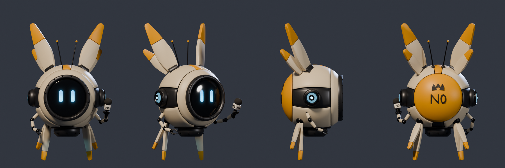

- **Модель:** `godot/tools/blender/n0_drone.py`, 36.4k треугольников (бюджет 40k), высота 1.39 м вместе с ушами и ножками, шар корпуса Ø 0.66 м. Узлы с шарнирами в origin: `N0_Body`, `N0_Screen`, `N0_Ear_L/R`, `N0_Legs_L/R`, `N0_Arm_L/R`, `N0_Mic`.
- **Корпус:** панели ливреи с зазорами, в щелях видно тёмное ядро; обойма экрана на болтах; боковые объективы с диафрагмой; две антенны; двигатель со стабилизирующим кольцом; на спине корона и «N0» по сфере.
- **Экран:** атлас `assets/models/n0/n0_face_atlas.png`, 10 выражений листа в порядке DEFAULT…GLITCH, LED-строки и ореол. Выражение выбирается `uv1_offset` ячейки.
- **Ливреи:** default, event, support — `N0Drone.LIVERIES` и `LIVERIES` в скрипте Blender, числа одни и те же.
- **Godot:**
  - `tools/build_n0.gd` пишет материалы по ролям `assets/materials/n0/*.tres` (краска — PBR `paint_marks`, как у кита) и пост-импорт `tools/import/n0_import.gd`, собирает `scenes/n0/n0.tscn`;
  - поведение — `scripts/n0/n0_drone.gd` (`class_name N0Drone`): `set_expression()`, `flash_expression(name, secs)`, `livery`, парение (покачивание, уши и ножки с запаздыванием, мерцание двигателя, дрожь экрана в GLITCH).
- **Проверка:** `tests/n0_snapshot.tscn` — 7 проверок: узлы, материалы ролей, бюджет, 10 разных ячеек, ливреи различаются, неизвестное выражение отклоняется, лист сохранён. Лист — `img/n0-godot-v1.png`.

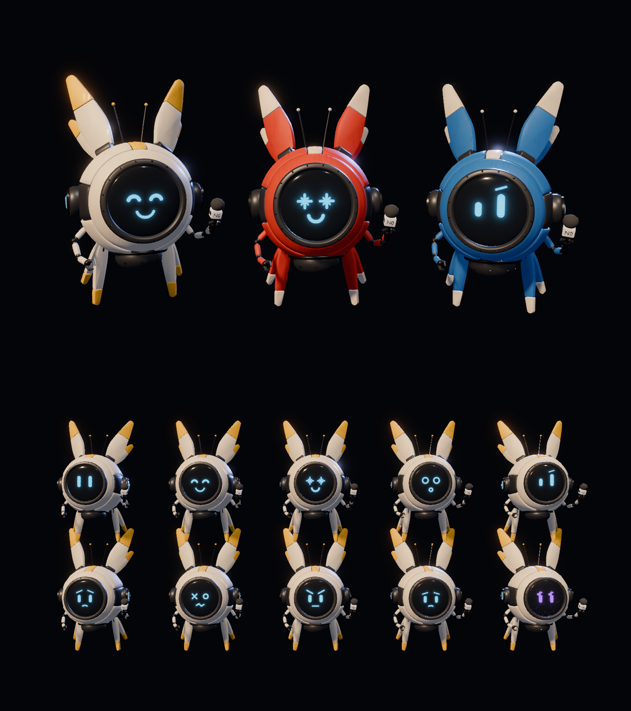

Не сделано:
- старый корпус NRU-07 под ливреей (серый, маркировка);
- вид в разрезе;
- рука-инструмент с насадками;
- микрофон в руке не двигается;
- кадры «в действии».

Всё это — следующие итерации, когда N0 заменит диктора (`LORE_NULL.md`, демо-срез п. 3).

## Арена 01 v1 (30.09.2026) — итог

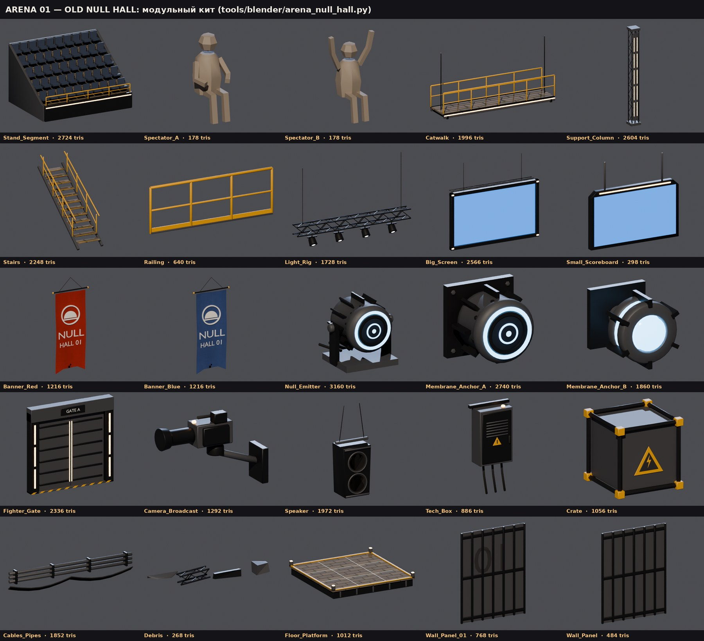

- **Кит:** `godot/tools/blender/arena_null_hall.py`, 25 glb в `assets/models/arena/null_hall/`, отчёт `kit_report.json`. Бюджет — 3000 треугольников на модуль, 4000 на трибуну, ворота, эмиттер и ферму, 300 на зрителя.
  - всё с листа: трибуна, мостик, колонна, лестница, перила, световая ферма, большой экран, табло, баннер (красный и синий), эмиттер, два якоря мембраны, ворота бойца, камера, динамик, техшкаф, ящик, кабели, обломки, платформа;
  - добавлено от меня: зрители Spectator_A (сидит) и Spectator_B (болеет) — модульные существа, людей в мире нет; панели стены Wall_Panel и Wall_Panel_01 с «01» с главного кадра;
  - у ворот створки — отдельные узлы `Gate_Door_L/R` с origin на петлях, для выхода бойца;
  - на экранах UV 0..1 под ViewportTexture;
  - надписи и эмблема на баннерах — геометрия. Эмблема (кольцо поля с куполом) — предложение, на листе она неразборчива.
- **Материалы:** роли `Hall_*`, в Godot — `assets/materials/null_hall/*.tres`; общий пост-импорт `tools/import/role_import.gd` берёт материалы из папки с именем каталога glb. Сталь — крашеная (PBR `paint_marks`, тёмно-серая); ржавый `iron` на листе не читался как «чистая индустрия».
- **Зал в Godot:** `tools/build_null_hall.gd` → `scenes/arena/null_hall.tscn`, скрипт `scenes/arena/null_hall.gd` (`NullHallArena`: API как у `VoidArena` — `spawn_points()`, `bounds()`, `body_fell`; плюс `membrane_anchors()`, `gravity_g` / `gravity_dir` / `membrane_pct` → табло).
  - полукольцо позади поля: 3 яруса по 11 секций со стенами, колонны, мостки, стена с «01»;
  - большой экран «NULL FIELD / ↘ 0.35G / MEMBRANE 98%» и табло GRAVITY;
  - 5 баннеров, 4 световые фермы с прожекторами, динамики, телекамеры, двое ворот, пол из платформ;
  - 1360 зрителей в двух MultiMesh (`scenes/arena/crowd_multimesh.gd`: позиции и цвета хранятся данными сцены, потому что headless-builder не сохраняет буфер MultiMesh);
  - поле — эллипс 30 × 21 м по 11 якорям мембраны (z = −2.5) и два эмиттера у пола. Спавны x = ∓5 / ∓9, y = 4.
- **Проверка:** `tests/null_hall_snapshot.tscn` — 11 проверок: модули, 1360 зрителей, 11 якорей и 2 эмиттера, ворота, экран и табло, спавны, 565 поверхностей с материалами ролей, текст табло и его смена при смене поля, рост бойца в игровом кадре — 10.1 % высоты (лист камеры: 8–12 %). Лист — `img/null-hall-godot-v1.jpg`: игровая камера, весь зал, край поля с N0.

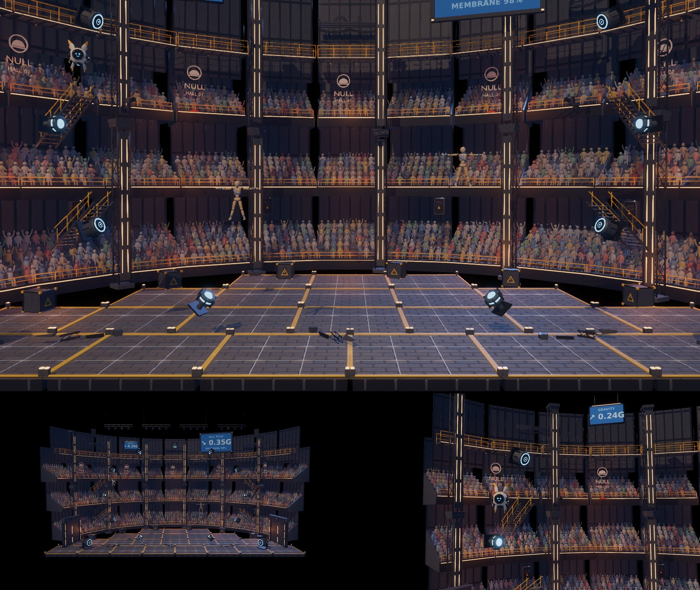

Не сделано и замечено:
- **Мембраны нет:** якоря стоят, упругой границы и шейдера прогиба пока нет (задача 3). Нет и пола-коллизии по всему залу: коллизия только под полем.
- **Бойцы читаются хуже, чем на артах.** Деревянные куклы теряются на тёплом фоне трибун. Толпа уже приглушена, добавлен туман на глубину. На артах бойцов выделяют цветные шлейфы и свечение двигателей: нужен шлейф цвета игрока при полёте или контур — это решение по виду бойцов (см. вопрос про «кубики» выше).
- **Ворота бойцов стоят по краям нижнего яруса** и в игровой кадр не попадают. Выход бойца (§7) — отдельная задача.
- **Вариантов раскладки нет:** зал собран только как STANDARD (1v1); WITH UPPER CATWALK и ALTERNATIVE LAYOUT с листа — параметры builder-а, позже.

## Мембрана и поле v1 (30.09.2026) — итог

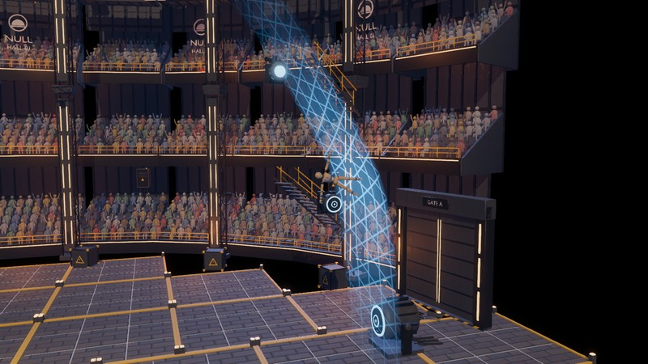

**Форма поля — купол.** По лору (§4: «A LARGE HEMISPHERE / DOME») поле — полуэллипс над полом: полуширина 16 м, высота 19 м, центр — середина пола. Якоря мембраны (9) стоят по дуге за лентой, эмиттеры — у ног купола. Прежний полный эллипс якорей из v1 убран: у пола его углы выпадали из поля.

**Гравитация поля** — `scenes/arena/null_field.gd` (`NullField`), Area3D с заменой гравитации на весь зал:
- по умолчанию — проектная `Tuning.GRAVITY` (табло «↓ 0.20G»);
- `NullHallArena.set_field(g, dir)` меняет силу (в G) и направление плавно, за `Tuning.NULL_FIELD_BLEND_S` = 1.2 с. Пока поле меняется, экран пишет «FIELD: SHIFTING»;
- на площадке клавиша **G** перебирает поля: ↓0.20, ↘0.35, ←0.24, ↑0.10, 0G, ↓0.50. Позже поле будет менять голосование зрителей;
- боты держатся против гравитации вектором: `EnemyBrain.hover_vec()` / `gravity_vec()` из `total_gravity` тела. `hover_input()` оставлен и возвращает вертикальную часть. PvE-проба после правки зелёная.

**Мембрана:**
- за контуром на каждое тело действует ускорение пружины по нормали к эллипсу — одинаковое для лёгких и тяжёлых частей, это поле, а не резина;
- наружу работает небольшой демпфер, на возврате пружина в 1.25 раза сильнее: мембрана «выстреливает» бойца обратно (§4: отскок — приём);
- числа — `Tuning.MEMBRANE_*`: K = 44 1/с², на 8 м/с растяжение ≈ 1.2 м; жёсткий упор после 2.5 м;
- свободный шар отскакивает со скоростью 1.08 от входа; кукла из-за своего дампа возвращается медленнее и не рвётся.

**Вид:**
- лента по дуге купола (`Membrane_Strip.glb` из кита, растянута до купола) с шейдером `assets/shaders/null_membrane.gdshader`;
- в покое почти не видна; у бойца ближе 2.5 м светится; в месте удара прогибается наружу на растяжение и вспыхивает «паутиной» (до 4 точек сразу);
- правило 5 листа камеры: «видна только вблизи, сильно тянется при ударе».

**Площадка** `scenes/playground_null_hall.tscn` (клавиша 8 на всех площадках; собирает `tools/build_null_hall.gd`):
- две куклы, Match, HUD, N0 у левой ноги купола;
- камера по листу камеры: полувысота кадра 7.5…11 м, то есть боец 8–12 % кадра;
- стрелки за экраном «P2 37m» цвета игрока — `scenes/ui/offscreen_markers.gd`, правило 4.

**Проверки:**
- `tests/null_field_probe.tscn` (headless) — 9 из 9: гравитация по умолчанию и сбоку, плавная смена и табло, отскок шара сбоку и сверху, кукла о мембрану (растяжение, возврат, не рвётся, свечение, сигнал), бот против бокового поля, стрелка за экраном, площадка (камера 7.5…11 м);
- `tests/null_hall_snapshot.tscn` — 12 из 12, третий кадр — удар о мембрану (`img/null-hall-godot-v2.jpg`).

Не сделано:
- голосование зрителей (задача 4);
- целостность мембраны («MEMBRANE 98%» пока число на табло);
- звук удара о мембрану (сигнал `membrane_hit` уже есть);
- отскок как приём «с разгоном» — например, рывок от растянутой мембраны. Нужна ручная проба автором: клавиша 8, затем G.

## Зрители и детали арены v1 (30.09.2026) — итог

Просьба автора: «зрители должны быть такими же модульными, а не людьми; запечь, чтобы не нагружали»; «детали на свой вкус на арену».

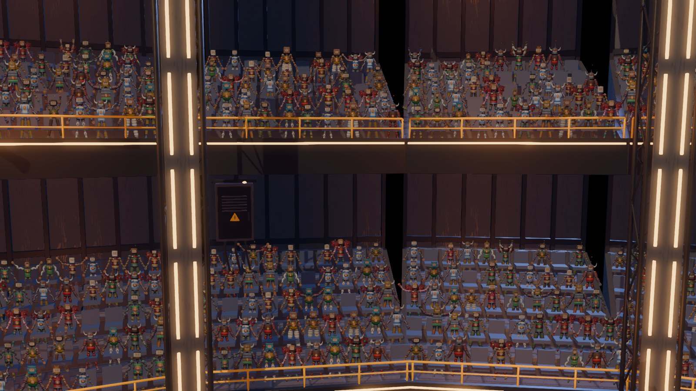

**Зрители — спрайты модульных существ:**
- `godot/tools/blender/crowd_sprites.py` собирает 16 случайных, но детерминированных (seed 2026) кукол из деталей кита тела v2 (`body_kit.human`): голова, ядро, руки, ноги, кисти, стопы, краски, цвет «рубашки» — цвет игрока 1–4, это болельщики; иногда декор: корона, султан, антенна, флажок, крылья;
- у каждой куклы три позы: руки вниз, в стороны, вверх. Всё запекается одним рендером Cycles в атлас `assets/textures/crowd/crowd_atlas.png`: 8 × 6 ячеек по 1.6 × 2.25 м, 1536 × 1620 px, с прозрачностью. Сборки записаны в `crowd_atlas.json`;
- масштаб один на все позы варианта, чтобы при смене позы зритель не «сжимался»;
- кэш деталей: повтор детали — копия меша, а не новая сборка с фасками. Без кэша рендер не укладывался в 20 минут, с кэшем — 1 мин 47 с.

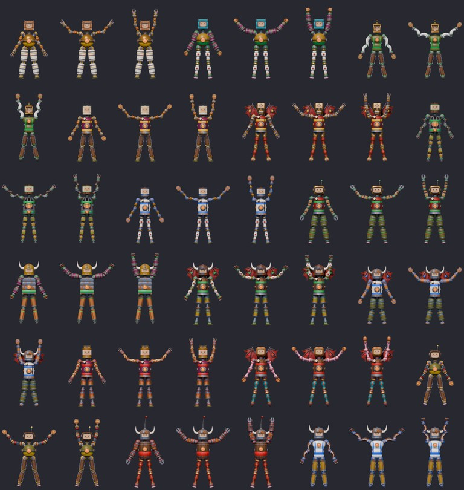

**В зале:**
- один MultiMesh квадов (`crowd_multimesh.gd`, custom data — вариант, фаза, яркость) с шейдером `assets/shaders/crowd_sprite.gdshader`: квад всегда повёрнут к камере вокруг вертикали, шейдер выбирает ячейку и сменяет позы;
- 1448 зрителей — одна текстура и одна отрисовка;
- **толпа болеет по событиям** (`NullHallArena.excite()`): удар о мембрану, сильный удар, KO, конец матча. Азарт спадает сам, позы меняются чаще;
- 3D-зрители Spectator_A/B из кита удалены.

**Детали (на мой вкус; всё фон, не спорит с бойцами):**
- лучи прожекторов в дымке (`Light_Beam.glb` + аддитивный `light_beam.gdshader`, по два от каждой фермы);
- три дрона-камеры трансляции (`Camera_Drone.glb`, `scenes/arena/drone_orbit.gd`) летают дугой снаружи купола и смотрят в центр — лор §7: «Cameras/drones follow»;
- два больших баннера «NULL / FIGHTING» под крышей;
- светящиеся швы на полу, где купол встаёт на пол (`Floor_Seam.glb`);
- **N0-ведущий** на площадке (`scripts/n0/n0_host.gd`):
  - держится у верхнего края кадра со стороны, где нет бойцов, и поворачивается к драке;
  - лицо меняется по событиям: удар о мембрану — EXCITED, сильный удар — SHOCKED, KO — EXCITED, конец матча — HAPPY, долгая тишина — CURIOUS.

Кадр игры (площадка, клавиша 8):

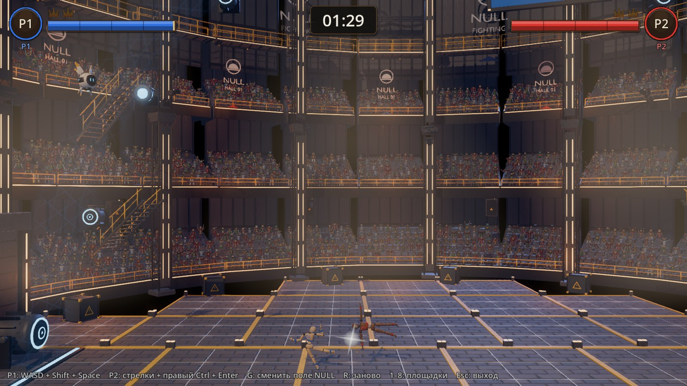

Кит целиком (v2: без 3D-зрителей, с новыми модулями):

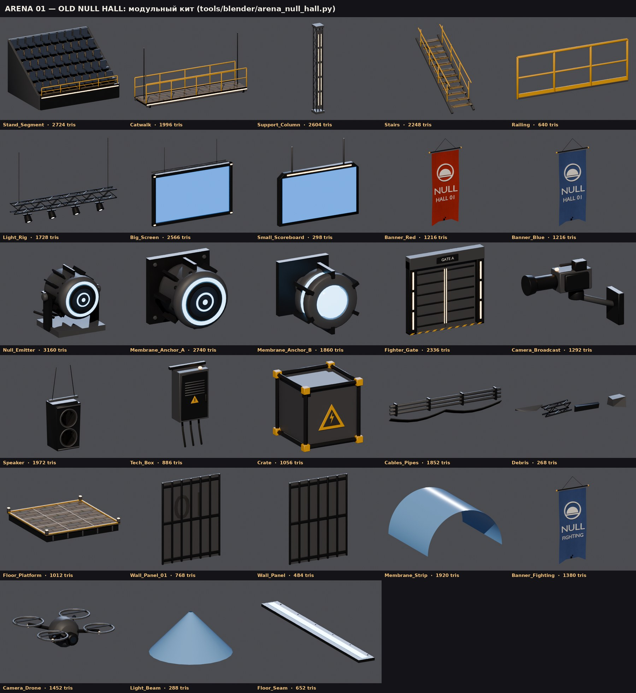

Проверки: `null_hall_snapshot` — 12 из 12, четвёртый кадр — трибуна крупно (`img/null-hall-godot-v3.jpg`); `null_field_probe` — 9 из 9.

Замечено:
- зрители стоят, а не сидят: суставы кукол гнутся только в плоскости экрана, посадить нельзя, ноги закрывает ряд впереди;
- при `playground_snapshot scene=null_hall` сценарий удара этой пробы рассчитан на Void: спавны там ближе, в зале удар слабый и «HEAD BLOW!» не объявляется. В список сцен пробы зал не добавлен.

## Детали лиги v1 (30.09.2026) — итог

> Вид деталей и бойцов переделан в v2 (раздел ниже): автор — «выглядят как обычные». Список деталей v1 остался, у них новый вид.

Автор: «бери на свой вкус». С двух листов я взял 12 деталей с самыми читаемыми силуэтами — по 1–3 на каждый раздел листов. Вышло 15 glb: у конечностей и щита по два размера.

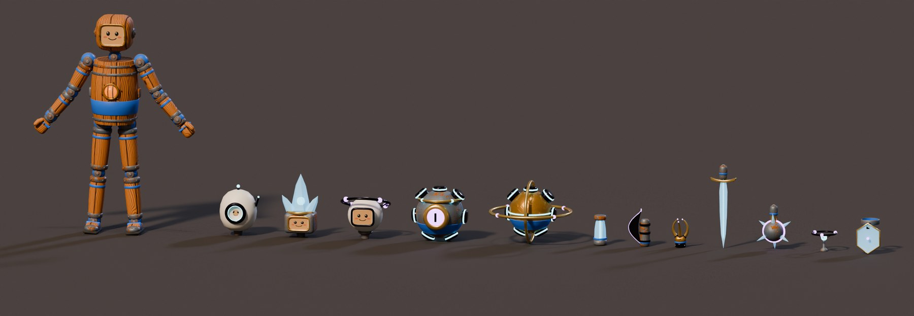

| Деталь | Вид | С листа | Корпус (ось материалов) |
|---|---|---|---|
| Голова-око | голова | яйцо-панцирь с одним огромным объективом; фото игрока — внутри линзы | PaintWhite |
| Кристальная голова | голова | друза энергокристаллов из тёмной маски с окном под фото | Iron |
| Голова с гало | голова | сфера с окном, наклонённое кольцо поля с фиолетовыми узлами | PaintWhite |
| Ядро-око | ядро | тёмный шар с фиолетовым зрачком в золотой обойме, кольцо-стабилизатор | Iron |
| Ядро-гироскоп | ядро | латунный шар в двух карданных кольцах, голубой шов | Brass |
| Кристальная | конечность S / L | шестигранный энергокристалл между обоймами, голубая прожилка | Iron |
| Коса | конечность S / L | тёмный сегмент с изогнутым лезвием и фиолетовой кромкой | Iron |
| Когти | кисть | три золотых когтя-серпа с фиолетовыми остриями | Brass |
| Кристальный клинок | навершие (Blade) | ромбический клинок из энергокристалла, золотая гарда | Iron |
| Шар-булава | навершие (Mace) | тёмный шар, фиолетовый экватор, шесть кристальных шипов | Iron |
| Гало поля | декор (макушка) | парящее кольцо с тремя узлами над голубым сенсором | Iron |
| Энергощит | броня S / L | шестиугольная кристальная пластина в золотой раме перед конечностью | Iron |

**Как встроено** (контракт кита, `BODY_KIT.md`):
- модуль `godot/tools/blender/kit_league.py`, в `body_kit.py` добавлен только он в `KIT_MODULES`;
- имена с префиксом вида: `Head_League…`, `Core_League…`, `Limb_League…` и так далее. Поэтому размеры, каталог, PartDef и сцены (`scenes/body/kit/kit_*league*.tscn`, `data/body/parts/kit_*league*.tres`) делает общий builder кита — детали сразу есть в мастерской;
- у каждой детали корпус на оси материалов (`Base_*`, физика по MaterialDef), у голов фото игрока, у ядер пояс цвета игрока (`Shirt_Kit`), у конечностей полоска;
- чужие материалы — фиксированные роли `League_Void` / `League_Glow` / `League_Cyan` / `League_Crystal` / `League_Gold`. Их `.tres` пишет отдельный `tools/build_league_mats.gd` (в v2 — `tools/build_league.gd`) в `assets/materials/kit/`, а ставит тот же пост-импорт `kit_import.gd`.

Трофейная идея лора — чужие детали на своём теле — работает сразу: детали лиги ставятся на обычных бойцов кита (правый боец на кадре ниже).

**Бойцы из деталей лиги** (Blender, `body_kit.human`):

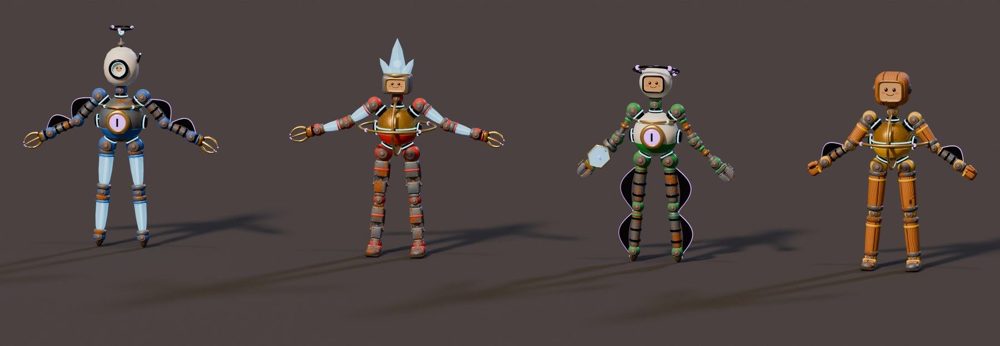

**В Godot:**

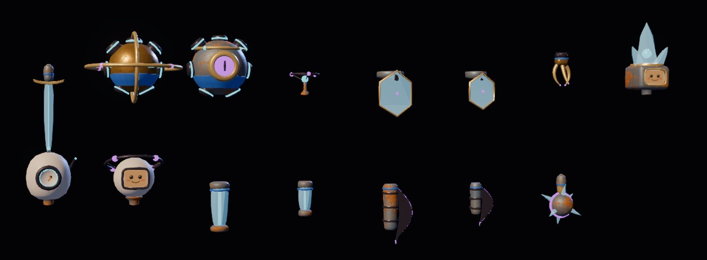

**Проверки:**
- `kit_probe` — OK, 2840 проверок, в том числе новые детали: PartDef, тела, формы, массы, сокеты, якоря, лицо, пояс, материалы, сборка наверший на верстаке;
- `workshop_probe` — OK, 173;
- `tests/league_parts_snapshot.tscn` — 5 из 5: все детали, корни RigidBody3D, материалы кита, лица у голов.

**Для соседней сессии (кит и мастерская — её зона, `BODY_KIT.md` §0):**
- общий builder `build_body_kit.gd` пишет предупреждение «роль League_* без .tres». Это ложное срабатывание: он сверяется со своей таблицей `MATS`, а не с диском; файлы есть, пост-импорт их ставит. Убрать — добавить роли в `MATS` или проверять файл;
- прогон builder-а на Linux меняет чужие файлы: округление в `Screen.tres` и пустое `control_rmb` в чертежах `kit_*`. Я их откатил и в коммит не брал.

**Не сделано:**
- особые механики с листов: гравитационное ядро (своё поле), фаза, щит, гасящий удар, самопочинка;
- чужие материалы как ось физики: void metal «лёгкий и прочный», energy crystal «реагирует на удар» и так далее;
- особый удар формой (`hit_mult`) у косы и когтей. Для него нужна строка в таблице `HIT_MULT` в `kit_probe` (зона соседней сессии), поэтому пока 1.0.

Всё это — решения по балансу для автора.

## Детали лиги v2 (30.09.2026) — чужой вид

Автор про v1: «эти инопланетные бойцы выглядят как обычные». Почему так вышло:
- бойцы v1 стояли на риге «человечка» кита, в Т-позе;
- корпуса деталей были из материалов кита: ржавое железо, кремовая краска, латунь;
- на каждом суставе — шар цвета игрока, на ядрах и конечностях — пояски, на головах — лицо-карточка;
- чужими были только акценты: кольца, свет, кристаллы.

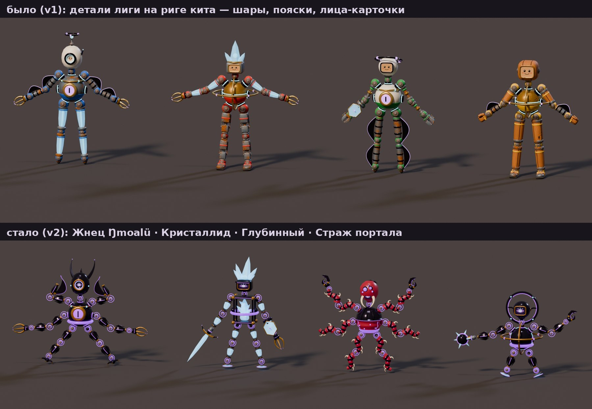

**Язык деталей лиги** (`godot/tools/blender/kit_league.py`):
- корпус — пустотный металл (`League_Void`: почти чёрный глянец с фиолетовым отливом, в Godot — светлая кромка силуэта) или живая ткань (новая роль `League_Flesh`, тёмно-алая) с хитином;
- свет — фиолетовые швы, кромки, глаза и узлы (`League_Glow`), голубые сенсоры (`League_Cyan`), энергокристалл;
- `Base_*` (ось материалов: физика и перекраска в мастерской) теперь только отделка: латунные эмиттеры, рамы, когти; на живых деталях — костяные шипы и жвала. Корпус чужой детали не перекрашивается. База по умолчанию — `Brass` или `Bone` вместо `Iron` и `PaintWhite`;
- «парящий» сустав с листов: у сокета каждой конечности, кисти, стопы и головы тонкое светящееся кольцо вокруг шара сустава. Сегмент начинается дальше от шара, чем у деталей кита.

**Детали — 20** (12 из v1 в новом виде и 8 новых, 25 glb с размерами S / L):

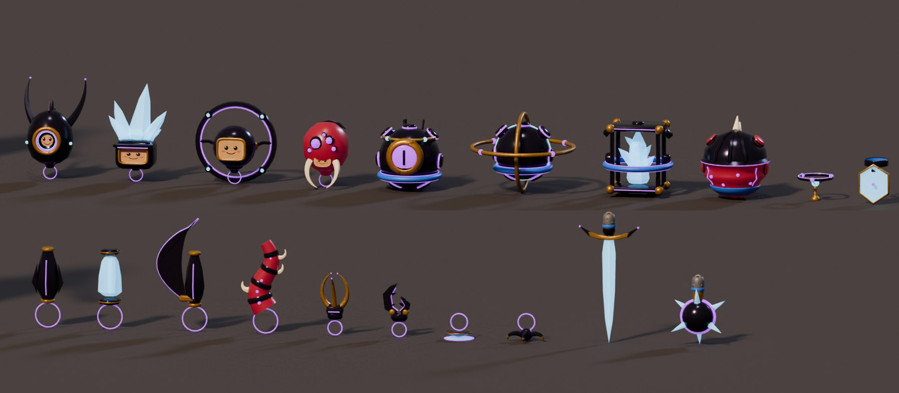

| Новая деталь | Вид | Что это |
|---|---|---|
| Живая голова | голова | алая луковица под хитином, гроздь из пяти светящихся глаз, костяные жвала; фото — в перепонке между жвалами |
| Кристальное ядро | ядро | друза кристаллов в чёрной клетке с латунными углами, голубое сердце |
| Живое ядро | ядро | ребристый мешок под хитиновым панцирем, светящиеся прожилки, костяной гребень по спине |
| Парящая | конечность S / L | гранёное чёрное веретено между латунными эмиттерами, светящийся шов, рёбра-плавники |
| Щупальце лиги | конечность S / L | живая ткань S-изгибом, хитиновые кольца, светящиеся точки, костяные крючья |
| Клешня лиги | кисть | две несимметричные челюсти со светящейся кромкой |
| Парящая стопа | стопа | подошвы нет: конус-эмиттер, сопло и полупрозрачный конус поля до земли |
| Ходуля-коготь | стопа | узел и четыре изогнутых когтя — лапа насекомого |

Остальные 12 деталей те же по смыслу. Голова с гало стала головой-порталом: большое кольцо в плоскости кадра вокруг сферы.

**Бойцы лиги** — четыре цивилизации, у каждой своё строение (предложение облачной сессии; имена, роли и бюджет — решения автора):

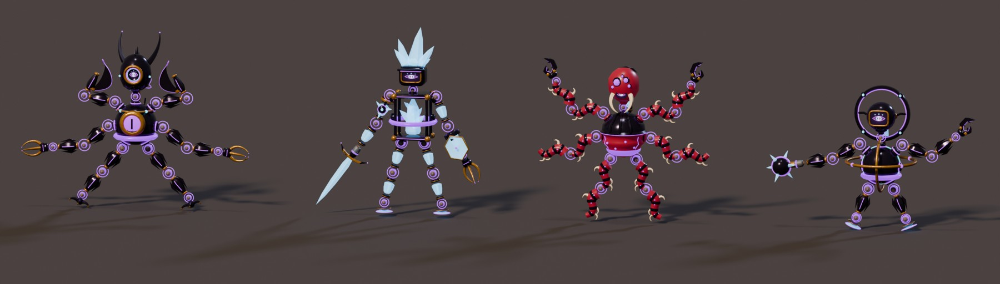

| id | Боец | Строение | Энергия / бюджет |
|---|---|---|---|
| `league_reaper` | Жнец Аоэлюн | ядро-око, голова-око с рогами; две пары рук — косы над головой и руки с когтями из боков; ноги-ходули на когтях | 134 / 140 |
| `league_crystal` | Кристаллид | кристальное ядро и голова-друза; руки длиной с ноги — до земли, щит и кристальный клинок; короткие ноги на парящих стопах | 107 / 110 |
| `league_deep` | Глубинный | живое ядро и живая голова; шесть щупалец: четыре руки (верхние с клешнями) и две ноги без стоп | 119 / 120 |
| `league_portal` | Страж портала | ядро-гироскоп, голова в кольце-портале; длинные руки с клешнёй и шаром-булавой; по одному короткому сегменту на эмиттер | 82 / 100 |

Три бойца дороже регламента 100. Бюджет чертежа поднят до их цены — это вопрос к автору (идея для лора, предложение: чемпионы Аоэлюн нарушают регламент лиги).

**В игре** (`godot/tools/build_league.gd`):
- пишет материалы `League_*`, чертежи `data/body/blueprints/league_*.tres` и сцены `scenes/body/presets/league_*.tscn`;
- состав и позы бойцов — таблица `LEAGUE_FIGHTERS` в этом builder-е. Кадр Blender (`tools/blender/league_fighters.py`) читает её же, поэтому картинка и игра не расходятся;
- углы — в пределах суставов куклы: локоть и колено гнутся в одну сторону. Поэтому косы Жнеца подняты над плечами, а не висят вниз, как у богомола;
- у куклы-пресета ребёнок `LeagueLook` (`scripts/league/league_look.gd`). После сборки он ужимает шары суставов до 0.55 — вокруг шара видно светящееся кольцо детали. Цвет игрока (`Shirt_*`) он меняет на фиолетовое свечение лиги, на лицо ставит светящийся визор с глазом;
- визор — `assets/textures/league/league_face.png`, генератор — `tools/league/league_face.py`. Картинка задана ключом `face` у головы в чертеже;
- правило трофея не ломается: деталь лиги на бойце игрока — обычная деталь кита, с цветом и фото игрока (витрина деталей ниже).

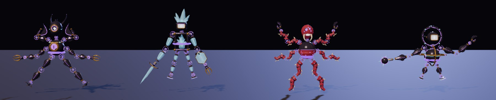

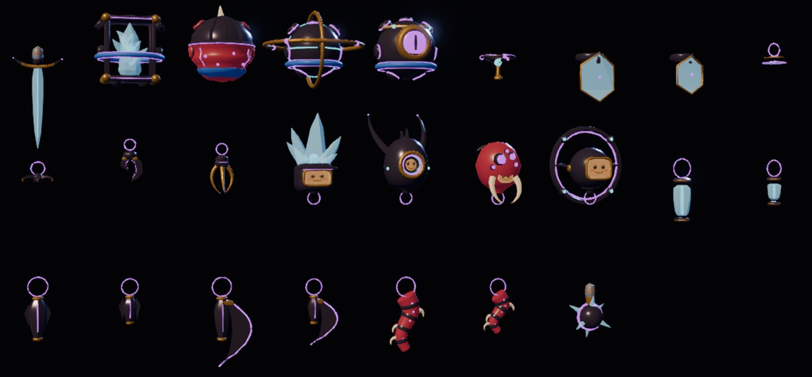

**Порядок сборки** после правки деталей:

```bash
blender -b --python godot/tools/blender/body_kit.py -- --export <Имена builder-ов>
godot --headless --path godot --import
godot --headless --path godot -s res://tools/build_league.gd      # материалы (нужны до импорта)
godot --headless --path godot -s res://tools/build_body_kit.gd    # PartDef и сцены деталей; откатить Screen.tres и kit_*.tres
godot --headless --path godot --import
godot --headless --path godot -s res://tools/build_league.gd      # чертежи и пресеты бойцов
blender -b --python godot/tools/blender/league_fighters.py -- out.png 48   # кадр бойцов
```

**Проверки:**
- `kit_probe` — OK, 3090 проверок, в том числе 8 новых деталей;
- `workshop_probe` — OK, 173;
- `tests/league_parts_snapshot.tscn` — 5 из 5 (25 сцен деталей);
- новый `tests/league_fighters_snapshot.tscn` — 25 из 25 без окна, 27 с кадром. Что проверяет:
  - четыре пресета собираются;
  - `LeagueLook` применился: шары ужаты, цвета игрока нет, визор на месте;
  - 4 с покоя на полу: суставы расходятся не больше чем на 1 см (порог 5 см), нет взрыва и NaN, торс над полом.

**Открыто — решения автора:**
- имена и роли цивилизаций, бюджет энергии бойцов лиги;
- один фиолетовый цвет у всей лиги или свой у каждой цивилизации (сейчас один, `LeagueLook.GLOW_*`);
- особые механики с листов (гравитационное ядро, фаза, щит, самопочинка) и `hit_mult` у косы, когтей, клешни и ходули. Сейчас 1.0, таблица `HIT_MULT` в `kit_probe` — зона соседней сессии;
- показывать ли бойцов лиги шаблонами в мастерской. Сейчас это только пресеты-сцены: список шаблонов `craft_edit.gd` ведёт соседняя сессия.

**Для соседней сессии:**
- ложное предупреждение builder-а кита «League_* без .tres» теперь есть и для `League_Flesh`: файлы на месте;
- прогон builder-а на Linux опять менял `Screen.tres` и `control_rmb` в `kit_*.tres`. Я откатил, в коммит не брал.
