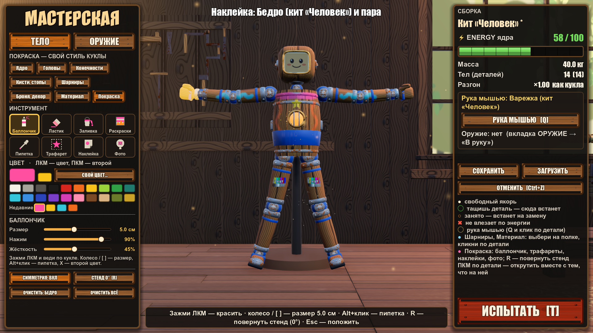
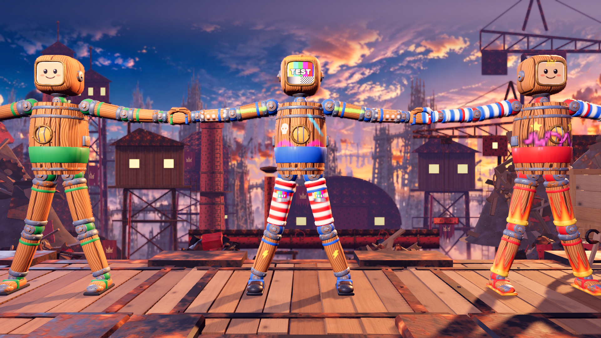

# Покраска куклы — баллончик, трафареты, наклейки, фото (29.09.2026, правки ревью — 30.09.2026)

Просьба автора: «кастомизация, чтобы было классно на это тратить время» — **баллончиком раскрасить любые части в любой цвет** и **импорт любого изображения**. Дополняет `BODY_KIT.md`, все правила оттуда в силе (§0 — кто что держит).

**Главное правило:** покраска косметическая. Физика — это материал (MaterialDef, `BODY_KIT.md` §4), покраска её не меняет: ни массы, ни трения, ни удара.

**Цвет игрока не закрашивается.** Поверхности `Shirt*` (шары шарниров, пояса, флажки) и `Face` (фото на плашке) в покраску не входят: кто есть кто, должно читаться всегда. Наклейка тоже не ложится ни на `Shirt*`, ни на коннекторы шарниров, ни на соседние детали (§3).

## 1. Что получает игрок

Во вкладке мастерской **«Покраска»**:

| Инструмент | Что делает | Как хранится |
|---|---|---|
| **Баллончик** | Зажал ЛКМ — по детали ложится мягкая краска с «напылением» (случайные точки в круге). Размер 1–10 см, нажим, жёсткость. На крупной детали кисть не мельче 0.9 ячейки её слоя — кольцо показывает настоящий размер | воксельный слой детали (§2) |
| **Ластик** | Стирает краску баллончика (до нуля: стёртая деталь снова без ключа `paint`) | тот же слой |
| **Заливка** | Клик — вся деталь в цвет | тот же слой |
| **Раскраски** | В один клик на деталь или на всю куклу: полосы, камуфляж, пламя, горошек, градиент, «граффити» | тот же слой, процедурно |
| **Пипетка** | Берёт цвет с детали | — |
| **Трафарет** | Чёткая фигура (звезда, корона, череп, молния, сердце, цифры 0–9, стрелка, череп-кость, шестерёнка, мишень) выбранного цвета; ставится кликом, колесо / `[` `]` / прокрутка и щипок трекпада / слайдер «Размер» — размер, Q/E — поворот | меш-наклейка (§3) с маской и цветом |
| **Наклейка** | Любая картинка с диска: кнопка «Импорт…» (нативный диалог) или просто **перетащить файл в окно игры**. png / jpg (и .jfif) / webp / bmp / tga / svg, формат — по байтам; импорт в фоне, окно не замирает; отказ — словами (слишком большая, HEIC, не картинка). Ставится и крутится как трафарет. ПКМ по картинке на полке — удалить (если её нет на кукле) | меш-наклейка с картинкой |
| **Фото на голову** | Голова кита — картинка на плашку лица (`FacePlate`, лор: фотокарточка Башни). Старая голова (плашка утоплена) — фото-наклейка на лицо. Одно фото: новое заменяет, «Снять фото» снимает | ключ `face` узла головы / наклейка с пометкой `face` |

- **Симметрия** (вкл. по умолчанию): краска и наклейки зеркалятся на парную сторону куклы (x → −x в кадре куклы). Наклейка у оси (её коробка задела бы зеркальную копию) — одна, ровно на оси.
- **Повернуть стенд:** 0° / 90° / 180° / 270°, чтобы красить бока и спину.
- **Палитра:** 20 цветов, «последние» 8 и полный `ColorPicker` (без ползунка яркости: цвет в 0..1).
- **Отмена** — Ctrl+Z, по одному штриху. Штрих, который ничего не изменил, записи не даёт. **Очистить деталь**, **очистить всё**.
- Звук баллончика (шипение, пока жмёшь) и облачко брызг в точке попадания.
- Покраска сохраняется в сборке: сохранить / загрузить, **автосейв через 2 с после любой правки** (и при закрытии окна, двойном Esc, «Испытать»), и едет с куклой в испытание и в матч.

## 2. Воксельный слой краски — `PaintLayer`

Файл `scripts/body/paint_layer.gd`, `class_name PaintLayer extends RefCounted`.

- Сетка RGBA8 поверх габарита меша детали — AABB в **локальных координатах корня меша детали** (узел `Mesh`, у слитой детали `Mesh_<uid>`).
- Ячейка кубическая, ребро = max(самая длинная ось / `MAX_CELLS` (40), `MIN_CELL` 8 мм): 8–9 мм у конечностей и голов кита, ≈ 14 мм у ядер-бочек. По каждой оси `MIN_CELLS` (4) … `MAX_CELLS` ячеек.
- Весь слой — ≤ 64 000 ячеек (256 КБ сырых данных). RGB предумножен на A (пустая ячейка — нули). В сейве он сжат zstd: пустой слой весит почти ноль.
- Цвет кистей, заливки и раскрасок зажат в 0..1 (компонента > 1 переполнила бы байт).

```
static func for_aabb(aabb: AABB, max_cells := 40) -> PaintLayer
static func cell_for_aabb(aabb: AABB, max_cells := 40) -> float      # ребро ячейки без самого слоя (кольцо кисти)
var res: Vector3i; var aabb: AABB; var data: PackedByteArray      # res.x*res.y*res.z*4, порядок x → y → z
func cell_size() -> float
func spray(p: Vector3, radius: float, color: Color, opacity: float, hardness: float, rng: RandomNumberGenerator, dots := 24, mist := SPRAY_MIST) -> void
func stamp(p: Vector3, radius: float, color: Color, strength: float, hardness: float) -> void   # мягкий шар, альфа накапливается
func erase(p: Vector3, radius: float, strength: float) -> void     # ячейка с заметной силой теряет ≥ 1/255 за вызов — доходит до 0
func fill(color: Color, strength := 1.0) -> void
func pattern(kind: String, colors: Array, seed: int, axis := Vector3.UP, mirror_x := false) -> void   # stripes, camo, flames, dots, gradient, graffiti
func pattern_begin(...) -> Dictionary; func pattern_run(job: Dictionary, max_usec := 0) -> bool   # то же частями (срезы z), байт в байт
func blank_like() -> PaintLayer                                    # пустой слой той же сетки (черновик раскраски)
func set_data(bytes: PackedByteArray) -> bool
func sample(p: Vector3) -> Color
func is_empty() -> bool
func to_dict() -> Dictionary        # {"v": 1, "res": Vector3i, "aabb": AABB, "data": PackedByteArray (zstd), "size": int}
static func from_dict(d: Dictionary) -> PaintLayer   # null, если данные битые
func make_texture() -> ImageTexture3D
func update_texture(tex: ImageTexture3D) -> void     # только грязные срезы z
```

- Кисти меняют только ячейки, чьи центры в радиусе. Кисть мельче ячейки может не задеть ни одного центра — поэтому мастерская не даёт радиус меньше 0.9 ячейки (§6.1).
- `mirror_x` — тот же рисунок, отражённый по X кадра слоя: правая деталь старой куклы (корень `Mesh_R` не зеркальный) получает зеркальную пару рисунка левой. У деталей кита корень правой уже зеркальный — им не нужно.
- `from_dict` отвергает всё, чего `for_aabb` не даёт: ось вне `MIN_CELLS..MAX_CELLS` (3D-текстура 64000 × 1 × 1 не создаётся — предел Metal 2048 по оси), ячейку мельче `MIN_CELL / 2`, не тот размер, не zstd.

**Рендер.** Основной путь — **краска в проходе самой поверхности**: `BodyPaint.attach_layer` заменяет материал поверхности (на этом MeshInstance3D) двойником — `ShaderMaterial`, чей шейдер повторяет `StandardMaterial3D` детали (альбедо, шероховатость, металл с каналами текстур, блик, карта нормалей, свечение, UV1, цвет вершин, cull) и смешивает с ним слой:
- позиция вершины → в пространство слоя через uniform `mat4 to_layer` (у MeshInstance бывает свой трансформ внутри glb);
- выборка `sampler3D paint_tex` по нормализованной позиции, rgb / a;
- по альфе краски: `ALBEDO` → цвет краски, `ROUGHNESS` → 0.45 (глянец краски), `METALLIC` → 0, `SPECULAR` → 0.5; свечение и карта нормалей под краской гаснут (окошко ядра не светит сквозь краску, доски не проступают рельефом);
- шейдер общий на набор возможностей (кэш), у двойника meta `paint_src` = исходный материал, `resource_name` — как у исходника (пипетка, `is_protected`, пробы узнают его).

Материалы, которые двойник не повторит (`BodyPaint.inpass_block`: прозрачные, triplanar, detail, rim, ORM, ShaderMaterial…), красятся по-старому — `assets/materials/kit/paint_overlay.gdshader` как `next_pass` дубля: `blend_mix`, `depth_draw_never`, сдвиг по нормали ≈ 0.4 мм, теней не отбрасывает. У кита и старой куклы `human` таких поверхностей нет.

## 3. Наклейки и трафареты — меш-наклейки

- Не `Decal`: кластерные декали Forward+ отсекаются по плиткам экрана 32 px, и наклейка шириной 10–17 px (камера матча, полувысота 4 м) пропадала кусками при каждом сдвиге камеры (замер 30.09: молния на голени исчезала в 2 из 9 положений камеры с шагом 4 px).
- Наклейка — `MeshInstance3D` «Sticker» ребёнком тела детали, meta `sticker` = словарь чертежа (§4). Кадр — `xf` в кадре корня меша; проекция вдоль −Y.
- Меш — копия треугольников **этой** детали внутри коробки `size.x × 4 см × size.y`, обрезанных по коробке, в кадре наклейки; UV = (x / w + ½, z / h + ½) — как у Decal (верх картинки — −Z кадра, у зеркального кадра порядок вершин обратный). Пропускаются: поверхности `Shirt*` (пояса, флажки), поддеревья `Connector_*` (шары суставов), треугольники, обращённые от наклейки. Спад по нормали n·Y 0.3 → 0.55 (не тянется по бокам конечностей) и к верху / низу коробки — альфа вершин. Плашка лица `Face*` — можно (очки на фото).
- Над поверхностью на 0.3 мм, материал — `StandardMaterial3D` (картинка × цвет, альфа-смешение, cull back, без теней), `render_priority` 1 — после прозрачного прохода краски; кэш по картинке и цвету. `layers` — как у мешей детали.
- Размер — 0.5–40 см по стороне (из чертежа больше не соберётся).
- Трафарет: маска `res://assets/textures/paint_stencils/<имя>.png` (белая фигура на прозрачном) × цвет.
- Картинка: `KitImages` (ниже), цвет белый.
- `PAINT_LAYER_BIT = 1 << 11` (слой 12): `tag_layers` даёт его всем MeshInstance3D куклы, **кроме коннекторов** — слой «кукла без шаров суставов» для Decal-эффектов по куклам. Наклейкам он больше не нужен.

`scripts/body/kit_images.gd`, `class_name KitImages`:

```
const DIR := "user://kit_images/"
static func import_file(path: String) -> String         # id или "" (причина — last_error)
static func import_file_ex(path: String) -> Dictionary  # {id, error: ERR_* | "", pixels} — без общего состояния, можно из потока
static func texture(id: String) -> Texture2D             # "stencil:<имя>" → маска из assets; иначе файл из DIR; кэш; null, если нет
static func stencils() -> PackedStringArray              # имена масок по порядку
static func list_images() -> PackedStringArray; static func delete_image(id: String) -> bool
```

- Формат — по сигнатуре байтов (png, jpg — в т. ч. .jfif / .jpe / без расширения, webp, bmp); по расширению — только tga и svg. HEIC узнаётся отдельно (`ERR_HEIC`: «сохрани как JPG»).
- Размер в пикселях — из заголовка **до** декодирования (png, jpg, webp): больше `MAX_PIXELS` (40 Мп) — `ERR_TOO_BIG_PIXELS` без гигабайта в памяти; файл больше 64 МБ — `ERR_TOO_BIG_FILE`; svg рисуется сразу в ≤ 512.
- Дальше RGBA8, большая сторона ≤ 512 (Lanczos), PNG в `DIR/<sha256[:16]>.png`; id — это имя.

## 4. Ключи узла чертежа (`BodyBlueprint.nodes[i]`)

Все ключи необязательные. Старые чертежи и враги (`data/enemies`) не меняются.

| Ключ | Тип | Смысл |
|---|---|---|
| `paint` | Dictionary | `PaintLayer.to_dict()` в пространстве корня меша узла |
| `stickers` | Array[Dictionary] | `{img: String, xf: Transform3D (кадр наклейки в пространстве корня меша; −Y — в поверхность), size: Vector2 (м), color: Color, face?: bool}`; `face: true` — фото-наклейка старой головы (одна на голову, «Снять фото» её снимает) |
| `face` | String | id картинки (`KitImages`) на `FacePlate` головы. Пишется только голове кита (`BodyPaint.face_plate_ok`) |

Валидация мягкая: битые данные — предупреждение в лог, кукла собирается без покраски. `validate()` на них ошибок не даёт: краска не должна ломать сборку.

Замена детали (`CraftEdit._replace`): другая деталь — `paint` и `stickers` стираются (они в кадре меша прежней); `face` остаётся только на голове кита, со старой головы / не головы снимается и возвращается как `face_lost` — мастерская кладёт это фото наклейкой на лицо новой головы в той же записи истории.

## 5. ModularDoll

После `super._ready()` (там `Doll._recolor` уже покрасил Shirt) вызывается `BodyPaint.tag_layers`, потом для каждого узла с `paint`/`stickers`/`face` — `BodyPaint.apply_node(...)`. Файл `scripts/body/body_paint.gd`, `class_name BodyPaint`, только статика:

```
const PAINT_LAYER_BIT := 1 << 11
static func mesh_root_of(doll: ModularDoll, uid: String) -> Node3D           # Mesh у своего тела, Mesh_<uid> у слитой детали
static func attach_layer(mesh_root: Node3D, layer: PaintLayer) -> Dictionary # {layer, tex, materials: [ShaderMaterial], mesh_root}
static func inpass_block(m: Material) -> String                              # "" — материал красится в своём проходе
static func paint_pass(m: Material) -> ShaderMaterial                        # материал с paint_tex (двойник или next_pass)
static func add_sticker(body: Node3D, mesh_root: Node3D, st: Dictionary) -> MeshInstance3D
static func bake_sticker(n: MeshInstance3D, mesh_root: Node3D, alpha := 1.0) -> int   # меш наклейки заново (после сдвига)
static func set_face(mesh_root: Node3D, tex: Texture2D) -> bool
static func face_plate_ok(d: PartDef) -> bool                                # фото на плашку — только голове кита
static func tag_layers(doll: Node) -> void                                   # бит PAINT_LAYER_BIT мешам куклы, кроме коннекторов
```

- `attach_layer`: для каждой поверхности, кроме `Shirt*` и `Face`, — двойник с краской в том же проходе (§2) на этот MeshInstance3D (у Base_ и материалов glb исходник общий, он не трогается), `to_layer` — свой у каждого меша, текстура слоя общая; повторный вызов собирает двойник заново от исходника. Запасной путь — дубль с `next_pass` = ShaderMaterial краски.
- Коннекторы шарниров не красятся.
- ModularDoll хранит ручки: `paint_handle(uid) -> Dictionary` (как у `attach_layer`, пустой, если краски нет), `stickers_of(uid) -> Array`, `add_sticker(uid, st)`. Мастерская рисует прямо в живой слой стенда, без пересборки: `ensure_paint(uid) -> Dictionary` создаёт пустой слой, если его не было.
- `face` ставится на любую плашку `Face*` (так собирается и старая кукла из чертежа); мастерская пишет его только голове кита.

## 6. Мастерская

- **Режим:** `paint_tool` ∈ {"", spray, erase, fill, pattern, pick, stencil, sticker, face}. Сбрасывается так же, как кисть материала: смена вкладки/вида, испытание, Esc/ПКМ.
- **Попадание:** луч камеры по треугольникам мешей стенда (`Mesh.generate_triangle_mesh()` → `TriangleMesh.intersect_ray` в локальных координатах, кэш по мешу): точная точка и нормаль на видимой поверхности.
- **Живой штрих:** каждый физкадр, пока зажата ЛКМ, `spray/erase` в живой слой, `update_texture`; облачко брызг (`GPUParticles3D` цвета краски) и шипение (`AudioStreamPlayer`, шина `SFX`, если есть, иначе `Master`). Отпустил ЛКМ → `node.paint = layer.to_dict()` для всех узлов, чей слой штрих изменил, одна запись в историю (Ctrl+Z).
- **Симметрия:** точка отражается в кадре куклы (x → −x), новый луч по тому же направлению камеры. Попал в другую деталь — красим её тоже.
- **Наклейка/трафарет:** клик → меш-наклейка в точке по нормали. Пока инструмент активен и курсор над наклейкой: колесо / `[` `]` / прокрутка и щипок трекпада — размер (2–40 см), Q/E — поворот на 15°, перетаскивание — переезд, Delete/ПКМ — снять. Импорт: кнопка «Импорт…» (`FileDialog` с `use_native_dialog`) и `get_window().files_dropped`.
- **Фото:** клик по картинке на полке или по голове → голове кита `node.face = id`, старой голове — фото-наклейка.
- **UI:** полка вкладки «Покраска» — инструменты, палитра, слайдеры (размер, нажим, жёсткость; у трафарета и наклейки — «Размер» наклейки), кнопки раскрасок, сетка трафаретов, список импортированных картинок (миниатюры из `user://kit_images`, ПКМ — удалить), «Симметрия», «Повернуть», «Очистить деталь/всё».
- `CraftEdit.signature` учитывает наличие и хэш `paint`/`stickers`/`face`, чтобы сохранение ловило потерю.

### 6.1. Как сделано (30.09.2026)

- **Файлы:** `scenes/workshop/workshop_paint.gd` (`class_name WorkshopPaint`, узел `Paint` у `WorkshopBuild`, `ws.paint`) — инструменты, штрих, наклейки, фото, импорт, поворот стенда, отклик; `scenes/workshop/ui/paint_panel.gd` — полка вкладки «Покраска» (`CraftEdit.BODY_SHELVES`, `tool: "paint"`). `WorkshopBuild.paint_tool` — инструмент в руке, `active_tool() == "paint"`; ввод 3D сначала идёт в `paint.handle_input`.
- **Полка:** 8 плашек инструментов с пиктограммами (их краска — текущий цвет), цвет + второй цвет (клик по второму / X — поменять), `ColorPicker` во всплывашке (без ползунка яркости), палитра 20 (ЛКМ — цвет, ПКМ — второй), «Недавние» 8; настройки инструмента: баллончик — размер (1–10 см, диаметр) / нажим / жёсткость, ластик — размер / сила, заливка — плотность; раскраски — 6 плиток с превью (настоящий `PaintLayer.pattern` на плашке 32 × 20 см) и «Своими цветами»; трафарет — сетка 20 масок цветом краски и слайдер «Размер»; наклейка / фото — миниатюры `user://kit_images` (ПКМ — удалить с подтверждением; картинку на кукле — нельзя), «Импорт…» (`FileDialog`, нативный, несколько файлов). Внизу: «Симметрия», «Стенд 0° [R]», «Очистить: <деталь>» (последняя правленная и пара), «Очистить всё». На вкладке шаблоны тела спрятаны (место палитре), точки якорей на стенде не рисуются. Вход во вкладку — баллончик сразу в руке (и звук `can_rattle`). Подсказки размера — «колесо / [ ]».
- **Попадание:** луч камеры по треугольникам **всех** мешей стенда (кэш `TriangleMesh` по мешу), ближайший; меш детали даёт uid, прочие (коннекторы, оружие в руке) только заслоняют. Физлуч `PICK_LAYER` не нужен: у декора форм может не быть, формы — капсулы. Над поверхностью цвета игрока (`Shirt*`, `Face*`) кольцо кисти серое и подсказка «не закрашивается».
- **Штрих:** каждый физкадр — путь курсора от прошлой точки до текущей: лучи через 6 px экрана (≤ 32 за кадр на сторону); между соседними попаданиями в одну деталь мазки идут **по поверхности** с шагом 0.35 эффективного радиуса (≤ 48 мазков за кадр, для большой кисти меньше — по числу ячеек тумана), краски на единицу пути столько же при любой скорости (туман и точки мазка — доля «мазка на шаг»: один вызов `spray` с `mist` = 1 − (1 − 0.12)² вместо двух). Радиус мазка — не меньше 0.9 ячейки слоя детали (кисть 1 см на ядре с ячейкой 14 мм иначе в 80 % мазков не задевала ни одного центра ячейки); кольцо и подсказка показывают этот размер. `update_texture` затронутых. Отпустил (или ЛКМ отпущена над панелью) — одна запись истории, `node.paint` узлов, чей слой изменился (пустой слой — ключ стирается); штрих без изменений — ни записи, ни «*». Симметрия: зеркалится весь луч в кадре куклы (начало и направление) — при повёрнутом стенде пара красится с другой стороны. Цена: ≤ 1.5 мс за кадр в среднем, пик 2.5 мс (кисть 10 см, быстрый штрих, симметрия; было 3.4–3.8 мс); первый мазок по детали без слоя — ещё 2–3 мс (слой и двойники материалов).
- **Раскраски:** клик — деталь и её пара (один seed — зеркально; правой детали старой куклы — `mirror_x`), Shift+клик — вся кукла волной от ядра; раскраска **заменяет** краску детали (баллончик — поверх), повторный клик — новый вариант. «Своими цветами» — `[цвет, второй цвет]`, иначе родная палитра узора. Рисуется очередью: деталь — в черновик (`blank_like`) срезами z по 4 мс за физкадр (`pattern_begin` / `pattern_run`), готовая ложится в живой слой целиком. Деталь 60 000 ячеек — 5–10 кадров без рывка (было 40–80 мс одним кадром, вся кукла — 250–370 мс). Горячие циклы раскрасок без вызова на ячейку.
- **Наклейки:** кадр — Y по нормали «площадки» (среднее 6 лучей вокруг точки), «верх» картинки — верх экрана (повёрнутый на заданный угол); с симметрией — пара по зеркальному лучу, картинка не отражается (читается), угол зеркальный; наклейка, чья коробка (половина большей стороны) задела бы зеркальную копию, — одна и встаёт ровно на плоскость симметрии. Над наклейкой: колесо / `[` `]` / трекпад — размер (2–40 см), Q / E — ±15°, тащить — переезд (и на другую деталь; меш пересобирается раз в кадр по детали под курсором), ПКМ / Delete — снять; правка идёт и паре. Серия колесом / Q / E — одна запись истории. Не над наклейкой колесо и Q / E настраивают следующую (превью — такая же меш-наклейка, полупрозрачная, с парой).
- **Фото:** голова кита — `node.face` (живьём). Старая голова (плашка утоплена) — фото-наклейка на лицо с пометкой `face` (60 % ширины головы): одна, новое фото её заменяет, то же фото повторно — ничего (и записи истории нет), «Снять фото» снимает и её. Клик в 3D ставит фото только по голове. Файл, брошенный в окно, — импорт, вкладка «Покраска», над куклой — сразу наклейка в точку курсора.
- **Импорт:** `import_files_async` — `KitImages.import_file_ex` в `WorkerThreadPool`, итог на главном потоке; подсказки по причинам отказа. Синхронный `import_files` — для проб.
- **Автосейв правок:** `WorkshopBuild.mark_dirty` (зовут `_push_history`, отмена, серия колесом по наклейке) → через 2 с `CraftEdit.save(…, _autosave)`. Не пишет во время штриха / перетаскивания / раскраски, в испытании и если чертёж не собирается (старт мастерской отверг бы его). Закрытие окна и двойной Esc — сейв сразу (незаконченный штрих сначала записывается). Проба выключает (`autosave_on_test = false`).
- **Поворот стенда:** R / Shift+R, кнопка — плавно 90°. Тела `RigidBody3D` за корнем куклы не едут и держат замки осей 2.5D, поэтому у тел стенда замки сняты (`WorkshopBuild._unlock_axes`, стенд заморожен), а каждое тело ставится явно: поворот × кадр 0°. Сбрасывается при уходе с вкладки, виде ОРУЖИЕ, испытании.
- **Отклик:** кольцо кисти на поверхности (толщина в пикселях, без теста глубины) и кольцо пары, брызги (`GPUParticles3D` капель) и облачко цвета краски, «пуф» при заливке, раскраске, наклейке и фото; шипение `spray_loop` с `spray_start` (ластик — то же ниже тоном и тише). Потёков нет.
- **Витрина:** `kit_graffiti` (kit_human: пламя на ногах, полосы на руках, тег граффити и звезда на груди, корона на макушке) и `kit_camo` (громила в светлом лесном камуфляже, мишень на груди) — пишет `tools/build_body_kit.gd` (`PaintLayer.pattern` с постоянным seed, трафареты — луч по треугольникам меша детали). Камуфляж на всех 16 деталях — `.tres` ≈ 390 КБ текста.
- **Проба:** `tests/workshop_probe.gd`, раздел `paint_*` / `sticker_*` / `face_*` / `pattern_*` / `import_async` / `image_delete_used` / `autosave_edits`; кадры `workshop-build-v1-paint{,-stencil,-presets}.png`.




## 7. Проверки (`tests/paint_probe.gd`, headless)

- `PaintLayer`:
  - `stamp`/`spray` меняют ячейки только в радиусе;
  - `erase` обнуляет (и при слабом нажиме — до пустого слоя);
  - цвет > 1 (ползунок яркости) не переполняет байт, rgb ≤ a — и у `stamp`, и у `fill`;
  - `to_dict`/`from_dict` дают тот же массив байт; пустой слой после zstd < 1 КБ; битое и размеры, которых `for_aabb` не даёт (4000 × 4 × 4, 2³, габарит 1 мкм), → null;
  - `pattern` на всех видах детерминирован по seed; частями — байт в байт как целиком; `mirror_x` — точное отражение.
- Сборка ModularDoll с `paint`/`stickers`/`face` на `kit_human` и на старой кукле `human`:
  - у не-Shirt поверхностей краска в своём проходе (двойник с `paint_tex`), прозрачного прохода нет;
  - у Shirt и Face — нет;
  - наклейки — MeshInstance3D (ни одного Decal), без треугольников `Shirt*` и коннекторов;
  - у всех MeshInstance куклы, кроме коннекторов, есть бит; у коннекторов — нет;
  - `FacePlate` получил текстуру.
- Физика с покраской и без совпадает: массы, центры масс, отклик на толчок.
- `KitImages.import_file` фикстуры → id стабилен; `texture(id)` не null; трафареты все грузятся; jpg под именем .png и .jfif грузятся; HEIC, огромный заголовок, не картинка — отказ с причиной.
- Мастерская (в `workshop_probe`): штрих меняет слой, отмена возвращает, сохранение/загрузка сохраняют краску, симметрия красит парную руку, наклейка ставится/крутится/снимается, фото ставится; кисть 1 см на ядре красит каждым мазком; пустой штрих без записи; трекпад меняет размер; наклейка у оси — одна; фото старой головы — одна наклейка, «Снять фото» снимает; замена головы переносит фото; пара старой куклы — зеркальная раскраска; кадр очереди раскраски ≤ 20 мс; импорт в потоке; автосейв через 2 с.

## 8. Производительность

Цель: 4 полностью окрашенные куклы на арене Свалки не теряют больше 10 % FPS против неокрашенных. Замер — windowed-скрипт в scratchpad (Apple M2, Metal, 1920 × 1080, vsync выкл; 4 кита, у каждого: заливка + раскраска на всех красимых деталях, 3 наклейки на деталь, фото на голове — 60 слоёв, 170 наклеек; парные циклы plain / full / paint_only в одной позе).

| Кадр | До правок (next_pass + Decal) | После (краска в проходе + меш-наклейки) |
|---|---|---|
| Матч (полувысота 4 м — ближе камера Свалки не подходит) | full −4.3 %, paint_only −2.7 % | full −1.8…−3.3 %, paint_only −1.2…−1.9 % |
| 4 куклы во весь кадр (полувысота 1.45 м) | full −12.6 %, paint_only −9.8 % | full −4.7…−6.0 % (+0.7–0.8 мс), paint_only −2.0…−2.3 % |
| Крит-крупный план торса (0.55 м) | −9.4 % | full ≈ −4.6 %, paint_only ≈ 0 (замер под нагрузкой: разброс ±1.5 мс) |

- Куда уходило: второй освещённый проход краски — 85–90 % цены (весь цикл света Forward+ и мягкие тени солнца ещё раз). Двойник рисует краску в том же проходе: +1 выборка 3D-текстуры.
- Меш-наклейки: ≈ +0.3–0.4 мс крупным планом (170 штук), вызовов отрисовки — +230.
- Мастерская: штрих ≤ 1.5 мс за кадр в среднем (пик 2.5 мс), раскраска — ≤ 4 мс за физкадр очередью, превью наклейки при движении мыши ≈ 2 мс за кадр (меш заново, когда курсор сдвинулся).
- Сборка куклы с краской: +16–48 мс к ModularDoll (`apply_node` ≈ 16–18 мс на всю куклу).
- Аудит FPS ведёт боевая сессия, ей сообщить результат.
