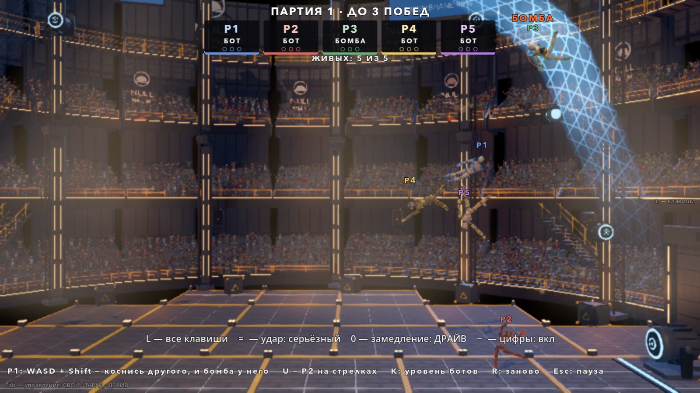
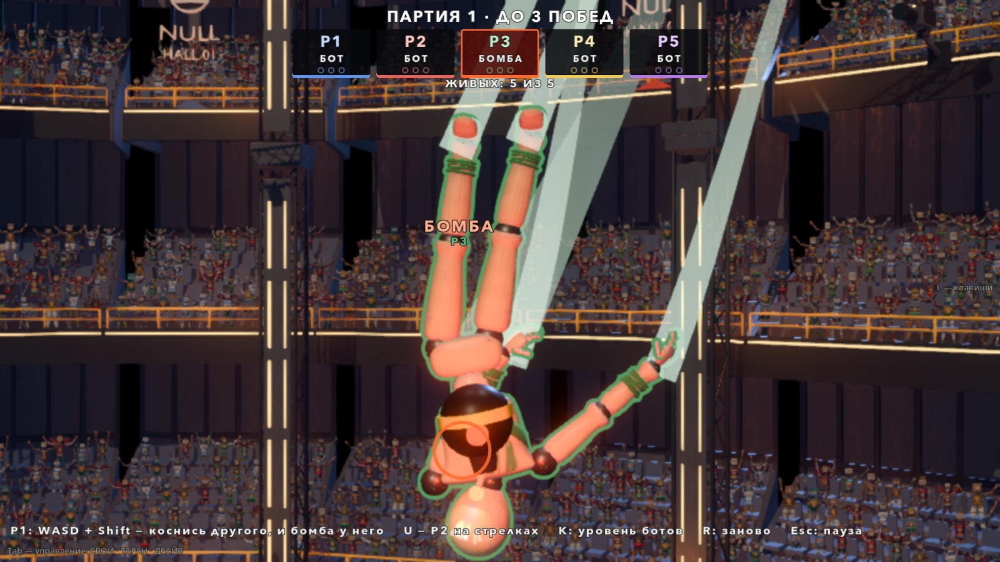
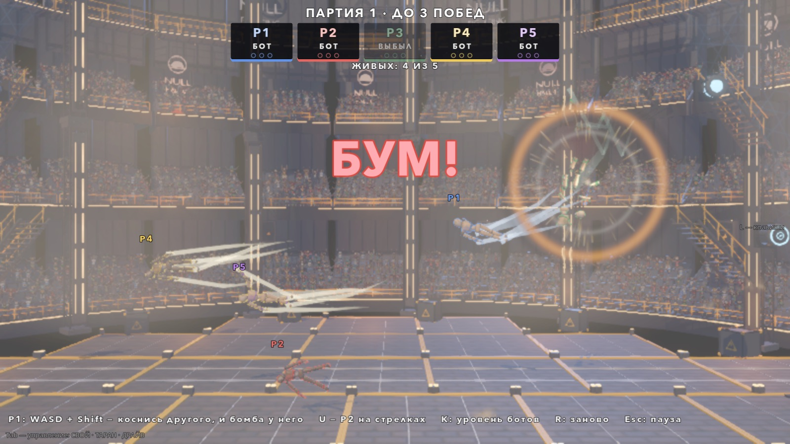
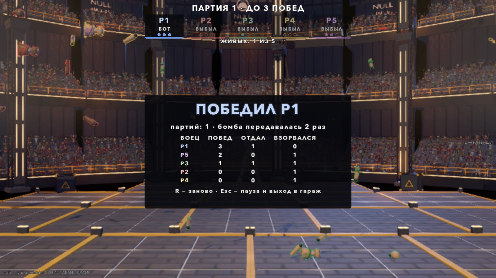

# Бомба касанием (06.10.2026)

Автор 06.10 (MODES_PACK.md): «передать бомбу касанием»; на вопрос про таймер — «скрытый таймер, но по миганию и звуку чуть-чуть
понятно, что и как».

Режим без лора, как спорт-зал и стычка. Пятеро в куполе Old NULL Hall, у одного бомба. Коснулся другого — бомба у него. Фитиль кончился —
держатель взрывается и выбывает. Последний живой берёт партию, матч — до 2 побед.






## Как запустить

- В игре: гараж → **ВСЕ РЕЖИМЫ** → «Бомба: передай касанием» (после строк «СТАЗИС»).
- Напрямую: `godot --path godot res://scenes/playground_bomb.tscn`.

## Правила

- **Пятеро:** P1 (человек) + 4 бота. P2 по умолчанию бот; клавиша **U** отдаёт его второму игроку на стрелках (или второй просто жмёт
  свою клавишу — бот отдаёт управление сам, как в спорт-зале). Купол Old NULL Hall, гравитация обычная (0.2 G); голосования зрителей,
  смены поля (G) и чемпиона (K арены) в режиме нет.
- **Бомба** в начале партии у случайной куклы. Касание **любой** деталью держателя **любой** детали другой живой куклы — бомба у неё
  (удар не нужен, хватит задеть рукой или стопой). Тому, от кого получил, вернуть нельзя **1.0 с**. Дальше по цепочке — не раньше
  0.15 с (в куче бомба не прыгает по трём куклам за один кадр).
- **Фитиль скрытый:** случайный 14–20 с, цифр нигде нет, при передаче **не сбрасывается**.
- **Писк и мигание весь фитиль**, темп растёт к концу: пауза между писками ≈ 1 с в начале → ≈ 0.11 с в конце. Темп считается от доли
  сгоревшего фитиля, а не от секунд: короткая и длинная бомба звучат в начале одинаково. У каждой паузы разброс ±15 %, у каждой бомбы
  своя поправка ±6 % — по темпу «чуть-чуть понятно», сколько осталось, но точно не высчитать. С писком вспыхивают лампа на бомбе,
  красный свет вокруг держателя, его плашка в HUD и метка над ним; фитиль искрит и тихо шипит (громче к концу).
- **Держатель быстрее:** тяга ×1.2 и предел скорости ×1.2 (без предела тяга дала бы только разгон — оба упираются в 9 м/с за секунду).
- **Урона нет:** удары между куклами только толкают (отброс полный, стана нет). Толчок видно — вспышка с пылью.
- **Взрыв** (`Explosion.detonate`, как у бочки): держатель разлетается на части и выбывает, соседей раскидывает (в 2.3 м — до 5–6 м/с),
  но без урона и без выбывания. Через **2 с** бомба у случайного живого, фитиль новый.
- **Партия** кончается, когда остался один живой — победа ему. Пауза 3 с, затем все снова в куполе, отсчёт 2 с. **Матч до 2 побед**,
  потом итоги: победитель, таблица (победы, сколько раз отдал бомбу, сколько раз взорвался). **R** — заново.

## Управление

| Клавиша | Что |
|---|---|
| WASD, Shift, Space + A/D | P1: полёт, ускорение (за Заряд), раскрутка — как в бою |
| стрелки, правый Ctrl, Enter | P2, если он человек |
| U | P2: бот ↔ человек |
| K | уровень ботов 1 → 2 → 3 |
| R | матч заново |
| Esc | пауза (продолжить / заново / в гараж) |
| M / N / H | музыка / толпа / скин HUD |

Камера держит людей и держателя бомбы, если он ближе 14 м; бомба у человека — его и ближнего к нему. Держатель за кадром — стрелка у
края экрана «БОМБА · P3 · 12 м». Человек выбыл — камера показывает всех живых.

## Устройство

| Что | Где |
|---|---|
| Матч: урон 0, бомба, касание, фитиль и писк, взрыв, партии и победы, итоги | `godot/scripts/bomb/bomb_match.gd` (`BombMatch extends Match`) |
| Бомба на кукле: вид, лампа и свет, искра, писк (синтез), шипение | `godot/scripts/bomb/bomb_carry.gd` (`BombCarry`) |
| Бот | `godot/scripts/bomb/bomb_brain.gd` (`BombBrain extends EnemyBrain`) |
| Площадка: пятеро, U / K / R, камера | `godot/scenes/bomb/playground_bomb.gd`, сцена `godot/scenes/playground_bomb.tscn` |
| HUD: партия, плашки, метки, диктор, итоги | `godot/scenes/bomb/bomb_hud.gd` (`BombHud`) |
| Стрелка к бомбе за кадром | `godot/scenes/bomb/bomb_markers.gd` (наследник `scenes/ui/offscreen_markers.gd`) |
| Числа | `godot/scripts/tuning.gd`, блок «БОМБА» в конце: `BOMB_*` |

Как сделано:
- Урон выключен через `Doll.incoming_mult = 0` у всех кукол режима: через него идут `take_damage`, стан DollCombat и урон взрыва; отброс
  DollCombat считается от сырого удара и остаётся полным.
- Касание — опрос `get_colliding_bodies()` у всех деталей держателя каждый тик (`contact_monitor` включён на всех деталях, DollCombat
  слушает не все). Опрос, а не `body_entered` (как у мяча): долгое касание тоже передаёт бомбу, когда кончился запрет возврата.
  Работает и при выключенном бое (DollCombat контакты в отсчёте не слушает — касанию это не мешает, но бомба горит только в партии).
- Бомба — узел без коллизии, ребёнок матча, каждый кадр ставится на грудь держателя по видимому (интерполированному) положению торса.
  На груди, а не на спине: кукла смотрит в камеру.
- Боты: держатель гонится за ближним, кому можно отдать (с упреждением и рывком); остальные убегают к точкам на кольце вдоль мембраны
  (эллипс мембраны, ужатый на 3 м; углы у пола в кольцо не входят), не сбиваясь в кучу; держатель ближе 3.5 м — удирают вбок к середине
  купола с рывком; только что отдавший может отпихнуть держателя, пока держит запрет возврата.
- Пятый цвет (фиолетовый) — `BOMB_COLORS`; у куклы цветов четыре, пятой рубашка перекрашивается при регистрации.

## Ручки Tuning (блок «БОМБА»)

| Константа | Сейчас | Что |
|---|---|---|
| `BOMB_DOLLS` | 5 | кукол в куполе |
| `BOMB_WINS_TO_WIN` | 3 | побед в партиях до конца матча |
| `BOMB_FUSE_MIN_S` / `MAX_S` | 14 / 20 | фитиль, с |
| `BOMB_RETURN_LOCK_S` | 1.0 | нельзя вернуть отдавшему |
| `BOMB_PASS_MIN_HOLD_S` | 0.15 | держать до передачи дальше |
| `BOMB_NEXT_S` | 2.0 | пауза до новой бомбы после взрыва |
| `BOMB_ROUND_PAUSE_S` / `BOMB_COUNTDOWN_S` | 3.0 / 2.0 | пауза после партии / отсчёт следующей |
| `BOMB_HOLDER_THRUST_MULT` / `SPEED_MULT` | 1.2 / 1.2 | держатель быстрее |
| `BOMB_BLAST_POWER` | 1.0 | сила взрыва (отброс соседей) |
| `BOMB_BEEP_SLOW_S` / `FAST_S` / `CURVE` | 1.0 / 0.11 / 1.7 | темп писка: начало, конец, кривая |
| `BOMB_BEEP_JITTER` / `BIAS` | 0.15 / 0.06 | разброс паузы и поправка бомбы — насколько «нельзя высчитать» |
| `BOMB_KO_SLOWMO_S` | 0.5 | замедление на взрыв |
| `BOMB_FOCUS_M` | 14 | камера берёт держателя ближе этого |
| `BOMB_BOT_LEVELS`, `BOMB_BOT_*` | — | боты: тяга, прицел, реакция, упреждение, рывок, паника |

## Проверки

```bash
godot --headless --path godot --fixed-fps 60 res://tests/bomb_probe.tscn                       # правила + матч ботов, 41 проверка
godot --headless --path godot --fixed-fps 60 res://tests/bomb_probe.tscn -- "only=bots,level=3,seed=7,trace=1"
godot/tools/godot_nofocus.sh --path godot --resolution 1600x900 res://tests/bomb_snapshot.tscn -- "out_dir=/abs/dir"   # кадры (окно)
```

Проба 06.10 (ветка от main ab8a356, язык ru), 41 из 41, exit 0:
- **rules** (куклы ставит проба, мозги выключены): касание передаёт бомбу, новый держатель ×1.2, прежний ×1; в касании с отдавшим 0.97 с
  бомба не вернулась (касаний под запретом 49 тиков), вернулась ровно через 1.00 с; фитиль 21.06 с не изменился после двух передач;
  удар куклой на 9 м/с — урон 0, отброс жертвы до 3.8 м/с, бомба не передалась (её у них не было); взрыв на 21.067 с при фитиле 21.056
  (позже на 1 тик), выбыл только держатель, соседей в 2.3 м отбросило на 5.2–6.1 м/с, HP 100; писков 47, первый на 0.02 с, последний за
  0.04 с до взрыва, средняя пауза по пятым долям фитиля 0.92 → 0.87 → 0.69 → 0.48 → 0.19 с; через 2 с новая бомба у живого; партия
  кончается одним живым (4 взрыва); матч до 3; табличка итогов; R — всё заново. 300 бросков фитиля — 20.03…29.99 с.
- **bots** (пятеро ботов, до 3 побед):

| Прогон | Партий | Игра | Передач за партию | Взрывов | Отклонение взрыва от фитиля | Ударов / урон |
|---|---|---|---|---|---|---|
| уровень 2 | 9 | 992 с | 14–30 | 36 (по 4 в партии) | ≤ 16 мс (1 тик) | 663 / 0 |
| уровень 3, seed 7 | 9 | 970 с | 14–31 | 36 | ≤ 17 мс | 614 / 0 |
| уровень 2 (раньше) | 11 | 1200 с | 18–26 | 44 | ≤ 17 мс | 783 / 0 |

Возвратов раньше 1 с — 0, новая бомба у выбывшего — 0, тиков за границей купола — 0. Застревание: держатель не стоял на месте дольше
2 с, «жмёт тягу и не едет» — не дольше 0.9 с; убегающий висел в безопасной точке до 24–31 с (предел пробы 40 с). Физика ~1.6–1.7 мс на
кадр headless (без соседних процессов). Ошибок скриптов и движка — 0.

Регресс после работы: `sport_probe` 89/89, `squad_probe`, `match_probe`, `i18n_probe`, `i18n_scenes_probe`, `i18n_layout_probe`
(сцена бомбы и её итоги добавлены в `_pass()`) — зелёные, `python3 godot/tools/i18n.py check` — 0 ошибок.

## Что открыто и что решать автору

- **Руками не проверено:** весело ли, слышен ли писк и понятен ли темп «на слух», видно ли бомбу в общей картинке — только руками.
  Звук ни разу не слушали (проверено только, что писк звучит каждый раз: счётчик писков = 47 из 47).
- **Длина — решено автором 06.10 («давай чуть короче»):** при 20–30 с и до 3 побед партия шла ~1:50, матч у ботов — 11–20 минут.
  Стало: фитиль 14–20 с, матч до 2 побед. Дальше крутить `BOMB_FUSE_*` и `BOMB_WINS_TO_WIN`.
- **Толкнуть держателя = взять бомбу — оставить так (решение автора 06.10).** Удар — тоже касание, поэтому «отпихнуть догоняющего» работает только сразу после передачи (пока
  1 с запрета возврата) или чужим телом (толкнуть третьего на держателя). Если автор хотел, чтобы толчок держателя не передавал бомбу —
  нужно правило «передаёт только касание, где держатель быстрее» (одна строка в `_check_touch`). Решать автору.
- Вторая карта (Руины, MODES_PACK) не сделана — только купол. 2–3 бомбы при 6+ куклах — не делали (вариант на потом).
- Боты висят в безопасной точке, пока держатель далеко, и смещаются раз в 4 с. Насколько их трудно догнать человеку — не проверено
  (руками); сила ботов — клавиша K и `BOMB_BOT_LEVELS`.
- Рядом найдено (не бомба): вызов `Match.restart()` внутри физического кадра до тика поля купола (сигнал `physics_frame` у проб) даёт
  ошибки движка `!is_inside_tree()` в `null_field.gd:129` (проверено в Быстром бою купола; R из ввода их не даёт). В бомбе перезапуск
  всегда идёт в своём тике.
