# HIT_FX — удар как в боевике и сокрушительный удар (контракт, 29.09.2026)

Просьба автора (29.09): «спецэффекты при ударах и отлёт, чтобы было круто, как в боевике; особо мощные удары показать как в Mortal Kombat». Модель куклы в это же время меняется в соседнем чате. Поэтому все эффекты привязаны к **данным удара** и **физическим телам** (`Doll.parts`), а не к мешам.

Числа баланса (правило крита, кулдауны, отлёт крита, переключатели) лежат в `scripts/tuning.gd`, в секции «удар-презентация и крит». Секция уже добавлена, `--import` после неё чистый. Длительности, размеры и цвета эффектов — константы в скриптах эффектов.

**Связь с «потолком массы».** Урон считается как `min(масса, MASS_CAP) × …`, и уровень удара берётся из урона. Если потолок массы изменится (для оружия, пропсов или тела из деталей), числа `CRIT_SCORE` и `HITFX_HEAVY_SCORE` нужно заново подобрать по пробе частоты (§5.3). Формулы при этом не меняются.

## 0. Что уже есть (конвейер удара)

`DollCombat._on_part_contact` ставит удар в очередь, в следующем тике физики его разбирает `_resolve_queue`, затем `_apply_hit` → `_deliver`. Порядок внутри `_deliver`: статистика атакующего → `hit_meta` → `take_damage` (при KO сразу `knock_out` и `break_apart`) → `apply_knockback` (только если кукла не сломана) → отдача атакующего → стан → `ImpactFx.spawn_impact` → `Match.on_hit`.

`Match.on_hit` делает три вещи:
- сигнал `hit`;
- надписи HEAD/BODY/DOUBLE BLOW и N HIT COMBO;
- `hit_feel`: тряска 0.03 м на 10 HP, zoom −5 % на 0.2 с от 20 HP, hit-stop 80 мс от 20 HP и 120 мс от 35 HP при time_scale 0.05.

KO проходит путь `_on_doll_ko` → надпись `KO!` → сигнал `ko` (HUD показывает карточку KO на 1.2 с) → тряска 40 → slow-mo 0.25× на 1.2 с → `_check_over` (deferred). Важно: **KO случается раньше `on_hit`**, внутри `take_damage`. Значит, когда `on_hit` вызван, `victim.alive == false`, а карточка KO уже видна.

Время в Match: `_time_effects` хранит записи `{scale, left}` в реальных секундах; `_process` берёт `real = delta / time_scale` и ставит `Engine.time_scale = min(...)`.

## 1. Приёмы жанра → что берём

| Приём | Откуда | У нас |
|---|---|---|
| Hit-lag, растущий с уроном | Smash, SF | уже есть (80/120 мс); heavy получает ещё 50 мс ниже 20 HP |
| Impact frame — 1–2 кадра инверсии или силуэта | аниме, Smash (finishing blow), SF (critical art) | heavy — 1 белый кадр, ko и crit — 2 кадра инверсии; не больше 3 в секунду |
| Стоп-кадр → кат в крупный план → «рентген» с ломающимися костями → замедление → надпись | MK X-ray / Krushing Blow / Fatal Blow | «сокрушительный удар» (§3). Вместо костей — волокно дерева, трещины идут по детали, щепки летят в замедлении |
| Редкость и условие: Krushing Blow срабатывает по условию и один раз за матч, Fatal Blow — при мало HP | MK11 | правило из данных удара + кулдауны на матч и на игрока + «засуха» (§2.1) |
| Дымный след отлёта, камера наезжает на добивание | Smash | следы, послеобразы, дым за летящим. Камера ведёт отлетающего (`DynamicCamera.focus`) |
| Bullet time, камера сопровождает летящего | боевики | замедление 0.3× после крупного плана, полосы-леттербокс |
| Надпись поверх боя | RM, MK | «CRUSHING BLOW!» в стиле HUD (`AnnounceLabel`, Impact, курсив, обводка) |

Не берём: кровь (у нас щепки и пыль), CRT-сетку, постоянную виньетку, мигание чаще 3 раз в секунду.

## 2. Уровни удара (tiers)

### 2.1 Правило (только из данных, которые уже есть в ударе)

```
score = damage × (1 + CRIT_HEAD_BONUS·[part — голова]) × (1 + CRIT_DASH_BONUS·[атакующий в рывке]) × (1 + CRIT_COMBO_BONUS·[combo ≥ CRIT_COMBO_N])
eligible = kind ∈ CRIT_KINDS (head/body/weapon) ∧ ¬double_blow ∧ attacker — Doll ≠ victim ∧ damage ≥ CRIT_MIN_DAMAGE
threshold = CRIT_SCORE × (CRIT_DROUGHT_SCORE_MULT, если с последнего крита — или с FIGHT! — прошло ≥ CRIT_DROUGHT_S боя, иначе 1)
q = crit_enabled ∧ eligible ∧ score ≥ threshold
is_ko:  q ∧ t − last_crit ≥ CRIT_KO_GAP_S                → "ko_crit"; иначе "ko"
иначе:  q ∧ t ≥ CRIT_MIN_FIGHT_S ∧ t − last_crit ≥ CRIT_COOLDOWN_S ∧ t − last_crit_by[attacker] ≥ CRIT_ATTACKER_COOLDOWN_S → "crit"
        score ≥ HITFX_HEAVY_SCORE → "heavy"; иначе "light"
```

Здесь `t` — это `Match.fight_time` (время физики, поэтому в headless результат детерминирован). `damage` уже включает `MASS_CAP`, `HEAD_HIT_MULT`, комбо и SD. Бонусы добавляют «стиль» удара. Рывок читается из `attacker.is_dashing()`; если метода нет — false. Удар kind `environment` уровня не получает: урон от окружения выключен и остаётся 0.

Начальные значения (`tuning.gd`):

| Параметр | Значение |
|---|---|
| `HITFX_HEAVY_SCORE` | 9 |
| `CRIT_SCORE` | 22 |
| `CRIT_MIN_DAMAGE` | 16 |
| бонусы голова / рывок / комбо ≥ 3 | 0.25 / 0.15 / 0.1 |
| `CRIT_MIN_FIGHT_S` | 5 с |
| `CRIT_COOLDOWN_S` | 8 с |
| `CRIT_ATTACKER_COOLDOWN_S` | 15 с |
| `CRIT_DROUGHT_S` | 40 с (порог × 0.8) |
| `CRIT_KO_GAP_S` | 2 с |

> **После калибровки ядра (29.09, вечер; §10):** `CRIT_MIN_DAMAGE` 10, засуха `CRIT_DROUGHT_S` 15 с × `CRIT_DROUGHT_SCORE_MULT` 0.5 → порог 11. Кукла днём поменялась, 95-й перцентиль урона ботов ~12 HP, и с числами выше крит выпадал раз в 57–96 с. Порог 22 и кулдауны 8/15 с не менялись.

**Калибровка (29.09).** Ботов `match_probe` прогнали на Руинах, в Мастерской и на Void: 98 ударов, 87.5 с боя. Результат правила: light 77, heavy 15, crit 3, ko_crit 1, ko 2. Получается crit или ko_crit примерно раз в 22 с — в целевой полосе 20–40 с. Кулдаун 8 с не даёт кинематографу идти чаще.

Что подобрало правило:
- Void 8.3 с: удар голенью 24 HP → crit;
- Руины 12.2 с: удар плечом с рывка 25 HP, score 28.8 → crit;
- Мастерская 14.1 с: сковорода в голову 22.5 HP, score 31 → crit;
- Мастерская 17.7 с: молот в голову 21.5 HP, добивание → ko_crit.

Молот 22.1 HP в Мастерской был DOUBLE BLOW и критом не стал. У людей с рывком и оружием удары сильнее, поэтому потолок частоты держат кулдауны.

### 2.2 Презентация по уровням (мс реального времени; кадр = 16.7 мс при 60 fps)

Реальное время во всех эффектах — это **нескалированные часы кадра**: сумма `delta / max(Engine.time_scale, 1e-4)` в `_process`. Так же работают `Tween.set_ignore_time_scale(true)` и `create_timer(s, true, false, true)`. С `--fixed-fps 60` такие часы детерминированы: `Time.get_ticks_msec` в headless бежит быстрее кадров, поэтому для таймлайнов он не годится.

**light** (касание, лёгкий удар; ~80 % ударов). Всё как сейчас: вспышка ImpactFlash, щепки, пыль, тряска `hit_feel`. Новое — только звук. Hit-stop, камеры и следов нет.

**heavy** (score ≥ 9; раз в 5–10 с):

| мс | Что происходит |
|---|---|
| 0 | ImpactFx как сейчас. Hit-stop: при уроне < 20 HP — `request_time_scale(0.05, 0.05, "heavy_stop")`, от 20 HP остаются старые 80/120 мс. Звук heavy |
| 0–17 | 1 белый кадр: `ScreenFx.flash`, альфа 0.25 × `flash_intensity`, считается в лимит вспышек |
| 0–180 | ударная волна `Shockwave`: кольцо 0.25 → 1.3 м, альфа 0.8 → 0, лёгкое искажение экрана, цвет по kind |
| 0–250 | камера `punch`: зум −8 % (вход 60 мс, выход 190 мс), центр на 20 % к точке удара; `roll_kick` ±1.5° в сторону `dir.x`, затухает за 250 мс |
| 0–400 | отлёт: `AfterimageTrail` — 3 послеобраза через 50 мс, каждый гаснет 150 мс (альфа 0.35, цвет игрока); лента `FlightTrail` от ЦМ (12 точек, ширина 0.3 → 0) |
| 0–600 | дым за летящим: клубы dust_puff каждые 60 мс, пока скорость ЦМ > 3 м/с (не больше 8) |
| 0–500 | камера `focus(victim, 0.35, 500 мс)` — ведёт отлетающего |

**ko** (добивание без крита). Всё существующее (slow-mo 0.25× на 1.2 с, карточка KO, тряска 40) плюс:

| мс | Что происходит |
|---|---|
| 0–33 | 2 кадра инверсии (`ScreenFx.impact_frame`): первый — чёрные силуэты на белом, второй — белые на тёмно-красном |
| 0–260 | большая ударная волна 0.4 → 2.2 м |
| 0–400 | `punch` −12 %, `roll_kick` 3° |
| 0–1200 | `focus` на ЦМ жертвы с весом 0.6. Ленты на голове и торсе разлетающихся частей гаснут к 1200. Звук KO |

**crit** — см. §3. **ko_crit** — §3.3.

Все эффекты, кроме вспышек ImpactFx, идут поверх: `ScreenFx` (CanvasLayer 5, **ниже** HUD 10 — HUD не инвертируется) и `FxRoot` (Node3D под директором).

### 2.3 Отброс

- **light, heavy, ko** — без изменений: v7/RM (`KNOCKBACK_*`, `KNOCKBACK_MIN`, `FLIGHT_MAX_SPEED` 4.5, `FLIGHT_LINEAR_DAMP` 1.8/1.5). У KO импульса нет, есть `KO_BURST`.
- **crit** — усиленный отлёт `CritLaunch.apply(ctx)` сразу после классификации. Физика в этот момент почти стоит (стоп-кадр).
  - Скорость ЦМ жертвы вдоль `kb_dir = Damage.knockback_dir(dir)`: `target = clamp(v_along × CRIT_KNOCKBACK_MULT (1.6), CRIT_LAUNCH_MIN_SPEED (5.5), CRIT_FLIGHT_MAX_SPEED (7.5) × Match.knockback_mult())`. Добавка Δv одинакова для всех частей, поэтому вращение и мах конечностей сохраняются.
  - `Doll.set_flight_cap(CRIT_FLIGHT_MAX_SPEED × sd, CRIT_FLIGHT_S 1.6)`: свой клэмп полёта и продление `knockback_until`.
  - Все части получают дамп `CRIT_FLIGHT_LINEAR_DAMP` 1.0 до `land()`; `land()` сам вернёт обычный дамп.
  - Итог: примерно 4 H/с, на Void кукла долетает до стены примерно за 1 с — это даёт удар о стену (§2.4).
- **ko_crit** — части разорванной куклы получают +`CRIT_KO_LAUNCH_SPEED` 3 м/с вдоль `kb_dir` сверх `KO_BURST_SPEED`.
- Отдача атакующего не меняется.
- Крит-отлёт — это баланс, а не презентация: он работает и при `feel_enabled = false` и не зависит от `HITFX_CRIT_CINEMATIC`. Отключается `Match.crit_enabled` / `Tuning.CRIT_ENABLED`.

### 2.4 Удар о стену или пол (без урона)

`DollCombat._contact_env` уже считает `wall_collisions` для касаний статики со скоростью ≥ 4 м/с (кулдаун на тело 0.25 с). В тот же блок добавляется вызов `Match.on_env_slam(...)` → сигнал `env_slam(ctx)`. Урона нет: `ENV_DAMAGE_ENABLED=false` не трогается, очередь урона не используется.

Презентация `HitFxDirector.play_slam`:
- dust_puff: сила растёт со скоростью, с разлётом по нормали;
- мелкие щепки `ImpactFx` kind `environment` **без вспышки** (`strength` × 0.5);
- звук thud;
- от `HITFX_SLAM_SHAKE_SPEED` 6 м/с — тряска `0.012 м × (v − 4)`, но не больше 0.12 м;
- в крит-полёте (`ctx.crit_flight`) сверх этого: ударная волна по нормали стены 0.3 → 1.6 м, тряска ×2, `roll_kick` 2°, звук «crash».

Части KO-нутой куклы события не шлют: `_on_part_contact` выходит, если кукла мертва.

### 2.5 Звук (слои; в Godot-демо звука пока нет)

Источники берём из TS-проекта `public/sounds/{combat,sfx}` (CC0, `README.txt`) и копируем в `godot/assets/audio/sfx/` вместе с `LICENSES.md`. Шины `SFX` и `SFX_Crit` создаются в рантайме, `project.godot` не трогается.

| Уровень | Слои (питч случайный ±8 %, громкость по урону) |
|---|---|
| light | «ток» дерева: `hits/*` с питчем 1.15–1.3, −10…−4 dB; не чаще раза в 60 мс на жертву |
| heavy | удар `qubodup/*` + треск дерева (`hits/*` с питчем 1.6) + низкий «тумп» (`hits/*` с питчем 0.7), 0…−3 dB |
| crit | 0 мс: тумп 0.6 + удар 0.8 + `zap_*` с питчем 0.5 (шина SFX_Crit). 120 мс: на шине SFX включается low-pass 900 Гц — мир глохнет. Затем «скрип и треск» волокна (растянутый треск с питчем 0.5), 220 мс `crowd-oof` с питчем 0.8, 620 мс свист (`phaser_up_*` с питчем 0.6); low-pass снимается к 700 мс |
| ko / ko_crit | `ko-01/02` + удар + `crowd-cheer` через 300 мс |
| удар о стену | тумп 0.6; в крит-полёте ещё треск и crash |
| FIGHT!, SUDDEN DEATH | `fight-gong`; на SD — два удара гонга |

Если нужных звуков треска и свиста нет, их можно синтезировать `tools/gen_hitfx_audio.py` (по образцу `gen_intro_audio.py`, результат наш, CC0). Запасной вариант — питч-шифт `hits/*`. Шина `SFX` → Master: HardLimiter с потолком −0.5 dB плюс LowPass (выключен по умолчанию). `SFX_Crit` → Master в обход LowPass. Не больше 12 голосов; на слой не чаще раза в 40 мс. Headless (Dummy) не падает, а тесты читают `SfxDirector.played` — лог `[слой, мс]`.

## 3. Сокрушительный удар (crit) по шагам

### 3.1 Таймлайн (мс реального времени от засчитанного удара, общая длительность 1300 мс ≤ 1.3 с)

| мс (кадр) | Картинка | Время | Камера | Звук |
|---|---|---|---|---|
| 0 (f0) | ImpactFx × 2 силы; 2 кадра инверсии (0–33); HUD `set_cinematic(true)` — панели и диктор скрыты | `request_time_scale(0.02, 0.12, "crit_freeze")` — стоп-кадр. `CritLaunch` уже задал скорость | игровая: `punch` −10 % за 120 мс, тряска `hit_feel` | тумп + удар + низкий zap |
| 33–120 (f2–7) | белая кромка-виньетка гаснет; леттербокс въезжает сверху и снизу (80 мс, по 11 % высоты) | стоп | стоп-кадр игровой камеры | — |
| 120 (f7) | **кат** в крупный план. Включаются: пост-рентген `XrayPost`, оверлей детали (волокно светится), Decal-трещины стадия 0, крит-щепки (48 шт, 6–12 м/с), экранные трещины от точки удара | `request_time_scale(0.12, 0.5, "crit_xray")` — щепки летят медленно | `CritCam` (своя Camera3D): точка удара в кадре, полувысота 0.9 м, fov 30°; следит за ударенной частью с лагом 60 мс | low-pass на SFX, скрип волокна |
| 120–620 | трещины расходятся: Decal-стадии 0 → 1 → 2 на 120/250/400 мс, экранная трещина раскрывается 0 → 1 за 120–450 мс; на 400 мс вспышка волокна и второй выброс щепок из центра детали («ломается кость») | 0.12× | наезд +6 % линейно, крен 0 → 5° (ease-out), дрейф 0.1 м вдоль `dir` | — |
| 220 | надпись **CRUSHING BLOW!**: влетает с масштабом 2.0 → 1.0 за 90 мс, дрожит 10 px 200 мс; золото (1.0, 0.8, 0.2), тёмно-красная обводка, наклон −4°, 62 % высоты | — | — | `crowd-oof` 0.8 |
| 620 (f37) | 1 белый кадр (альфа 0.5 × intensity) → **кат назад**. Рентген и оверлей сняты, Decal остаётся на детали и гаснет к 1300 | снимается `crit_xray`; `request_time_scale(CRIT_SLOWMO_SCALE 0.3, CRIT_SLOWMO_S 0.55, "crit_slowmo")` | `Match.release_camera("crit")` → DynamicCamera; `focus(victim, 0.7, 700 мс)`, `roll_kick` 2° | свист, low-pass снят к 700 |
| 620–1050 | отлёт в замедлении: послеобразы каждые 40 мс (до 10), лента, дымный след, радиальные линии скорости вокруг жертвы (альфа 0.35, без мигания) | 0.3× | ведёт отлетающего | — |
| 900–1020 | леттербокс уезжает; надпись гаснет за 1000–1150 | — | — | — |
| 1170 | — | `crit_slowmo` кончился → 1.0 (или то, что держит Match) | — | — |
| 1300 | следы погасли; HUD `set_cinematic(false)`, `announcer.clear()` (BODY BLOW! этого удара не всплывёт после); сигнал `finished` | ассерт: нет тегов `crit_*` | ассерт: текущая камера — игровая | — |

За кинематограф проходит примерно 0.23 с игрового времени (0.12 × 0.02 + 0.5 × 0.12 + 0.55 × 0.3). Остальной крит-полёт (`CRIT_FLIGHT_S` 1.6 с физики) идёт в реальном темпе. Время глобальное: **замирает всё и у всех** локальных игроков одинаково. Ввод в стоп-кадре не копится: тяга — это сила, при 0.02× она почти не действует.

### 3.2 «Рентген» для деревянной куклы (без правки материалов и мешей куклы)

- **XrayPost.** Квад на весь экран — ребёнок `CritCam` (spatial shader, `unshaded`, `POSITION = vec4(VERTEX.xy, 1, 1)`, `hint_screen_texture` + `hint_depth_texture` + `hint_normal_roughness_texture`, Forward+):
  - обесцвечивание;
  - яркость → рампа #0b1630 → #2d7fd6 → #bfe9ff;
  - контуры Собелем по глубине и нормали, #e8f6ff, 1.5 px;
  - виньетка 0.35.
  Работает в 3D-проходе, поэтому HUD и оверлей не затрагивает.
- **Ударенная деталь** (`Doll.parts[ctx.part]`). Всем её `MeshInstance3D`-потомкам, найденным в рантайме, на время крупного плана ставится `material_overlay = xray_wood`: светящиеся волокна вдоль длинной оси детали (процедурный шум в object space), трещины из triplanar `crack_decal_*.png` с раскрытием `reveal` 0 → 1, френель-обод. Старый `material_overlay` запоминается и возвращается — меняется свойство инстанса узла, ресурс материала не трогается. Остальные части жертвы получают `xray_ghost` (слабый голубой обод), чтобы силуэт читался как «насквозь».
- **Decal-трещины.** Узел `Decal` — ребёнок тела ударенной части, едет с ней. `-Y` смотрит в деталь по `-normal`, размер 0.35 м, `cull_mask` = бит `HITFX_DOLL_LAYER` (1 << 19). HitFxDirector при регистрации куклы ставит этот бит в `layers` её MeshInstance3D; бит аддитивный и камер не касается. Поэтому Decal не ложится на арену. Стадии — текстуры `crack_decal_0/1/2.png`: у Decal нет своего шейдера, раскрытие сделано заменой текстур.
- **Экранные трещины.** `TextureRect` в CritOverlay с шейдером `screen_crack`. Текстура `crack_screen.png`: R — маска, G — расстояние раскрытия от центра. Центр ставится в `CritCam.unproject_position(pos)`, показывается `G < progress`.
- **Текстуры.** Генерирует `tools/gen_hitfx_textures.gd` (headless `-s`, `Image`, seed 29) → `assets/textures/fx/crack_decal_{0,1,2}.png` (512²) и `crack_screen.png` (1024²), каждая ≤ 2 МБ. Вне рантайма ничего не рисуется.
- **Нет мешей** (другая модель, скелетный скин, мешей нет) → оверлей пропускается, Decal и щепки работают как обычно. Послеобразы в этом случае строятся из `Shape3D.get_debug_mesh()` коллизий частей.

### 3.3 Совмещение с KO: ko_crit

KO срабатывает раньше `on_hit`, поэтому к началу кинематографа карточка KO уже показана.

- CritCinematic вызывает `hud.defer_ko_card(0.65)` (через группу `hud`): карточка прячется и показывается заново на 650 мс. `KoCard.remaining_s()` учитывает отложенный показ, так что итоги ждут карточку: 650 + 1200 мс.
- Шаги 0–620 такие же, как у crit, надпись та же — CRUSHING BLOW!.
- На 620 вместо `crit_slowmo` ставится `request_time_scale(KO_SLOWMO_SCALE, 1.4, "ko_crit_slowmo")`. Старый KO slow-mo (0.25× на 1.2 с с нуля) перекрывается через min.
- Разлёт частей в 0.12× на крупном плане — это и есть «кости ломаются»: суставы уже разорваны `break_apart`, куски медленно расходятся, трещины бегут по ударенному куску.
- Двойной KO в одном тике (чинит соседняя сессия): кинематограф получает только первый ko_crit, второй показывается как ko.

Если кинематограф ещё идёт, а пришёл новый crit или ko_crit (ko_crit возможен через `CRIT_KO_GAP_S` 2 с), новый не прерывает старый и показывается как heavy или ko. Уровень в ctx остаётся честным — для звука и статистики.

### 3.4 Прерывание и восстановление

`CritCinematic.abort()` вызывается, если:
- `phase_changed` в COUNTDOWN или OVER без KO (restart, R);
- `doll_replaced` для жертвы;
- `tree_exiting` площадки или директора;
- 1500 мс без окончания (сторож).

Что делает `abort()`:
- `cancel_time_scale` для всех тегов `crit*`;
- `release_camera("crit")`;
- возвращает `material_overlay`;
- освобождает Decal, щепки и оверлей;
- HUD `set_cinematic(false)`.

Кроме того, `HitFxDirector._process` каждый кадр проверяет, что камера не захвачена и текущая камера — игровая; иначе делает `make_current`.

### 3.5 Отключаемость и фоточувствительность

- `HITFX_CRIT_CINEMATIC=false` (или `HitFxDirector.crit_cinematic`): крит без ката, рентгена и леттербокса. Остаются стоп-кадр 80 мс, надпись `CRUSHING BLOW!` через `Match.announce` (kind `crit`), замедление 0.3× на 0.4 с, следы и усиленный отлёт.
- `HITFX_FLASH_INTENSITY` 0–1 умножает альфу вспышек, impact frame и белого кадра; 0 — их нет совсем. `HITFX_IMPACT_FRAMES=false` убирает только инверсию.
- `HITFX_SHAKE_INTENSITY` 0–1 умножает `punch`, `roll_kick`, `focus` и тряску удара о стену. Старый `hit_feel` не трогается.
- Лимит `HITFX_MAX_FLASHES_PER_S` 3: полноэкранных вспышек и инверсий не больше 3 в скользящую секунду (WCAG 2.3.1). Лишние пропускаются.
- Директор копирует эти константы в свои `var` в `_ready`, чтобы меню 11 могло менять их на лету.

## 4. Контракт (кто чем владеет)

### 4.1 Ядро (гейм-хуки; правки чужих файлов — только точечные вставки, основная логика в новых файлах)

**Новый `scripts/core/hit_tier.gd`**

```gdscript
class_name HitTier extends RefCounted
var last_crit_t := -INF              # Match.fight_time последнего crit/ko_crit
var last_crit_by: Dictionary = {}    # attacker instance_id -> fight_time
var crits: Array = []                # [{t, tier, score, attacker}] для проб
static func score(ctx: Dictionary) -> float
static func eligible(ctx: Dictionary) -> bool
func threshold(fight_time: float) -> float
func classify(ctx: Dictionary, fight_time: float, crit_enabled: bool = true) -> String   # "light"|"heavy"|"crit"|"ko"|"ko_crit"; фиксирует кулдаун
func reset() -> void
```

**Новый `scripts/core/crit_launch.gd`**

```gdscript
class_name CritLaunch extends RefCounted
static func apply(ctx: Dictionary, sd_mult: float = 1.0) -> Vector3   # Δv ЦМ (для проб); ko_crit — части; иначе target-скорость + set_flight_cap + дамп
```

**`scripts/core/match.gd` — только новое.** Одна строка в `_ready`: `_ensure_fx_directors()`. Одна строка в конце `on_hit`: `_emit_hit_fx(victim, attacker, damage, kind, position, combo_n, double_blow, _weapon_id, _speed)`. Всё остальное — новые члены:

```gdscript
signal hit_fx(ctx: Dictionary)       # каждый удар с уроном > 0 (kind != environment), после hit_feel
signal env_slam(ctx: Dictionary)     # касание статики ≥ HITFX_SLAM_SPEED, без урона
var crit_enabled: bool = Tuning.CRIT_ENABLED   # тесты могут выключить крит-отлёт
var hit_tiers := HitTier.new()       # reset — в собственном обработчике phase_changed(COUNTDOWN), подключается в _ensure_fx_directors
func _emit_hit_fx(victim: Doll, attacker: Node, damage: float, kind: String, position: Vector3, combo_n: int, double_blow: bool, weapon_id: String, speed: float) -> void
func on_env_slam(doll: Doll, part: String, speed: float, position: Vector3, normal: Vector3) -> void
func request_time_scale(scale: float, real_s: float, tag: String = "") -> bool   # max(scale, HITFX_TIME_SCALE_MIN); false и no-op при feel_enabled=false
func cancel_time_scale(tag: String) -> void        # убирает записи с тегом, Engine.time_scale = min(оставшиеся, 1)
func time_scale_tags() -> Array                    # для проб
func game_camera() -> Camera3D                     # _camera() как Camera3D (DynamicCamera площадки)
func capture_camera(cam: Camera3D, tag: String) -> void   # cam.make_current(), владелец = tag
func release_camera(tag: String) -> void           # если владелец tag: game_camera().make_current(), владелец ""
func camera_owner() -> String
func _ensure_fx_directors() -> void                # Tuning.HITFX_ENABLED: HitFxDirector / SfxDirector детьми, если их нет (load .tscn, ResourceLoader.exists)
```

- Сигналу нужно имя, отличное от метода, поэтому пара называется `on_env_slam` → `env_slam`. У `request_time_scale` те же записи `_time_effects` плюс ключ `tag`: `_process` не меняется, лишний ключ он игнорирует.
- **`ctx` для `hit_fx`** собирается в `_emit_hit_fx`; `victim.last_hit` к этому моменту уже записан:

```
victim: Doll, attacker: Node|null, damage: float, kind: String, part: String (имя ударенного тела), part_base: String (Doll.part_base_name),
striker: String (имя бьющего тела или weapon_id), position: Vector3, normal: Vector3, dir: Vector3 (XY, нормализован: last_hit.dir,
иначе −normal), speed: float, weapon_id: String, combo: int, double_blow: bool, dash: bool, score: float, tier: String,
is_ko: bool (not victim.alive), hp_after: float, fight_time: float, sd_mult: float, colour: Color (Tuning.PLAYER_COLORS[victim.player_index])
```

- Порядок в `_emit_hit_fx`:
  1. собрать ctx;
  2. `tier = hit_tiers.classify(ctx, fight_time, crit_enabled)`;
  3. crit/ko_crit → `CritLaunch.apply(ctx, knockback_mult())`;
  4. heavy при уроне < `HIT_STOP_DAMAGE_1` → `request_time_scale(HIT_STOP_TIME_SCALE, HITFX_HEAVY_STOP_S, "heavy_stop")`;
  5. `hit_fx.emit(ctx)`.
- `ctx` для `env_slam`: `doll, part, speed, position, normal, flying: doll.is_flying(), crit_flight: doll.flight_cap_active(), fight_time`.

**`scripts/core/doll_combat.gd` — две вставки.**
- В литерал `hit_meta` в `_deliver` добавляются ключи `"dir": c["dir"]` и `"striker_name": String((c["striker"] as Node).name)`. Они попадают в `last_hit` и KoRecord.
- В блок `wall_collisions` в `_contact_env` добавляется строка `_notify_env_slam(part, pos, nrm, closing)` (новая функция: вызывает `match_ref.on_env_slam`, если у Match есть этот метод и `closing ≥ HITFX_SLAM_SPEED`).

Очередь, урон и отброс не трогаются.

**`scenes/doll/doll.gd` — только аддитивно (файл перед правкой перечитать: соседний чат меняет модель, сам скрипт общий).**

```gdscript
var _flight_cap := 0.0
var _flight_cap_until := -1.0
func set_flight_cap(speed: float, seconds: float) -> void   # свой клэмп полёта на seconds; knockback_until = max(…, _time + seconds)
func flight_cap_active() -> bool
func is_dashing() -> bool                                   # _time < dash_until
```

В `_cap_flight_speed()` одна строка `var cap := _flight_cap if _time < _flight_cap_until else Tuning.FLIGHT_MAX_SPEED`, и два вхождения `Tuning.FLIGHT_MAX_SPEED` заменяются на `cap`. `doll.tscn`, `doll_dark.tscn`, builder и Blender не трогаются.

**HUD — аддитивно, после перечитывания.**
- `hud.gd`: `add_to_group("hud")` в `_ready`; `func set_cinematic(on: bool)` — прячет Root/Players, TimerBox и Announcer, при выходе вызывает `announcer.clear()`; `func defer_ko_card(real_s: float)`.
- `ko_card.gd`: `func defer(real_s: float)` плюс одна строка в `remaining_s()` для отложенного показа.

### 4.2 Эффекты ударов, не крит: `scripts/fx/hit_fx_director.gd` + `scenes/fx/*`

```gdscript
class_name HitFxDirector extends Node        # сцена scenes/fx/hit_fx_director.tscn, узел "HitFxDirector" — ребёнок Match, группа "hit_fx_director"
var enabled := true
var flash_intensity: float                   # = Tuning.HITFX_FLASH_INTENSITY
var shake_intensity: float                   # = Tuning.HITFX_SHAKE_INTENSITY
var impact_frames: bool                      # = Tuning.HITFX_IMPACT_FRAMES
var crit_cinematic: bool                     # = Tuning.HITFX_CRIT_CINEMATIC
var played: Array = []                       # [{tier, ms}] для проб
func play(ctx: Dictionary) -> void           # диспетчер по ctx.tier (подписан на Match.hit_fx); crit/ko_crit → CritCinematic.play(ctx), если можно; иначе heavy/ko
func play_slam(ctx: Dictionary) -> void      # подписан на Match.env_slam
func abort_all() -> void                     # restart, смена фазы, выход из дерева
func fx_node_count() -> int                  # узлы под FxRoot + ScreenFx (проба утечек)
func can_flash() -> bool                     # лимит HITFX_MAX_FLASHES_PER_S
func clock_ms() -> float                     # нескалированные часы кадра
func prewarm() -> void                       # материалы и шейдеры всех эффектов; один скрытый экземпляр рентгена — до первого удара
```

Файлы:
- `scripts/fx/afterimage_trail.gd` (`AfterimageTrail`): копии `MeshInstance3D` частей — mesh общий, `material_override = ghost` (unshaded, аддитивный, френель, цвет игрока), замороженный transform. Для скинованных и отсутствующих мешей — меш коллизии.
- `scripts/fx/flight_trail.gd` (`FlightTrail`): лента за ЦМ и клубы дыма.
- `scenes/fx/shockwave.tscn` + `scripts/fx/shockwave.gd`.
- `scenes/fx/hit_fx_director.tscn`: CanvasLayer `ScreenFx` (layer 5) — `ImpactFrame`, `Flash`, `SpeedLines` на `ColorRect` с шейдерами.
- Шейдеры `scenes/fx/shaders/{impact_frame,shockwave,ghost,speed_lines,xray_post,xray_wood,xray_ghost,screen_crack}.gdshader`.

`ImpactFx` не меняется; director только добавляет к нему своё.

**`DynamicCamera` — новые методы.** Время эффектов нескалированное. Старый `shake`/`zoom_impulse` не меняется. В `_process` одна вставка `_apply_fx(delta)` перед установкой `global_transform`, а `Basis.IDENTITY` меняется на `_fx_basis()` (крен). Клэмп `fit_bounds` действует и на эти эффекты.

```gdscript
func punch(world_pos: Vector3, zoom_frac: float, pull: float, real_s: float) -> void
func roll_kick(deg: float, real_s: float) -> void
func focus(target: Node3D, weight: float, real_s: float) -> void   # цель с centre_of_mass() или global_position; вес тянет центр кадра, цель всегда в кадре
func clear_fx() -> void
func fx_idle() -> bool
```

### 4.3 Кинематограф крита

- `scripts/fx/crit_cinematic.gd` — `class_name CritCinematic extends Node3D`, `scenes/fx/crit_cinematic.tscn`: `CritCam` (Camera3D, fov 30) → `XrayPost` (квад), `CritSplinters` (GPUParticles3D, 48), экземпляр `CritOverlay`.
- `scenes/ui/crit_overlay.tscn` + `crit_overlay.gd` (`CritOverlay`, CanvasLayer 30 — выше HUD 10): `Letterbox` (2 × ColorRect), `ScreenCrack` (TextureRect + шейдер), `Caption` (Label, `theme_type_variation = AnnounceLabel`, hud_theme), `CutFlash`.
- Генератор `tools/gen_hitfx_textures.gd` → `assets/textures/fx/crack_*.png`.
- Ребёнок HitFxDirector.

```gdscript
signal phase(name: String, ms: float)   # "freeze", "cut_in", "caption", "crack_2", "cut_out", "slowmo", "done"
signal finished(ctx: Dictionary)
const FREEZE_MS := 120.0; const XRAY_MS := 500.0; const CAPTION_MS := 220.0; const TOTAL_MS := 1300.0   # и остальные числа таблицы §3.1
func play(ctx: Dictionary) -> bool      # false, если занят или выключен; таймлайн по clock_ms() директора (±1 кадр)
func is_playing() -> bool
func abort() -> void
func elapsed_ms() -> float
```

Камера захватывается только через `Match.capture_camera(crit_cam, "crit")` и `release_camera("crit")`. Время — только через `request_time_scale`/`cancel_time_scale` с тегами `crit_freeze`, `crit_xray`, `crit_slowmo`, `ko_crit_slowmo`.

### 4.4 Звук

`scripts/audio/sfx_director.gd` (`class_name SfxDirector extends Node`), `scenes/audio/sfx_director.tscn`. В сцене пул из 12 `AudioStreamPlayer` и слои как `AudioStreamRandomizer`: `tok`, `punch`, `crack`, `thud`, `zap_low`, `whoosh`, `ko`, `gong`, `crowd_cheer`, `crowd_oof`. Ассеты — `assets/audio/sfx/**` и `assets/audio/sfx/LICENSES.md`.

Подписки на Match: `hit_fx`, `env_slam`, `ko`, `announce` (FIGHT!), `phase_changed` (SD); на CritCinematic — `phase` (low-pass). Шины `SFX` и `SFX_Crit` создаются в `_ready` через `AudioServer.add_bus`, если их нет.

```gdscript
var played: Array = []                                    # [{layer, ms}]
func play_layer(layer: String, volume_db: float = 0.0, pitch: float = 1.0, bus: String = "SFX") -> void
func set_muffle(on: bool) -> void                         # LowPass на SFX (крупный план крита)
```

### 4.5 Подключение

`Match._ensure_fx_directors()` создаёт `HitFxDirector` и `SfxDirector` детьми Match, если их нет и `Tuning.HITFX_ENABLED`. Этого достаточно, чтобы эффекты работали на всех площадках с Match — Руины, Мастерская, Void, Свалка, body, arm — без правки чужих сцен. Директор находит HUD по группе `hud`, камеру — через `Match.game_camera()`.

### 4.6 Правки чужих и общих файлов (все точечные; перед правкой перечитать)

| Файл | Правка |
|---|---|
| `scripts/core/match.gd` | 2 строки-вызова + новые члены §4.1 |
| `scripts/core/doll_combat.gd` | 2 ключа в `hit_meta` + 1 строка в `_contact_env` + `_notify_env_slam` |
| `scenes/doll/doll.gd` | 2 поля + 3 метода + строка клэмпа |
| `scenes/ui/hud.gd` | группа + `set_cinematic` + `defer_ko_card` |
| `scenes/ui/ko_card.gd` | `defer` + строка в `remaining_s` |
| `scenes/camera/dynamic_camera.gd` | методы §4.2 + вставка в `_process` |

Не трогаются: `scripts/body/**`, `scenes/body/**`, `scenes/workshop/**`, scrap*, `doll*.tscn`, builder/Blender куклы, `combat_gate.gd`.

## 5. Приёмка (числа)

### 5.1 Существующие гейты — зелёные, без изменения чисел

- `--import`: без `SCRIPT ERROR` и `Parse Error`.
- `run_gate.sh` 9/9 + `feel_probe strict`.
- `run_combat_gate.sh` 128/128: полосы урона на стандартном оружии совпадают с отчётом до правки (±0.01 HP), env-урон 0.
- `match_probe`: ruins, workshop, void, `sd=1`.
- `scene_switch_probe`, `body_probe`, `craft_probe`, `workshop_probe`, `pickup_probe`.
- `arm_assist_probe`: единственная известная красная `throw_flies` — чужая, не чинить.
- `hud_snapshot`, `fx_probe`, `playground_snapshot` (void, `hit=1` / `ko=1`).

Если сценарий `combat_gate` зависит от крит-отлёта, в нём ставится `Match.crit_enabled = false` — отдельной правкой после разбора: `combat_gate.gd` сейчас правит соседняя сессия.

### 5.2 `tests/hit_tier_probe.tscn` (headless, синтетические ctx)

Проверяются:
- пороги heavy и crit;
- `CRIT_MIN_DAMAGE`;
- исключение `double_blow`, `environment`, `self` и удара без атакующего;
- `CRIT_MIN_FIGHT_S`;
- глобальный кулдаун 8 с и кулдаун атакующего 15 с;
- засуха: 40 с без крита → порог 17.6;
- ko_crit сквозь кулдаун, но не ближе 2 с;
- `reset()`.

Каждая проверка — точное значение.

### 5.3 Частота крита (боты)

В отчёт `match_probe` добавляется гистограмма уровней и `crits[]`. Скрипт `tests/run_hitfx_gate.sh` суммирует по трём площадкам:
- `Σ fight_time / Σ(crit + ko_crit)` в полосе **15–45 с** (цель для людей 20–40; калибровка 29.09 дала 21.9 с);
- минимальный зазор между crit ≥ 8.0 с боя, у одного атакующего ≥ 15.0 с;
- ko_crit не ближе 2.0 с к прошлому криту;
- heavy — от 5 до 30 % ударов (калибровка: 15 %);
- env-kind ударов 0, `env_slam` > 0.

### 5.4 `tests/hitfx_probe.tscn` (headless `--fixed-fps 60`, Void; уровни через `HitFxDirector.play(ctx)` и один настоящий удар через `Match.on_hit`)

- **Таймлайн крита.** Сигналы `phase`: freeze 0, cut_in 120, caption 220, crack_2 400, cut_out 620, done 1300 мс; допуск ±16.7 мс (1 кадр).
- **Время.** `Engine.time_scale` в окнах: 0.02 (0–120), 0.12 (120–620), 0.3 (620–1170). Через 1 кадр после `done` — 1.0, если нет KO; для ko_crit — ≤ 0.25 до 2.0 с, потом 1.0. В `time_scale_tags()` нет `crit*` / `heavy_stop`.
- **Камера.** Во время крупного плана `viewport.get_camera_3d()` — это CritCam, через 1 кадр после `cut_out` — `Match.game_camera()`.
- **Прерывание.** `Match.restart()` на 300 мс крита → через 1 кадр `time_scale == 1`, камера игровая, `camera_owner() == ""`, оверлеи сняты.
- **Утечки.** Через 3 с после последнего эффекта `fx_node_count()` равен исходному. На частях нет `Decal` и узлов послеобразов. `material_overlay` всех MeshInstance3D жертвы — как до удара. Число детей Match равно исходному плюс 2 директора.
- **Heavy.** Hit-stop 50 ± 17 мс при 12 HP; `DynamicCamera.fx_idle()` через 600 мс. **Light.** Нет ни hit-stop, ни `punch`.
- **Отлёт крита.** Скорость ЦМ жертвы сразу после — в [5.5, 7.5] × sd; через 0.5 с физики ≤ 7.5; при `feel_enabled=false` отлёт тот же (детерминизм). Обычные удары в этом же прогоне ≤ `FLIGHT_MAX_SPEED`.
- **Удар о стену.** Кукла 8 м/с в стену Void: `env_slam` = 1, `hp` = 100, `play_slam` отработал.
- **Доступность.** `flash_intensity = 0` → счётчик impact frame и вспышек 0. 10 heavy за 1 с → не больше 3 полноэкранных вспышек.
- **Независимость от модели.** Тот же прогон на `doll.tscn`, `doll_dark.tscn` и пресете `ModularDoll` (площадка body). Отдельный прогон, где у жертвы удалены все MeshInstance3D: 0 ошибок, послеобразы из коллизий.
- **Звук.** Слои `SfxDirector.played` по уровням совпадают с таблицей §2.5.

### 5.5 Кадры и производительность (оконные)

- `tests/hitfx_snapshot.tscn` (1280×720):
  - `docs/plan-demo/img/hitfx-tiers-v1.png`: 5 столбцов light / heavy / crit / ko / ko_crit × кадры 0 / 100 / 400 мс;
  - `img/hitfx-crit-seq-v1.png`: 0, 33, 120, 250, 450, 640, 900, 1250 мс;
  - каждый ≤ 2 МБ.
- Клип `clip_capture` с форсированным критом → `img/hitfx-crit-v1.gif` (≤ 8 МБ) и `.mp4` (≤ 3 МБ). Сырые кадры — в scratchpad `hitfx/` или `tests/clip*/`.
- Производительность на Void 1280×720 (`perf_probe`), 20 с, crit каждые 3 с (форс) и heavy каждую секунду: средний fps ≥ 55, худшее секундное окно ≥ 45. В отчёт пишутся load average и питание. При чужой нагрузке (load > числа ядер) — предупреждение, а не провал.

## 6. Порядок работ

1. **Ядро:** HitTier, CritLaunch, Match API, DollCombat и Doll вставки, `hit_tier_probe` → гейты 5.1–5.3.
2. **HitFxDirector:** heavy/ko/slam + камера. Кадры tiers.
3. **CritCinematic:** рентген, текстуры, HUD-вставки. `hitfx_probe`, кадры последовательности, клип.
4. **SfxDirector:** ассеты, лицензии, шины.

Этапы 2–4 независимы после 1: общий у них только `ctx`.

Риски:
- стал компиляции рентген-шейдера на первом крите → `prewarm` в начале матча плюс скрытый экземпляр;
- конфликт с правкой двойного KO в `match.gd` и `hud.gd` → только вставки, перечитать перед правкой;
- крит-отлёт меняет сценарии гейтов → `Match.crit_enabled`;
- боты бьют слабее людей → частоту держат кулдауны; после ручной игры автора заново подобрать `CRIT_SCORE` через `run_hitfx_gate`.

## 7. Сделано: звук (29.09)

**Файлы.**
- `scripts/audio/sfx_director.gd` — `SfxDirector`.
- `scenes/audio/sfx_director.tscn` — 12 голосов `Voice00…11` и 16 слоёв `AudioStreamRandomizer` в `layers`: питч ±8 %, громкость ±1.5 dB, без повтора подряд.
- `assets/audio/sfx/<слой>/*.ogg` — 48 звуков, 355 КБ; источники в `LICENSES.md`.
- `tools/audio/gen_hitfx_audio.py` — готовит ассеты: CC0-сэмплы из `public/sounds` плюс синтез numpy/scipy (seed 29).
- `tools/audio/build_sfx_director_scene.gd` — собирает сцену из папок слоёв.
- `tests/sfx_probe.tscn` — проба.
- В `tuning.gd` одна строка: `HITFX_SFX_VOLUME_DB` 0 — громкость шин SFX и SFX_Crit.

`project.godot` и `default_bus_layout.tres` не нужны: шины создаются в `_ready`.

**Слои.**
- CC0-сэмплы: `punch` (qubodup, hits 28/34), `ko`, `zap_low`, `whistle` (Kenney), `gong`, `crowd_cheer`.
- Синтез: `tok` (деревянный стук, модальный), `crack`, `creak` (скрип волокна), `thud`, `boom`, `whoosh`, `inhale` (вдох-реверс 95 мс), `crash`, `shatter` (кукла рассыпается), `crowd_oof`. `crowd-oof.ogg` из TS-проекта битый: там тишина −91 dB.

**Что звучит** (мс реального времени; c — шина SFX_Crit):

| Событие | Звук |
|---|---|
| light | `tok` −10…−4 dB по урону, питч 1.15–1.3; не чаще раза в 60 мс на жертву |
| heavy | `punch` + `crack` (питч ~1.25) + `thud` (питч 0.7); на 70 мс — `whoosh` по скорости ЦМ жертвы (от 2 м/с, громче и выше к 7.5 м/с) |
| crit, кинематограф | 0: короткий `punch` + `inhale`c, мир глохнет (low-pass 900 Гц на SFX за 50 мс) → тишина стоп-кадра → **cut_in**: `boom` + `thud` 0.6 + `punch` 0.8 + `zap_low` 0.5 + `crack` + `creak`c → **caption**: `crowd_oof`c → **crack_2**: `crack` 0.7c («перелом») → **cut_out**: `whistle` 0.6 + `whoosh`c, мир открывается за 80 мс |
| crit без крупного плана (`HITFX_CRIT_CINEMATIC=false`, нет HitFxDirector или кинематограф занят прошлым критом) | 0: `punch`, `thud`, `boom`, `crack`, `zap_low`c; 150: `crowd_oof`; 200: `whoosh`; без глушения |
| ko (`Match.ko`) | `ko` + `crack` + `shatter`; 300: `crowd_cheer`. `hit_fx(ko)` того же удара добавляет только `thud` |
| ko_crit | KO + крит; `crowd_cheer` переносится на 700 мс, после выхода из крупного плана |
| env_slam | `thud` 0.6, −10…0 dB по скорости 4–10 м/с; в крит-полёте ещё `crack` + `crash` |
| отсчёт / FIGHT! / SUDDEN DEATH / match_over | тихий `tok` / `gong` / 2 × `gong` через 260 мс / 3 × `gong` через 220 мс |
| полёт > 5 м/с без события (крит-полёт, броски) | `whoosh`; после крита 700 мс тишина |

**Отличия от §2.5.**
- В крите бум и треск перенесены на cut_in (120). На 0 звучат вдох-реверс и тишина: «вдох → тишина стоп-кадра → бум».
- Low-pass включается с 0 мс, а не с 120.
- «Ток» — синтез дерева, а не `hits/*` с поднятым питчем.
- К KO добавлено рассыпание, к концу матча — тройной гонг.

**Синхронизация с кинематографом.** Директор подписан на `CritCinematic.phase` и `aborted` (группа `crit_cinematic`). Фазы ведут звук, и свой таймлайн по тем же мс снимается. Порядок `hit_fx` → `freeze` может быть любым, двойного звука нет. Без кинематографа директор играет тот же таймлайн по своим часам. Сторожа:
- глушение не дольше 1.5 с;
- крит без `done` закрывается через 1.7 с;
- `phase_changed` COUNTDOWN или OVER без KO → `abort_all()`.

**Шины.**
- `SFX` → Master: LowPass (выключен) → Compressor (−14 dB, 2.5:1, атака 3 мс) → HardLimiter −0.5 dB.
- `SFX_PanL2/L1/R1/R2` → SFX: AudioEffectPanner ±0.25/±0.5. Панорама идёт по X экрана через текущую камеру: край экрана = ±0.55, округление до шага 0.25.
- `SFX_Crit` → Master: HardLimiter, в обход глушения.

**Время.**
- Часы нескалированные: SceneTreeTimer с `ignore_time_scale`. С `--fixed-fps 60` шаг ровно 16.7 мс.
- В slow-mo (0.2 ≤ time_scale < 1) новые голоса звучат ниже: питч × time_scale^0.2, при 0.3× это 0.79. Толпу и гонг это не касается.
- В стоп-кадре (< 0.2) питч не меняется. `AudioStreamPlayer3D`/`2D` не подходят: они стартуют в физическом тике, а при time_scale 0.02 это до 0.8 с задержки.

**Лимиты.**
- 12 голосов; при нехватке вытесняется самый старый голос с приоритетом не выше нового.
- Слой не чаще раза в 40 мс.
- Не больше 4 голосов одного слоя.

**Проверки.**
- `--import` чистый.
- `sfx_probe` 38/38 (headless, Dummy). Проверено:
  - ресурсы и шины;
  - все события таблицы с допуском ±17 мс;
  - синхронизация с фазами: подделка с катом на 200 мс и настоящий крит через `Match.on_hit` — бум на cut_in 117, свист на cut_out 617;
  - глушение и сторож;
  - лимиты голосов и слоя, питч в slow-mo, панорама, abort;
  - бой ботов 20 с: голосов ≤ 6, time_scale 1.
- `match_probe` void / ruins / workshop OK, `scene_switch_probe` OK: SfxDirector там создаёт `Match._ensure_fx_directors`.

```bash
python3 godot/tools/audio/gen_hitfx_audio.py                                   # ассеты (numpy, scipy, ffmpeg+libvorbis)
godot --headless --path godot --import
godot --headless --path godot -s res://tools/audio/build_sfx_director_scene.gd  # сцена из папок слоёв
godot --headless --path godot --fixed-fps 60 res://tests/sfx_probe.tscn -- "fight_s=20"
```

**Открыто.**
- Микс проверен только числами и спектрограммами, на слух — нет. Громкости слоёв — `SfxDirector.LAYER_DB`, общая — `Tuning.HITFX_SFX_VOLUME_DB`.
- Синтетические «ох» толпы и «ток» — временные, их можно заменить файлами в папке слоя и пересобрать сцену.

## 8. Сделано: крит (29.09)

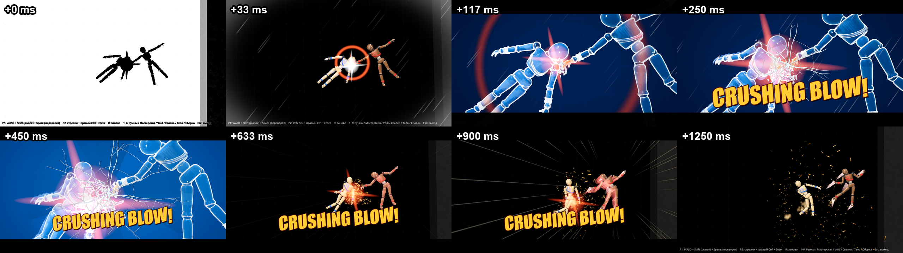

Кадры 0 / 33 / 117 / 250 / 450 / 633 / 900 / 1250 мс: инверсия → белая кромка → кат в рентген → трещины и CRUSHING BLOW! → «перелом» (вспышка, второй выброс щепок) → кат назад, отлёт в замедлении с линиями скорости → конец.

**Файлы.**
- `scripts/fx/crit_cinematic.gd` (`CritCinematic`) + `scenes/fx/crit_cinematic.tscn`: `CritCam` (fov 30) → `XrayPost`, `CritSplinters` (48) и `CritSplinters2` (32, «перелом» на 400 мс), `CritOverlay`. API по §4.3: `play(ctx) -> bool`, `is_playing()`, `abort()`, `elapsed_ms()`, сигналы `phase(name, ms)` и `finished(ctx)`, плюс `aborted(ctx)`, `prewarm()`, `active_time_tags()`, `fx_node_count()`, `flash_intensity_override`, `speed_lines_enabled` и `static attach(parent, match)` для работы без директора. HitFxDirector создаёт его сам (`_ensure_cinematic`).
- `scenes/ui/crit_overlay.gd/.tscn` (`CritOverlay`, CanvasLayer 30): SpeedLines, ScreenCrack, Letterbox (по 11 %), Caption (`AnnounceLabel` из hud_theme, золото, тёмно-красная обводка, −4°, 74 % высоты — на 62 % надпись закрывала ударенную деталь в крупном плане), CutFlash. Слой пассивный: состояние — функция от мс таймлайна.
- Шейдеры `assets/shaders/fx/`: `xray` (квад в прозрачном проходе: экран + глубина + нормали, рампа #0b1630 → #2d7fd6 → #bfe9ff, контуры Собелем, виньетка), `xray_wood` (оверлей ударенной детали: тлеющая основа, волокна вдоль длинной оси в пространстве тела детали, трещины из `crack_screen.png` с раскрытием, обод; смешивание по альфе и `render_priority` 20 — после квада рентгена, поэтому деталь остаётся тёплой), `xray_ghost` (голубой обод остальных частей), `screen_crack`, `crit_screen` (инверсия / белый кадр / кромка), `speed_lines`.
- Текстуры: `tools/fx/gen_crack_textures.py` (Pillow + numpy, seed 29) → `assets/textures/fx/crack_decal_{0,1,2}.png` (512², стадии растут из одних трещин: главная вдоль волокна, звезда сколов, на стадии 2 — расщеп и сколы), `crack_glow_{0,1,2}.png` (эмиссия Decal) и `crack_screen.png` (1024², R — маска, G — путь от центра, B — осколок). У `crack_screen.png` в `.import` `detect_3d/compress_to=0`: это данные, VRAM-сжатие их испортило бы.

**Как устроено.**
- Часы — `delta / time_scale`, где масштаб берётся из конца прошлого кадра. Узел идёт с `process_priority` 1000, поэтому после `Match._process`. Проверка показала: Godot считает `delta` кадра по `Engine.time_scale` на начало кадра, а смена масштаба в физике того же кадра на этот `delta` не влияет. Поэтому запросы времени кинематограф ставит в своём `_process`, а не в `play()` (удар приходит из физики). Иначе `Match._process` в том же кадре посчитал бы `(1/60)/0.02 = 0.83 с` и сразу снял бы стоп-кадр. Та же ловушка есть у старых hit-stop 80/120 мс из `hit_feel` — их `_time_effect` вызывается в физике.
- Время: теги `crit_freeze` / `crit_xray` / `crit_slowmo` / `ko_crit_slowmo` через `Match.request_time_scale` / `cancel_time_scale`. Длительность берётся с запасом 0.15 с, на переходах теги снимаются явно, поэтому на стыках нет кадра с 1.0. Без этих методов запись идёт прямо в `Match._time_effects` с ключом `tag`, без Match — своё `Engine.time_scale` с возвратом к 1.
- Камера: `Match.capture_camera(CritCam, "crit")` / `release_camera("crit")`; без них — `make_current` с возвратом. В крупном плане точка — середина между центром детали и точкой удара (едет с деталью, лаг 60 мс). Дистанция даёт полувысоту 0.9 м, камера на 6° ниже и довёрнута на 14° в сторону удара. Наезд +6 %, крен 0 → 5°, дрейф 0.1 м (× `shake_intensity`).
- На кате в крупный план прячутся (`visible = false`) вспышки `ImpactFlash` этого удара в радиусе 1.5 м. В стоп-кадре они не гаснут и красным крестом закрывали деталь.
- Decal: ребёнок тела детали, проецируется от камеры (−Z), ось X — вдоль волокна, `cull_mask` = 1 << 19. Бит в `layers` мешей жертвы ставится, если его нет, и снимается в конце. Стадии 120 / 250 / 400 мс, свечение гаснет к 800, сам Decal — к 1300.
- HUD: `set_cinematic` / `defer_ko_card`, если они есть. Сейчас в `hud.gd` их ещё нет, поэтому работает запасной путь: прячутся `Root/Players`, `TimerBox`, `Announcer`, в конце `announcer.clear()`. Карточка KO прячется в начале и заново показывается через `show_card` на 650 мс.

**Проверки.**
- `tests/crit_probe.tscn` (headless, `--fixed-fps 60`, Void) — 49/49:
  - фазы freeze 0 / cut_in 116.7 / caption 216.7 / crack_2 400 / cut_out 616.7 / done 1300;
  - `time_scale` 0.02 / 0.12 / 0.3 во всех кадрах окон;
  - CritCam в каждом кадре 140–600 мс, игровая камера — со следующего кадра после cut_out;
  - рентген, оверлей на голове, обод на торсе, 1 Decal, леттербокс, трещины, надпись, HUD скрыт; повторный `play` → false;
  - после done: `time_scale` 1, тегов нет, `camera_owner` пуст, 49 `material_overlay` как до удара, через 3 с Decal 0, у Match только 2 директора;
  - restart на 300 мс → через кадр всё возвращено;
  - ko_crit: ≤ 0.25 до 1950 мс, 1.0 после 2100 мс, карточка KO скрыта на 300 мс и видна на 800;
  - жертва без мешей: таймлайн до конца, Decal есть;
  - `flash_intensity` 0 → вспышек 0 (обычно 2); `enabled=false` → `play` false; `feel_enabled=false` → `time_scale` всё время 1.
- `tests/crit_snapshot.tscn` (окно 1280×720, `--fixed-fps 60`) → `img/crit-sequence-v1.png` (0.8 МБ). Параметры `victim=p1|p2` и `ko=1`: орех и ko_crit проверены отдельно, там же видна отложенная карточка KO.

**Открыто.**
- `Hud.set_cinematic` / `defer_ko_card` и `KoCard.defer` — вставки ядра по §4.1. Пока их нет, итоги матча при ko_crit могут всплыть раньше конца карточки: `remaining_s` не знает о переносе.
- На кадрах куклы стоят в T-позе (синтетический удар). Живой крит в бою с ботами ещё не снят, клип `hitfx-crit-v1` — за `hitfx_snapshot` / `clip_capture`.
- Волокна на голове читаются как годовые кольца: ось головы короткая. Для «кости» внутри детали можно сделать отдельный меш-силуэт — пока нет.

## 9. Сделано: удары (HitFxDirector, 29.09)

**Файлы** (все новые, кроме помеченных).
- `scripts/fx/hit_fx_director.gd` — `HitFxDirector`; сцена `scenes/fx/hit_fx_director.tscn`: `FxRoot` (Node3D) + `ScreenFx` (CanvasLayer 5: `SpeedLines`, `ImpactFrame`, `Flash`). Её создаёт `Match._ensure_fx_directors`.
- `scripts/fx/screen_fx.gd` (`ScreenFx`), `scripts/fx/shockwave.gd` + `scenes/fx/shockwave.tscn` (`Shockwave`), `scripts/fx/afterimage_trail.gd` (`AfterimageTrail`), `scripts/fx/flight_trail.gd` (`FlightTrail`), `scripts/fx/fx_clock.gd` (`FxClock`).
- Шейдеры `scenes/fx/shaders/{ghost,shockwave,impact_frame,speed_lines}.gdshader`.
- `scenes/camera/dynamic_camera.gd` (правка): `punch`, `roll_kick`, `focus`, `kick`, `clear_fx`, `fx_idle`; в `_process` вставки `_apply_fx` / `_fx_centre` / `_fx_basis`. Без вызовов поведение прежнее.
- `scripts/core/match.gd` (правка, 2 строки): `FxClock.ensure(self)` в `_ready` и `FxClock.real_delta(delta)` в `_process` — см. «Время».
- Пробы `tests/hitfx_probe.tscn` (headless) и `tests/hitfx_snapshot.tscn` (оконная, лист `img/hitfx-tiers-v1.png`).
- `ImpactFx` и `ImpactFlash` не менялись: директор добавляет свои щепки и пыль теми же `splinters.tscn` / `dust_puff.tscn`, но без вспышки.

**Что показывает** (мс реального времени от удара):

| Уровень | Эффекты |
|---|---|
| light | только ImpactFx от DollCombat; hit-stop, камеры и следов нет |
| heavy | 1 белый кадр 0.25; кольцо 0.25 → 1.3 м за 180 мс с лёгким искажением экрана, цвет по kind; щепки ×1.35 и крупная пыль; `punch` −8 % (60/190 мс, центр на 20 % к точке), `roll_kick` 1.5° по удару, `kick` 6 см по направлению удара; `focus` 0.35 на 500 мс; 3 послеобраза через 50 мс (и не раньше сдвига ЦМ на 10 см — в стоп-кадре копии не слипаются), гаснут за 150 мс; ленты ЦМ (0.3 м) + головы, кистей, стоп (0.14 м) 400 мс; дым каждые 60 мс, пока ЦМ > 3 м/с (до 8 клубов, 600 мс); линии скорости 450 мс на краях кадра, пока ЦМ > 2.6 м/с. Hit-stop 50 мс ставит ядро (`Match._emit_hit_fx`); без ядра — директор |
| ko | 2 кадра инверсии (тёмные силуэты на белом → белые на тёмно-красном); кольцо 0.4 → 2.2 м за 260 мс; щепки ×1.8, пыль; `punch` −12 %, `roll_kick` 3°; `focus` 0.6 на 1.2 с; ленты на голове и торсе разлетающихся частей 1.2 с; 2 послеобраза. Существующие slow-mo 0.25× и карточка KO не трогаются |
| crit / ko_crit | `CritCinematic.play(ctx)`. После ката (620 мс) директор добавляет отлёт: 10 послеобразов каждые 40 мс, ленты 900 мс, дым 700 мс (линии скорости рисует CritOverlay). Если кинематограф занят — heavy / ko; если выключен (`crit_cinematic = false`) или его нет — крит без ката §3.5: стоп 0.02× на 80 мс, `CRUSHING BLOW!` через `Match.announce` (kind `crit`), slow-mo 0.3× на 0.4 с (у ko_crit — slow-mo KO), инверсия, большое кольцо, те же следы и линии |
| slam | пыль ×1.8 по скорости и крупнее (×2.6 при 8 м/с), мелкие щепки без вспышки; нормаль контакта разворачивается от стены к кукле; от 6 м/с тряска 0.012 × (v − 4) ≤ 0.12 м; в крит-полёте ×2, полукольцо по нормали 0.3 → 1.6 м, крен 2°. Кулдаун 120 мс на куклу поверх 0.25 с ядра |

**Время.** Движок считает `delta` кадра с `Engine.time_scale` на начало кадра, а удар меняет масштаб в физике того же кадра. Поэтому `delta / Engine.time_scale` в первом кадре стопа завышал реальное время в 1/scale раз: стоп 0.05× засчитывал 333 мс вместо 16.7, и hit-stop, поставленный из `_physics_process` (DollCombat → `Match.on_hit`), кончался в том же кадре — это касалось и старых 80/120 мс. `FxClock` (узел под root с максимальным `process_priority`) в конце каждого кадра запоминает `Engine.time_scale`; `FxClock.real_delta(delta)` делит на него. На нём Match, DynamicCamera и все эффекты директора. Проверка: heavy 12 HP через `Match.on_hit` из физики — стоп 66.7 мс (4 кадра, допуск 50 ± 17). CritCinematic ведёт свои часы тем же приёмом (`_scale_seen`).

**Лимиты и уборка.** Одновременно ≤ 4 лент, ≤ 4 наборов послеобразов, ≤ 6 волн, ≤ 24 систем частиц директора — старые снимаются. Послеобразы и ленты — дети `FxRoot`, не частей куклы. Частицы освобождаются по `finished` и таймеру 1.6 × lifetime. `abort_all()` — на COUNTDOWN (restart, R), при выходе из дерева и по вызову: снимает узлы, расписание, экран, FX камеры и свои теги времени. `can_flash()` занимает слот вспышки (≤ 3 в секунду, WCAG 2.3.1) — общий для директора и CritCinematic. Сторож камеры работает 2.5 с после крита: если `camera_owner()` пуст, а текущая камера не игровая, делает её текущей.

**Независимость от модели.** Всё строится от `Doll.parts` и позиций частей. Послеобразы копируют видимые нескинованные `MeshInstance3D`-потомки частей: меш общий, материал `ghost` через `material_override` копии, у куклы ничего не меняется. Для скинованных моделей и частей без мешей берётся `Shape3D.get_debug_mesh()` коллизии. Ленты — по базовым именам частей (`Head`, `Hand`, `Foot`, `Torso`).

**Проверки** (29.09, ядро и CritCinematic уже в дереве):
- `--import` чистый.
- `hitfx_probe` 57/57 на `doll_dark` (Void, P2), `doll.tscn` (Void, P1) и ModularDoll (body, P1). Проверяется:
  - light без узлов, punch, hit-stop и вспышки;
  - heavy: 1 кадр вспышки, волна, 3 послеобраза, лента, линии, punch, `fx_idle` к 600 мс; hit-stop 66.7 мс через `Match.on_hit`;
  - ko: 2 кадра инверсии, кольцо до 2.2 м, ленты голова + торс, к 1300 мс лент нет;
  - slam: 2 системы частиц, тряска 0.048 м, без вспышки, hp 100; кулдаун; волна в крит-полёте; настоящий удар о стену Void 8 м/с → `env_slam` ≥ 1, hp не изменился;
  - crit: кат в CritCam, time_scale 1, камера игровая, тегов `crit*` / `heavy_stop` нет;
  - `flash_intensity` 0 → 0 кадров вспышки и инверсии; 10 heavy за 1 с → 3 вспышки; лент ≤ 4, послеобразов ≤ 4;
  - `material_overlay` / `material_override` всех мешей жертвы как до ударов; на частях нет узлов эффектов;
  - кукла без мешей → послеобразы из коллизий;
  - `restart()` через 100 мс heavy → через 2 кадра узлов как исходно, time_scale 1, камера спокойна, экран чист, `camera_owner` пуст;
  - настоящий удар `Match.on_hit` доходит до директора; настоящий KO — ko/ko_crit, time_scale 1, всё освобождено;
  - через 3 с после последнего эффекта `fx_node_count()` равен исходному (3 — дети ScreenFx).
- `hitfx_snapshot` → `img/hitfx-tiers-v1.png`, 1.1 МБ.
- Старые гейты после правки `Match._process`: `run_gate` OK (doll_gate + feel_probe strict), `combat_gate` 134/134, `match_probe` ruins / workshop / void / `sd=1` OK, `scene_switch_probe` OK, `fx_probe` OK, `playground_snapshot` void `hit=1` и `ko=1` OK, `hud_snapshot` OK.

**Кадры: оценка.** Лучше всего читаются кольцо heavy, красное кольцо и кадр инверсии KO. Линии скорости после прореживания — редкие штрихи по краям кадра вдоль полёта. Крен кадра заметен по наклону пола. Послеобразы на +100 мс видны как красные полупрозрачные копии, но в первые 100 мс сливаются с жертвой: она ещё почти не сдвинулась. Ленты на стоп-кадрах почти не видны — это эффект движения, их надо смотреть в клипе. Удар о стену сдержанный: клуб пыли и щепки у стены, тряска на кадрах не видна. Так задумано: урона нет.

**Открыто.**
- `playground_snapshot ko=1` один раз упал на `ko_card_at_shot`: на кадре через 450 мс карточки KO не было. В это время в дереве менялся CritCinematic. Три повторных прогона — OK, KO в сценарии — уровень ko (6.5 HP). Если KO станет ko_crit, карточка отложится на 650 мс (`defer_ko_card`), и кадр на 450 мс её не застанет: тогда сценарию нужен `Match.crit_enabled = false`.
- На выходе headless-проб висят ресурсы `SfxDirector` (`AudioStreamRandomizer`, ogg — «resources still in use at exit»). Это не директор эффектов: его кэши материалов чистятся в `_exit_tree`.
- Послеобразы копируют позу целиком (все части); у ModularDoll с оружием в руке оружие не копируется — оно не в `parts`.

## 10. Итог (интеграция I1, 29.09)

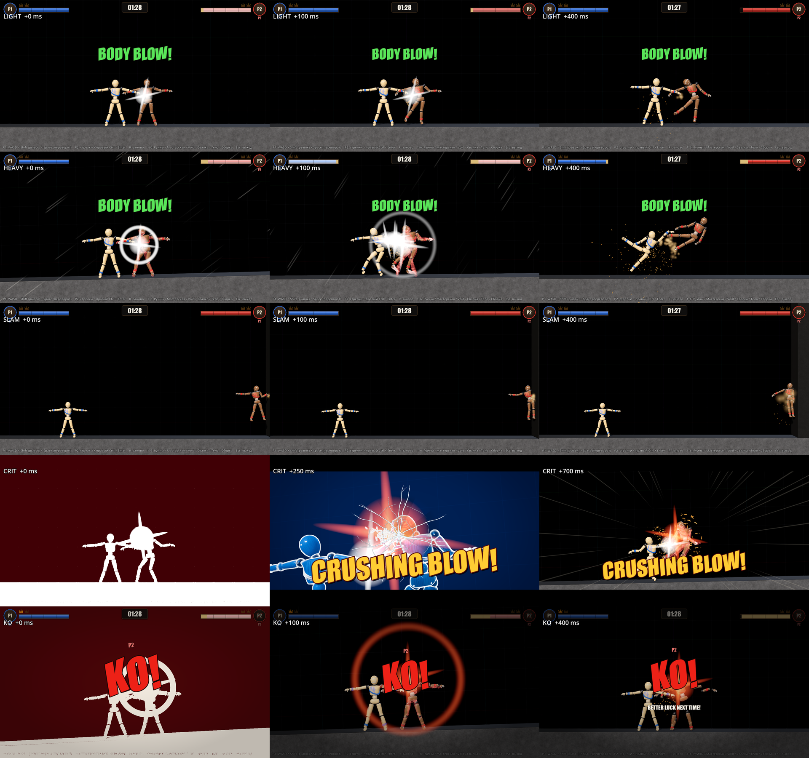

Строки листа: light / heavy / env_slam / crit / ko. Столбцы — +0 / +100 / +400 мс, у crit — +0 / +250 / +700 мс. Бой со всеми уровнями — `img/hitfx-fight-v1.gif` (15 fps, 960 px, 7.4 МБ) и `img/hitfx-fight-v1.mp4` (0.56 МБ, **со звуком** — Movie Maker Godot). Крит на Руинах — `img/hitfx-crit-ruins-v1.png`. Последовательность крита в живом бою на Void — `img/crit-sequence-v1.png`: кадры 0 / 33 / 117 / 250 / 450 / 633 / 900 / 1250 мс (заменила T-позу из §8).

**Как подключено.** `Match._ensure_fx_directors()` создаёт детьми Match `HitFxDirector` (он сам создаёт `CritCinematic`) и `SfxDirector` на всех площадках с Match: Руины, Мастерская, Void, Свалка, body. Сигналы `hit_fx`, `env_slam`, `ko`, `announce`, `phase_changed` доходят до обоих директоров, `CritCinematic.phase` — до звука.

**Правки интеграции.**
- `hud.gd`: группа `hud`, `set_cinematic(on)`, `defer_ko_card(real_s)`; на COUNTDOWN снимаются кинематограф и отложенная карточка.
- `ko_card.gd`: `defer(real_s)`, `cancel_defer()` и строка в `remaining_s()`. Итоги матча ждут отложенную карточку ko_crit. Запасной путь CritCinematic больше не нужен.
- `doll.gd`: `apply_recoil` не действует в крит-полёте. Иначе в клинче (оба тела бьют в одном тике) отдача встречного удара гасила крит-отлёт жертвы: ЦМ 5.5 → 2.6 м/с, полёт назад.
- `HitTier.force_next` — тестовый переключатель («следующий удар — heavy / crit»). В игре всегда пуст, в `reset()` сбрасывается. Нужен клипам, листам и perf_probe.
- `SfxDirector.ensure_buses`: HardLimiter на Master. Шины SFX и SFX_Crit ограничены по отдельности, а их сумма клипала: 900 сэмплов у 0 dBFS, после правки пик −0.5 dB.
- Пробы:
  - `match_probe`: `scene=scrap`, `out=`, проверки `fx_directors` и `hitfx_env_kind`, `info.hitfx` (уровни, `crits[]`, `env_slam`);
  - `clip_capture`: `hitfx=1` (heavy на наскоке, crit на рывке, отлёт в стену → env_slam в крит-полёте, кадры крита каждый кадр) и `scene=ruins`;
  - `perf_probe`: `hitfx=1` (heavy раз в секунду, crit раз в 3 с), FPS по реальным часам, прогрев 30 кадров, load average;
  - `hitfx_snapshot`: строка crit;
  - новый `tests/run_hitfx_gate.sh`.

**Проверки (29.09).**
- `--import` чистый.
- `run_gate` OK. `run_combat_gate` 134/134: полосы стандартного оружия как до потолка массы (молот 8 м/с — 29.64, в голову — 44.46), env 0.
- `match_probe` ruins / workshop / void / scrap и `void sd=1` OK. Частота по четырём площадкам: 170.7 с боя, 7 crit + ko_crit — **24.4 с на крит**; heavy 12.4 %.
- `hitfx_core_probe` 99/99: боты 1451.6 с, 44 крита → 33.0 с; зазоры 14.9 / 19.5 / 2.1 с; heavy 12 %.
- `hit_tier_probe` 58/58, `hitfx_probe` 57/57 × 3 (doll_dark, doll, ModularDoll), `crit_probe` 49/49 (в том числе отложенная карточка KO через `KoCard.defer`), `sfx_probe` 38/38.
- `scene_switch_probe`, `body_probe`, `craft_probe` 201/201, `workshop_probe`, `pickup_probe`, `arm_assist_probe` 28/28 — OK.
- Оконные `fx_probe`, `hud_snapshot`, `playground_snapshot` void `hit=1` / `ko=1` — OK.
- `perf_probe scene=void hitfx=1` 1280×720, 21 с (14 heavy, 6 crit): 72.1 fps в среднем, худшая секунда 71.8, load average 26 (8 ядер). Первый кадр сцены под чужой нагрузкой занял ~12 с (компиляция пайплайнов), его отрезает прогрев.

**Кадры: честно.**
- Лучше всего читаются кадр инверсии, синий рентген с контурами, трещины, надпись CRUSHING BLOW! и кольца heavy / KO.
- В клипе крит бросает жертву в стену, у стены клуб пыли.
- Послеобразы heavy видны как красные копии, ленты заметны только в движении.
- Удар о стену вне крита сдержанный.
- На Руинах в крупном плане ударенная деталь (голень) мелкая, рентген красит синим всю стену. Кадр +0 мс на светлом небе почти чёрный: инверсия.
- CRUSHING BLOW! держится до ~1000 мс и в клипе перекрывает кукол ниже центра.
- Атакующий после крита летит следом за жертвой (рывок).

**Открыто.**
- Микс звука проверен числами, не на слух.
- Выход headless-проб печатает «ObjectDB leaked / resources still in use» — ресурсы SfxDirector, на гейты не влияет.
- `workshop_probe` в headless печатает `material_get_instance_shader_parameters: material is null` (мастерская, dummy-рендер), проба OK.
- `env_slam` частый (~0.6 в секунду боя ботов), директоры троттлят.
- Крит-отлёт с середины Void до стены быстрее 4 м/с не доходит; `crit_flight`-slam бывает, только если жертва ближе ~2 м к стене.
- Бросок пропса теперь бьёт массой без капа (ящик 10 кг на 4 м/с ≈ 24 HP) — проверить руками.
- Отличия от текста §2–4, принятые сборщиками: шейдеры крита лежат в `assets/shaders/fx/`, шейдеры ударов — в `scenes/fx/shaders/`; текстуры трещин генерирует `tools/fx/gen_crack_textures.py`; надпись на 74 % высоты; звук крита — на cut_in (§7).

## 11. v2 доводка (после критика v1, 29.09)

### 11.1 Честный крит и отлёт (P1 — правила и физика)

Замечание критика v1: 45–56 % критов у ботов выдавала «засуха» (порог 22 × 0.5 = 11 при `CRIT_MIN_DAMAGE` 10), критом становились удары 10–16 HP. Автор просил крит только для «особо критичных мощных» ударов.

**Правило v2** (`scripts/core/hit_tier.gd`):
- `eligible` требует `damage ≥ CRIT_MIN_DAMAGE` (14). Слабее — никогда не crit и не ko_crit, при любых бонусах и в засуху.
- Новое `HitTier.stylish(ctx)`: удар в голову (часть `Head*` или kind `head`), атакующий в рывке, kind `weapon` или `combo ≥ CRIT_COMBO_N`.
- `threshold(t, is_stylish)`: засуха (`CRIT_DROUGHT_S` 15 с без крита) снижает порог в `CRIT_DROUGHT_SCORE_MULT` 0.75 раза и только стильному удару. Обычному порог всегда `CRIT_SCORE`.
- `CRIT_SCORE` 22 → **18** (2 × heavy 9). Без этого честных критов у ботов выходило раз в 45–55 с: ударов ≥ 15 HP у ботов ~5 %, 98-й перцентиль — 22 HP.
- Порог засухи 18 × 0.75 = 13.5 ниже минимума 14. Засуха лишь подтягивает стильные удары со score 13.5–18.
- `crits[]` пишет `drought` (score < `CRIT_SCORE`).
- Кулдауны 8 / 15 / 2 с и `CRIT_MIN_FIGHT_S` 5 с не менялись.

**Калибровка.** `hitfx_core_probe`, боты `match_probe`, по 6 матчей до KO на площадку и сид. Удары из `info.freq.hits` (добавлены part / dash / combo / weapon_id) прогонялись офлайн по сетке MIN 14–18 × SCORE 18–22 × засуха 10–20 с, потом проверялись живым прогоном.

| Прогон | Бой, с | crit + ko_crit | с на крит | выдано засухой | слабейший крит, HP | heavy |
|---|---|---|---|---|---|---|
| v1: 4 площадки, сиды 29 + 7 | 1898 | 64 | 29.7 | 36 (56 %) | 10.0 (18 критов < 14) | 12.9 % |
| v2: 4 площадки, сиды 29 + 7 | 1856 | 48 | **38.7** | 1 (2 %) | 14.4 | 14.4 % |
| v2: 4 площадки, сиды 11 + 3 | 1826 | 52 | **35.1** | 4 (8 %) | 14.4 | 14.6 % |
| v2: гейт (Void / Руины / Мастерская, сиды 29 + 7) | 1578 | 45 | **35.1** | 5 (11 %) | 14.4 | 13.9 % |

`match_probe` (по одному матчу на площадку): Руины — crit 17.6 HP (score 20.2); Void — crit 19.4 и ko_crit 18.1; Мастерская — crit оружием 21 HP; Свалка — без крита. Итого 319 с боя, 4 крита.

**Атакующий не летит следом** (`scripts/core/crit_launch.gd`, `CritLaunch.stop_attacker`, crit и ko_crit):
- ЦМ атакующего режется до `CRIT_ATTACKER_STOP_SPEED` 1.5 м/с вдоль `kb_dir` и вдоль его горизонтали. У `kb_dir` есть апбиас, и без горизонтали атакующий, коснувшись пола, катился бы дальше.
- Рывок снимается (`dash_until`). Тяга выключена на `CRIT_ATTACKER_LOCK_S` 0.5 с физического времени (`thrust_lock_until`, как у отдачи). Это время почти целиком приходится на замедление крита.
- `CritLaunch.AttackerHold` — узел-ребёнок атакующего на те же 0.5 с. На это время части атакующего и жертвы не сталкиваются (collision exception, потом снимается), и клэмп повторяется каждый тик.
- Зачем исключение столкновений: в упоре сцепившиеся конечности тащили атакующего следом до 4.2 м/с и гасили отлёт жертвы 6.3 → 2.5 м/с. Через 0.5 с между ЦМ было 1.45 м. С `AttackerHold`: скорость атакующего вдоль отлёта 0.96 м/с при ударе, максимум 1.05 за 0.5 с, между ЦМ 3.53 м, жертва 6.7 → 3.9 м/с за 0.5 с (дамп крит-полёта).

**Hit-stop heavy.** `HITFX_HEAVY_STOP_S` 0.05 → **0.083** (5 кадров). `ts_heavy_stop_ms` меряет целые кадры ± 1: в пробе 100 мс, потому что тег снимается на кадр позже. `feel_probe strict` и `combat_gate` не задеты.

**Проверки** (`hitfx_core_probe`, 122 проверки):
- `tier_*`: пороги 18 / 14 / 13.5, `tier_stylish`, засуха только стильным (`drought_plain_heavy`, `drought_stylish_dash`, `drought_weapon`, `drought_combo`), `min_damage_all_bonus` (13.99 со всеми бонусами — heavy), `ko_below_min_damage`, `tier_crit_drought_flag`.
- `hit_crit_attacker_*`: атакующий в рывке 6 м/с бьёт крит в упор на Void.
- `freq_crit_period` — полоса сужена до **25–45 с**. Новые `freq_crit_min_damage` и `freq_crit_drought_share` ≤ 0.20. `freq_heavy_share` — 8–20 %.

**Честно.**
- `match_probe scene=workshop` красный: нет KO за 120 с. **Закрыто в §11.6** (расклинивание ботов через станок). После крита на 9.9 с оба бота к 17-й секунде упираются в геометрию Мастерской (x ≈ −1 и x ≈ 5, скорость 0, тяга друг к другу). Прыжок врозь не помогает, ударов нет 110 с.
  - Это не остаток крита: исключения столкновений сняты (119 → 315 → 119), тяга свободна.
  - Та же заклинка в Мастерской была и в v1: `hitfx_core_probe` workshop — 1–2 матча без KO за 60 с на сид.
  - Без крита (v1-пороги) или без `AttackerHold` этот матч проходит — траектории хаотичны. Лечить надо анти-заклинку ботов `match_probe`, а не правило крита.
  - Руины, Void, Свалка и `void sd=1` — OK.
- `hitfx_core_probe` на Свалке (не в гейте): `freq_env_hits` 8–15 ударов kind `environment`. Их даёт сцена Свалки — механизмы, чужая зона. Void, Руины и Мастерская — 0.
- Для людей удары сильнее, и крит будет чаще — потолок держат кулдауны 8 / 15 с. Перепроверить после ручной игры автора.
- В §11.5 строка «красный только `freq_crit_period` (49.9 с)» записана на промежуточных числах P1. С итоговыми числами `run_hitfx_gate` зелёный.

### 11.2 Пресеты FX для игрока — API (объявлено P1 в начале работы; визуальный агент читает отсюда)

- **Одна точка:** `scripts/fx/fx_preset.gd`, `class_name FxPreset` (статический, без узла). `FxPreset.current` — `"full"` / `"reduced"` / `"off"`; `FxPreset.set_preset(name, tree)`, `FxPreset.cycle(tree) -> String`. Значения — `Tuning.HITFX_PRESETS[name]`: `flash` (0–1), `shake` (0–1), `impact_frames` (bool), `crit_cinematic` (bool), `time_fx` (bool).
- **Геттеры для эффектов:** `FxPreset.flash()`, `FxPreset.shake()`, `FxPreset.impact_frames()`, `FxPreset.crit_cinematic()`, `FxPreset.time_fx()`.
- **HitFxDirector не меняется:** `FxPreset.apply(director)` пишет в его `var` `flash_intensity` / `shake_intensity` / `impact_frames` / `crit_cinematic` (как меню 11). Зовут: `Match._ensure_fx_directors` после создания директора и `set_preset` для всех узлов группы `hit_fx_director`. CritCinematic уже читает эти `var` через `_flag`. Директору можно (не обязательно) добавить `FxPreset.apply(self)` в конец `_ready` — это идемпотентно.
- **Время:** `Match.request_time_scale` при `time_fx = false` отказывает всем тегам, кроме `ko*` (heavy_stop, crit_freeze, crit_xray, crit_slowmo). Старый `Match.hit_feel`: hit stop 80/120 мс — тоже только при `time_fx`, тряска и zoom умножаются на `FxPreset.shake()`. KO slow-mo остаётся всегда.
- **Просьба к визуальному агенту:** белая звезда `ImpactFlash` (ImpactFx) — масштабировать альфу на `FxPreset.flash()`; при 0 не показывать. Щепки и пыль остаются во всех пресетах.
- **Игрок:** F10 в `scenes/playground.gd` — циклически full → reduced → off, тост «FX: FULL / REDUCED / OFF» (Label на своём CanvasLayer 20 внизу по центру, 1.2 с + гашение 0.3 с). Пресет — статический, переживает смену арены (1–6) и рестарт. С 29.09 вечера F10 работает и на площадке «Тело» (5): пресеты тела переехали на F1–F12 и [ ] / PgUp PgDn.
- **Итог (сделано).** Пресеты: full — `Tuning.HITFX_*` (1 / 1 / кадры инверсии / кинематограф / время); reduced — flash 0.4, shake 0.5, без кадров инверсии и без ката: крит идёт запасным путём директора (надпись, стоп 80 мс, замедление 0.4 с), время есть; off — 0 / 0 / нет / нет / без стоп-кадров и замедлений. В `Match` три точечные вставки: `_ensure_fx_directors` → `FxPreset.apply`, `request_time_scale` → `time_tag_allowed`, `_camera_fx` / `hit_feel` → `shake()` / `time_fx()`. Проверки `hitfx_core_probe preset_*`: reduced/off доходят до директора; при off heavy и принудительный крит без тегов времени и с `Engine.time_scale` 1 за 30 кадров; `stats` директора — 0 вспышек, инверсий, катов и punch; `hit_feel(30)` без стопа; крит-отлёт есть; KO slow-mo 0.25 есть; full восстанавливается. Живая проверка F10 на Void: full → reduced → off → full, значения доходят до директора; новая площадка получает текущий пресет.

### 11.3 Heavy и камера (P2 — визуал)

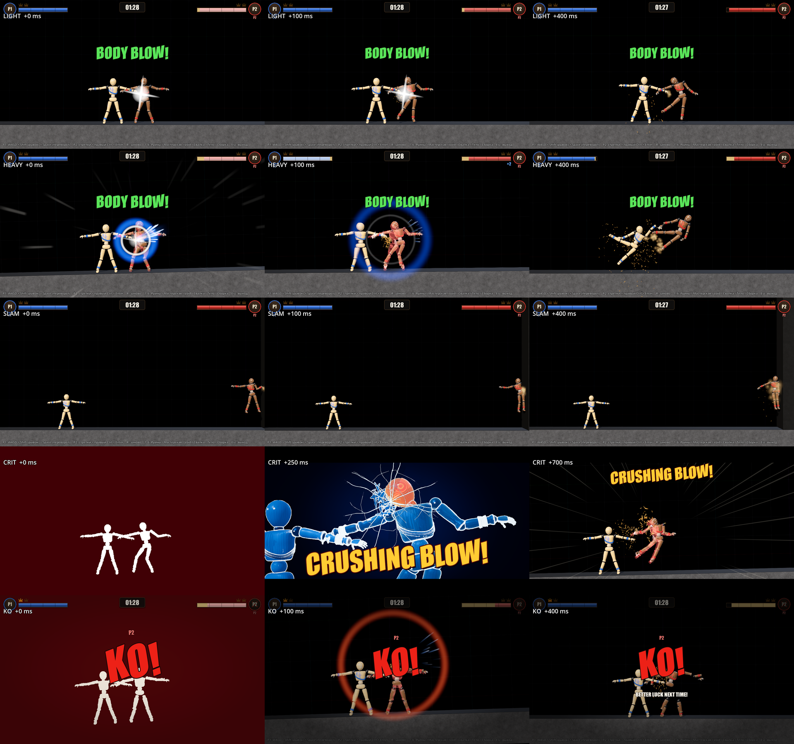

Лист как в §10: строки light / heavy / slam / crit / ko, столбцы +0 / +100 / +400 мс (crit — +0 / +250 / +700). Сравнение — с `img/hitfx-tiers-v1.png`.

- **Искра вдоль удара.** Новый `scripts/fx/spark_cone.gd` (`SparkCone`) и шейдер `scenes/fx/shaders/spark.gdshader`. Конус-вспышка от точки удара вдоль `ctx.dir` (1.5 м, 100 мс) и 13 штрихов-искр в веере ±26° (7–12 м/с, 120–200 мс). Цвет — цвет атакующего с тёплым ядром. Время реальное (`FxClock`), искра доигрывает в hit-stop и к 210 мс снимается. Heavy — `k` 1.0, ko — 1.35.
- **Волна.** `HEAVY_WAVE_R` (0.3, 1.8), толщина 0.3 радиуса (было 0.16), 210 мс. Цвет — цвет игрока-атакующего (`_attacker_colour`: `ctx.attacker.player_index` → `Tuning.PLAYER_COLORS`). Внутри белое кольцо 0.15 → 0.95 м, 150 мс. `Shockwave.setup(..., thickness)` — новый необязательный аргумент.
- **Звезда ImpactFlash.** Раньше звезда жила по времени сцены и в hit-stop висела над торсами обеих кукол. Теперь `ImpactFlash.collapse(real_ms, pop)` переводит её на реальное время: хлопок до полного размера (30 % окна), затем сжатие до 0.25 и гашение. Heavy — 65 мс, ko — 90 мс. Директор держит окно 300 мс: звёзды вторичных контактов того же сшиба (DollCombat спавнит их и после `Match.on_hit`) гаснут без хлопка. Яркость звезды × `FxPreset.flash()`, при 0 звезды нет (просьба §11.2).
- **Линии скорости** (`scenes/fx/shaders/speed_lines.gdshader`) — радиально от ЦМ жертвы. Штрихи бегут наружу, гуще позади полёта (`back_bias` 0.65). Показ, как и раньше, только пока ЦМ быстрее 2.6 м/с.
- **Упреждение камеры.** `DynamicCamera.focus` тянет кадр к точке ЦМ + lead. Lead идёт по скорости ЦМ цели (масса-взвешенно по `parts`), до `focus_lead_frac` = 0.18 ширины кадра при `focus_lead_full_speed` = 6 м/с, сглаживание `focus_lead_tau` 0.08 с. Действует только внутри `focus` (FX удара); без FX камера не меняется. Геттер для проб — `focus_lead()`.
- **Интенсивность — одна точка:** `var` директора `flash_intensity` / `shake_intensity` / `impact_frames` / `crit_cinematic`, их пишет `FxPreset.apply` (§11.2; директор зовёт его и сам в конце `_ready`). Искра × `flash_intensity`, при 0 не создаётся. Hit-stop heavy 83 мс — `Tuning.HITFX_HEAVY_STOP_S` (P1); `hitfx_probe` сверяет с ним ±17 мс.

**Кадры: честно (сравнение с v1).**
- Heavy +0: синее кольцо атакующего толстое и читается. Веер искр вдоль удара заметен. Белое внутреннее кольцо даёт «хлопок».
- Heavy +100: торсы обеих кукол открыты: звезда v1 закрывала их целиком. Видны искры и кольцо.
- Линии скорости теперь расходятся от жертвы, а не штрихуют экран по диагонали. На +0 они ещё длинные и серые, выразительнее всего в полёте.
- Light, slam и +400 heavy не менялись.

### 11.4 Маска кукол: кадры-силуэты и рентген

- **`scripts/fx/doll_mask.gd` (`DollMask`)** — ребёнок `HitFxDirector` (`doll_mask`); без директора CritCinematic заводит свою. SubViewport с камерой-копией текущей камеры (половинное разрешение, до 1280 px, `DEBUG_DRAW_UNSHADED`, прозрачный фон) рисует только визуальный слой `MASK_BIT` = 1 << 18.
- **Бит слоя.** На время показа бит добавляется `MeshInstance3D` кукол (группа `dolls` и `Match.dolls()`, меши найдены в рантайме по `parts`) и снимается сразу после. Сцены кукол, материалы и `material_overlay` не трогаются. Щепки крита лежат в маске постоянно (`include`).
- **Рендер по требованию:** `pulse(frames)` — кадры-силуэты, `hold(key)` / `release(key)` — рентген. Вне показа `UPDATE_DISABLED` и ноль затрат. Маска рисуется в том же кадре, что и силуэт: проверено листами, силуэт +0 мс совпадает с куклами.
- **Кадры удара ko / crit / crit без ката** (`impact_frame.gdshader` ScreenFx, `crit_screen.gdshader` CritOverlay): фигура — альфа маски, фон плоский (белый / тёмно-красный). На Руинах теперь так же, как на Void. Без маски (нет DollMask) — прежний порог яркости.
- **Рентген** (`assets/shaders/fx/xray.gdshader`, `use_mask`): вне маски фон плоский тёмно-синий (`bg_colour` → `bg_centre`, мягкий радиальный градиент), без рампы и контуров. Куклы, ударенная деталь, трещины и щепки — как в v1.

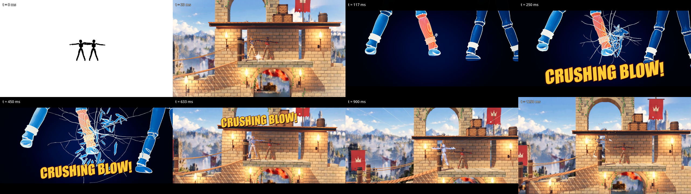

`crit_snapshot scene=ruins part=LowerLeg_L`: кадры 0 / 33 / 117 / 250 / 450 / 633 / 900 / 1250 мс. Сравнение — с `img/hitfx-crit-ruins-v1.png`.

**Честно.**
- Кадр +0 на Руинах: чёрные силуэты на ровном белом. В v1 был почти чёрный экран.
- В рентгене стена больше не синяя с контурами. Голень крупная, около половины высоты кадра, и читается: волокно, трещины, щепки.
- Минус: кадры +633 / +900 / +1250 на Руинах — куклы мелкие на пёстром фоне. Это игровая камера Руин, а не эффект.
- Минус: в этом синтетическом ударе (куклы стоят вплотную) отлёт почти не виден.

### 11.5 Крупный план и надпись CRUSHING BLOW!

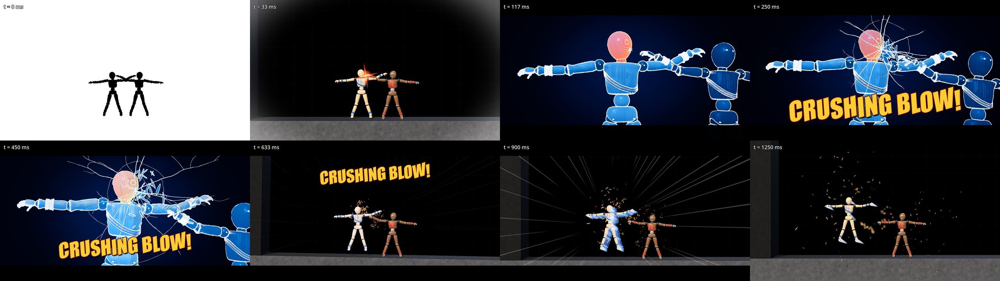

Сравнение — с `img/crit-sequence-v1.png`.

- **Полувысота CritCam** — по мировому AABB ударенной детали на плоскости XY (меши, иначе отладочные меши коллизий): протяжённость × 1.15 в пределах [0.5, 0.95] м. Голова, торс и таз — не меньше 0.7, чтобы были видны шея и плечи. Голень — 0.55, голова — 0.7 (`crit_probe`: A и G). Раньше полувысота была фиксированной, 0.9. Деталь стоит чуть выше центра кадра (`CAM_COMPOSE_UP` 0.16), низ остаётся под надпись.
- **Надпись во время крупного плана.** На 220 мс выбирается полоса 0.76 (низ) или 0.25 (верх) — та, что меньше перекрывает проекцию AABB детали и точки удара на экране CritCam.
- **Надпись после ката** (620 мс, жёсткая смена плана). Надпись встаёт в полосу над жертвой в игровой камере: 0.26, а если жертва в верхней трети — 0.84. Затем уезжает вверх на 0.08 со scale 0.86 → 0.7 (620–760 мс) и гаснет 700 → 860 мс. В v1 она висела до ~1150 мс поверх кукол. API: `CritOverlay.set_caption(since, alpha, shake, in_ms, y_frac, scale_mult)`.
- **Вспышки.** `_hide_flashes_near` прячет ImpactFlash под любым узлом рядом с точкой удара, а не только под узлами с именем `ImpactFx*` (дубли имён Godot переименовывает в `@Node3D@N`). Звезда больше не висит в крупном плане.

**Честно.**
- +633 мс: надпись над куклами, не поверх них. +900: её уже нет.
- +250 / +450: надпись внизу перекрывает торс атакующего, но не голову-деталь.
- Кадр +33 на Void (кромка-виньетка, въезд леттербокса) не менялся.

**Проверки (29.09, v2 визуал).**
- `--import` чистый.
- `hitfx_probe` 65/65 × 3 (void p2 / p1 / body). Новые проверки: `heavy_spark`, `heavy_wave_big_thick` (1.8 / 0.3), `heavy_wave_attacker_colour`, `heavy_star_gone_100ms` (0.0), `heavy_star_collapsed`, `heavy_focus_lead` (0.99 м вдоль полёта), `ko_masked_frames` 2, `ko_mask_bits_restored`, `heavy_hitstop_ms` по `Tuning.HITFX_HEAVY_STOP_S`.
- `crit_probe` 59/59. Новые проверки: `A_mask_hold_in_xray`, `A_masked_impact_frames` 2, `A_after_mask_released` (бит снят), `A_cam_half_height_head` 0.7, `A_caption_slot`, `A_caption_out_shrinks_off_victim`, `A_caption_out_slot`, `A_caption_gone_880`, `G_cam_half_height_limb` 0.55, `G_done_mask_released`. Проверки утечек, восстановления time_scale и камеры не ослаблены.
- `run_gate` OK, `match_probe` void / ruins OK, `scene_switch_probe` OK.
- В `run_hitfx_gate` красный только `hitfx_core_probe freq_crit_period` (49.9 с на крит при ожидании 25–45 с). Это калибровка правил крита P1 (§11.1), эффекты тут ни при чём. **Устарело:** с итоговыми числами P1 и ботами §11.6 гейт зелёный (31.5 с на крит).
- Оконные: `hitfx_snapshot` → `img/hitfx-tiers-v2.png`; `crit_snapshot` (новые ключи `scene=void|ruins|workshop`, `part=`) → `img/crit-sequence-v2.png`, `img/hitfx-crit-ruins-v2.png`.

### 11.6 Итог v2 (интеграция I1, 29.09)

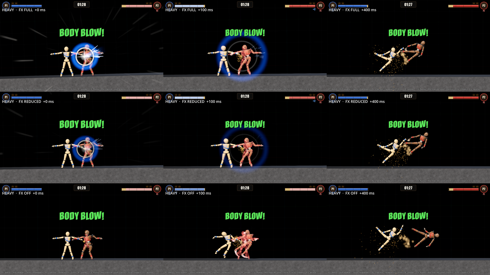

Лист пресетов: строки full / reduced / off (F10), столбцы +0 / +100 / +400 мс, удар один и тот же (heavy 14 HP в торс, Void). Бой v2 — `img/hitfx-fight-v2.gif` (960 px, 15 fps, 9 с, 7.8 МБ) и `img/hitfx-fight-v2.mp4` (0.56 МБ, **со звуком**, пик −0.4 dB). Листы `hitfx-tiers-v2.png`, `crit-sequence-v2.png`, `hitfx-crit-ruins-v2.png` пересняты после сведения (§11.3–11.5).

**API пресетов сведено.** Правила (§11.2) и визуал (§11.3) используют одну точку — `FxPreset` → `var` директора. Точечные правки интеграции:
- `HitFxDirector._wave`: альфа кольца × `flash_intensity`. В reduced кольцо прозрачнее, в off его не видно. `_lines`: линии скорости × `flash_intensity`, в off их нет. Раньше в off оставались синее кольцо heavy и линии скорости.
- В off остаются щепки, пыль, послеобразы и ленты (движение, не вспышки), надписи диктора и KO slow-mo.
- `tests/hitfx_snapshot.tscn -- "presets=1,…"` — лист пресетов. В конце пресет возвращается в full.

**Мастерская: боты больше не заклиниваются** (`match_probe` и копия ботов в `hitfx_core_probe`). После 6 с без ударов боты расклиниваются попеременно: чётная попытка — вверх и через препятствие к сопернику, нечётная — врозь, как раньше. Причина заклинки — станок (x ≈ 0.3) между куклами. Прыжок врозь-вниз снова ставил их в упор со двух сторон, вторая попытка (через станок) дала удары через 1 с. Числа крита меряют бой, а не простой: раньше `hitfx_core_probe` workshop давал 1–4 матча без KO за 60 с на сид, `freq_crit_period` уходил за 45 с (45.4 в первом прогоне этого круга). Правила крита не менялись.

**Проверки (29.09, после сведения).**
- `--import` чистый. `run_gate` OK (doll_gate, feel_probe strict). `run_combat_gate` 134/134.
- `run_hitfx_gate` OK: `hitfx_core_probe` 122/122, `hitfx_probe` 65/65 × 3, `crit_probe` 59/59, `sfx_probe` 38/38.
- `match_probe`: ruins / workshop / void / scrap и `void sd=1` — OK. По одному матчу на площадку, всего 156.6 с боя, 6 crit + ko_crit — **26.1 с на крит**. Засухой не выдано ни одного (все score ≥ 18), слабейший крит 18.1 HP.
  - Руины: crit 29.1 HP.
  - Мастерская: crit оружием 21 HP, KO на 31.6 с.
  - Void: crit 19.4 и ko_crit 18.1.
  - Свалка: crit 26.3 и ko_crit 19.1.
- `hitfx_core_probe`, частота у ботов:

| Прогон | Бой, с | crit + ko_crit | с на крит | засухой | слабейший, HP | heavy |
|---|---|---|---|---|---|---|
| гейт (Void / Руины / Мастерская, сиды 29 + 7) | 1447 | 46 | **31.5** | 2 (4 %) | 14.01 | 14.7 % |
| то же, повтор | 1395 | 47 | 29.7 | 3 (6 %) | 14.0 | 13.6 % |
| 4 площадки, сиды 11 + 3 | 1720 | 57 | 30.2 | 8 (14 %) | 14.2 | 15.7 % |

- `scene_switch_probe`, `body_probe`, `craft_probe` 201/201, `workshop_probe` 109, `pickup_probe`, `doll_hooks_probe` — OK. `arm_assist_probe` 28/28, новых красных нет.
- Оконные — OK: `hud_snapshot`, `fx_probe`, `playground_snapshot scene=void hit=1` / `ko=1`, `hitfx_snapshot` (обычный и `presets=1`), `crit_snapshot` Void и Руины, `clip_capture hitfx=1`.
- `perf_probe scene=void hitfx=1`, 1280×720, 21 с (13 heavy, 6 crit): в среднем 59.9 fps, худшая секунда 59.2. Load average 44 при 8 ядрах (параллельные сессии). С v1 (72 fps при load 26) напрямую не сравнить. Маска кукол в худшей секунде просадки ниже 59 не дала.

**Кадры: честно.**
- **Пресеты.** Full: звезда, веер искр и толстое синее кольцо. Reduced: звезда и искры тусклее, кольцо полупрозрачное, стоп-кадр есть. Off: на +0 только куклы, щепки и надпись. На +100 жертва уже летит (стоп-кадра нет), видны красные послеобразы.
- **Heavy** (`hitfx-tiers-v2`): на +100 торсы открыты, кольцо цвета атакующего читается.
- **Крит на Void** (`crit-sequence-v2`): +0 — чёрные силуэты на белом. На 117–450 мс голова крупно, рентген, трещины, щепки. На 633 мс надпись над куклами, к 900 мс её уже нет. Синтетика (куклы стоят вплотную): отлёт на 900–1250 мс мал.
- **Крит на Руинах** (`hitfx-crit-ruins-v2`): голень на половину высоты кадра, фон ровный тёмно-синий. После ката куклы мелкие на пёстром фоне — это камера Руин.
- **Клип** (`hitfx-fight-v2`): после удара рывком атакующий остаётся на месте. Между ЦМ 1.6 м при ударе, 2.98 м через 0.6 с, атакующий идёт к жертве со скоростью 0.12 м/с. Жертва улетает к стене, у стены пыль (`crit_flight`-slam).
- В клипе крит задан тестовым переключателем `force_next` на ударе в 6.7 HP. В игре такой удар критом не станет (правило ≥ 14 HP), клип показывает только презентацию.

**Открыто.**
- `hitfx_core_probe` с `freq=…+scrap` (не в гейте): `freq_env_hits` — 10 ударов kind environment от механизмов Свалки. Это чужая зона, в гейт Свалка не входит.
- Подсказка площадки (Hint в `.tscn`) не упоминает F10: строка уже во всю ширину 1280. F10 описан в `godot/README.md`, при нажатии всплывает тост. (F10 на площадке «Тело» больше не занят — пресеты тела на F1–F12, [ ], PgUp/PgDn.)
- Reduced выключает кинематограф крита целиком (запасной путь: надпись, стоп 80 мс, замедление 0.4 с). Короткий кат — правка CritCinematic.
- Частота крита у людей не мерилась. Потолок держат кулдауны 8 / 15 с. Звук, частоту и пресеты автор проверяет руками.
- Отчёты `hit_tier_probe` и `hitfx_core_probe` по умолчанию пишутся в один файл (`tests/hitfx_core_probe_report.json`). Для параллельных прогонов нужен `out=`.

## 12. v3 доводка (после критика v2, 29.09)

### 12.1 Крит-отлёт виден целиком (замечание 1)

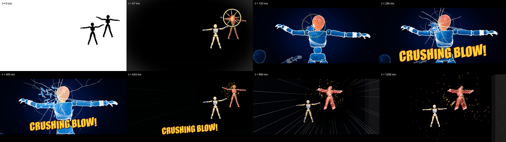

`crit_snapshot corner=1`: жертва под потолком у правой стены Void, удар вдоль (1, 0.55) — тот же угол, где в клипе v2 она висела под полосой HP P2. Кадры 0 / 70 / 130 / 250 / 450 / 640 / 900 / 1250 мс. Сравнение — с `img/crit-sequence-v2.png`.

- **Safe-area камеры.** Новый `DynamicCamera.keep_safe(target, real_s, avoid)`. Прямоугольник цели — AABB мешей всех её частей на плоскости XY (`target_rect`). Он кладётся в `safe_rect` = (0.03, 0.19)–(0.97, 0.88) кадра: верхние 19 % — панели HUD и леттербокс 11 %, нижние 12 % — леттербокс и подсказка. Сначала камера отъезжает (не больше `safe_max_zoom_out` 0.6), потом сдвигает центр. Сдвиг идёт поверх клэмпа границ арены: за стеной и над потолком Void — чёрная пустота. Внутренний запас `safe_inset` 0.02 закрывает крен кадра. После окна сдвиг и отъезд уходят за `safe_release_tau` 0.25 с. Без вызова камера прежняя. `safe_enabled = false` — камера как в v2 (для проб).
- **Окно.** `HitFxDirector` включает safe сразу в момент крита (игровая камера за крупным планом уже кадрирует жертву — на кате назад нет скачка из угла). Держит до конца замедления + `CRIT_HOLD_TAIL_S` 0.3 с: `crit_hold_s` — 0.85 с для crit, 1.7 с для ko_crit, без ката 0.78 с. Дальше safe продлевается шагами 0.25 с, пока жертва в крит-полёте (`flight_cap_active`), но не дольше 2.2 с от ката.
- **Focus с упреждением** держится с полным весом до того же конца: длительность `hold / (1 − FOCUS_OUT_FRAC)`. Её ставят и `CritCinematic._cut_out`, и директор; в v2 было 0.7 с.
- **ko_crit.** Для корпуса жертвы (голова, торс, таз) есть зона `avoid` = «KO!» карточки (`KO_CARD_AVOID`, центр кадра). Если корпус в неё попадает, кадр сдвигается вбок, но только пока вся жертва остаётся в safe-area.
- **След на весь полёт.** `_crit_flight_fx(victim, colour, cc, hold_s)`: послеобразы каждые 45 мс на всё окно (`AfterimageTrail.MAX_SNAPSHOTS` 12 → 40; одновременно живут ≤ 5). Ленты живут `hold + 200` мс. Дымный след — всё окно, до 18 клубов (`FlightTrail.smoke_max`). В v2 было 430 / 900 / 700 мс и 8 клубов.

**Проверка** — `crit_probe` сценарий S. Настоящий крит через `Match.on_hit` (`force_next`), с отбросом и отдачей как у DollCombat. Жертва долетает до ЦМ (5.69, 7.31). От ката до ката + 850 мс в каждом кадре меряется экранная проекция AABB мешей жертвы против `safe_rect`:
- v2 (`safe_enabled = false`, тот же сценарий): вне safe-area 49 кадров из 51, заход до 0.30 кадра;
- v3: **0 из 51**;
- послеобразы ещё снимаются и лента жива за 40 мс до конца окна;
- камера после окна — `fx_idle`.

**Честно.**
- Кадр 1250 мс: справа видна чёрная пустота за стеной Void (кадр вышел за границы ради safe-area). На Void это не отличить от фона. На Руинах за границей — небо и задник.
- Safe-area отъезжает не больше чем на 60 %. Разорванная кукла ko_crit шире кадра может выйти за край.

### 12.2 Heavy: тормоз атакующего (замечание 2)

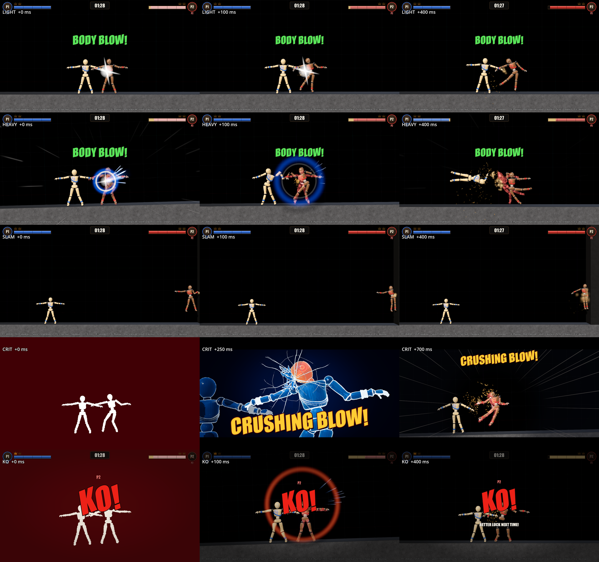

- **Код.** `CritLaunch.brake_attacker(ctx, speed, seconds)`: ЦМ атакующего вдоль `kb_dir` и его горизонтали режется до `speed` — сразу. При `seconds > 0` клэмп повторяется каждый тик окна (узел `HeavyAttackerBrake`). Исключений столкновений нет, рывок и тяга не снимаются. С `AttackerHold` крита тормоз не работает. Вызов — одна строка в `Match._emit_hit_fx` для tier heavy (`ctx.brake_cut`). Константы: `Tuning.HEAVY_ATTACKER_BRAKE_SPEED` 2.5, `HEAVY_ATTACKER_BRAKE_S` **0** — только мгновенный клэмп в ударе.
- **Замер: окно 0.18 с разлёт не увеличивает.** Один и тот же сценарий с тормозом и без (`CritLaunch.heavy_brake_enabled`), расстояние между ЦМ на +400 мс реального времени:

| Сценарий | без тормоза | тормоз 2.5 м/с × 0.18 с | 0.5 м/с × 0.2 с |
|---|---|---|---|
| боты (`_rush`, Void / Руины / Мастерская, сиды 29 + 7, по 120 с): 67 / 80 heavy | 2.10 м | 2.07 м | — |
| `hitfx_probe` stand 1.2 м (P2), удар без отдачи — как листы v1/v2 | 1.41 | 1.53 | — |
| то же с отдачей DollCombat | 1.62 | 1.66 | 1.07 |
| рывок в упор 1.0–1.3 м, среднее (P2 / P1 / тело) | 1.53 / 1.75 / 1.33 | 1.50 / 1.47 / 1.31 | 1.27 (P2) |

- **Почему не работает.** DollCombat уже ставит атакующему отдачу: сближение → −0.5 Δv жертвы, тяга выключена 0.3 с (`HIT_ATTACKER_RECOIL`, v6.2). У ботов атакующий вдоль отлёта в момент heavy — медиана −0.3 м/с. Быстрее 2.5 м/с — только 10 % ударов, до 5.2 м/с; это клинч, где конечности переплетены. Там жертва в первом же шаге физики отдаёт скорость атакующему: 3.96 → −0.77 м/с, атакующий получает +2.5. Тормоз без исключений столкновений держит атакующего, а тот держит жертву, поэтому разлёт не растёт (0.5 м/с даёт −0.55 м). Повтор одного прогона после restart расходится на ±0.3 м, так что разница «с тормозом / без» — в пределах шума.
- **Что видел критик.** Листы v1/v2 ставили удар без отдачи (`_hit` не звал `apply_recoil`), атакующий стоял в 1.2 м, и руки Т-позы были вложены друг в друга (кисть атакующего x = −0.33, плечо жертвы −0.37). `hitfx_snapshot` v3 эмулирует отдачу как DollCombat. Heavy ставится с 1.6 м между ЦМ (`HEAVY_GAP_M`): руки касаются, но не вложены. В `hitfx_probe` на такой постановке между ЦМ 1.70 → **2.27 м** на +400 мс, атакующий −0.08 м/с (v2-постановка — 1.41 м). В листе v3 на +400 атакующий заваливается назад-вбок, жертва улетает; в v2 атакующий взлетал вместе с ней.
- **Проверки** (`hitfx_probe`, все три варианта):
  - `heavy_brake_unit` — 6 м/с → ≤ 2.5 в окне 0.18 с, после окна узла нет, исключений столкновений нет;
  - `heavy_brake_one_shot` — `seconds` 0: клэмп без узла;
  - `heavy_brake_tier_*` / `heavy_brake_along_stand`;
  - разлёт — справка `info.heavy_brake_gap_400_*`.
- **Честно:** цель «на +400 мс заметно больше» тормоз не даёт. Разлёт в листе дают честная эмуляция отдачи и постановка без вложенных рук. Разлёт в клинче без исключений столкновений не лечится. Окно тормоза оставлено параметром — если автор захочет пробовать руками.

### 12.3 Крупный план, яркие арены, reduced (замечания 4, 5)

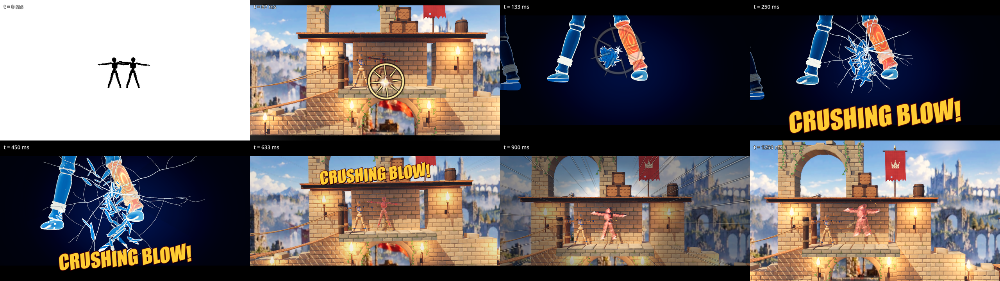

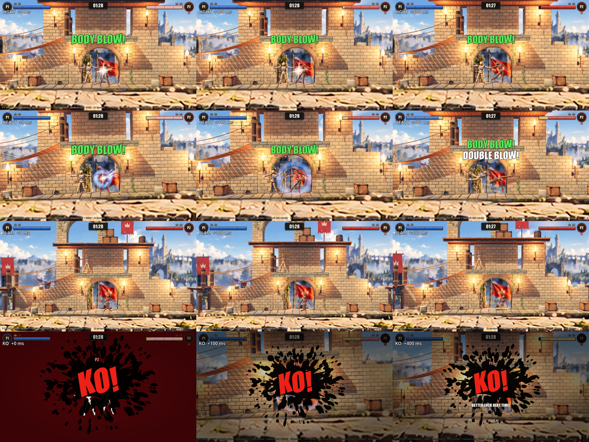

- **Маркер точки удара 33–150 мс** (`CritOverlay.HitMarker`, шейдер `assets/shaders/fx/hit_marker.gdshader`): кольцо 55 → 175 ед. и 8 лучей, тёплое ядро в тёмной обводке, гаснет к 150 мс. До ката точка берётся в игровой камере, после ката — в CritCam. Кадр +117 больше не статичен: на 70 мс кольцо на застывших куклах, на 130 мс — в крупном плане.
- **Атакующий в рентгене затемнён.** Оверлей `xray_dim.gdshader` (тёмный, альфа 0.86, тонкий холодный обод) ставится на `material_overlay` мешей атакующего. Меши ищутся в рантайме по `parts`, прежний оверлей возвращается вместе с оверлеями жертвы. Ударенная деталь остаётся тёплой, остальная жертва — голубой, атакующий — тень.
- **Надпись не на куклах.** В крупном плане при равном перекрытии детали выбирается полоса, которая меньше закрывает атакующего; есть запасная полоса 0.84. После ката — из полос 0.26 / 0.84 / 0.2 / 0.74 та, что меньше перекрывает обе куклы с учётом уезда вверх и сжатия (`caption_overlap`). KO-карточка ko_crit — через `avoid` камеры (§12.1).
- **Затемнение фона в замедлении** (`CritOverlay.BgDim`, `crit_bg_dim.gdshader`): тёмно-синий слой 0.5 вне круга вокруг жертвы. Радиус — 0.6 размера её экранного прямоугольника + 60 ед. Вход 70 мс, выход 220 мс к концу замедления. На Руинах (+900) небо и стены уходят в тень, жертва и линии — вперёд.
- **Тёмная обводка.**
  - Линии скорости heavy (`scenes/fx/shaders/speed_lines.gdshader`) и крита (`assets/shaders/fx/speed_lines.gdshader`) — светлое ядро в тёмной кайме.
  - Кольцо (`shockwave.gdshader`) — тёмная кайма по обе стороны; радиус кольца внутри квада сдвинут внутрь, чтобы кайма не обрезалась.
  - Альфа линий heavy теперь не ниже `LINES_K_FLOOR` 0.5 уже на пороге 2.6 м/с. В v2 при 4 м/с она была ≈ 0.07, линий не было видно и на Void.
- **Reduced уменьшает кольцо по размеру:** радиус × lerp(`WAVE_SIZE_MIN` 0.55, 1, flash). Reduced (0.4) — 1.31 м вместо 1.8. Альфа — как в v2.

**Проверки.**
- `crit_probe` 59 → **69**:
  - `A_marker_33_150` — виден на 85 мс, снят к 200 мс, 8 кадров;
  - `A_attacker_dimmed_xray` — 49 мешей;
  - `A_attacker_overlay_restored`;
  - `A_bg_dim_slowmo` — есть на 800 мс, снято после done;
  - `A_caption_out_off_dolls` — 0.0;
  - S × 5 (§12.1).
- `hitfx_probe` 65 → **71** × 3: `reduced_wave_smaller` 1.31 и тормоз §12.2 (разлёт — справка).
- `hitfx_snapshot scene=ruins` (новый ключ; строки light / heavy / slam / ko, slam на Руинах — падение на пол), `recoil=0` — постановка v2.
- `crit_snapshot corner=1` (новый ключ).
- Гейты (29.09, v3 A): `--import` чистый. `run_gate` OK (doll_gate, feel_probe strict). `run_combat_gate` 134/134 (`rush_damage` 61.8 HP в полосе 20–120). `run_hitfx_gate` OK: `hit_tier_probe`, `hitfx_core_probe` 158/158, `hitfx_probe` 71/71 × 3, `crit_probe` 69/69, `sfx_probe`. Клип боя v3 (`clip_capture hitfx=1`) не переснят.

**Кадры: честно (сравнение с v2).**
- **Крит на Void** (`crit-sequence-v3` против v2).
  - На 70 мс виден маркер. На 130 мс кольцо на голове в крупном плане.
  - Атакующий в рентгене темнее жертвы, но в этом ракурсе он почти за кадром.
  - На 640–1250 мс жертва в кадре и ниже HUD. В v2 в том же углу она уходила под полосу HP P2.
  - Надпись после ката — внизу (0.84), не на куклах.
  - Минус: на 250 / 450 мс надпись внизу по-прежнему лежит на нижней части жертвы. Верхнюю полосу закрывает голова-деталь, и в крупном плане свободной полосы нет.
- **Крит на Руинах** (`hitfx-crit-ruins-v3`).
  - Маркер на 70 мс читается на светлой стене благодаря тёмной обводке.
  - На 900 мс фон затемнён, линии скорости видны на небе. В v2 их не было видно.
  - Минус: куклы после ката мелкие — это игровая камера Руин. Отлёт мал: синтетика, куклы стоят вплотную.
- **Heavy на Void** (`hitfx-tiers-v3`, строка 2).
  - Кольцо цвета атакующего с тёмной каймой.
  - На +400 жертва улетает вправо, атакующий остаётся слева: 2.3 м между ЦМ против ~1.4 м в v2. Это заслуга постановки и отдачи, а не тормоза.
- **Руины** (`hitfx-tiers-ruins-v3`).
  - Кольцо heavy и белое внутреннее кольцо читаются на кирпиче.
  - Минус: на +400 в клинче засчитан второй удар (DOUBLE BLOW), куклы снова рядом.
  - Минус: slam (падение на пол) мелкий, пыль еле видна на пёстром полу.
  - KO-карточка обычного KO лежит на куклах. Это HUD (`ko_card`, чужая зона); в ko_crit её обходит камера.

### 12.4 Крит для самых мощных ударов (обход кулдауна)

Замечание критика v2: кулдаун атакующего 15 с отдавал в heavy самые мощные удары боя (41 HP / score 47, 30.7 HP, три по 25+), а критом становились «стильные» удары 14–16 HP. Автор просил крит именно для особо мощных ударов.

**Правило v3** (`scripts/core/hit_tier.gd`, числа — `Tuning.CRIT_BYPASS_*`):
- `HitTier.crushing(ctx)` — «сокрушительный» удар: score ≥ `CRIT_BYPASS_SCORE` **27** (1.5 × `CRIT_SCORE`) или урон ≥ `CRIT_BYPASS_DAMAGE` **25** HP.
- Сокрушительный удар — crit сквозь кулдауны 8 с (матч) и 15 с (атакующий), если от прошлого крита прошло ≥ `CRIT_BYPASS_GAP_S` **4 с** боя. Кинематограф идёт 1.3 с реального времени, это ≈ 0.4 с боя; сторож — 1.5 с реального. К 4 с боя он давно закончен, наложения нет (проверка `tier_bypass_gap_covers_cinematic`).
- Обход снимает и `CRIT_MIN_FIGHT_S` 5 с, и исключение DOUBLE BLOW (`eligible(ctx, true)`). У ботов оставались heavy удары оружием 40–53 HP на 1-й секунде боя и молот 36 HP вторым телом клинча. Если первое тело клинча было критом, второе закрывает зазор 4 с.
- Не снимает: `CRIT_MIN_DAMAGE`, `CRIT_KINDS`, удар по себе, `crit_enabled = false`.
- Криту обходом ставятся кулдауны, как обычному. При KO ko_crit выдаётся по (порог ∨ сокрушительный) и `CRIT_KO_GAP_S` 2 с.
- `CRIT_MIN_DAMAGE` 14 → **15**. Обход добавляет ~6 критов на 1800 с боя ботов, а подъём минимума забирает столько же с нижнего края (стильные удары 14–15 HP). Частота остаётся в середине полосы, слабейший крит — 15 HP.
- Для проб в ctx пишутся два поля. `crit_block` — почему удар, прошедший порог, не стал критом: `min_fight` / `cooldown` / `attacker_cooldown` / `bypass_gap`. `crit_bypass` — крит выдан только обходом. В `crits[]` добавлен флаг `bypass`.

**Проверки** (`hitfx_core_probe`, 158; синтетика `hit_tier_probe` 101):
- `tier_bypass_*`: границы 25 HP / score 27 (21.6 HP в голову), зазор 3.99 / 4 с, обход кулдауна атакующего и матча, обход MIN_FIGHT и DOUBLE BLOW, цепочка 10 → 14 → 18 с. Обход ставит кулдаун 8 с. Выключатель, удар по себе и зазор после крита первого тела клинча — обход не срабатывает.
- `tier_block_*`: значения `crit_block`.
- Старые `cd_*`, `min_fight_*`, `excl_double_blow` и `ko_double_blow` идут на 20 HP, не сокрушительных. `crit_by_bonus` идёт через рывок: 14.4 HP в голову теперь ниже минимума.
- `freq_crit_power_lost` (новая): у ботов нет ни одного heavy ≥ 25 HP / score 27, потерянного из-за кулдауна 8 / 15 с, MIN_FIGHT или DOUBLE BLOW. Разрешена одна причина — зазор кинематографа `bypass_gap`.
- `freq_crit_gap` и `freq_crit_gap_attacker` меряют только криты без обхода. Новая `freq_crit_bypass_gap` проверяет зазор обхода ≥ 4 с.
- В отчёте: `info.freq.power` (мощные удары по уровням и причинам), `damage_dist` (урон crit и heavy по корзинам), `bypass`. В `hits[]` добавлена колонка `crit_block`.

**До / после** (боты `hitfx_core_probe`, 6 матчей до KO на площадку и сид; «потеряно» — heavy ≥ 25 HP / score 27 не из-за зазора кинематографа):

| Прогон | Бой, с | crit + ko_crit | с на крит | обходом | засухой | слабейший, HP | потеряно | heavy |
|---|---|---|---|---|---|---|---|---|
| до: 4 площадки, сиды 29 + 7 | 1739 | 60 | 29.0 | — | 4 (7 %) | 14.0 | **8** (4 кулдаун, 2 MIN_FIGHT, 2 DOUBLE BLOW) | 14.7 % |
| до: 4 площадки, сиды 11 + 3 | 1815 | 51 | 35.6 | — | 4 (8 %) | 14.1 | **8** (2 / 2 / 4) | 14.5 % |
| после: 4 площадки, сиды 29 + 7 | 1822 | 59 | **30.9** | 5 | 1 (2 %) | 15.3 | **0** | 14.2 % |
| после: 4 площадки, сиды 11 + 3 | 1810 | 57 | **31.8** | 8 | 3 (5 %) | 15.2 | **0** | 13.2 % |
| после: гейт (Void / Руины / Мастерская, 29 + 7) | 1516 | 41 | **37.0** | 3 | 1 (2 %) | 15.0 | **0** | 13.3 % |

Промежуточный прогон с обходом при `CRIT_MIN_DAMAGE` 14 дал 27.6 / 28.1 / 28.7 с на крит: в полосе, но у нижнего края.

Урон критов и heavy (по сумме двух прогонов на 4 площадках):

| Корзина, HP | 14–18 | 18–25 | 25–30 | 30+ |
|---|---|---|---|---|
| crit + ko_crit, до | 32 | 46 | 15 | 18 |
| crit + ko_crit, после | 16 | 56 | 18 | 26 |
| heavy, до | 44 | 17 | 2 | 10 |
| heavy, после | 57 | 11 | 1 | 4 |

Среди потерянных «до»: по кулдауну — 37.3 HP мечом, 30.7 HP кистью, 28.0 и 34.7 HP молотом в голову (score 35 / 50); до 5-й секунды — 52.9, 49.4, 39.2 и 39.9 HP оружием; вторым телом клинча — 36.0 HP молотом и 35.3 HP топором. «После» мощные удары — это crit и ko_crit, кроме зазора `bypass_gap`.

**Честно.**
- Остаток — heavy ≥ 25 HP внутри 4 с после чужого крита: 3 + 3 + 2 удара на трёх прогонах. Почти всегда это ответ жертвы.
  - Во время кинематографа (0.05–0.31 с боя) — 29.6, 60 и 36 HP. Второй кинематограф здесь невозможен.
  - После него (0.9–3.8 с) — 33.1, 34.7, 22.4 (score 28) и 49.2 HP. Их вернёт `CRIT_BYPASS_GAP_S` 2.5–3 с. Критик просил ≈ 4 с — оставлено 4.
- Прошлый крит перед таким ударом часто слабый (15–18 HP): кинематограф уже потрачен. Отменять начатый крит ради более сильного удара не стали, это правка CritCinematic.
- Частота у людей не мерилась: удары сильнее, и обход у людей сработает чаще. Потолок — не чаще раза в 4 с боя.
- `freq_env_hits` на Свалке (4 площадки, не в гейте) по-прежнему 9–12 ударов kind environment от механизмов — чужая зона, см. §11.6.

### 12.5 Итог v3 (интеграция, 29.09)

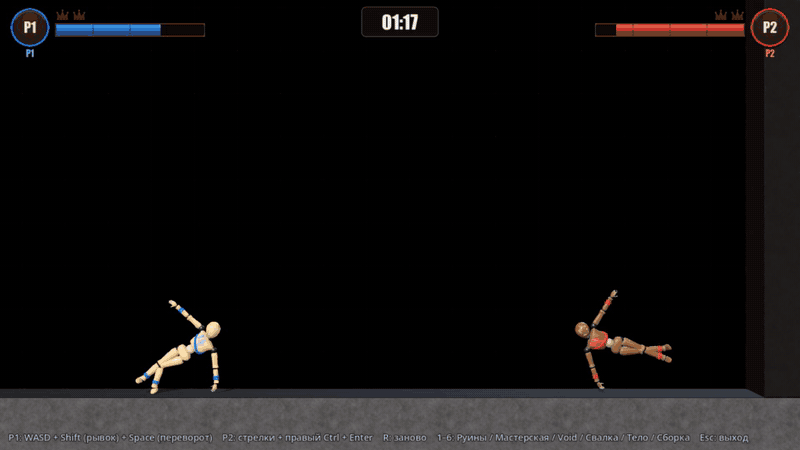

**Клип** — `img/hitfx-fight-v3.gif` (12 fps, 800 px, 12.8 с, 7.9 МБ) и `img/hitfx-fight-v3.mp4` (960 px, 30 fps, 0.87 МБ, **со звуком**, пик −0.5 dB). Впервые без `force_next`: новый режим `clip_capture bots=1` — бот-бой как `match_probe._rush` (наскок, отход, рывок с разбега, распутывание застреваний). Снимается до первого настоящего crit / ko_crit + 4.2 с. `seed=29`, Void: прогон детерминирован, с `--write-movie` и без крит на одном и том же кадре 1347.
- Окно клипа — 13.9–26.7 с боя. Heavy на 14.7 с: 8.3 HP в голову, DOUBLE BLOW, красное кольцо. **Крит на 22.4 с**: P2 рывком в голову P1, 16.0 HP, score 23.1 (порог 18, обход не нужен).
- Крит-полёт: жертва улетает влево ~4 м и бьётся о стену Void. На всём полёте (кадры 9.5–11.4 с клипа) она целиком в кадре и ниже HUD. Видны голубые ленты-послеобразы, дымный след, пыль у стены.
- Минусы клипа. Боты Void дерутся лёжа на полу, в общем плане куклы мелкие. Крит — 16 HP, не «сокрушительный»: обход кулдауна (§12.4) в клип не попал. На Руинах (`seed=29`) настоящий крит был сокрушительным (22.3 HP, score 27.9), но случился под деревянным помостом: полёт упёрся в конструкцию, поэтому этот прогон не взят. В крупном плане надпись снова ложится на нижнюю часть жертвы (§12.3).

**Листы v3 (просмотрены).**
- `crit-sequence-v3` (угол Void): маркер на 67 / 133 мс читается; атакующий в рентгене — тёмная тень; на 633–1250 мс жертва в кадре и ниже HUD. Отлёт в синтетике короткий, около 1 м.
- `hitfx-tiers-v3`: heavy на +400 — куклы разошлись; кольцо синее с тёмной каймой. Карточка KO на +400 лежит на куклах (HUD, чужая зона).
- `hitfx-tiers-ruins-v3`: общий план Руин мелкий. Кольцо heavy читается; slam почти не виден; клякса KO закрывает кукол.
- `hitfx-crit-ruins-v3`: маркер на стене на 67 мс виден; линии скорости на небе на 900 мс тонкие, но видны. К 1250 мс жертва почти не сдвинулась — синтетика.

**Проверки (29.09, интеграция v3).**
- `--import` чистый.
- `run_gate` OK (doll_gate, feel_probe strict).
- `run_combat_gate` **134/134**, `rush_damage` 61.8. В `combat_gate.gd` 13 сценариев, файл с 11:07 не менялся; «153» в отчёте агента A — ошибка счёта.
- `run_hitfx_gate` OK: hit_tier 101/101, core 158/158, hitfx_probe 71/71 × 3, crit_probe 69/69, sfx_probe 38/38. `freq_crit_period` 35.3 с, 41 крит на 1448 с боя; `freq_crit_power_lost` 0 (из 21 мощного удара: 11 crit, 6 ko_crit, 4 heavy внутри зазора 4 с).
- `match_probe` ruins / workshop / void / scrap — 34/34, `void sd=1` — 11/11.
- `scene_switch_probe`, `body_probe`, `craft_probe` 201/201, `workshop_probe`, `pickup_probe`, `doll_hooks_probe`, `arm_assist_probe` — exit 0.
- Оконные: `hud_snapshot`, `fx_probe` (3 вспышки, OK), `playground_snapshot scene=void hit=1` / `ko=1` — exit 0. В `ko=1` мягкие `fps` 47 и `frame_time` 21 мс — нагрузка, не гейт.
- `clip_capture hitfx=1` (прежний сценарий с `force_next`) — OK, `bots=1` — OK.
- `perf_probe scene=void hitfx=1`, 1280×720, 21 с (13 heavy, 6 crit): 85.3 fps в среднем, худшая секунда 71.7 (load 5.4).

**Честно / открыто.**
- **Частота крита у ботов шумит.** Первый прогон гейта (параллельно с run_gate и combat_gate, высокая нагрузка) упал на `freq_crit_period` 24.4 с < 25: 54 крита на 1315 с. Три следующих прогона — 34.2 / 35.3 / 35.4 с. Прогоны совпадают на первых двух площадках (void@29, ruins@29) и расходятся с workshop@29: где-то в бою остаётся зависимость от реальных часов. Нижний край 25 с близко к разбросу.
- **Фриз на первом ударе.** Два первых `perf_probe` после импорта: секунды с 0.9 и 0.6–0.7 fps на первом heavy (t≈2 с) и первом крите (t≈4 с), каждый фриз ~1 с. Третий прогон и диагностический с логом длинных кадров — без фризов. Похоже на компиляцию пайплайнов новых или изменённых шейдеров v3 при холодном кэше. Надо проверить, покрывает ли `prewarm` `hit_marker`, `crit_bg_dim`, `xray_dim` и тёмную кайму линий и кольца. На машине автора после правки шейдеров первый heavy или крит может подвиснуть на ~1 с.
- Замечание 2 закрыто не тормозом, а постановкой и отдачей (§12.2). Остальное открытое — в §12.1–12.4: пустота за стеной при safe-area, карточка KO на куклах, частота у людей.
