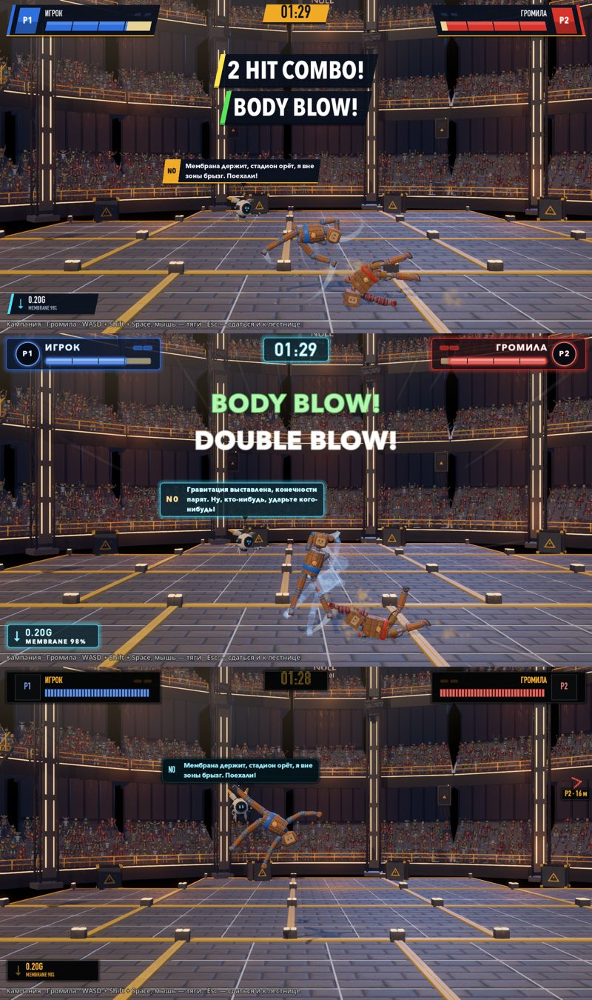
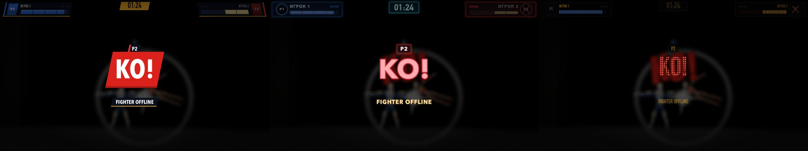

# Скины HUD боя: трансляция, неон, LED (02.10.2026)

## Решения автора

- «Как сделать интерфейс более крутым, модным? Неоновым может?» — сделан макет трёх направлений поверх настоящего кадра из купола: https://claude.ai/artifact/CWWbTg5BjZcxKGfErYB7xw (страница доступна только автору).
- Сначала выбрана «Трансляция Лиги».
- Потом: «не могу выбрать до конца, хочу посмотреть на все 3 варианта сразу в игре; в настройках, чтобы можно было переключить».

Сейчас в игре все три скина. По умолчанию — «Трансляция Лиги».

## Как переключать

- **В бою — F9:** трансляция → неон → LED → снова трансляция. Внизу экрана тост «HUD: …», HUD перекрашивается сразу. Работает в Быстром бою, кампании, на старых аренах; в PvE меняется только диктор.
- **Где хранится:** `user://settings.cfg`, раздел `[player]`, ключ `hud_skin` (`broadcast` / `neon` / `led`). Это тот же файл и раздел, что у `Flow` — настроек меню-гаража из ветки `claude/great-mendel-npa4x9`.
- **Код:** `HudSkin.set_skin(id)`, `HudSkin.cycle()`, `HudSkin.IDS`, `HudSkin.LABELS` — `godot/scripts/ui/hud_skin.gd`.

### Строка для экрана «Настройки» (сессия меню-гаража)

Экран настроек делает сессия «дизайн запуска игры и меню». Чтобы там появился выбор скина, нужно три правки:

1. `scripts/menu/flow.gd`:
   - в `DEFAULTS` добавить `"hud_skin": "broadcast"`;
   - в `apply_settings()` добавить `HudSkin.set_skin(String(settings["hud_skin"]), false)`.
2. `scenes/menu/garage_settings.gd`, в `ROWS` перед «НАЗАД» добавить строку:
   ```gdscript
   {"key": "hud_skin", "title": "ИНТЕРФЕЙС БОЯ", "kind": "choice", "values": ["broadcast", "neon", "led"], "labels": ["ТРАНСЛЯЦИЯ", "НЕОН", "LED-ТАБЛО"]},
   ```
3. Там же, в запасных значениях `get_value()`, добавить `"hud_skin": "broadcast"`.

Без первой правки `Flow.save_settings()` перезапишет файл без ключа `hud_skin`, и выбор, сделанный клавишей F9, забудется.

## Что меняет скин





| Элемент | Трансляция Лиги | Неон NULL | LED-табло |
|---|---|---|---|
| Панели игроков | косая тёмная плашка, полоса цвета игрока, янтарь снизу | тёмное стекло с краем цвета игрока и свечением | чёрная панель табло |
| Портрет | косой блок цвета игрока | круг с неоновым кольцом | квадрат табло |
| Полоса здоровья | косая, с рисками по четвертям | светящаяся трубка | ряд светодиодных ячеек |
| Метки побед | косые янтарные | обведённые неоном | круглые светодиоды |
| Таймер | янтарная плашка (в Sudden Death — красная) | голубое стекло, цифры светятся | чёрная панель, цифры точками LED |
| Диктор | плашка «выезжает» слева: отсчёт и FIGHT! — янтарь, KO! — красная, удары — тёмная с полосой цвета удара | светящийся текст с отскоком | панель табло, точки LED, мигание при появлении |
| Реплика N0 | «нижняя плашка» эфира с ярлыком «N0» | голубое стекло | экран самого N0: голубые строки |
| Стрелка к сопернику | плашка с треугольником и метрами | светящийся шеврон и метры | шеврон из светодиодов, метры на табло |
| Индикатор поля | плашка с голубой полосой | голубое стекло | панель табло |
| Карточка KO | красная плашка «KO!», «FIGHTER OFFLINE» | красный ореол | красные светодиоды |
| Итоги и кнопки | тёмные плашки, REMATCH — янтарь | стекло | панели табло |
| Голосование зрителей | плашка с янтарным ярлыком | стекло | панель табло |

Индикатор поля — новый, слева снизу: стрелка гравитации, сила в G, строка мембраны (как на табло зала). Взят с листа камеры автора, раньше его не было. На аренах без поля NULL он скрыт.

## Файлы

- `godot/scripts/ui/hud_skin.gd` — выбор и хранение скина; шрифты, панели, стиль подписей и тема по скину.
- `godot/scripts/ui/broadcast.gd` и `bc_style.gd` — графпакет трансляции (косые плашки).
- `godot/scripts/ui/led_dots.gdshader` — точки светодиодов у крупных строк табло.
- Элементы перекрашиваются по сигналу `HudSkin.events.changed`:
  - `scenes/ui/hud.gd`, `player_panel.gd`, `portrait.gd`, `hp_bar.gd`, `announcer.gd`, `ko_card.gd`, `results_panel.gd`, `offscreen_markers.gd`, `field_badge.gd`;
  - `scripts/n0/n0_speech.gd`;
  - `scenes/arena/audience_vote_panel.gd`.
- Деревянная тема `scenes/ui/hud_theme.tres` осталась у мастерской и меню; HUD боя её больше не берёт.

## Шрифты

Пока системные шрифты Mac:

- **Трансляция и LED:** DIN Condensed Bold — в нём есть кириллица — и Avenir Next Condensed Heavy Italic для крупных латинских надписей.
- **Неон:** Avenir Next с широкой разрядкой.
- **Другие системы:** на машине без этих шрифтов будет узкий Arial.

**Вопрос автору:** для релиза положить в проект свободный шрифт с кириллицей (OFL — например, Russo One или Oswald; Oswald уже лежит в ветке меню). Для этого его нужно скачать — с разрешения автора.

## Проверки

- `tests/hud_skin_probe.tscn` (headless) — 4 из 4. На каждом скине после смены на лету:
  - тема HUD;
  - панель таймера;
  - шрифт имени;
  - плашка диктора;
  - облачко N0;
  - точки LED у «KO!».

  Порядок F9 тоже проверяется.
- `tests/hud_snapshot.tscn` с `skin=broadcast|neon|led` — по 22 проверки на каждый скин (`"ok": true`), кадры выше.
- `tests/n0_follow_snapshot.tscn` с `skin=…` — кадры боя.
- Зелёные после правок:
  - `n0_follow_probe` 16/16 — новая проверка: облачко N0 не выше 160 px, раньше в первый кадр реплики оно раздувалось;
  - `match_probe`, `campaign_probe` 15/15, `arena_events_probe` 8/8, `null_field_probe` 9/9, `menu_probe` 4/4, `pve_probe`, `combat_gate`.

## Не сделано

- PvE: у `pve_hud` своя тема, скин меняет только диктора.
- Кинематограф крита («CRUSHING BLOW!», `crit_overlay`) и карточки выхода бойца — в старом виде.
- Табло цифрами (`IMPACT 18.4G`) — этап 14.
