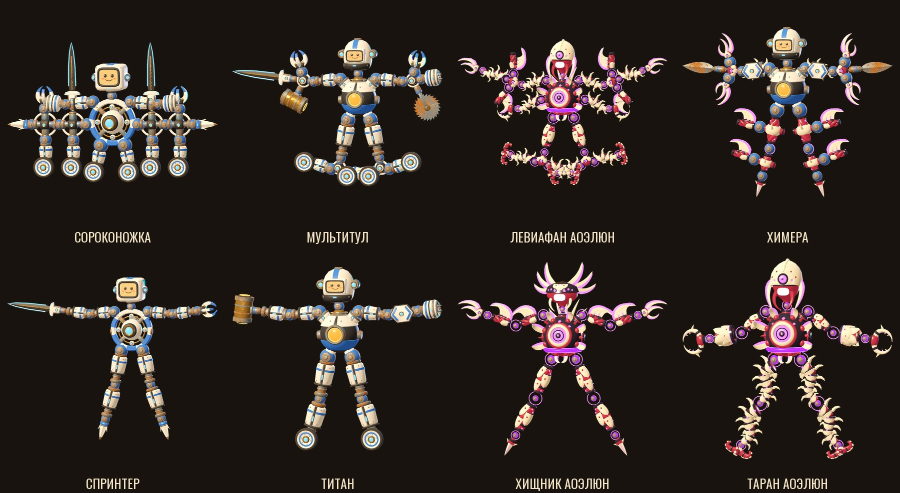

# Наборы деталей 04.10.2026: про-лига Земли и Аоэлюн

Автор 04.10 прислал три листа-концепта и попросил: «давай добавлять модели в игру как детали и закрывать проблемы». Листы сохранены в `docs/refs/null/sets-0410-sheet1.webp` … `sheet3.webp`. Проблемы — это разбор каталога (`AI_ASSET_BRIEF.md` §8); что из них закрыто — `ARMOR_BREAK.md`.

Листы — картинки, 3D-файлов в них нет. Детали построены так же, как детали лиги с прошлых листов: скриптами Blender в общий конвейер кита (`BODY_KIT.md`). Правило 1 из `ASSET_PIPELINE.md` не нарушено, генерация 3D нейросетью не понадобилась.

Верхний ряд — «невозможные конструкции» на разветвителях, нижний — первая партия бойцов; кадры из игры, поза спавна.

## Что на листах

| Лист | Ряд «Про-лига Земли» | Ряд «Аоэлюн» | Ряд «Утилиты и аренные модули» |
|---|---|---|---|
| 1 | ядра: гиростаб, реактор; голова: визор; руки: клинок, дробилка, крюк, цепь, бур; ноги: пропеллер, пружина | ядро: сердце; голова: наблюдатель; руки: коготь, плеть, лезвия; ноги: ходули, щупальца; броня: панцирь | щиты: полевой, секционный; модули: магнит, трос, дрон, ракетный, маховик, стабилизатор, манипулятор, генератор поверхности |
| 2 | рама спортивная, ядро форсаж, голова пилот; руки: клешня, молот, пила, горохомёт; ноги: колесо, прыжок, копьё | ядро органическое, голова охотник; руки: клинок, щупальце, коготь; ноги: ходули, хвост; броня: панцирь; модули: плазменная железа, перестройка | щиты: сфера, панель; модули: гироскоп, трос, реактивный, магнит, дрон, генератор поля, манипулятор, ремонт, масса, камуфляж |
| 3 | полные конструкции: Спринтер, Титан, Снайпер, Трансформер, Поддержка | Хищник, Левиафан, Сталкер, Таран, Рой | гравитационное кольцо, реактивный бустер, магнит, трос, генератор щита, распылитель, стабилизатор, манипулятор, сенсорная сфера, платформа |

Язык про-лиги: кремовые панели на тёмной раме, латунные обода, полосы цвета игрока, голубой свет линз и сопел. Язык Аоэлюн: костяные пластины на тёмно-алой мышце, чёрный хитин, фиолетовая кромка лезвий и глаза.

## Что сделано — первая партия

«Рука» и «нога» листа — это целая конечность с инструментом. В ките она собирается из звена, кисти или навершия, поэтому вместо «руки: клинок» в игре есть панельное звено и энергоклинок.

### Про-лига Земли — `godot/tools/blender/kit_pro.py`, 13 деталей, 15 glb

| id `kit_…` | Имя для игрока | Вид | Масса, кг | Энергия | Особое |
|---|---|---|---|---|---|
| `core_pro_gyro` | Ядро-гиростаб | ядро | 13 | 0 | заряд за нанесённый урон × 1.3 |
| `core_pro_reactor` | Ядро-реактор | ядро | 16 | 0 | броня 0.15; +40 к запасу заряда |
| `head_pro_visor` | Голова-визор | голова | 4.2 | 9 | |
| `head_pro_pilot` | Шлем пилота | голова | 4.6 | 10 | |
| `limb_pro_panel_s / _l` | Панельная рука / нога | конечность | 2.6 / 5.0 | 6 / 8 | |
| `hand_pro_claw` | Спортивная клешня | кисть | 1.1 | 4 | форма ×1.15, колющая |
| `hand_pro_crusher` | Дробилка | кисть | 1.9 | 5 | форма ×1.2, дробящая |
| `blade_pro_energy` | Энергоклинок | навершие (Blade) | 1.2 | 0 | в оружии ×1.55 |
| `hammer_pro_drum` | Молот-барабан | навершие (Hammer) | 3.4 | 0 | в оружии ×1.4; база — латунь |
| `foot_pro_wheel` | Большое колесо | стопа | 1.2 | 4 | форма столкновения — шар, катится |
| `foot_pro_spike` | Стопа-копьё | стопа | 0.8 | 3 | форма ×1.2, колющая; на 17 см длиннее ботинка |
| `foot_pro_prop` | Стопа-пропеллер | стопа | 0.9 | 4 | пока только вид: тяги нет |
| `deco_pro_panel_s / _l` | Щит-панель руки / ноги | броня | 1.3 / 1.9 | 4 | броня 0.3 |

Корпус — ось материалов, по умолчанию белая краска (`Base_PaintWhite`); у молота — латунь. Новые роли `Pro_Glow`, `Pro_Carbon`, `Pro_Heat` — таблица `PRO_MATS` в модуле, в Godot их пишет `tools/build_league.gd`.

### Аоэлюн — `godot/tools/blender/kit_aoe.py`, 12 деталей, 16 glb

| id `kit_…` | Имя для игрока | Вид | Масса, кг | Энергия | Особое |
|---|---|---|---|---|---|
| `core_aoe_heart` | Ядро-сердце | ядро | 13 | 0 | +0.7 HP в секунду |
| `head_aoe_watcher` | Голова-наблюдатель | голова | 4.0 | 10 | форма ×1.1, колющая |
| `head_aoe_hunter` | Голова-охотник | голова | 4.4 | 11 | форма ×1.15, колющая |
| `limb_aoe_sinew_s / _l` | Рука-жила / нога-жила | конечность | 1.8 / 3.4 | 5 / 7 | |
| `limb_aoe_blade_s / _l` | Рука-лезвия / нога-лезвия | конечность | 2.3 / 4.4 | 7 / 9 | форма ×1.2, колющая |
| `limb_aoe_whip_s / _l` | Рука-плеть / нога-плеть | конечность | 1.5 / 2.9 | 5 / 7 | форма ×1.1, колющая |
| `hand_aoe_claw` | Живой коготь | кисть | 1.0 | 4 | форма ×1.2, колющая |
| `hand_aoe_hook` | Крюк-захват | кисть | 1.1 | 4 | форма ×1.1, дробящая |
| `foot_aoe_stilt` | Ходуля | стопа | 0.8 | 3 | форма ×1.15, колющая; на 14 см длиннее ботинка |
| `foot_aoe_grip` | Присоска | стопа | 0.7 | 3 | |
| `deco_aoe_carapace_s / _l` | Панцирь руки / ноги | броня | 1.2 / 1.8 | 4 | броня 0.3 |
| `deco_aoe_spines` | Спинные иглы | декор (спина, макушка) | 0.7 | 2 | хозяину форма ×1.15, колющая |

Костяные пластины — ось материалов, по умолчанию кость (`Base_Bone`). Мышца, хитин и свет — роли лиги `League_Flesh` / `League_Void` / `League_Glow`; новых ролей нет.

### Бойцы — `tools/build_league.gd`, таблица `LEAGUE_FIGHTERS`

| id | Боец | Состав | Энергия / бюджет | Масса, кг |
|---|---|---|---|---|
| `pro_sprinter` | Спринтер | гиростаб, визор; панельные руки: клешня и энергоклинок; панельные ноги на копьях | 96 / 100 | 51.5 |
| `pro_titan` | Титан | реактор, шлем пилота; дробилка и молот-барабан, щит-панель на левом предплечье; ноги на колёсах | 109 / 110 | 60.0 |
| `aoe_predator` | Хищник Аоэлюн | сердце, охотник; руки-лезвия с когтями, ноги-жилы на ходулях, иглы на спине | 105 / 110 | 44.5 |
| `aoe_ram` | Таран Аоэлюн | сердце, наблюдатель; руки-жилы в панцире с крюками, ноги-плети на присосках | 106 / 110 | 41.8 |

Бойцы Аоэлюн носят `LeagueLook` (свет вместо цвета игрока, визор на лице), земные — нет. Все четыре есть в шаблонах мастерской (`CraftEdit.BODY_PRESETS`). Бюджет выше 100 сборщик поднимает сам до цены бойца — регламент про-лиги и Аоэлюн автор не задавал.

## Разветвители и «невозможные конструкции» (04.10, вечер)

Автор: «нужно, чтобы можно было собрать интересные невозможные конструкции». Раньше тело было ядром и шестью цепочками без ветвлений: у звена один разъём на конце. Теперь есть детали с **тремя разъёмами под конечности** — цепочка перестаёт быть линией.

| id `kit_…` | Имя для игрока | Вид | Масса, кг | Энергия | Разъёмы |
|---|---|---|---|---|---|
| `hub_pro_tee` | Тройник | сустав | 2.4 | 4 | вниз и в стороны на ±70° |
| `limb_pro_spine_s / _l` | Малая / большая рама-позвонок | конечность | 2.9 / 5.2 | 7 / 9 | на конце и два боковых под 90° |
| `hub_aoe_node` | Узел-сплетение | сустав | 2.2 | 4 | вниз и в стороны на ±70° |
| `limb_aoe_spine_s / _l` | Малый / большой позвонок | конечность | 2.0 / 3.7 | 6 / 8 | на конце и два боковых под 90° |

Как это устроено: якоря названы по контракту (`End`, `Side_L`, `Side_R`), поэтому сборщик кита и мастерская понимают их без правок кода. Боковой разъём — группа мышц бедра, ход −60…80°. Тройник и узел лежат на полке «Шарниры», позвонки — на полке «Конечности».

Что можно собрать:
- **ветку:** рука → тройник → три инструмента или три новые руки;
- **хребет:** цепочка позвонков, на каждом пара ног, лезвий или щупалец;
- **дерево:** узел на узле — пока хватает энергии и номеров узлов.

Что по-прежнему нельзя:
- голова одна и только на шее ядра; ядро одно;
- узлов не больше 36 (номер узла — один символ);
- бюджет чертежа: в обычной сборке 100, чем дальше деталь от ядра, тем она дороже. Для больших сборок есть шаблон мастерской **«Открытая категория»** — ядро, голова и бюджет 300.

### Новые конструкции

| id | Боец | Что это | Энергия / бюджет | Масса, кг | Узлов |
|---|---|---|---|---|---|
| `pro_centipede` | Сороконожка | гиростаб посередине горизонтального хребта из четырёх рам-позвонков: шесть колёс вниз, клинки и клешни вверх, копья на концах | 179 / 180 | 66.8 | 28 |
| `pro_multitool` | Мультитул | каждая рука кончается тройником с тремя инструментами (клинок, клешня, молот / дробилка, клешня, пила), каждая нога — тележкой на двух колёсах | 157 / 160 | 71.1 | 24 |
| `aoe_leviathan` | Левиафан Аоэлюн | верхние плети делятся в узлах на коготь и два лезвия, нижние жилы — на две плети с присосками, из боков плети с крюками | 214 / 220 | 64.5 | 31 |
| `set_chimera` | Химера | реактор и шлем пилота на живых деталях: руки-плети с узлом на два когтя и жало, ноги — хребты из позвонков с лезвиями в стороны | 158 / 160 | 58.6 | 24 |
| `open_empty` | Открытая категория | заготовка: гиростаб и голова-визор, бюджет 300 | 9 / 300 | 17.2 | 2 |

Все пять — в шаблонах мастерской; первые четыре — на площадке тела (листаются `]`). В `tools/build_league.gd` для них новый формат `"tree"`: узлы с явным родителем, «*» в ключе разворачивает строку в левую и правую ветку.

Подводные камни:
- **Буквы L и R нельзя давать номерами узлов:** тело без своего имени зовётся `<префикс>_<номер>`, и узел «L» даёт второй `UpperArm_L`. В `build_league.gd` они убраны из `UIDS`.
- **Угол покоя на боковом разъёме:** у Левиафана ноги-плети с углом −20° стояли «домиком» и рвали сустав узла (расхождение 11 см), с +20° лежат в стороны и держат (2 мм). Проба `sets_probe` называет сустав с наибольшим расхождением.
- Разветвитель в ноге несёт вес тела; лёгкий узел (1.3 кг) между тяжёлым ядром и полом растягивал сустав сильнее, поэтому масса тройника и узла — 2.4 и 2.2 кг.

Проверка — `tests/sets_probe.tscn` (63 проверки): восемь бойцов собираются, стоят 4 с без разрыва суставов, едут под вводом; ветвление дошло до куклы; мастерская (`CraftEdit.attach`) собирает ветвящееся тело из «Открытой категории». **Не проверено:** сборка мышью в самой мастерской и бой на этих телах — только через программный вызов и пробу покоя.

## Как пересобрать

Из корня репозитория, `B=/Applications/Blender.app/Contents/MacOS/Blender`:

1. `godot --headless --path godot -s res://tools/build_league.gd` — роли `Pro_*.tres` (до импорта glb; бойцы на этом шаге дадут ошибки, пока нет деталей).
2. `$B -b --python godot/tools/blender/body_kit.py -- --export <Имена builder-ов>`.
3. `godot --headless --path godot --import`.
4. `godot --headless --path godot -s res://tools/build_body_kit.gd`.
5. **`git checkout -- godot/scenes/body/presets/`** — сборщик кита портит сцены пресетов (дефект ниже).
6. `godot --headless --path godot --import`.
7. `godot --headless --path godot -s res://tools/build_league.gd` — чертежи и сцены бойцов.
8. Имена — `PartNames.NAMES`, переводы — `godot/locale/en.json`, профиль формы — `HIT_PROFILE` в `build_body_kit.gd`, число формы — `HIT_MULT` в `tests/kit_probe.gd`.

Проверка бюджета без экспорта, пока деталь в работе: `$B -b --python godot/tools/blender/kit_tris.py -- <Имена>` — треугольники, габарит, материалы, пустышки; на диск ничего не пишет.

## Дефект сборщиков (был до этой работы)

`build_body_kit.gd` и `build_league.gd` в режиме `-s` переписывали сцены пресетов с двадцатью лишними свойствами: `scenes/ui/hud.gd:67` зовёт автозагрузку `Flow`, которой в `-s` нет, поэтому `modular_doll.gd` не компилируется и `PackedScene.pack()` сохраняет все свойства куклы. Проверено на чистом `main` `8a7c23f`. В `build_league.gd` сцена теперь пишется текстом и готовая не трогается; `build_body_kit.gd` не исправлен — шаг 5 выше.

## Что с листов не сделано

- **Про-лига:** рама спортивная, ядро форсаж; руки крюк, цепь, бур, пила, горохомёт (бур, пила, крюк и цепь с шаром в ките уже есть в старом виде); ноги пружина и прыжок.
- **Аоэлюн:** ядро органическое; нога-хвост; модули «плазменная железа» и «перестройка».
- **Весь нижний ряд** (щиты, дрон, маховик, стабилизатор, манипулятор, генератор поля, платформа, ремонт, масса, камуфляж) — это активные блоки, каждому нужна механика в `ActiveBlocks` / `ActiveRig`, а не только модель.
- **Конструкции листа 3:** Снайпер, Трансформер, Поддержка, Левиафан, Сталкер, Рой.
- Стопа-пропеллер не летает; щитков на ядро и голову нет.
