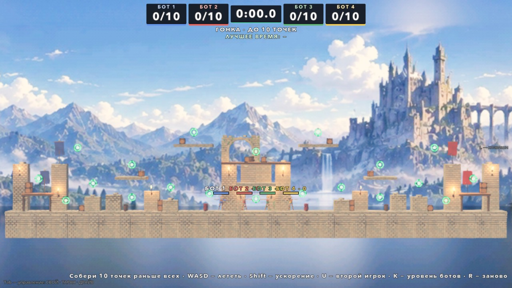
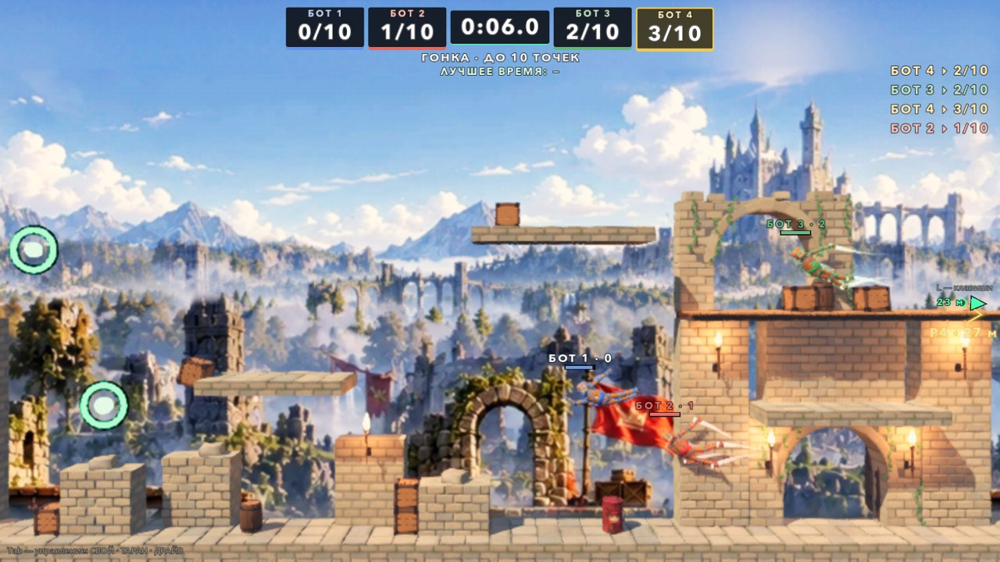
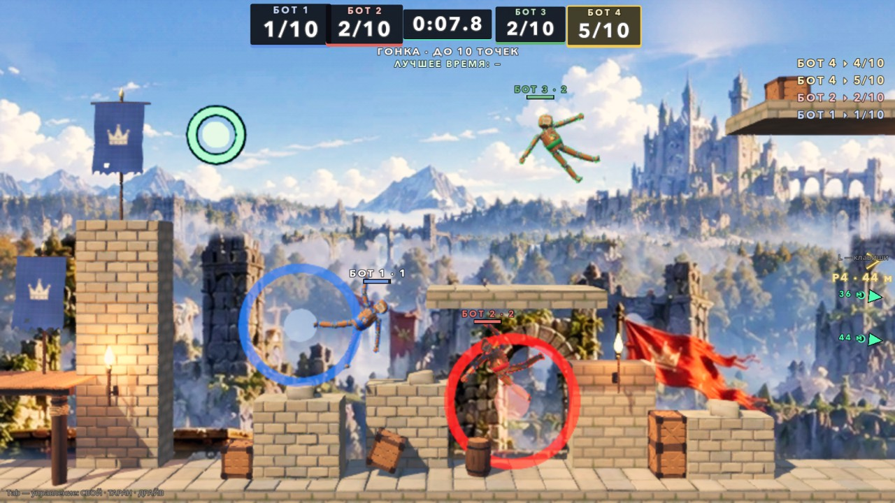
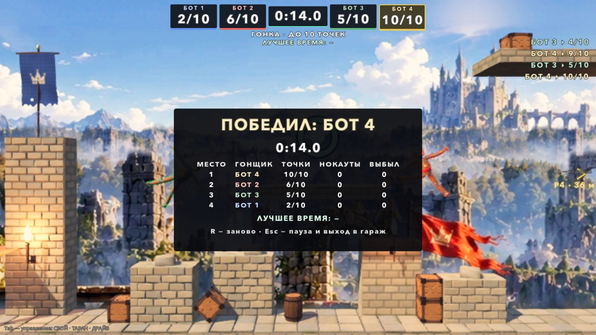
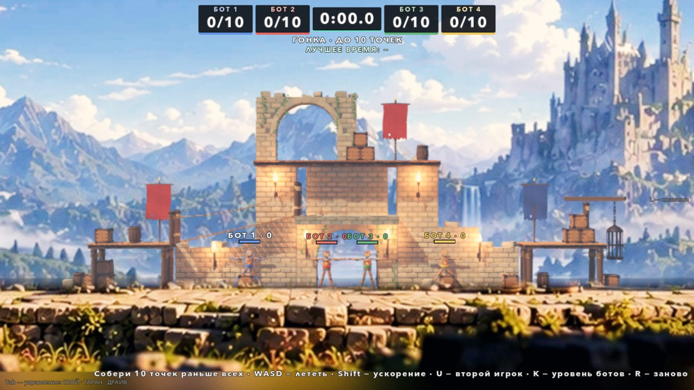
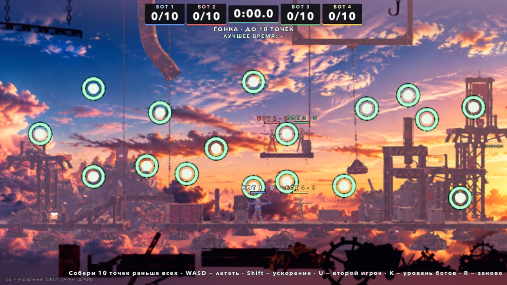

# Гонка: 10 точек (06.10.2026)

Автор 06.10 (`docs/plan-demo/MODES_PACK.md` §4):

> гонки — нужно быстрее собрать 10 пунктов, кто быстрее соберёт их
>
> Гонка — у всех одни и те же точки: если кто-то взял, то у тебя этой точки уже нет, и надо к следующей.

Режим без привязки к лору, как спорт-зал и стычка. Ветка `worktree-agent-ab39fb1dbe561ad2a` от `main` ab8a356.








## Как запустить

- В игре: гараж → **ВСЕ РЕЖИМЫ** → «Гонка: 10 точек — Полигон» (или «— Руины», «— Свалка»), сразу после строки СТАЗИСА.
- Напрямую: `godot --path godot res://scenes/playground_race.tscn` (`_ruins`, `_scrap` — другие карты).

## Правила

- Четыре гонщика: ты (P1) и три бота. За P2 по умолчанию играет бот.
- Точки **общие**. Одновременно горят `RACE_VISIBLE` = 3. Подлетел любой деталью ближе 0.9 м к центру — точка твоя: +1, она гаснет у
  всех, вместо неё загорается новая на случайной свободной метке не ближе 8 м к тебе. Свободная — та, на которой точка сейчас не горит
  (и не та, что только что взята). Подходящих меток нет — новая загорается на самой дальней свободной.
- Первые точки загораются не ближе 8 м к центру старта — бесплатной точки на старте нет.
- Коснулись двое в одном тике — берёт тот, чья деталь ближе.
- Первый, кто набрал **10** (`RACE_TO_WIN`), побеждает — гонка кончается. Лимит 5:00: вышло — побеждает тот, у кого больше точек
  (равно — кто раньше их набрал). Sudden Death и «последний живой» выключены.
- Бить можно, урон обычный. Эффекты удара (тряска, стоп-кадр, надписи HEAD BLOW!) — только если в ударе участвует человек: драка
  ботов на другом краю Полигона не дёргает кадр (как в стычке). Крит-кино выключено — гонка не стоит полторы секунды.
- **KO** (удар, пропасть) → через 2 с гонщик возвращается **у последней точки, которую взял сам** (не брал — на старте); если на
  этой метке сейчас горит точка — у ближайшей негорящей. Счёт не теряется. Первые 1.5 с урон не проходит.
- Лучшее время P1 до 10 на каждой карте пишется в `user://race_best.cfg` (только если победил человек-P1) и показывается под часами
  и в итогах («НОВЫЙ РЕКОРД!»).

## Управление

P1 — как в бою: WASD летать, Shift ускорение, Space + A/D раскрутка, ЛКМ — рука к курсору, E — хват.

| Клавиша | Что |
|---|---|
| U | P2: бот ↔ второй игрок на стрелках (правый Ctrl, Enter). Можно просто нажать стрелку — бот отдаст управление сам |
| K | уровень ботов 1 → 2 → 3 (по умолчанию 2) |
| R | заново |
| Esc | пауза (продолжить / заново / в гараж) |
| M / N / H | музыка / толпа / скин HUD |
| 1–9 | другие площадки, как в стычке |

## HUD

- Сверху по центру — часы гонки (идут вверх), под ними «ГОНКА · ДО 10 ТОЧЕК» и лучшее время на карте.
- По бокам от часов — плашки четырёх гонщиков: имя и «7/10» цветом игрока. У лидера рамка ярче.
- Над гонщиками — имя, счёт и полоска HP. Горящие точки за краем кадра — стрелки цвета точки с метрами от тебя. Соперники за кадром —
  стрелки `OffscreenMarkers` («P3 · 24 м»).
- Своя точка — диктор «+1 · 7/10» и нота выше с каждой точкой (десятая — колокол). Чужая — строка в ленте справа «БОТ 3 ▸ 6/10» и
  короткий низкий сигнал.
- Выбыл — «ВОЗВРАТ ЧЕРЕЗ 2». Конец — табличка: кто победил, время, места (точки, нокауты, выбывания), лучшее время.

## Камера

На Полигоне (64 м) всех в кадре не удержать: камера держит тебя, ближайшую горящую точку ближе 16 м и соперников ближе 10 м
(`focus_point_m`, `focus_rivals_m` у площадки, группа `race_focus`); остальное — стрелки у края. Масштаб — как в стычке
(`min_half_height` 5.5, `max_half_height` 9). На Руинах и Свалке в кадре все гонщики и ближайшая точка. Колёсный масштаб игрока на
время сцены сброшен в 1.

## Карты и метки

Метки — `Marker3D` в узле `RaceMarks` своей сцены-площадки (сцены арен не тронуты), старт — `RaceStart/Start0..3`. Двигать руками в
редакторе можно; после правки — проба `only=marks` (метка не в статике, из каждой видно ≥ 3 других, граф связный) и `only=grid`
(ASCII-карта слоя кукол с метками).

Правило расстановки, выученное пробой: **меток в карманах быть не должно** (под палубой с ящиками в Руинах, под уступом и между
ярусами справа на Свалке, под верёвочным мостом). Боты без поиска пути лезут в карман за точкой и не могут выбраться — в первых
прогонах они стояли там по 14–18 с. Сейчас все метки в открытом воздухе.

| Карта | Сцена | Меток | Видно из метки (в среднем) | Особенности |
|---|---|---|---|---|
| Полигон | `scenes/playground_race.tscn` | 20 | 9.4 | ворота под мостом, над башней, над и под парящими плитами, над укрытиями и палубами баз, высокое небо |
| Руины | `scenes/playground_race_ruins.tscn` | 16 | 8.1 | тесно, ямы по краям (KO), точки над ямами, верёвочный мост, клетка |
| Свалка | `scenes/playground_race_scrap.tscn` | 17 | 11.2 | пропасть, паровой клапан, магнит, пресс, ярусы справа |

## Боты

`RaceBrain extends EnemyBrain` (без EnemyLook):
- **цель** — ближняя горящая точка; если соперник к ней заметно ближе (его путь < 0.65 моего и короче на 3 м) — другая. Новая цель
  должна быть лучше текущей на 2 м — бот не мечется.
- **путь** — поиска пути в игре нет, поэтому граф видимости по меткам (`RaceNav`): толстый луч (центр и ±0.3 м) к точке чист —
  прямо; закрыт — через видимую метку с кратчайшим путём по графу до цели; ни одной не видно — обход сбоку от препятствия. Препятствия —
  статика, доски верёвочного моста, замороженные и тяжёлые (> 15 кг) пропсы: тележку 30 кг и железную бочку 40 кг с ходу не
  растолкать, а лучи раньше их не видели — бот упирался в них по 10 с.
- **толчок** (уровни 2–3) — соперник рядом и ближе к моей точке — наскок с ускорением.
- **застрял** (жмёт, а стоит, или 3 с в круге 1.2 м) — выход в самую открытую сторону (самый длинный из 8 лучей — из кармана к
  выходу; застревает там же снова — выход дольше), точка и метка-перевалка — в чёрный список на 6 с.

Старт на Свалке: двое на полу, двое на висящем островке. Прежний старт (четверо на полу под островком и магнитом) стоял среди
тяжёлых пропсов — четвёртый бот застревал у старта до 10 с.

## Ручки (`godot/scripts/tuning.gd`, блок «ГОНКА»)

| Константа | Сейчас | Что |
|---|---|---|
| `RACE_VISIBLE` | 3 | сколько точек горит сразу (работает 1..6) |
| `RACE_TO_WIN` | 10 | до скольких |
| `RACE_PICK_M` | 0.9 | радиус взятия от любой детали |
| `RACE_NEW_MIN_M` | 8 | новая точка не ближе к взявшему |
| `RACE_RESPAWN_S` / `RACE_SPAWN_SHIELD_S` | 2 / 1.5 | возврат после KO / неуязвимость |
| `RACE_RESPAWN_DROP_M` | 0.9 | на сколько ниже центра точки встаёт кукла при возврате |
| `RACE_TIME_LIMIT_S` | 300 | лимит гонки |
| `RACE_BOT_LEVELS` | 1–3 | тяга, ускорение, уступчивость, толчки |

## Устройство

| Что | Где |
|---|---|
| Матч: метки, горящие точки, взятие, счёт, KO и возврат, итоги, звук взятия | `godot/scripts/race/race_match.gd` (`RaceMatch extends Match`) |
| Точка и вспышка взятия | `godot/scripts/race/race_point.gd` (`RacePoint`) |
| Бот | `godot/scripts/race/race_brain.gd` (`RaceBrain extends EnemyBrain`) |
| Граф видимости по меткам | `godot/scripts/race/race_nav.gd` (`RaceNav`) |
| Площадка: гонщики, P2 бот/человек, камера, клавиши, рекорд | `godot/scenes/race/playground_race.gd` (`RacePlayground`) |
| HUD | `godot/scenes/race/race_hud.gd` (`RaceHud`) |
| Сцены карт | `godot/scenes/playground_race.tscn`, `_ruins.tscn`, `_scrap.tscn` |

### Правки в общих файлах

- `scripts/tuning.gd` — блок «ГОНКА» в конце файла.
- `scenes/menu/test_menu.gd` — три строки в `ITEMS` после СТАЗИСА.
- `locale/en.json` — переводы гонки **в начале файла** (после `@name`), чтобы не спорить при слиянии с ветками, которые дописывают в
  конец.
- `tests/i18n_layout_probe.gd` — экран гонки и её итогов в `_pass()` (рекорд в этой пробе пишется во временный файл).
- `godot/README.md` — две строки проб гонки после строк стычки.
- `match.gd`, `doll.gd`, сцены арен — не тронуты.

## Проверки

```bash
godot --headless --path godot --fixed-fps 60 res://tests/race_probe.tscn                                  # marks + rules + bots на трёх картах
godot --headless --path godot --fixed-fps 60 res://tests/race_probe.tscn -- "only=bots,map=ruins,seed=3,trace=1"   # гонка ботов с печатью
godot --headless --path godot --fixed-fps 60 res://tests/race_probe.tscn -- "only=bots,visible=1"          # одна точка на всех
godot --headless --path godot --fixed-fps 60 res://tests/race_probe.tscn -- "only=grid,map=scrap"          # ASCII-карта меток
godot/tools/godot_nofocus.sh --path godot --resolution 1600x900 res://tests/race_snapshot.tscn -- "out_dir=/abs/dir,map=proving"   # кадры (окно)
```

Проба 06.10 (ветка поверх `main` ab8a356, язык ru, headless): **51 из 51**, exit 0, ошибок скриптов 0.

- **marks** — на трёх картах метки не задевают статику и тяжёлые пропсы, из каждой видно ≥ 3 других (в среднем 9.4 / 8.1 / 12.2),
  граф видимости связный, старты свободны.
- **rules** (Полигон, мозги сняты, проба сама переносит кукол): горит 3 на разных метках, первые — 12.8 м от старта и дальше; взял
  один — +1 только ему, точка погасла у всех, загорелась новая на свободной метке в 23 м от него; двое у одной точки в одном тике —
  +1 одному; KO → через 2 с у своей последней точки (ЦМ куклы — в 0.05 м над центром метки), без точек — на старте, счёт сохранён;
  9 — гонка идёт, 10 — победа, конец и итоги, после конца точки не берутся; при `RACE_VISIBLE` = 1 и 5 горит ровно 1 / 5 после
  каждого из 4 взятий.
- **bots** — гонка четырёх ботов до 10 на каждой карте: Полигон 34.1 с, Руины 30.2 с, Свалка 17.5 с; дольше всего на месте
  2.1–2.9 с, вне границ — 0.

Разброс — 27 гонок ботов (5 зёрен на уровне 2, уровни 1 и 3, `visible` 1 и 5; `race_probe -- "only=bots,map=…,seed=…"`), все
зелёные:

| Карта | Уровень 2, 5 зёрен | Ур. 1 | Ур. 3 | Горит 1 | Горит 5 | Дольше всего на месте | Нокаутов за гонку |
|---|---|---|---|---|---|---|---|
| Полигон | 24.9–35.3 с | 30.7 с | 32.8 с | 127.2 с | 24.2 с | 2.7 с | 0 |
| Руины | 20.3–26.2 с | 27.7 с | 17.2 с | 54.2 с | 14.5 с | 3.8 с | 0–2 |
| Свалка | 14.0–30.3 с | 24.9 с | 36.6 с | 74.0 с | 12.4 с | 5.4 с | 0–1 |

Ударов между ботами за гонку — 7–115 (больше всего при одной точке на всех), нокаутов почти нет: гонка короче, чем нужно, чтобы
выбить.

Те же пробы после правок общих файлов — все зелёные, ошибок скриптов 0: `sport_probe`, `squad_probe`, `match_probe`, `menu_probe`
(пунктов 18), `i18n_probe`, `i18n_scenes_probe`, `i18n_layout_probe` (экраны гонки и итогов на en и qps), `python3 godot/tools/i18n.py
check` — ошибок 0.

## Что не проверено и что решать автору

- **Руками не проверено.** Числами доказано, что правила работают и боты доигрывают гонку на всех картах. Весело ли, удобно ли
  ловить точку и видно ли её на бегу — только руками.
- **Темп.** Боты набирают 10 за 15–35 с — гонка короткая. Человек, скорее всего, медленнее. Ручки: `RACE_TO_WIN` (15–20),
  `RACE_NEW_MIN_M` (дальше новая точка — длиннее перелёт), `RACE_VISIBLE` (1 — драка за каждую точку: 54–127 с у ботов),
  уровень ботов K.
- **Возврат после KO** сделан у последней точки, которую взял **сам** выбывший (как чекпойнт), а не у последней взятой кем угодно.
  Как задумано?
- **Новая точка может загореться рядом с соперником** — правило «не ближе 8 м» только к взявшему. Если это даёт бесплатные точки —
  можно требовать 8 м от всех.
- **Драк мало.** Боты толкаются только на подлёте к общей точке (уровни 2–3), нокаутов за гонку 0–2. Если автор хочет больше драки
  — сильнее толчок ботов, урон за наскок или точки, которые дают «заряд».
- P2 на стрелках — без руки мышью (рука только у P1). Геймпад не проверен. СТАЗИС вместе с гонкой не проверен.
- N0 гонку не комментирует, своей музыки и толпы нет (работает общий звук боя: удары, KO, отсчёт).
- Карт Полигон ночью и купола нет (купол замкнутый и узкий — может зайти для `RACE_VISIBLE` = 1).
