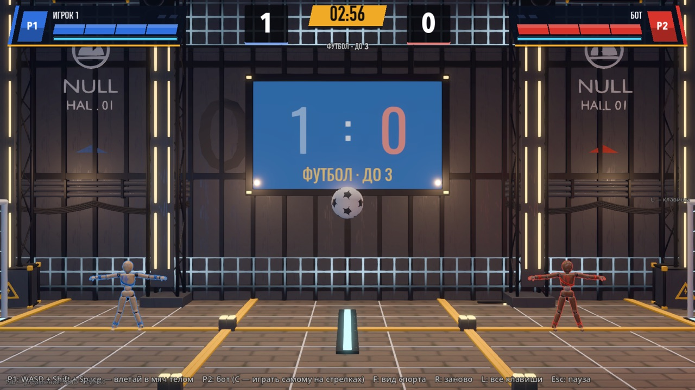
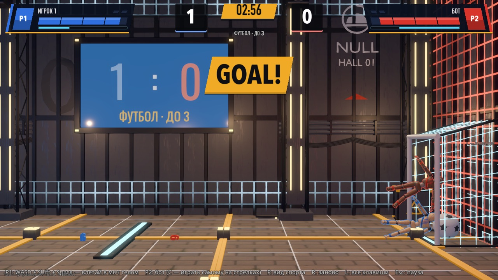
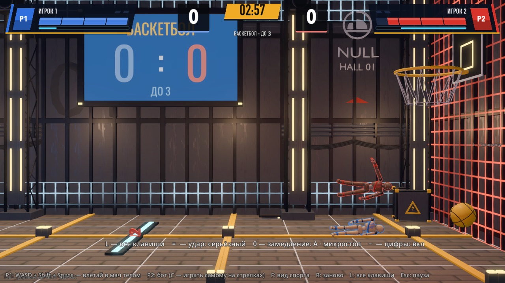
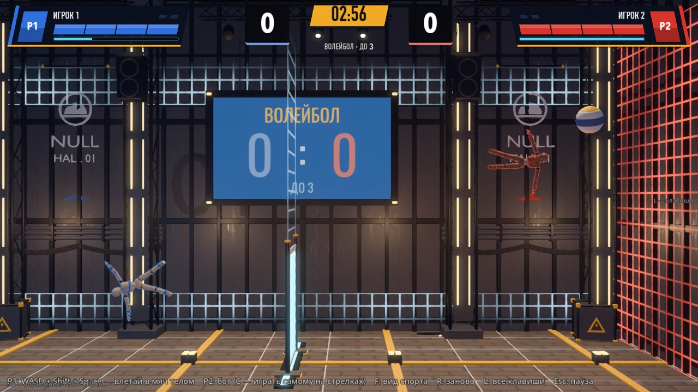

# Спорт-зал: футбол, баскетбол, волейбол (04.10.2026)

Автор 04.10: «хочу попробовать добавить ещё режим ФУТБОЛ, где куклам нужно пинать мяч в чужие ворота, чтобы забить гол. До 3 голов.
И ещё, если какие-то спорты легко перенести, можно попробовать тоже».

Сделано как проба: три вида спорта в одном зале, матч до 3, бот за второго игрока. Ветка `worktree-sport-modes` слита в `main` к сборке 0.0.3 (05.10).






## Как запустить

- В игре: гараж → **ВСЕ РЕЖИМЫ** → «Спорт-зал: футбол / баскетбол / волейбол».
- Напрямую: `godot --path godot res://scenes/playground_sport.tscn` (`_basketball`, `_volleyball` — другие виды).

## Правила

Общее: команда P1 играет слева и атакует вправо, команда P2 — наоборот. Отдельной кнопки удара нет: кукла бьёт мяч телом, чем быстрее
влетела — тем дальше он улетел. Руками мяч не берётся.

| Вид | Очко | Особенность |
|-----|------|-------------|
| Футбол | мяч за линией чужих ворот под перекладиной | ворота у пола у обеих стен; с крыши ворот мяч скатывается в поле |
| Баскетбол | мяч прошёл чужое кольцо сверху вниз | мяч сам отскакивает от пола (не ниже 5 м/с вверх): лежащий мяч куклой не поднять |
| Волейбол | мяч коснулся пола на чужой половине | сетка по центру, куклы заперты на своих половинах, подача — пропустившему |

- Матч до **3** (`Tuning.SPORT_GOALS_TO_WIN`). Время 3:00; вышло — победил ведущий; счёт равный — «золотой гол» ещё 1:30, потом ничья.
- После гола: надпись табло (`GOAL!` / `BASKET!` / `POINT!`), замедление, пауза 2.2 с, куклы и мяч встают на ввод. Часы идут только в игре.
- Гол в свои ворота засчитывается сопернику.
- Драться можно. Нокаут матч не кончает: кукла возвращается у своих ворот через 2.5 с — соперник это время играет в пустые.
  Крит-кино в спорте выключено, чтобы розыгрыш не останавливался.

## Управление

P1 — WASD, Shift (ускорение), Space + A/D (раскрутка). За P2 по умолчанию играет бот; второй игрок берёт управление, просто нажав
свою клавишу (стрелки, правый Ctrl, Enter). **U** — вернуть бота / отдать человеку (C занята пробным режимом «Прочность суставов»). **F** — следующий вид спорта. Остальное — как в
бою: R заново, Esc пауза, L все клавиши.

## Устройство

| Что | Где |
|-----|-----|
| Матч: счёт, розыгрыши, золотой гол, возврат после нокаута, итоги по счёту | `godot/scripts/sport/sport_match.gd` (`SportMatch extends Match`) |
| Мяч: физика по виду, касания, потолок скорости, отскок от пола в баскетболе | `godot/scripts/sport/sport_ball.gd`, сцена `scenes/sport/sport_ball.tscn` |
| Бот | `godot/scripts/sport/sport_brain.gd` (`SportBrain extends EnemyBrain`) |
| Зал: снаряды трёх видов, табло на стене, точки ввода | `godot/scenes/arena/sport_hall.gd` + `sport_hall.tscn` |
| Площадка: клавиши F / U, бот за P2 | `godot/scenes/sport/playground_sport.gd`, `scenes/playground_sport*.tscn` |
| Счёт поверх боевого HUD | `godot/scenes/sport/sport_hud.gd` |
| Числа (поле, мячи, ворота, кольцо, сетка, бот) | `godot/scripts/tuning.gd`, блок «спорт-зал»: `SPORT_*`, `SPORTS`, `SPORT_BOT_LEVELS` |
| Модели: мячи, ворота, кольцо со щитом, сетка | `godot/tools/blender/arena_null_hall.py`, модули `Sport_*` → `assets/models/arena/null_hall/` |
| Сборщик сцен | `godot/tools/build_sport_hall.gd` (запуск сценой `build_sport_hall.tscn`) |

Зал собран из кита Old NULL Hall, как тренировочный: поле 22 × 10 м в плоскости боя, боковые стены — энергосетка цветов команд
(синяя у P1, красная у P2). Камера держит в кадре обе куклы и мяч; общий масштаб игрока (по умолчанию 1.5× ближе) на время сцены
сброшен в 1, иначе при разлёте мяч уходил бы за кадр.

Бот играет одним правилом на все виды: встать за мяч со стороны, противоположной точке прицела, и пройти сквозь него. Прицел — чужие
ворота; в баскетболе — точка над кольцом, а когда мяч уже над ним — само кольцо; в волейболе — высоко над чужой половиной.
Уровень 1–3 — `Tuning.SPORT_BOT_LEVELS` (тяга, прицел, упреждение, ускорение), по умолчанию 2 (`bot_level` площадки).

Пересборка после правки чисел или моделей:

```bash
/Applications/Blender.app/Contents/MacOS/Blender -b --python godot/tools/blender/arena_null_hall.py -- --export Sport_Ball_Foot Sport_Ball_Basket Sport_Ball_Volley Sport_Goal Sport_Hoop Sport_Net
godot --headless --path godot --import
godot --headless --path godot res://tools/build_sport_hall.tscn
```

## Проверки

```bash
godot --headless --path godot --fixed-fps 60 res://tests/sport_probe.tscn                         # правила трёх видов + матч ботов, 89 проверок
godot --headless --path godot --fixed-fps 60 res://tests/sport_probe.tscn -- "sports=football,only=bots,trace=1"   # бой ботов с печатью мяча и состояний
godot/tools/godot_nofocus.sh --path godot --resolution 1600x900 res://tests/sport_snapshot.tscn -- "out_dir=/abs/dir"   # кадры (окно)
```

Проба 04.10 (ветка `worktree-sport-modes` поверх `main` 8a7c23f, язык ru): 89 из 89, exit 0. Матч бот против бота до конца:

| Вид | Счёт | Игровое время | Касаний мяча | Макс. скорость мяча |
|-----|------|---------------|--------------|---------------------|
| Футбол | 2 : 3 | 35 с | 97 | 11.3 м/с |
| Баскетбол | 3 : 1 | 140 с | 272 | 8.7 м/с |
| Волейбол | 3 : 0 | 29 с | 52 | 9.4 м/с |

Мяч ни разу не покинул зал, скорость не выше потолка 16 м/с. В headless проба печатает `Parameter "material" is null` — это
известный артефакт заглушки рендера при пересоздании кукол (см. HIT_FX.md), в окне его нет.

## Что не проверено и что решать автору

- **Ощущение игры руками не проверено**: числами доказано, что правила работают и боты доигрывают матч, но «весело ли» — только руками.
  Первые ручки, если не так: масса и тяжесть мяча (`SPORTS[вид].mass`, `gravity_scale`), высота ворот (`goal_h`), уровень бота.
- Футбол у ботов быстрый: 5 голов за 35 с. Если так же с человеком — уменьшить ворота или утяжелить мяч.
- Баскетбол самый трудный вид: кольцо сделано вдвое шире настоящего (просвет 2 м на мяч 0.8 м), и всё равно матч ботов идёт 2–3 минуты.
- Пункта в главном меню гаража нет — режим лежит во «ВСЕ РЕЖИМЫ». Свой пункт сдвинул бы цифры 1–7 и точки камеры гаража; решать автору.
- N0 голы не комментирует, толпы в зале нет.
- Команды 2 × 2: счёт и точки ввода на четверых готовы (P3 / P4), площадка собрана на двоих.
