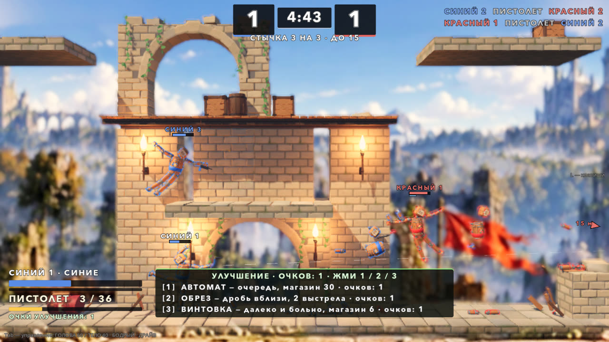
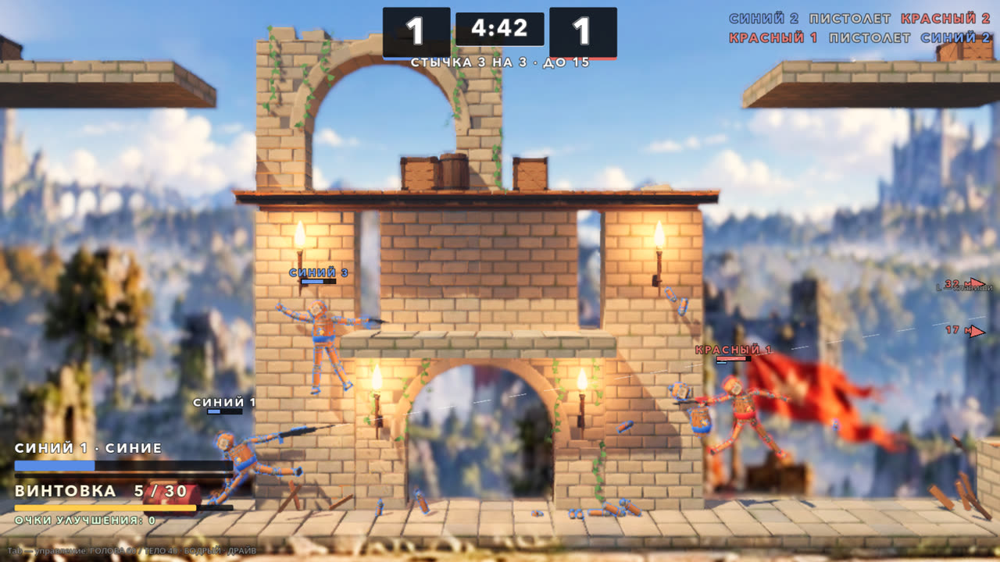

# Стычка 3 на 3: перестрелка на Полигоне (05.10.2026)

Автор 05.10: «можем ли тестово сделать карту побольше и сделать стычки 3 на 3, например, как это бывает в шутерах? При этом дать
какие-то базовые пулемёты, что есть, и попробовать такой режим ещё для игры?»

Второй заход, в тот же день (после пробы руками):

> во-первых, слишком трясётся всё. Во-вторых, давай сделаем так, чтобы из рук стреляло, когда нажимаешь, а рукой можешь управлять
> просто одной, как в обычных режимах. У команды справа левая рука, у левой — правая. + система upgrade и улучшение оружия. И
> количество пуль + перезарядка. Первое оружие у всех пистолет, потом ветка из 3 развитий. Стрелять на одну из активных клавиш, пока
> зажата. Перезарядка и сколько осталось патронов. Между выстрелами минимальная пауза. Закончились пули — в рукопашку. Патроны,
> жизни и броню можно взять в ящиках, которые должны появляться.

Ветка `claude/squad-3v3`. Первая версия влита в `main` (09d154f), второй заход — поверх неё.





## Как запустить

- В игре: гараж → **ВСЕ РЕЖИМЫ** → «Стычка 3 на 3: перестрелка на Полигоне».
- Напрямую: `godot --path godot res://scenes/playground_squad.tscn`.

## Правила

Командный бой, как в шутерах:

- Две команды по три бойца. Синие — ты и два бота, красные — три бота.
- Выбыл соперник (пуля, удар телом, взрыв, падение) — очко твоей команде. Фраг засчитывается тому, кто добил.
- Выбывший возвращается на базу своей команды через 4 с. Первые 1.5 с после возврата урон по нему не проходит.
- Матч идёт до 15 очков. Если за 5:00 никто не набрал 15, побеждает ведущая команда, при равном счёте — ничья.
- Свои не ранят и не оглушают: ни пулей, ни ударом, ни своим взрывом. Толкают при этом полностью.
- Крит-кино выключено. Нокаут даёт короткое замедление, и только если в нём участвуешь ты.

## Управление

| Клавиша | Действие |
|---|---|
| WASD | лететь |
| ЛКМ | тянуть руку с оружием к курсору, как в обычном бою; ствол смотрит по руке |
| I (активная клавиша 1) | огонь, пока зажата |
| O (активная клавиша 2) | перезарядка |
| 1 / 2 / 3 | взять улучшение (панель внизу видна, пока хватает очков) |
| Shift | рывок |
| K | уровень ботов 1 → 2 → 3, сразу |
| R | заново |
| Esc | пауза и выход в гараж |

Остальное — как в бою: M (музыка), N (толпа), H (скин HUD), 4–9 (площадки). Цифры 1–3 в стычке заняты улучшениями.

**Рука с оружием** — со стороны соперника на экране: у синих (слева) — рука справа, у красных — слева. Кукла смотрит в камеру,
поэтому анатомически у синих это левая кисть (Hand_L), у красных — правая (Hand_R). Ею же управляет ЛКМ. Вторая рука —
только физика.

От ствола идёт **пунктир прицела** — туда уйдёт пуля. Красный пунктир значит, что патронов в магазине нет или идёт перезарядка.

## Оружие

У всех на старте пистолет. Числа — `Tuning.SQUAD_WEAPONS`.

| Оружие | Уровень | Урон | Пауза между выстрелами | Магазин / запас | Перезарядка | Разброс | Дальность |
|---|---|---|---|---|---|---|---|
| Пистолет | старт | 9 | 0.28 с | 12 / 48 | 1.1 с | ±1.5° | 18 м |
| Автомат | 1, ветка «очередь» | 5 | 0.09 с | 30 / 120 | 1.5 с | ±4° | 16 м |
| Пулемёт | 2, ветка «очередь» | 6 | 0.075 с | 70 / 210 | 2.6 с | ±3.5° | 20 м |
| Обрез | 1, ветка «дробь» | 7 × 5 | 0.45 с | 2 / 24 | 1.4 с | ±11° | 9 м |
| Дробовик | 2, ветка «дробь» | 8 × 5.5 | 0.65 с | 6 / 30 | 2.0 с | ±8° | 12 м |
| Винтовка | 1, ветка «точность» | 30 | 0.75 с | 6 / 30 | 1.8 с | ±0.4° | 32 м |
| Рельсотрон | 2, ветка «точность» | 55, насквозь до 3 бойцов | 1.3 с | 3 / 15 | 2.4 с | 0° | 45 м |

Как ведёт себя оружие:

- **Пустой магазин** — перезарядка начинается сама со следующего тика. Клавишей O можно перезарядиться раньше.
- **Нет ни магазина, ни запаса** — спуск молчит, на HUD надпись «ПАТРОНОВ НЕТ — РУКОПАШНАЯ». Бот в этом случае ищет ящик
  с патронами, а если его нет — идёт бить телом.
- **Пуля толкает** то, во что попала. Обрез и рельсотрон отбрасывают сильно, у стрелка — отдача в кисть.
- **Пуля ломает пропсы:** ящики ломаются, взрывные бочки загораются.
- **Модели стволов собраны из простых форм** — своих моделей оружия в игре нет. Ствол в цвете команды.

### Улучшения

Очки улучшения даются за каждый фраг и за каждые 250 урона по соперникам. Когда очков хватает, внизу появляется панель с
карточками [1] [2] [3]:

1. **Ветка из трёх**, 1 очко: автомат, обрез или винтовка.
2. **Второй уровень ветки**, 2 очка: пулемёт, дробовик или рельсотрон.
3. **Усиления**, по 3 очка, каждое до 3 раз:
   - урон +20 %;
   - магазин и запас +50 %;
   - перезарядка и темп +25 %.

Оружие и усиления сохраняются после выбывания и сбрасываются на «заново». Боты улучшаются сами, каждый своей веткой, поэтому
в отряде разное оружие.

### Ящики снабжения и броня

- Каждые 6 с на одной из 13 точек карты появляется ящик. Точки — над укрытиями и плитами, у середины, у баз. На карте
  одновременно не больше 5 ящиков, каждый живёт 40 с.
- **Виды:**
  - патроны (жёлтые) — +60 % полного запаса;
  - жизни (зелёные) — +40 HP;
  - броня (голубая) — +50, не выше 100.
- Ящик берётся касанием любой детали. Если запас и так полный, ящик остаётся на месте.
- **Броня:** пока она есть, любой входящий урон уменьшается вдвое, а вторая половина снимается с брони. Она видна полоской
  под HP — у тебя в HUD и над головой у каждого бойца.

## «Слишком трясётся» — что было и что сделано

Каждое попадание пули шло тем же путём, что удар телом (`Match.on_hit`): тряска камеры, толчок кадра, микрозамедление времени и
эффекты удара. С ДРАЙВОМ (он включён у автора) тряска ×2.5 и толчок кадра на каждом ударе от 2.5 HP. Урон пули был ровно
2.5, шесть стволов били по 10 раз в секунду — камера и время дёргались почти непрерывно.

Теперь у пули свой путь урона (`SquadMatch.bullet_hit`): урон, статистика, искры у попадания и тихий звук. Ни камеры, ни
стоп-кадров, ни замедлений. Проба считает: за матч ботов на 243–283 попадания пулями эффектов удара 0–13, и все они от ударов
телом. Камера тоже стала спокойнее:
- в кадре игрок и только один ближайший соперник в 10 м, а не двое в 12 м;
- пулемёта на предплечье с отдачей 10 раз в секунду больше нет.

## Боты

`SquadBrain` работает на каркасе `EnemyBrain`: восприятие с задержкой, упреждение, ошибка прицела, плавный ввод.

| Состояние | Что делает бот |
|---|---|
| Переход | идёт к ближайшему сопернику на своей «полке» высоты |
| Бой | держит дистанцию своего оружия (дробовик — 3–6.5 м, винтовка — 10–18 м, `SQUAD_BOT_RANGE`) со своей стороны от цели (синие левее, красные правее — рука с оружием смотрит на соперника), ходит вверх-вниз; стреляет, когда ствол в конусе от цели и на линии огня нет своих |
| Перезарядка | отходит подальше |
| Ящик | без патронов — к любому ящику с патронами; мало жизней или запаса, нет брони — к нужному ящику ближе 16 м; по дороге стреляет |
| Наскок | цель ближе 2.2 м или патронов нет совсем — бьёт телом |

Уровни 1–3 (`Tuning.SQUAD_BOT_LEVELS`) отличаются тягой, ошибкой прицела, задержкой восприятия и конусом выстрела.

## Устройство

| Что | Где |
|---|---|
| Матч: команды, счёт, фраги, возврат, улучшения, броня, ящики, урон пули, звук, осанка | `godot/scripts/squad/squad_match.gd` (`SquadMatch extends Match`) |
| Оружие: магазин, запас, темп, перезарядка, дробь, пробитие, модель, трассы | `godot/scripts/squad/squad_gun.gd` (`SquadGun`) |
| Ящик снабжения | `godot/scripts/squad/supply_crate.gd` (`SupplyCrate`) |
| Бот | `godot/scripts/squad/squad_brain.gd` (`SquadBrain extends EnemyBrain`) |
| Рука (обычная тяга ЛКМ; у ботов без колец) | `godot/scripts/squad/squad_arm.gd` (`SquadArm extends ArmAssist`) |
| Площадка: бойцы, огонь и перезарядка игрока, улучшения 1/2/3, камера | `godot/scenes/squad/playground_squad.gd`, сцена `godot/scenes/playground_squad.tscn` |
| HUD | `godot/scenes/squad/squad_hud.gd` (`SquadHud`) |
| Карта и точки ящиков | `godot/scenes/arena/proving_ground.gd` (`ProvingGround extends RuinsArena`), сцена `proving_ground.tscn` |
| Сборщик карты | `godot/tools/build_proving_ground.gd` (запуск сценой `build_proving_ground.tscn`) |
| Числа | `godot/scripts/tuning.gd`, блок «СТЫЧКА 3 НА 3»: `SQUAD_*` |

**Тело.** У обеих команд одно тело — «Человек»; команды различают рубашка, обводка и имена цветом команды. С «Черепом» у красных
красные выигрывали 15:9, а если поменять тела местами — уже синие, 15:12. **Корпус** у всех бойцов держится вертикально
(`SQUAD_UPRIGHT`): в зависании он заваливался на 40–70°, и рука не доставала целей над головой.

Пересборка карты после правки сборщика:

```bash
godot --headless --path godot --import
godot --headless --path godot res://tools/build_proving_ground.tscn
```

### Правки в общих файлах

- `scenes/doll/doll.gd` — `incoming_mult`, множитель всего входящего урона и стана в `team_mult_for`: через него проходят
  `take_damage` и удары `DollCombat`. По умолчанию 1. Стычка ставит 0.5, пока у бойца есть броня.
- `scenes/props/explosion.gd` (первый заход, уже в `main`) — **исправление для всех режимов.** Взрыв по своей команде отдаёт в
  `Match.on_hit` и статистику урон, который реально снят, а стан × множитель команды.
- `scripts/active/active_rig.gd` — флаги первого захода (`manual`, `bullets_break_props`) убраны: стычка больше не стреляет
  активным блоком. Файл снова такой же, как до режима.
- `scenes/menu/test_menu.gd` — пункт во «ВСЕ РЕЖИМЫ»; `locale/en.json` — переводы; `tests/i18n_layout_probe.gd` — экраны стычки и
  её итогов в пробе вёрстки.

## Проверки

```bash
godot --headless --path godot --fixed-fps 60 res://tests/squad_probe.tscn                      # 51 проверка: прицел, правила, матч ботов
godot --headless --path godot --fixed-fps 60 res://tests/squad_probe.tscn -- "only=bots,level=3,trace=1"   # матч ботов с печатью состояний и патронов
godot/tools/godot_nofocus.sh --path godot --resolution 1600x900 res://tests/squad_snapshot.tscn -- "out_dir=/abs/dir"   # кадры и клип (окно)
```

Проба 05.10, второй заход: 51 из 51, exit 0, ошибок скриптов 0.

**aim** — рука своей стороны наводит ствол на цель в пяти направлениях к сопернику (±60°). Медиана 5.3°, худший 7.1°, у обеих
команд одинаково.

**rules:**
- 6 бойцов: у каждого одна рука своей стороны и пистолет 12 / 48. У игрока обычная тяга руки с подсказкой, у ботов без колец.
- Свои не ранят ни ударом, ни пулей. Пуля не даёт ни эффектов удара, ни замедлений.
- Пистолет: 4 выстрела за 1 с, зазор 17 тиков. Магазин тратится. Пустой — перезарядка сама через 1 тик, длится 1.10 с;
  клавишей — тоже. Без патронов спуск молчит.
- Очки за урон и фраг. Ветка из трёх → второй уровень → усиления (урон пулемёта 6 → 7.2). Всё переживает возврат.
- Броня: урон 20 при броне 50 — HP −10, броня 40; кончилась — урон снова полный.
- Ящики: патроны, жизни, броня берутся касанием; с полным запасом ящик остаётся; ящики появляются сами.
- Нокаут — очко, фраг и очко улучшения, возврат на базу со щитом. Падение — очко сопернику. Конец по очкам и по времени,
  «заново» сбрасывает всё.

**bots** — матч ботов 3 на 3 до конца:

| Уровень ботов | Счёт | Длительность | Фрагов | Первый фраг | Попаданий пулями | Эффектов удара | Перезарядок | Улучшений | Ящиков взято / появилось |
|---|---|---|---|---|---|---|---|---|---|
| 1 | 9 : 15 | 97 с | 24 | 11.4 с | 250 | 13 | 43 | 14 | 11 / 16 |
| 2 | 11 : 15 | 79 с | 26 | 11.1 с | 243 | 2 | 25 | 13 | 6 / 11 |
| 3 | 15 : 7 | 78 с | 22 | 9.7 с | 283 | 0 | 30 | 13 | 9 / 13 |

- Урона по своим 0, вне границ карты никто не был, дольше всего на месте бот стоял 12 с.
- К концу матча в ходу все ветки: пулемёт, дробовик, рельсотрон, автомат, обрез, винтовка.

**Скорость.** Под одинаковой нагрузкой машины тик физики новой версии — 3.4 мс, первой — 4.1 мс. В окне 1600 × 900 — 94–98
кадров/с, 60 тиков физики в секунду.

**Те же пробы после правок общих файлов** — все зелёные, ошибок скриптов 0:
- `run_combat_gate.sh`;
- `active_blocks_probe`, `part_hp_probe`, `prop_heft_probe`;
- `menu_probe`;
- `i18n_probe`, `i18n_scenes_probe`, `i18n_layout_probe` (en — OK).

Headless-пробы шли на управлении по умолчанию (`user://control_feel.cfg` они не читают). Кадры в окне — на настройках автора
с ДРАЙВОМ.

## Что не проверено и что решать автору

- **Руками не проверено.** Числами доказано, что всё работает и боты доигрывают ровный матч. Удобно ли целиться ЛКМ и стрелять I
  (руки далеко друг от друга на клавиатуре) — только руками. Если неудобно, огонь можно повесить на ПКМ или пробел.
- **Звука оружия своего нет.** Сейчас это слои SfxDirector с разным питчем: щелчок у пистолета и очередей, глухой удар у дроби,
  «вжух» у рельсотрона. Нужны настоящие звуки.
- **Модели оружия простые**, из коробок и цилиндров. Нужны свои — по листам автора, как кит.
- **Темп:** матч ботов идёт 80–100 с до 15. Если коротко — `SQUAD_SCORE_TO_WIN` 20–25. Улучшения: очко за 250 урона, усиление
  за 3 очка.
- **Рукопашная почти не нужна:** за матч ботов они ни разу не остались без патронов — запаса и ящиков хватает. Если хочется, чтобы
  дрались телом, урезать `reserve` или вес ящиков с патронами.
- **Второго игрока нет** (P2 на стрелках). N0 стычку не комментирует.
- **Не проверено:** геймпад P1 (огонь — X, перезарядка — Y, рука — правый стик, должно работать как в бою); СТАЗИС вместе со
  стычкой.
