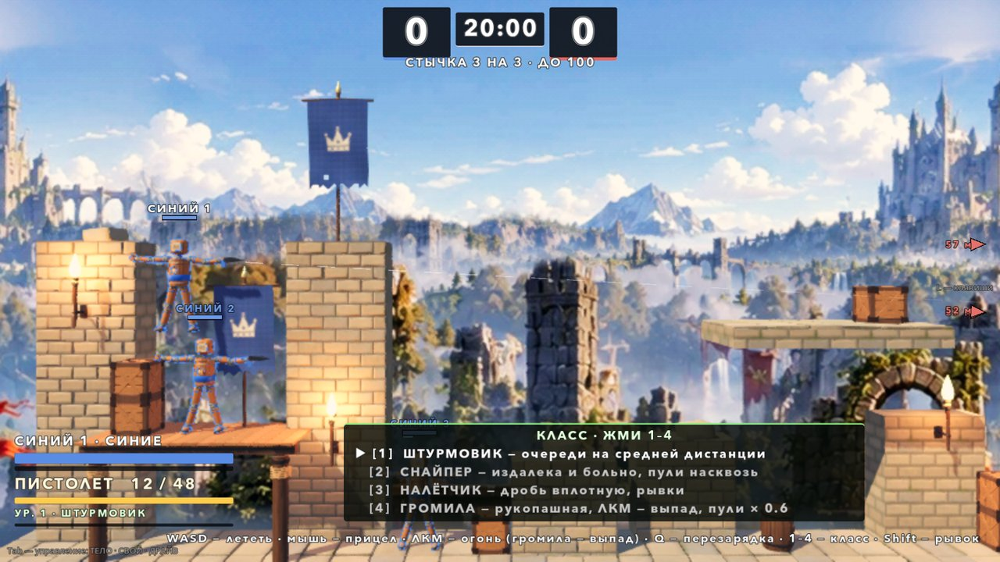
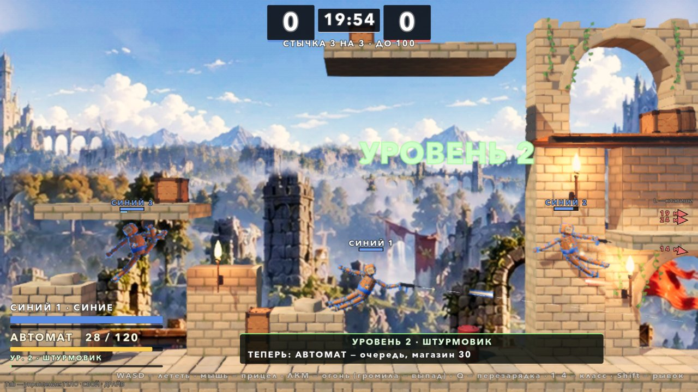
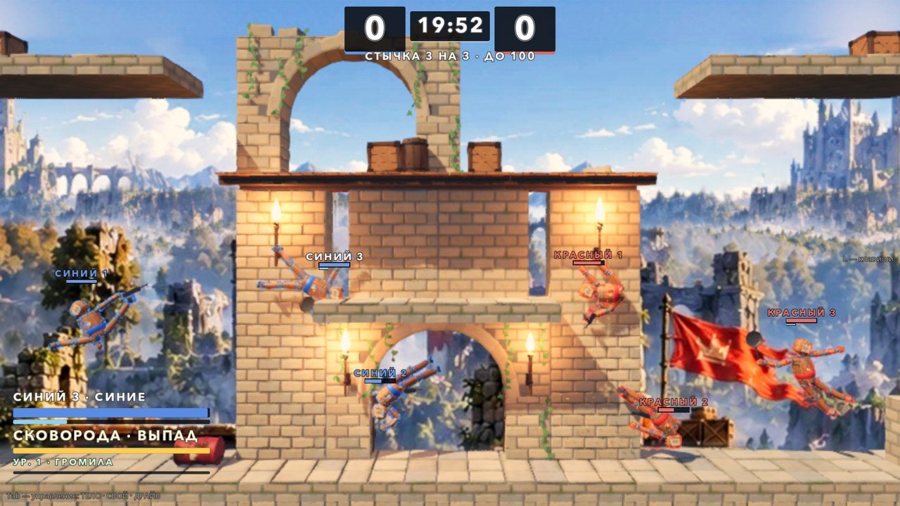
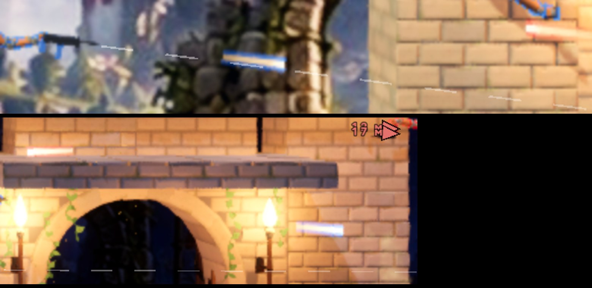
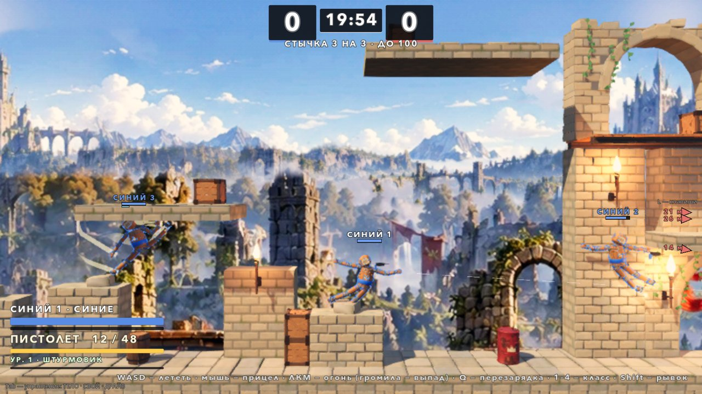
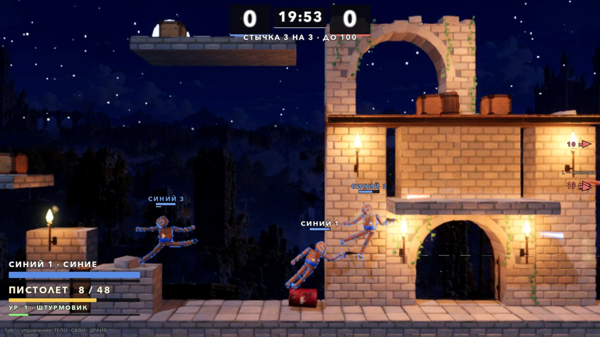
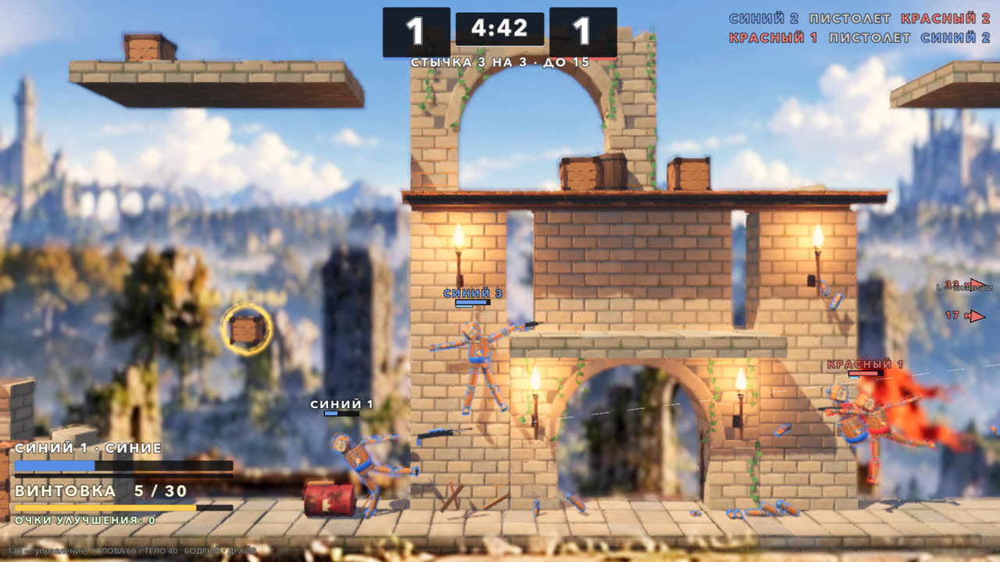
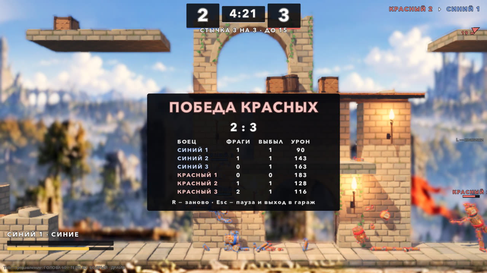

# Стычка 3 на 3: перестрелка на Полигоне (05.10.2026)

Автор 05.10: «можем ли тестово сделать карту побольше и сделать стычки 3 на 3, например, как это бывает в шутерах? При этом дать
какие-то базовые пулемёты, что есть, и попробовать такой режим ещё для игры?»

Второй заход, в тот же день (после пробы руками):

> во-первых, слишком трясётся всё. Во-вторых, давай сделаем так, чтобы из рук стреляло, когда нажимаешь, а рукой можешь управлять
> просто одной, как в обычных режимах. У команды справа левая рука, у левой — правая. + система upgrade и улучшение оружия. И
> количество пуль + перезарядка. Первое оружие у всех пистолет, потом ветка из 3 развитий. Стрелять на одну из активных клавиш, пока
> зажата. Перезарядка и сколько осталось патронов. Между выстрелами минимальная пауза. Закончились пули — в рукопашку. Патроны,
> жизни и броню можно взять в ящиках, которые должны появляться.

Третий заход, 06.10:

> сделай, чтобы рука всегда тянулась за мышкой, без ЛКМ, а огонь — на ЛКМ; сделай ещё карту ночью; снаряды именно как шарики, а не
> линии; и ещё как-то размыто всё выглядит; перезарядка автоматом, когда закончились патроны, и на Q.

Четвёртый заход, 06.10:

> когда идёшь в рукопашку, очень сильно всё трясётся опять же и не прерывается. Давай ещё сделаем как минимум 3 класса бойцов.
> Добавим только рукопашных бойцов как один из классов, и будет улучшаться ему оружие. Фрагов сделаем общих пока 100 прямо. И
> сделаем улучшение за опыт: автоматически выбираешь класс, и там показывает тебе, что ты можешь теперь сделать. Иногда подвисает
> во время битвы — надо тоже разобраться. Пули сделать лучше, шарики как-то детские получаются. Если есть какие-то предложения — тоже
> делай.

Ветка `claude/squad-3v3`, каждый заход влит в `main`.










## Как запустить

- В игре: гараж → **ВСЕ РЕЖИМЫ** → «Стычка 3 на 3: перестрелка на Полигоне» (день) или «Стычка 3 на 3: Полигон ночью».
- Напрямую: `godot --path godot res://scenes/playground_squad.tscn` (ночь — `playground_squad_night.tscn`).

## Правила

Командный бой, как в шутерах:

- Две команды по три бойца. Синие — ты и два бота, красные — три бота.
- Выбыл соперник (пуля, удар, взрыв, падение) — очко твоей команде. Фраг засчитывается тому, кто добил.
- Выбывший возвращается на базу своей команды через 4 с. Первые 1.5 с после возврата урон по нему не проходит.
- Матч идёт **до 100 очков** (общий счёт команды). Если за 20:00 никто не набрал 100, побеждает ведущая команда, при равном
  счёте — ничья. Боты набирают 20 очков за 2.5–3.5 минуты, значит, 100 — это 12–16 минут.
- Свои не ранят и не оглушают: ни пулей, ни ударом, ни своим взрывом. Толкают при этом полностью.
- Крит-кино выключено. Нокаут даёт короткое замедление, и только если в нём участвуешь ты.

## Управление

| Клавиша | Действие |
|---|---|
| WASD | лететь |
| мышь | прицел: рука с оружием всегда тянется к курсору, кнопок держать не надо; ствол смотрит по руке; кольцо у курсора — куда тянется рука |
| ЛКМ (или I) | огонь, пока зажата; у громилы — выпад к курсору |
| Q | перезарядка; пустой магазин перезаряжается сам |
| 1 / 2 / 3 / 4 | класс: штурмовик, снайпер, налётчик, громила (на отсчёте — сразу, в бою — с возврата) |
| Shift | рывок |
| K | уровень ботов 1 → 2 → 3, сразу |
| R | заново |
| Esc | пауза и выход в гараж |

Остальное — как в бою: M (музыка), N (толпа), H (скин HUD), 5–9 (площадки). Цифры 1–4 в стычке заняты классами.

**Рука с оружием** — со стороны соперника на экране: у синих (слева) — рука справа, у красных — слева. Кукла смотрит в камеру,
поэтому анатомически у синих это левая кисть (Hand_L), у красных — правая (Hand_R). Вторая рука — только физика. Геймпад: огонь — X,
перезарядка — Y (не проверено).

От ствола идёт **пунктир прицела** — туда уйдёт пуля. Красный пунктир значит, что патронов в магазине нет или идёт перезарядка.

## Классы и опыт

Четыре класса. Выбор — клавишами 1–4: на отсчёте он применяется сразу, в бою — с возврата на базу. Пока идёт отсчёт или ты ждёшь
возврата, внизу открыта панель «КЛАСС · ЖМИ 1–4». Числа — `Tuning.SQUAD_CLASSES`.

| Класс | HP | Броня при возврате | Особенность | Уровни 1 → 8 |
|---|---|---|---|---|
| Штурмовик | 100 | — | очереди на средней дистанции | пистолет → **автомат** → магазин → темп → **пулемёт** → урон → магазин → урон |
| Снайпер | 90 | — | издалека и больно, пули насквозь | пистолет → **винтовка** → урон → темп → **рельсотрон** → магазин → урон → темп |
| Налётчик | 110 | 20 | дробь вплотную, рывки | пистолет → **обрез** → темп → магазин → **дробовик** → урон → темп → урон |
| Громила | 140 | 30 | рукопашная, ЛКМ — выпад, пули по нему × 0.6 | **сковорода** → **меч** → броня +30 → **топор** → выпад сильнее → **булава** → **молот** → выпад сильнее |

**Опыт** копится сам: 1 за каждый HP урона по соперникам и 40 за фраг. Пороги уровней 2…8 — 60, 160, 300, 480, 700, 960, 1260.
Новый уровень сразу даёт то, что записано у класса. Внизу на 3.5 с появляется карточка «УРОВЕНЬ 2 · ШТУРМОВИК / ТЕПЕРЬ: АВТОМАТ —
очередь, магазин 30», в центре — надпись «УРОВЕНЬ 2». Выбирать ничего не нужно.

- Опыт и уровень переживают выбывание и смену класса: уровень переносится в новый класс.
- «Заново» сбрасывает всё.
- Под HP в HUD — полоска опыта до следующего уровня и строка «УР. 3 · СНАЙПЕР».

**Громила.** В руке настоящее оружие игры: сковорода, меч, топор, булава, молот (`Tuning.WEAPON`). Оно бьёт физикой через
`DollCombat`, как в обычном бою. Рука тянется к курсору, поэтому махи мышью бьют.

- **Выпад** (ЛКМ) толкает торс к курсору с Δv 7.5 м/с, а кисть с оружием — сильнее, ×1.8. Пауза между выпадами 0.9 с.
- Усиление «выпад сильнее» даёт ×1.25 к силе и к частоте.
- Пуль громила не боится так, как стрелки: урон от пуль ×0.6, плюс 140 HP и 30 брони при каждом возврате. Без этого его
  расстреливали на подходе: 1–3 фрага при 9–10 выбываниях.
- В HUD вместо патронов — «СКОВОРОДА · ВЫПАД» с полоской готовности выпада.

**Боты:** составы зеркальные, по месту в команде — штурмовик, снайпер, громила (`SQUAD_BOT_CLASSES`). С налётчиком вместо
снайпера красные проигрывали все матчи 14–19 : 30. Если снайпер стоял на другой высоте, проигрывали уже синие, 21–23 : 30.

## Оружие

Числа — `Tuning.SQUAD_WEAPONS`.

| Оружие | Класс, уровень | Урон | Пауза между выстрелами | Магазин / запас | Перезарядка | Разброс | Дальность | Скорость пули |
|---|---|---|---|---|---|---|---|---|
| Пистолет | стрелки, 1 | 9 | 0.28 с | 12 / 48 | 1.1 с | ±1.5° | 18 м | 40 м/с |
| Автомат | штурмовик, 2 | 5 | 0.09 с | 30 / 120 | 1.5 с | ±4° | 16 м | 46 м/с |
| Пулемёт | штурмовик, 5 | 6 | 0.075 с | 70 / 210 | 2.6 с | ±3.5° | 20 м | 50 м/с |
| Обрез | налётчик, 2 | 5 × 7 | 0.45 с | 2 / 24 | 1.4 с | ±11° | 9 м | 34 м/с |
| Дробовик | налётчик, 5 | 5.5 × 8 | 0.65 с | 6 / 30 | 2.0 с | ±8° | 12 м | 38 м/с |
| Винтовка | снайпер, 2 | 26 | 0.75 с | 6 / 30 | 1.8 с | ±0.4° | 32 м | 80 м/с |
| Рельсотрон | снайпер, 5 | 48, насквозь до 3 бойцов | 1.3 с | 3 / 15 | 2.4 с | 0° | 45 м | 130 м/с |

Усиления: урон +20 %, магазин и запас +50 %, перезарядка и темп +25 %. Складываются умножением.

**Пули — светящиеся трассеры**, не мгновенные лучи. Каждая летит со скоростью своего оружия, её видно и от неё можно увернуться.
Каждый тик пуля проверяет свой отрезок пути лучом и гаснет, пройдя дальность.

Как ведёт себя оружие:

- **Пустой магазин** — перезарядка начинается сама со следующего тика. Клавишей Q можно перезарядиться раньше.
- **Нет ни магазина, ни запаса** — спуск молчит, на HUD надпись «ПАТРОНОВ НЕТ — РУКОПАШНАЯ». Бот в этом случае ищет ящик
  с патронами, а если его нет — идёт бить телом.
- **Пуля толкает** то, во что попала. Обрез и рельсотрон отбрасывают сильно, у стрелка — отдача в кисть.
- **Пуля ломает пропсы:** ящики ломаются, взрывные бочки загораются.
- **Модели стволов собраны из простых форм** — своих моделей оружия в игре нет. Ствол в цвете команды.

### «Шарики как-то детские» — трассеры

Раньше пуля была светящейся сферой. Теперь это трассер (`SquadGun.STREAK_SHADER`): плоская полоса вдоль полёта.

- **Голова** — белое горячее ядро с оттенком оружия.
- **Ореол** — цвета команды: синий или красный, так видно, чья пуля.
- **Хвост** гаснет назад.

Размеры и вид:
- Длина хвоста — от 0.4 м у дроби до 2.7 м у рельсотрона, но не больше пройденного пути: у дула хвост не торчит сквозь ствол.
- Толщина — от 16 см у дроби до 42 см у рельсотрона, из них ядро — около трети.
- Смешение цветов обычное, а не сложение, и днём яркость около 1. Первая версия складывала цвета и пересвечивала: на светлом камне
  трассер выбеливался в бледную нитку. Ночью яркость вдвое выше, и трассеры светятся.

Тонкий белый пунктир на кадрах — это линия прицела от ствола, а не пули.

### Ящики снабжения и броня

- Каждые 6 с на одной из 13 точек карты появляется ящик. Точки — над укрытиями и плитами, у середины, у баз. На карте
  одновременно не больше 5 ящиков, каждый живёт 40 с.
- **Виды:**
  - патроны (жёлтые) — +60 % полного запаса; громиле не нужны;
  - жизни (зелёные) — +40 HP;
  - броня (голубая) — +50, не выше 100.
- Ящик берётся касанием любой детали. Если запас и так полный, ящик остаётся на месте.
- **Броня:** пока она есть, любой входящий урон уменьшается вдвое, а вторая половина снимается с брони. Она видна полоской
  под HP — у тебя в HUD и над головой у каждого бойца.

## «В рукопашке всё трясётся и не прерывается» — что было и что сделано

В третьем заходе пуля перестала трясти камеру, но удары телом и оружием по-прежнему шли через общий `Match.on_hit`:
- тряска камеры;
- стоп-кадр;
- микрозамедление времени;
- наезд камеры ДРАЙВА;
- эффекты удара.

С ДРАЙВОМ (он включён у автора) тряска ×2.5 и стоп-кадр на каждом ударе от 2.5 HP. В рукопашке удары идут один за другим: тело
касается тела каждые несколько тиков. Камера и время дёргались без перерыва, пока бойцы сцеплены.

Теперь у стычки свой `on_hit`:
- остаются урон, статистика, «Заряд», цифры урона над головой и звук удара;
- нет стоп-кадров, замедлений, наезда камеры и эффектов удара;
- камеру чуть трясёт (×0.5) только удар не слабее 14 HP, в котором участвуешь ты;
- удары о стену и пол без урона дают эффекты только тебе.

Проба: за матч ботов 196–279 ударов телом и оружием — 0 эффектов удара, 0 тиков замедления, 0 тряски.

## «Иногда подвисает во время битвы» — что нашлось

Проба подвисаний `squad_perf_probe` идёт в окне. У каждого кадра она записывает реальное время, у событий — кадр, в котором они
случились: нокаут, возврат, новый уровень, ящик, взрыв, обломки, стоп-кадр или замедление.

1. **Стоп-кадры и замедления от ударов** — главное, что выглядело как подвисание. С ДРАЙВОМ каждый удар телом останавливал время
   на несколько кадров, плюс микрозамедления. Теперь их в стычке нет: в матчах ботов 0 тиков замедления.
2. **Первая загрузка модели посреди боя.** Сковорода, меч, топор, булава, молот и ящик снабжения читались с диска в момент, когда
   впервые были нужны, — например, на новом уровне громилы. Теперь матч загружает их заранее, на загрузке сцены
   (`SquadMatch._prewarm`).
3. **Одиночный кадр в 1 с** был в самом первом прогоне в окне. В последующих за 270 с боя он не повторился. Скорее всего,
   это первая сборка шейдеров: драйвер её кэширует.

Замер 06.10, бой ботов в окне 1600 × 900, 120 с, после правок:
- медиана кадра 14.1 мс, 95 % — 18.0 мс, 99 % — 24.2 мс, худший — 59.5 мс;
- кадров дольше 50 мс — 1, дольше 100 мс — 0;
- в замедлении игра провела 0.07 с реального времени;
- 13 нокаутов, 12 возвратов (сборка куклы — 260 новых узлов за кадр), 23 новых уровня — ни один не совпал с длинным кадром.

Если у автора подвисает всё равно: это может быть авто-масштаб рендера (он меняет разрешение на лету — проба пишет это событием
`render_scale`) или СТАЗИС. Нужна запись кадров с его машины: `squad_perf_probe` с `seconds=120`.

## «Как-то размыто всё» — что было и что сделано

- У камеры Руин глубина резкости: всё дальше 24 м размыто. На этой карте камера отъезжает до 22 м, и размытым был почти весь фон.
  У Полигона теперь своя камера без глубины резкости.
- Туман Руин с «воздушной перспективой» затягивал дальние планы молочной дымкой. Днём дымка вдвое слабее.
- Ближний слой фона — нарисованная размытой полоса травы перед бойцами внизу кадра. В стычке он спрятан.
- **Масштаб рендера** — это общая настройка игры («Качество графики»), стычка её не трогает. При «высоком» качестве игра рисует
  3D не больше чем 3.7 Мп, а при включённом авто-масштабе ещё и снижает разрешение, если кадров меньше 60. На большом окне картинка
  растягивается и мылится. Если всё ещё мутно: ВСЕ РЕЖИМЫ → «Качество графики: ультра» (без потолка пикселей), Shift+F9 —
  выключить авто-масштаб.

## Ночная карта

`proving_ground_night.tscn` — тот же Полигон ночью:
- **Небо и свет:** тёмно-синее небо, луна (слабый холодный свет с тенями), синий окружающий свет — бойцов видно.
- **Свечение сильнее:** светятся трассеры, факелы, фонари и кольца ящиков.
- **Фонари** (`Lamps`, 14 штук): у баз — цвета команд, у башни — тёплые, над парящими плитами — холодные.
- **Фон** — те же нарисованные слои Руин. Скрипт карты (`ProvingGround.night`) затемняет их в лунный синий и вешает на небо
  звёзды и луну.

## «Слишком трясётся» (второй заход) — пули

Каждое попадание пули шло тем же путём, что удар телом (`Match.on_hit`): тряска камеры, толчок кадра, микрозамедление времени и
эффекты удара. Шесть стволов били по 10 раз в секунду, и камера с временем дёргались почти непрерывно.

Теперь у пули свой путь урона (`SquadMatch.bullet_hit`): урон, статистика, искры у попадания и тихий звук. Ни камеры, ни
стоп-кадров, ни замедлений. Камера тоже стала спокойнее: в кадре игрок и только один ближайший соперник в 10 м.

## Боты

`SquadBrain` работает на каркасе `EnemyBrain`: восприятие с задержкой, упреждение, ошибка прицела, плавный ввод.

| Состояние | Что делает бот |
|---|---|
| Переход | идёт к ближайшему сопернику на своей «полке» высоты |
| Бой | держит дистанцию своего оружия (дробовик — 3–6.5 м, винтовка — 10–18 м, `SQUAD_BOT_RANGE`) со своей стороны от цели, ходит вверх-вниз; с дробью сближается рывком; стреляет, когда ствол в конусе от цели и на линии огня нет своих |
| Драка (громила) | идёт к цели, дальше 6 м — рывком, ближе 5 м — выпад |
| Перезарядка | отходит подальше |
| Ящик | без патронов — к любому ящику с патронами; мало жизней или запаса, нет брони — к нужному ящику ближе 16 м; по дороге стреляет. Не дошёл за 6 с — бросает этот ящик на 15 с |
| Наскок | цель ближе 2.2 м или патронов нет совсем — бьёт телом |

**Застревание:** если бот 5 с топчется в круге 1.5 м, он по очереди пробует выходы вверх, в стороны, вниз. Нижняя точка
возрождения у базы перенесена из-под настила на сам настил: из-под него боты подолгу не могли выбраться.

Уровни 1–3 (`Tuning.SQUAD_BOT_LEVELS`) отличаются тягой, ошибкой прицела, задержкой восприятия и конусом выстрела.

## Устройство

| Что | Где |
|---|---|
| Матч: команды, счёт, фраги, возврат, классы и опыт, броня, ящики, урон пули и удара без эффектов, звук, осанка, заранее загруженные модели | `godot/scripts/squad/squad_match.gd` (`SquadMatch extends Match`) |
| Оружие: магазин, запас, темп, перезарядка, дробь, пробитие, модель, трассеры | `godot/scripts/squad/squad_gun.gd` (`SquadGun`) |
| Рукопашное оружие громилы и выпад | `godot/scripts/squad/squad_melee.gd` (`SquadMelee`) |
| Ящик снабжения | `godot/scripts/squad/supply_crate.gd` (`SupplyCrate`) |
| Бот | `godot/scripts/squad/squad_brain.gd` (`SquadBrain extends EnemyBrain`) |
| Рука (у ботов без колец) | `godot/scripts/squad/squad_arm.gd` (`SquadArm extends ArmAssist`) |
| Площадка: бойцы, огонь, выпад и перезарядка игрока, классы 1–4, камера | `godot/scenes/squad/playground_squad.gd`, сцена `godot/scenes/playground_squad.tscn` |
| HUD: счёт, лента, метки над головой, панель игрока, выбор класса, карточка уровня, итоги | `godot/scenes/squad/squad_hud.gd` (`SquadHud`) |
| Карта, точки ящиков, ночное небо | `godot/scenes/arena/proving_ground.gd` (`ProvingGround extends RuinsArena`), сцены `proving_ground.tscn`, `proving_ground_night.tscn` |
| Сборщик обеих карт | `godot/tools/build_proving_ground.gd` (запуск сценой `build_proving_ground.tscn`) |
| Ночная площадка | `godot/scenes/playground_squad_night.tscn` (та же площадка с ночной картой) |
| Числа | `godot/scripts/tuning.gd`, блок «СТЫЧКА 3 НА 3»: `SQUAD_*` |

**Тело.** У обеих команд одно тело — «Человек»; команды различают рубашка, обводка и имена цветом команды. С «Черепом» у красных
красные выигрывали 15:9, а если поменять тела местами — уже синие, 15:12. **Корпус** у всех бойцов держится вертикально
(`SQUAD_UPRIGHT`): в зависании он заваливался на 40–70°, и рука не доставала целей над головой.

**Узлы бойца пересоздаются при возврате.** `Match.respawn_doll` создаёт детей-скриптов заново через `script.new()`, и экспорты
теряются. Поэтому `SquadGun` и `SquadMelee` берут оружие и усиления у матча (`SquadMatch.kit`), а не из своих полей.

Пересборка карты после правки сборщика:

```bash
godot --headless --path godot --import
godot --headless --path godot res://tools/build_proving_ground.tscn
```

### Правки в общих файлах

- `scenes/doll/doll.gd` — `incoming_mult`, множитель всего входящего урона и стана в `team_mult_for`: через него проходят
  `take_damage` и удары `DollCombat`. По умолчанию 1. Стычка ставит 0.5, пока у бойца есть броня.
- `scenes/weapons/weapon_pickup.gd` — **исправление для всех режимов.** Если оружие освободили, пока у подбора шла пауза,
  `WeaponPickup` ловил ошибку скрипта «previously freed instance», и функция обрывалась. Теперь он сначала проверяет, живо ли
  оружие.
- `scenes/props/explosion.gd` (первый заход, уже в `main`) — **исправление для всех режимов.** Взрыв по своей команде отдаёт в
  `Match.on_hit` и статистику урон, который реально снят, а стан × множитель команды.
- `scenes/menu/test_menu.gd` — пункты во «ВСЕ РЕЖИМЫ»; `locale/en.json` — переводы; `tests/i18n_layout_probe.gd` — экраны стычки и
  её итогов в пробе вёрстки.

## Проверки

```bash
godot --headless --path godot --fixed-fps 60 res://tests/squad_probe.tscn                      # 65 проверок: прицел, правила, ночь, матч ботов
godot --headless --path godot --fixed-fps 60 res://tests/squad_probe.tscn -- "only=bots,level=3,trace=1"   # матч ботов с печатью состояний
godot --headless --path godot --fixed-fps 60 res://tests/squad_probe.tscn -- "only=aim+rules"             # несколько разделов через «+»
godot/tools/godot_nofocus.sh --path godot --resolution 1600x900 res://tests/squad_snapshot.tscn -- "out_dir=/abs/dir,night=1"   # кадры и клип (окно)
godot/tools/godot_nofocus.sh --path godot --resolution 1600x900 res://tests/squad_perf_probe.tscn -- "seconds=120"           # подвисания (окно)
```

Проба 06.10, четвёртый заход: 65 из 65 на уровне ботов 2, матч ботов на уровнях 1 и 3 — тоже без провалов. Exit 0, ошибок
скриптов 0.

**aim** — рука своей стороны наводит ствол на цель в пяти направлениях к сопернику (±60°). Медиана 5.5–5.6°, худший 7.3°, у обеих
команд одинаково.

**rules:**
- 6 бойцов, классы по местам. У стрелков одна рука своей стороны и пистолет 12 / 48, у громил — сковорода в той же руке.
  Громила — 140 HP и броня 30, снайпер — 90 HP.
- Свои не ранят ни ударом, ни пулей. Ни пуля, ни удары телом не дают эффектов удара и замедлений. Тряска — только от сильного
  удара с игроком (1 из 3 случаев в пробе: бот × бот, слабый с игроком, сильный с игроком).
- Пули — трассеры: квад с шейдером трассера, за тик 0.67 м (40 м/с у пистолета), гаснут после дальности.
- Пистолет: 4 выстрела за 1 с, зазор 17 тиков. Пустой магазин — перезарядка сама через 1 тик, длится 1.10 с; клавишей — тоже.
  Без патронов спуск молчит.
- Опыт +9 за 9 урона. Громила 3-го уровня — меч, броня 30 → 60. Выпад — Δv 7.5 м/с к цели, второй сразу не проходит.
- Уровень переживает возврат (5-й уровень — пулемёт 105 / 105). Смена класса в бою — с возврата: громила 5-го уровня с топором.
- Броня: урон 20 при броне 50 — HP −10, броня 40; кончилась — урон снова полный.
- Ящики: патроны, жизни, броня берутся касанием; с полным запасом ящик остаётся; ящики появляются сами.
- Нокаут — очко, фраг и 40 опыта, возврат на базу со щитом. Падение — очко сопернику. Конец по очкам и по времени, «заново»
  сбрасывает всё.

**night:**
- окружающий свет 0.55, луна 0.55 и голубая, свечение включено, фонарей 14;
- фон затемнён, на небе звёзды и луна;
- у обеих карт нет глубины резкости;
- 20 с боя ботов ночью: пули летят и попадают.

**bots** — матч ботов 3 на 3 до 20 очков (`score=20`, быстрее; в игре 100):

| Уровень ботов | Счёт | Длительность | Фрагов | Попаданий пулями | Ударов в рукопашной | Новых уровней | Дольше всего на месте |
|---|---|---|---|---|---|---|---|
| 1 | 18 : 20 | 195 с | 38 | 392 | 279 | 31 | 16.9 с |
| 2 | 20 : 19 | 161 с | 39 | 422 | 196 | 30 | 10.7 с |
| 3 | 11 : 20 | 152 с | 31 | 427 | 261 | 27 | 9.6 с |

- Урона по своим 0, вне границ карты никто не был.
- Тиков замедления 0, тряски от ударов 0, эффектов удара на попадания пулями 0.
- К концу матча снайперы на 8-м уровне с рельсотроном, штурмовики — с автоматом или пулемётом, громилы — с топором.

**Те же пробы после правок общих файлов** — все зелёные, ошибок скриптов 0:
- `run_combat_gate.sh`;
- `active_blocks_probe`, `part_hp_probe`;
- `menu_probe`;
- `i18n_probe`, `i18n_scenes_probe`, `i18n_layout_probe`.

Headless-пробы шли на управлении по умолчанию (`user://control_feel.cfg` они не читают). Кадры в окне — на настройках автора
с ДРАЙВОМ.

## Что не проверено и что решать автору

- **Руками не проверено.** Числами доказано, что всё работает и боты доигрывают матч. Удобно ли бить выпадом и махами мышью — только
  руками.
- **Баланс классов:**
  - **снайпер сильнее всех.** Во всех матчах ботов лучший по фрагам — снайпер: 12–13 фрагов при 2–6 выбываниях.
  - **громила слабее всех.** 0–6 фрагов при 5–7 выбываниях.

  Ручки: урон винтовки и рельсотрона (26 / 48), `bullet_mult` громилы (0.6), сила и пауза выпада (`SQUAD_LUNGE_*`). Бот-громила
  ещё и прямолинеен: идёт к цели напрямую, без укрытий. Человек с мышью, скорее всего, сыграет им лучше.
- **Темп до 100:** матч ботов до 20 идёт 2.5–3.5 минуты, до 100 — около 12–16 минут, лимит времени 20 минут. Если долго —
  `SQUAD_SCORE_TO_WIN`.
- **Опыт:** 8-й уровень снайпер берёт за 2.5 минуты. Если открывается слишком быстро для матча до 100, нужно поднять пороги
  `SQUAD_XP_LEVELS`.
- **Звука оружия своего нет.** Сейчас это слои SfxDirector с разным питчем. Нужны настоящие звуки.
- **Модели стволов простые**, из коробок и цилиндров. Нужны свои — по листам автора, как кит.
- **Второго игрока нет** (P2 на стрелках). N0 стычку не комментирует.
- **Не проверено:** геймпад P1 (огонь и выпад — X, перезарядка — Y; рука ведётся мышью); СТАЗИС вместе со стычкой.

### Предложения на следующий заход

1. **Классы ботов под счёт.** Проигрывающая команда меняет класс одного бота (например, на налётчика против снайперов), как
   делают люди в шутерах.
2. **Режим «Захват точки»** на той же карте: очки за удержание середины. Громиле там есть что делать, а снайперу у базы — нет.
3. **Добивание громилой:** выпад по оглушённому — двойной урон. У класса появится своя роль, а не только «крепкий».
4. **Убийственная серия:** 3 фрага без выбывания — короткая метка над головой и +50 % опыта за этого бойца.
