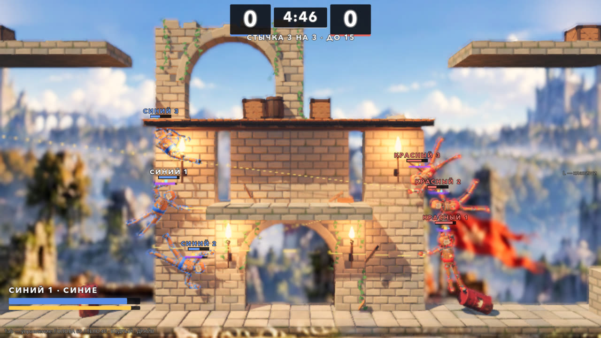
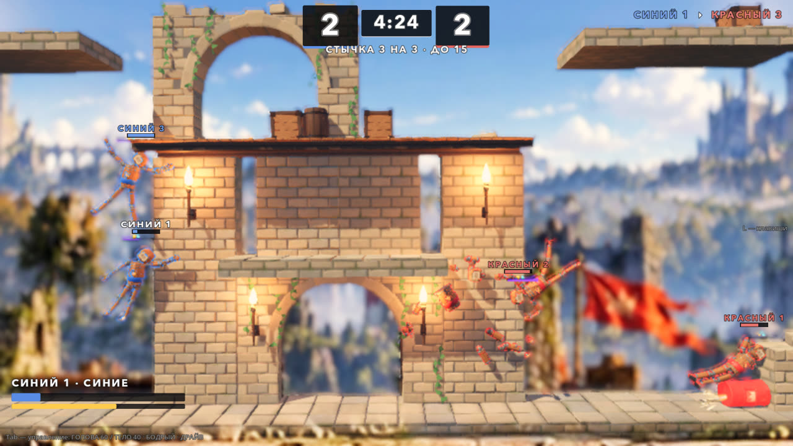

# Стычка 3 на 3: пулемёты на Полигоне (05.10.2026)

Автор 05.10: «можем ли тестово сделать карту побольше и сделать стычки 3 на 3, например, как это бывает в шутерах? При этом дать
какие-то базовые пулемёты, что есть, и попробовать такой режим ещё для игры?»

Сделано как проба. Ветка `claude/squad-3v3` от `main` 3dbafd1, worktree `.claude/worktrees/squad-3v3`.





## Как запустить

- В игре: гараж → **ВСЕ РЕЖИМЫ** → «Стычка 3 на 3: пулемёты на Полигоне».
- Напрямую: `godot --path godot res://scenes/playground_squad.tscn`.

## Правила

Командный бой, как в шутерах:

- Две команды по три бойца. Синие — ты и два бота, красные — три бота.
- Выбыл соперник (пуля, удар телом, взрыв, падение) — очко твоей команде. Фраг засчитывается тому, кто добил.
- Выбывший возвращается на базу своей команды через 4 с. Первые 1.5 с после возврата урон по нему не проходит.
- Матч идёт до 15 очков. Если за 5:00 никто не набрал 15, побеждает ведущая команда, при равном счёте — ничья.
- Свои не ранят и не оглушают: ни пулей, ни ударом, ни своим взрывом. Толкают при этом полностью.
- Крит-кино выключено, нокаут даёт короткое замедление, и только если в нём участвуешь ты. Иначе 30 нокаутов за матч превратились бы
  в 30 роликов.

## Управление

| Клавиша | Действие |
|---|---|
| WASD | лететь, как в обычном бою |
| мышь | прицел: обе руки всегда смотрят на курсор |
| ЛКМ или I | огонь: стреляет ствол, который смотрит на курсор |
| Shift | рывок |
| K | уровень ботов 1 → 2 → 3, сразу |
| R | заново |
| Esc | пауза и выход в гараж |

Остальное — как в бою: M (музыка), N (толпа), H (скин HUD), 1–9 (площадки).

## Пулемёт

Это готовый активный блок «Пулемёт» (`kit_active_gun`, `ACTIVE_BLOCKS.md`): луч-очередь вдоль конечности.

- Пулемёт стоит на **обоих предплечьях**: правое — канал 1, левое — канал 2. Почему так, объяснено ниже в разделе «Прицел».
- Заряд блока служит патронами: 2 заряда за выстрел, запас 100, восстановление 10/с. Непрерывной очереди хватает примерно на 5 с.
  Полоска заряда — над бойцом и в HUD слева снизу (жёлтая).
- Пули рвут ящики и поджигают взрывные бочки. Это только в стычке, в остальных режимах пули пропсы лишь толкают.

| | Обычный бой (DEFS) | Стычка (`Tuning.SQUAD_GUN`) |
|---|---|---|
| Выстрелов в секунду | 12 | 10 |
| Урон за попадание | 1.5 HP | 2.5 HP |
| Дальность | 14 м | 22 м |
| Разброс | ±3° | ±2.5° |
| Толчок / отдача | 5 / 2.5 Н·с | 4 / 2 Н·с |
| Восстановление заряда | 4/с | 10/с |

Числа стычки накладываются на копию описания блока у каждого бойца. Общие `ActiveBlocks.DEFS` не меняются.

### Прицел

Бойцу, стрелку и боту понадобились три вещи, которых в игре не было. Найдено пробой `aim`.

1. **Ствол ложится на цель, а не кисть.** `ArmAssist` тянет к цели кисть, а пулемёт стреляет вдоль предплечья. Поэтому ось уходила на
   9–14° мимо. `GunAim` поворачивает цель руки вокруг плеча на угол между линией «плечо → кисть» и осью ствола.
2. **Корпус держится вертикально.** В зависании торс заваливался на 40–70°, и плечо не доставало до целей над головой: «вверх» —
   80–160° мимо. В стычке у всех бойцов работает мягкая осанка (`Tuning.SQUAD_UPRIGHT`, тот же PD, что вариант управления с осанкой).
   После удара, в стане и в раскрутке она молчит.
3. **Два ствола.** Правая рука почти не достаёт целей справа от куклы, левая — слева. С одним стволом синие, воюющие вправо, стреляли
   втрое реже красных и проигрывали 2:15. Теперь лучший из двух стволов в любом из 8 направлений смотрит на цель с ошибкой 1–19°
   (медиана 6.5°).

## Карта «Полигон»

64 × 16 м — вдвое шире Руин, из тех же компонентов. Карта зеркальная.

- **Базы** у стен: палуба на столбах, башни, знамя цвета команды, по три точки возврата (земля, палуба, земля ближе к центру).
- **Укрытия** — стены в плоскости боя, утопленные в землю. Дальнее закрывает до груди, ближнее (у центра) — так, что видна голова.
- **Парящие плиты:**
  - между укрытиями, верх на 4.8 м;
  - над серединой, верх на 9 м.
- **Центр:** башня Руин — ворота, каменный мост (верх 4 м), верхняя площадка (6.65 м).
- **Пропсы:** ящики и бочки по всей карте, две взрывные бочки Свалки у середины.

Ям нет: это карта для перестрелки, а не для выталкивания. Камера ведёт игрока и до двух ближайших соперников в 12 м. Масштаб камеры
на время сцены — 1 (на ближнем масштабе соперники всё время за кадром). Соперник за кадром — стрелка у края экрана с метрами.

## Боты

`SquadBrain` работает на каркасе `EnemyBrain`: восприятие с задержкой, упреждение, ошибка прицела, плавный ввод, выход из застревания.

| Состояние | Что делает бот |
|---|---|
| Переход | идёт к ближайшему сопернику на своей «полке» высоты (у трёх ботов команды они разные) |
| Бой | держит 6–12 м до цели и ходит вверх-вниз; обе руки на упреждённой цели; стреляет ствол, чья ось в конусе от цели (уровень 2 — 10°), если на линии огня нет своих (луч от дула) |
| Перезарядка | заряд ниже 8 — отходит, пока не накопит 45 |
| Наскок | цель ближе 2.2 м — бьёт телом с рывком, как в обычном бою |

Уровни 1–3 (`Tuning.SQUAD_BOT_LEVELS`) отличаются тягой, ошибкой прицела, задержкой восприятия и конусом выстрела.

## Устройство

| Что | Где |
|---|---|
| Матч: команды, счёт, фраги, возврат на базу, осанка, звук выстрела, итоги | `godot/scripts/squad/squad_match.gd` (`SquadMatch extends Match`) |
| Бот | `godot/scripts/squad/squad_brain.gd` (`SquadBrain extends EnemyBrain`) |
| Доводка прицела ствола | `godot/scripts/squad/gun_aim.gd` (`GunAim`) |
| Руки (правая без колец-подсказок, левая — Hand_L) | `godot/scripts/squad/squad_arm.gd`, `squad_arm_left.gd` |
| Площадка: бойцы, прицел и огонь игрока, камера, клавиши | `godot/scenes/squad/playground_squad.gd`, сцена `godot/scenes/playground_squad.tscn` |
| HUD | `godot/scenes/squad/squad_hud.gd` (`SquadHud`) |
| Карта | `godot/scenes/arena/proving_ground.gd` (`ProvingGround extends RuinsArena`), сцена `proving_ground.tscn` |
| Сборщик карты | `godot/tools/build_proving_ground.gd` (запуск сценой `build_proving_ground.tscn`) |
| Числа | `godot/scripts/tuning.gd`, блок «СТЫЧКА 3 НА 3»: `SQUAD_*` |

HUD свой, а не боевой: боевой рассчитан на 2–4 большие панели игроков, шесть закрыли бы карту. Что в нём:

- счёт команд и часы сверху;
- лента фрагов справа сверху;
- полоски HP и имена над бойцами (ТЫ, СИНИЙ 2, КРАСНЫЙ 1…);
- твои HP и заряд слева снизу;
- «ВОЗВРАТ ЧЕРЕЗ N», пока ты выбыл;
- табличка итогов: победитель, счёт, фраги, выбывания и урон каждого бойца.

Тело у обеих команд одно — «Человек». Команды различают рубашка, обводка и имена цветом команды. С «Черепом» у красных
красные стреляли вдвое чаще и выигрывали 15:9; если поменять тела местами, выигрывали уже синие, 15:12.

Пересборка карты после правки сборщика:

```bash
godot --headless --path godot --import
godot --headless --path godot res://tools/build_proving_ground.tscn
```

### Правки в общих файлах

- `scripts/active/active_rig.gd` — два флага, по умолчанию выключены, остальные режимы не меняются:
  - `manual`: каналы человека жмёт площадка через `held[]`;
  - `bullets_break_props`: пуля ранит `Breakable`.
- `scenes/props/explosion.gd` — **исправление для всех режимов.** Раньше взрыв отдавал в `Match.on_hit` и статистику номинальный урон,
  даже когда жертве из своей команды урон не прошёл (`team_damage_mult` 0), и оглушал своих. Теперь в отчёт и статистику идёт урон,
  который реально снят, а стан × множитель команды, как у `DollCombat`. Затрагивает и PvE: враги, взорвавшие бочку рядом со своими,
  своих больше не оглушают.
- `scenes/menu/test_menu.gd` — пункт во «ВСЕ РЕЖИМЫ».
- `locale/en.json` — переводы.
- `tests/i18n_layout_probe.gd` — экраны стычки и итогов добавлены в пробу вёрстки.

## Проверки

```bash
godot --headless --path godot --fixed-fps 60 res://tests/squad_probe.tscn                      # 32 проверки: прицел, правила, матч ботов
godot --headless --path godot --fixed-fps 60 res://tests/squad_probe.tscn -- "only=bots,level=3,trace=1"   # матч ботов с печатью состояний
godot/tools/godot_nofocus.sh --path godot --resolution 1600x900 res://tests/squad_snapshot.tscn -- "out_dir=/abs/dir"   # кадры и клип (окно)
```

Проба 05.10 (ветка `claude/squad-3v3`, язык ru) — 32 из 32, exit 0, ошибок скриптов 0. Разделы:

- **aim:** лучший ствол в 8 направлениях — медиана 6.4–6.6°, худший 18.6°; у бойцов обеих команд одинаково.
- **rules:**
  - 6 бойцов, команды 3 / 3, по стволу на каждом предплечье со своей рукой;
  - свои не ранят ни ударом, ни пулей;
  - нокаут — очко и фраг, возврат на базу со щитом; руки, мозг и стволы после возврата как были;
  - падение — очко сопернику;
  - конец по очкам, конец по времени (ничья и победа ведущего), заново.
- **bots** — матч ботов 3 на 3 до конца:

| Уровень ботов | Счёт | Длительность | Фрагов | Первый фраг | Выстрелов | Урон пулемётом | Сломано пропсов |
|---|---|---|---|---|---|---|---|
| 1 | 14 : 15 | 135 с | 29 | 11.7 с | 3691 | 95 % | 9 из 21 |
| 2 | 14 : 15 | 126 с | 29 | 11.8 с | 3465 | 98 % | 7 из 21 |
| 3 | 14 : 15 | 130 с | 29 | 12.8 с | 2746 | 97 % | 4 из 21 |

Урона по своим 0, вне границ карты никто не был, дольше всего на одном месте бот стоял 12 с. Тик физики headless — 2.6 мс.
В окне 1600 × 900 — 72 кадра/с, худший кадр 17–20 мс, 60 тиков физики в секунду.

Те же пробы после правок общих файлов — все зелёные, ошибок скриптов 0:

- `active_blocks_probe`, `league_brain_probe`;
- `prop_heft_probe`, `scrap_props_probe`;
- `menu_probe` (открывает и новую сцену);
- `i18n_probe`, `i18n_scenes_probe`, `i18n_layout_probe` (en — OK);
- `run_combat_gate.sh`.

Headless-пробы шли на управлении по умолчанию (`user://control_feel.cfg` они не читают). Кадры в окне — на настройках автора
из панели Tab: внизу видна строка «ГОЛОВА 60 / ТЕЛО 40 · БОДРЫЙ · ДРАЙВ». Матч ботов с ДРАЙВОМ числами не проверялся.

## Что не проверено и что решать автору

- **Руками не проверено.** Числами доказано, что режим работает, боты доигрывают ровный матч, а прицел и огонь доходят до цели. Весело
  ли стрелять мышью — только руками. Первые ручки, если не так:
  - `SQUAD_GUN` — урон и темп;
  - `SQUAD_CHARGE_REGEN` — «патроны»;
  - `SQUAD_RESPAWN_S`, `SQUAD_SCORE_TO_WIN`;
  - уровень ботов (K).
- **Пулемёт почти вытеснил рукопашную:** 95–98 % урона — пулями. Если хочется смеси, есть три ручки:
  - урон пули меньше;
  - заряд копится медленнее;
  - урон тела больше вблизи.
- **Второго игрока нет:** P2 на стрелках в стычку не встроен. Можно сделать его напарником или соперником, как в спорт-зале.
- **Пункта в главном меню гаража нет** — режим лежит во «ВСЕ РЕЖИМЫ», как спорт-зал и СТАЗИС.
- **Своего звука выстрела нет.** Сейчас это щелчок слоя `snap` SfxDirector с высоким питчем, громче рядом с камерой. Нужен настоящий
  звук очереди.
- **N0 стычку не комментирует.**
- **Обводка подчиняется общей клавише B:** выключишь — команды различают только рубашка и имена.
- **Не проверено:** геймпад P1 в стычке не целится (прицел — мышь); СТАЗИС и ДРАЙВ вместе со стычкой числами не проверялись
  (ДРАЙВ был включён только на кадрах в окне).
