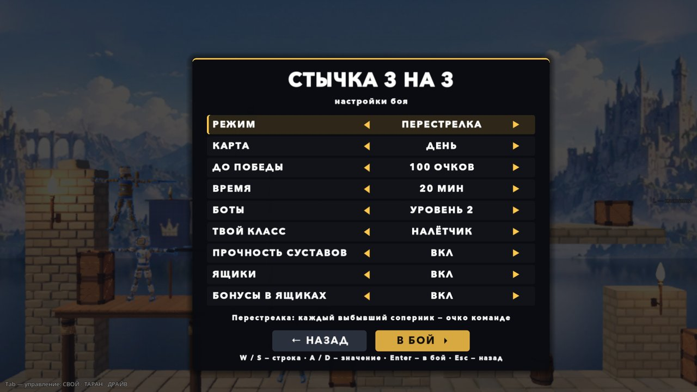
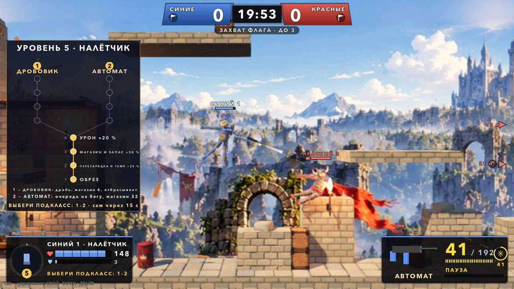
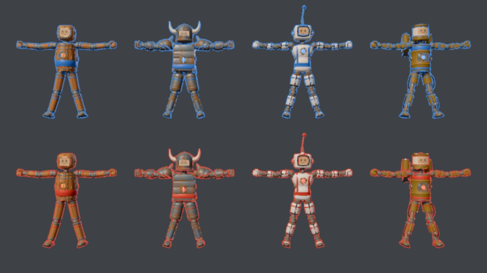
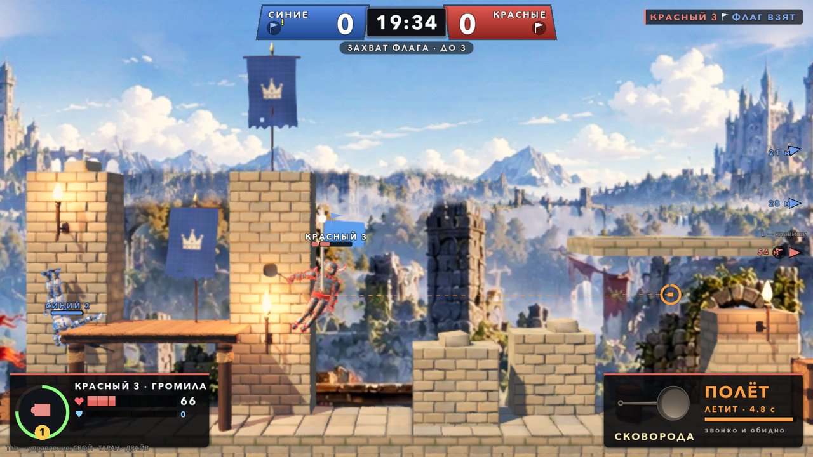

# Стычка 3 на 3: перестрелка и захват флага на Полигоне (05–06.10.2026)

Пробный режим: две команды по три бойца на большой карте, как в командных шутерах. Ветка `claude/squad-3v3`, каждый заход
влит в `main`.

Заходы автора:
1. **05.10.** «Можем ли тестово сделать карту побольше и сделать стычки 3 на 3, как в шутерах? Дать базовые пулемёты».
2. **05.10.** «Слишком трясётся. Из рук стреляло, рука одна; у команды справа левая рука, у левой — правая. Upgrade и улучшение
   оружия, патроны и перезарядка, пауза между выстрелами, без патронов — в рукопашку, ящики с патронами, жизнями и бронёй».
3. **06.10.** «Рука всегда за мышкой, огонь на ЛКМ; карта ночью; снаряды шариками; размыто всё; перезарядка сама и на Q».
4. **06.10.** «В рукопашке всё трясётся; минимум 3 класса, рукопашный — один из них; фрагов 100; улучшение за опыт; иногда
   подвисает; пули лучше».
5. **06.10.** Двенадцать пунктов:
   1. весь HUD красиво, а не просто линии;
   2. выбор персонажей с картинками и древо развития как в Skyrim;
   3. подкласс на 5 уровне;
   4. громила — выбор из трёх оружий, выпад как молот Тора, проверить, чтобы не ваншотил;
   5. стрелка убрать, оставить три класса, налётчику — тоже разветвление;
   6. снайперу зум дальше;
   7. прицел информативнее (жёлтый между выстрелами, длина — докуда достанет);
   8. CTF;
   9. модельки разные по классам и сторонам;
   10. настройки перед боем;
   11. прочность суставов по умолчанию, ящик возвращает руку с оружием;
   12. бонусы вроде зума.









## Как запустить

- В игре: гараж → **ВСЕ РЕЖИМЫ** → «Стычка 3 на 3: перестрелка и захват флага». Сначала открывается экран настроек.
- Напрямую: `godot --path godot res://scenes/playground_squad.tscn` (ночь — `playground_squad_night.tscn`). Без экрана настроек,
  со значениями по умолчанию.

### Настройки перед боем

Экран `SquadSetup` открывается поверх площадки: карта и бойцы видны за затемнением, бой ждёт «В БОЙ». Значения живут в
`SquadSettings` до выхода из игры, поэтому R (заново) их не сбрасывает. O в бою снова открывает экран.

| Строка | Варианты |
|---|---|
| Режим | перестрелка / захват флага |
| Карта | день / ночь (другая карта — сцена загружается заново, сразу в бой) |
| До победы | 25 / 50 / 100 / 150 очков, в захвате — 3 / 5 / 7 флагов |
| Время | 5 / 10 / 20 / 30 минут |
| Боты | уровень 1 / 2 / 3 (в бою — K) |
| Твой класс | громила / снайпер / налётчик (в бою — 1–3) |
| Прочность суставов | вкл (по умолчанию) / выкл |
| Ящики | вкл / выкл |
| Бонусы в ящиках | вкл / выкл |

Клавиши: W/S — строка, A/D — значение, Enter — в бой, Esc — назад в гараж. Мышью — ◀ ▶ и кнопки.

## Режимы

- **Перестрелка.** Каждый выбывший соперник — очко команде.
- **Захват флага.** У каждой базы стоит флаг цвета команды.
  - Чужой флаг берётся касанием.
  - Донёс его до своего флага, пока свой дома, — очко.
  - Несущий выбыл — флаг падает. Свой упавший флаг касанием возвращается домой, сам — через 15 с.
  - Несущий летит медленнее (×0.85). Выбывания очков не дают, но опыт за них идёт.
  - Флаг над головой несущего, флаги на табло (дома / унесён — мигает / лежит), стрелки к флагам за кадром, лента и диктор:
    «НАШ ФЛАГ УНЕСЛИ!», «ФЛАГ ДОСТАВЛЕН!».

Общее для обоих режимов:
- Выбывший возвращается на базу через 4 с, первые 1.5 с неуязвим.
- Конец — по очкам или по времени: побеждает ведущая команда, равный счёт — ничья.
- Свои не ранят.

## Управление

| Клавиша | Действие |
|---|---|
| WASD | лететь |
| мышь | прицел: рука с оружием всегда тянется к курсору |
| ЛКМ (или I) | огонь, пока зажата; гаусс — держи для заряда, отпусти — выстрел; громила — полёт за оружием, пока держишь |
| Q | перезарядка; пустой магазин перезаряжается сам |
| 1 / 2 / 3 | класс: громила, снайпер, налётчик. Пока ждёт выбор подкласса — подкласс |
| Shift | рывок |
| O | экран настроек |
| K | уровень ботов 1 → 2 → 3 |
| R | заново |
| Esc | пауза и выход в гараж |

**Рука с оружием** — со стороны соперника на экране: у синих (слева) — справа, у красных — слева. Анатомически это Hand_L у
синих и Hand_R у красных, потому что кукла смотрит в камеру.

## Классы, опыт, подклассы

Опыт копится сам: 1 за каждый HP урона по соперникам, 40 за фраг, 80 за доставленный флаг, 20 за возвращённый.
- Пороги уровней 2…8: 60, 160, 300, 480, 700, 960, 1260.
- Уровни 1–4 — общий ствол класса.
- На **5 уровне выбирается подкласс** — ветка со своим оружием, её уровни 5–8.
  - Игроку внизу древа показываются ветки с пояснениями и клавишами 1–2(3). Не выбрал за 20 с — берётся первая.
  - Бот выбирает сразу, от матча к матчу по очереди.
- Сменил класс — ветку выбирать заново, уровень сохраняется.

| Класс | HP | Броня при возврате | Особое | Уровни 1–4 | Подклассы (уровень 5 → 8) |
|---|---|---|---|---|---|
| Громила | 140 | 30 | пули по нему × 0.5, полёт за оружием | сковорода → броня +30 → полёт быстрее → запас +20 HP | **молот** (ударная волна) / **меч** (полёт быстрее, пауза вдвое короче) / **топор** (сквозь броню, рубит суставы ×2.5) |
| Снайпер | 90 | — | обзор камеры × 1.4 | винтовка → темп → урон → магазин | **гаусс** (заряд, насквозь) / **снайперка** (быстрее и дальше) |
| Налётчик | 110 | 20 | вплотную | обрез → темп → магазин → урон | **дробовик** (отбрасывает) / **автомат** (очереди на бегу) |

Класс бота задаётся местом в команде. Составы зеркальные: налётчик, снайпер, громила. P1 по умолчанию — налётчик.

**Древо как в Skyrim.** При каждом новом уровне слева появляется древо класса:
- ствол уровней 1–4 идёт снизу вверх, на 5-м — развилка подклассов, их уровни выше;
- открытые узлы горят, новый пульсирует, внизу подпись «ТЕПЕРЬ: …»;
- пока ждёт выбор подкласса, ветки мигают с номерами клавиш, внизу — их пояснения и таймер.

## Оружие

| Оружие | Класс | Урон | Пауза | Магазин / запас | Перезарядка | Дальность | Скорость пули |
|---|---|---|---|---|---|---|---|
| Обрез | налётчик, 1 | 5 × 7 | 0.45 с | 2 / 24 | 1.4 с | 9 м | 34 м/с |
| Дробовик | налётчик, 5 | 5.5 × 8, отброс | 0.65 с | 6 / 30 | 2.0 с | 12 м | 38 м/с |
| Автомат | налётчик, 5 | 6 | 0.08 с | 32 / 128 | 1.5 с | 17 м | 48 м/с |
| Винтовка | снайпер, 1 | 24 | 0.8 с | 5 / 30 | 1.8 с | 32 м | 85 м/с |
| Снайперка | снайпер, 5 | 30 | 0.5 с | 8 / 40 | 1.6 с | 42 м | 140 м/с |
| Гаусс | снайпер, 5 | 15…85 по заряду | 0.9 с | 4 / 16 | 2.6 с | 55 м | 190 м/с |

Усиления складываются умножением: урон +20 %, магазин и запас +50 %, перезарядка и темп +25 %, заряд гаусса ×0.7 по времени.

**Гаусс** (автор: «гаусс бьёт сквозь всех, но каждое препятствие — минус процент урона; мощность — от того, сколько зажато»):
- держишь ЛКМ — копится заряд, полный за 1.6 с; отпустил — выстрел;
- урон от 15 до 85 по заряду, трассер толще;
- пуля проходит сквозь бойцов (каждый — −15 % урона) и сквозь стены и пропсы (каждое — −35 %).

**Громила и полёт** (автор: «выпад как молот Тора — резкое ускорение на 5 секунд в сторону оружия; проверь, чтобы импульс был
нормальный и не ваншотил»):
- ЛКМ зажата — оружие тянет бойца к курсору. Разгон 38 м/с², до 12 м/с; кисть с оружием летит впереди.
- Ведёшь мышью — летит за курсором. Отпустил — полёт кончился. Не дольше 5 с, потом пауза 4 с.
- Клавиши движения жать не нужно: тормоз торса без ввода в полёте выключен.
- **Потолок удара:**
  - удар оружием в полёте — не больше 35 HP, и одного бойца не чаще раза в 0.6 с;
  - мах без полёта — не больше 40 HP;
  - без потолка молот на 12 м/с снимал 60 HP с касания и добивал прижатого за секунду.
- **Своё у каждого оружия:**
  - молот — первый удар в полёте поднимает ударную волну: соседей в 3 м отбрасывает, оглушает на 0.6 с и ранит на 8;
  - меч — полёт ×1.2 быстрее, пауза вдвое короче;
  - топор — броня не гасит его урон, износ суставов от него ×2.5.

## Прицел

У курсора — кольцо прицела:
- **деления** — патроны в магазине;
- **цвет** — состояние:
  - белый — готов;
  - **жёлтый — пауза между выстрелами**, внутреннее кольцо показывает её ход;
  - красный — перезарядка (с ходом) или патронов нет;
  - голубой — заряд гаусса (с процентом);
- под кольцом — число патронов или слово состояния.

От дула идёт пунктир тем же цветом — **ровно докуда достанет выстрел**:
- до первой стены или пропса — там крестик;
- или на всю дальность оружия — кружок;
- у гаусса — всегда на всю дальность, он проходит стены.

У громилы кольцо показывает готовность полёта, а во время полёта — сколько осталось лететь и линию от тела к курсору.

## Зум, бонусы, суставы

- **Зум снайпера.** Камера игрока-снайпера отъезжает в 1.4 раза дальше, чем у других классов, — сразу при выборе класса, плавно.
  Пределы высоты кадра — `DynamicCamera.min/max_half_height`.
- **Бонусы** — не ящики, а светящиеся кристаллы. Таймеры — в карточке бойца, значки — над головой.

  | Бонус | Действие | Длительность |
  |---|---|---|
  | Обзор | камера ×1.35 | 25 с |
  | Ярость | урон ×1.5 | 12 с |
  | Форсаж | тяга и скорость ×1.35, полёт громилы чаще | 12 с |

- **Ящики** появляются раз в 6 с, всего на карте не больше 5. Вес видов: патроны 30 %, жизни 26 %, броня 16 %, бонусы по 9–10 %.
- **Прочность суставов включена по умолчанию** (выключается в настройках). Конечности отлетают от ударов и пуль.
  - Запас суставов у бойцов стычки ×2: база рассчитана на удары телом, а винтовка в 24 HP отрывала бы предплечье с выстрела.
  - Пуля в кисть изнашивает сустав предплечья: износ кисти ×4, иначе пистолет отрывал кисть одной пулей.
  - Оторвало руку с оружием — ствол молчит, громила роняет оружие, на карточке оружия красная плашка.
  - **Любой ящик** возвращает все оторванные конечности, и рука снова с оружием. Ящик берётся, даже если своё не нужно (например,
    полный запас патронов). Бот без руки идёт к ближайшему ящику любого вида.

## Вид бойцов по классам и командам

`SquadLook` — только меши поверх «Человека»: физика та же (масса 40 кг, 14 коллайдеров, массы и центры масс деталей проверены пробой
`squad_look_snapshot`).

| Класс | Корпус и голова | Руки и ноги | Детали | Краска |
|---|---|---|---|---|
| Громила | ящик, рогатый шлем | толстые плечи и бёдра, кулаки | наплечники ×1.45, наручи | железо |
| Снайпер | «игрушка», визор | панели про-лиги | антенна | белая |
| Налётчик | бочка, голова-банка | роботизированные, поршни | джетпак над плечами, реактивные сапоги | жёлтая |

Команда — рубашка, обводка, свечение ядра и визора в цвете команды.

Меши местами на несколько сантиметров больше коллайдеров (корпус 0.45 м против коробки 0.36 м, как у прежней бочки), а рога,
антенна и джетпак — без коллайдеров. Пуля может пройти сквозь край меша.

## HUD

Всё рисует один слой (`SquadHud`, `_draw`): скошенные плашки с градиентом, кольца, векторные значки (`SquadIcons`), текст шрифтом
скина HUD. Длинные строки ужимаются или переносятся — языков будет 10+.

- **Табло:** плашки команд со счётом, часы (последние 30 с — красные), под ними режим и «до N», в захвате — флаги.
- **Лента:** фишки «кто — значок — чем — кого», доставки флагов.
- **Над бойцом:** имя, полоса HP (броня — тонкая под ней), значок класса, бонусы, флаг у несущего.
- **Карточка бойца** (слева снизу):
  - значок класса в кольце опыта с номером уровня;
  - имя, класс и подкласс;
  - HP с делениями по 25;
  - броня;
  - бонусы с таймерами.
- **Карточка оружия** (справа снизу):
  - **картинка оружия** — 3D-модель, отрендеренная в текстуру;
  - магазин и запас, деления магазина;
  - состояние и его ход;
  - у громилы — полёт.
- **Выбор класса** на отсчёте и пока ждёшь возврата: три карточки с картинкой оружия, описанием, запасом, обзором и подклассами.
- **Древо** после нового уровня (см. выше), **кольцо возврата**, **итоги** — таблица с классом, фрагами, выбываниями, уроном,
  флагами (в перестрелке — уровнем) и звёздой лучшему.

## Боты

`SquadBrain` (каркас `EnemyBrain`: задержка восприятия, упреждение, ошибка прицела).

- **Стрелки** держат дистанцию своего оружия.
- **Гаусс** копит заряд до 0.7–1.0 (по уровню бота) и стреляет, отпустив спуск, когда ствол на цели.
- **Громила** летит к цели с 9 м, держит полёт до 1.2 с и бьёт.
- **Ящики:** бот идёт за нужным ящиком (и за бонусом рядом), без руки — к любому ящику.
- **Застрял** на 5 с в круге 1.5 м — пробует выходы по кругу.

**Захват флага:**
- **Нападающие** (места 0 и 2) бегут к чужому флагу, стреляя на ходу. Громила летит к флагу за оружием. За ящиками нападающие не
  заходят, если только нет патронов или руки.
- **Защитник** (место 1, снайпер) держится у своего флага.
- **Несущий** летит домой.
- **Свой флаг унесли** — целью становится несущий.
- **Свой флаг упал** — ближайший идёт его вернуть.

## Устройство

| Что | Где |
|---|---|
| Матч: команды, режимы, счёт, классы, опыт, подклассы, бонусы, флаги, суставы и возврат рук, урон пули и удара, потолок удара, волна | `godot/scripts/squad/squad_match.gd` (`SquadMatch extends Match`) |
| Оружие: магазин, перезарядка, гаусс, пробитие стен, трассеры, состояние прицела, модель ствола | `godot/scripts/squad/squad_gun.gd` (`SquadGun`) |
| Оружие громилы и полёт | `godot/scripts/squad/squad_melee.gd` (`SquadMelee`) |
| Флаг | `godot/scripts/squad/squad_flag.gd` (`SquadFlag`) |
| Настройки | `godot/scripts/squad/squad_settings.gd` (`SquadSettings`), экран — `godot/scenes/squad/squad_setup.gd` (`SquadSetup`) |
| Вид классов | `godot/scripts/squad/squad_look.gd` (`SquadLook`) |
| Ящик и бонус | `godot/scripts/squad/supply_crate.gd` (`SupplyCrate`) |
| Бот | `godot/scripts/squad/squad_brain.gd` (`SquadBrain extends EnemyBrain`) |
| Площадка: бойцы, ввод игрока, классы и подклассы с клавиш, камера и зум, настройки | `godot/scenes/squad/playground_squad.gd` |
| HUD, значки и картинки оружия | `godot/scenes/squad/squad_hud.gd`, `godot/scenes/squad/squad_icons.gd` |
| Карта, точки ящиков и флагов | `godot/scenes/arena/proving_ground.gd` (`flag_point`, `supply_points`) |
| Числа | `godot/scripts/tuning.gd`, блок «СТЫЧКА 3 НА 3»: `SQUAD_*` |

### Правки в общих файлах

Все по умолчанию ничего не меняют в других режимах:
- `scenes/doll/doll.gd`:
  - `incoming_mult` — броня стычки;
  - `thrust_mult` и `speed_cap_mult` — тяга и потолок скорости управления, для форсажа, несущего флаг и полёта;
  - `brake_off` — без тормоза торса при нулевом вводе, для полёта.
- `scripts/core/doll_combat.gd` — режим может поправить урон удара до применения (`adjust_hit_damage`, если у матча есть такой
  метод): стычка — потолок удара громилы, ярость, топор.
- `scenes/weapons/weapon_pickup.gd` (прошлый заход) — проверка, живо ли оружие.
- `scenes/menu/test_menu.gd` — один пункт стычки, он ставит `SquadSettings.ask`.
- `locale/en.json` — переводы. `tests/i18n_layout_probe.gd` — экран настроек стычки в пробе вёрстки.

## Проверки

```bash
godot --headless --path godot --fixed-fps 60 res://tests/squad_probe.tscn                                 # 93 проверки
godot --headless --path godot --fixed-fps 60 res://tests/squad_probe.tscn -- "only=bots+ctfbots,level=3"   # матчи ботов
godot/tools/godot_nofocus.sh --path godot --resolution 1600x900 res://tests/squad_snapshot.tscn -- "out_dir=/abs/dir,mode=ctf,night=1"
godot/tools/godot_nofocus.sh --path godot --resolution 1600x900 res://tests/squad_perf_probe.tscn -- "seconds=120"
godot --headless --path godot res://tests/squad_look_snapshot.tscn                                         # вид классов: физика та же
```

Проба 06.10, пятый заход, на уровне ботов 2: 93 из 93, ошибок скриптов 0. Матчи ботов на уровнях 1 и 3 — тоже без провалов.
- **rules** (61 проверка):
  - классы по местам, вид класса, стартовое оружие и запас;
  - винтовка: темп, магазин, трассер 85 м/с, перезарядка сама и клавишей; прицел — «пауза» сразу после выстрела; луч упирается в
    пол; без патронов молчит;
  - гаусс: 0.8 с — заряд 0.50, выстрел на отпускание, урон по заряду; две стены — урон 80 → 33.8, винтовка гаснет в первой;
  - опыт, уровень 2 даёт усиление; на 5-м у игрока ветка ждёт выбора и через время берётся сама; бот выбирает сразу; смена класса
    с возврата и выбор ветки клавишей;
  - полёт: до 11 м/с за 0.5 с, второй старт — нет, пауза 4 с, сам кончается через 5 с;
  - потолок удара: 60 → 35 в полёте, тот же боец сразу — 0, без полёта 40, ярость 20 → 30;
  - волна молота — одна за полёт, задетый в стане; топор — броня не гасит;
  - суставы: запас ×2, пуля в кисть изнашивает предплечье; оторванная рука — ствол молчит; ящик патронов (не нужных) возвращает
    руку; громиле — и руку, и сковороду;
  - бонусы: ярость, форсаж, обзор, проходят по времени;
  - броня, ящики, счёт, нокаут, возврат, конец, заново;
  - настройки в матч и зум снайпера (кадр 12.6 м против 9); экран настроек — бой ждёт, строка листается, бой начинается.
- **ctf** (7): флаги у баз; касание берёт; доставка — очко, флаг дома; выбыл с флагом — флаг упал, очка нет; свой вернул; сам
  домой по времени; победа по флагам.
- **night, aim** — как раньше.

**Матчи ботов до 20 очков:**

| Уровень | Счёт | Длительность | Полётов громил | Сильнейший удар громилы | Суставов сломано | Рук возвращено |
|---|---|---|---|---|---|---|
| 1 | 13 : 20 | 152 с | 30 | 40 HP | 7 | 2 |
| 2 | 15 : 20 | 197 с | 55 | 40 HP | 10 | 2 |
| 3 | 20 : 17 | 170 с | 44 | 40 HP | 11 | 1 |

Уровень 1 — до усиления бота-громилы (полёт с 5 м), 2 и 3 — после.

**Захват флага ботами до 2:**

| Уровень | Счёт | Длительность | Флагов взято | Доставлено |
|---|---|---|---|---|
| 1 | 2 : 1 | 88 с | 3 | 3 |
| 2 | 2 : 1 | 170 с | 10 | 3 |
| 3 | 2 : 1 | 329 с | 18 | 3 |

**Скорость.** Бой ботов в окне 1600 × 900, 120 с, с новым HUD и видом классов: медиана кадра 13.8 мс, 99 % — 18.7 мс, худший — 33 мс,
кадров дольше 50 мс — ноль.

**Те же пробы после правок общих файлов** — все зелёные, ошибок скриптов 0:
- `run_combat_gate.sh`;
- `joint_break_probe`, `part_hp_probe`, `active_blocks_probe`, `doll_hooks_probe`, `stasis_probe`;
- `menu_probe`;
- `i18n_probe`, `i18n_scenes_probe`, `i18n_layout_probe` (с экраном настроек).

## Что не проверено и что решать автору

- **Руками не проверено.** Как ощущаются полёт громилы мышью, заряд гаусса и древо — только руками.
- **Баланс:**
  - снайпер с гауссом сильнее всех: 8–15 фрагов при 4–5 выбываниях;
  - бот-громила слабее всех, даже после усиления (полёт с 9 м, пули × 0.5): 0–5 фрагов. Человек с мышью, вероятно, сыграет им
    лучше: полёт направляется и держится до 5 с.
  - ручки: `SQUAD_WEAPONS.gauss` (урон, заряд), `SQUAD_CLASSES.brawler.bullet_mult`, `SQUAD_DASH_*`, `SQUAD_MELEE_HIT_MAX`.
- **Волна молота у ботов не встретилась.** Громилы-боты редко доходят до 5 уровня. Проверена пробой правил.
- **Модели стволов** — из простых форм; картинки оружия в HUD рендерятся из них. Своих моделей и звуков оружия нет.
- **Захват флага:** у ботов роли постоянные (два нападающих, защитник). Матч до 3 флагов идёт 2–8 минут.
- **Не проверено:** геймпад; СТАЗИС вместе со стычкой; пробы вёрстки на языках, кроме en.

### Предложения на следующий заход

1. Проигрывающая команда ботов меняет класс одного бойца под соперника, как делают люди.
2. Добивание громилой: полёт в оглушённого — двойной урон. Своя роль у класса, а не только «крепкий».
3. Серия из трёх фрагов без выбывания — метка над головой и опыт ×1.5 за этого бойца.
4. Захват флага: короткая неуязвимость несущему при взятии (0.5 с), иначе флаг роняют, едва взяв.
